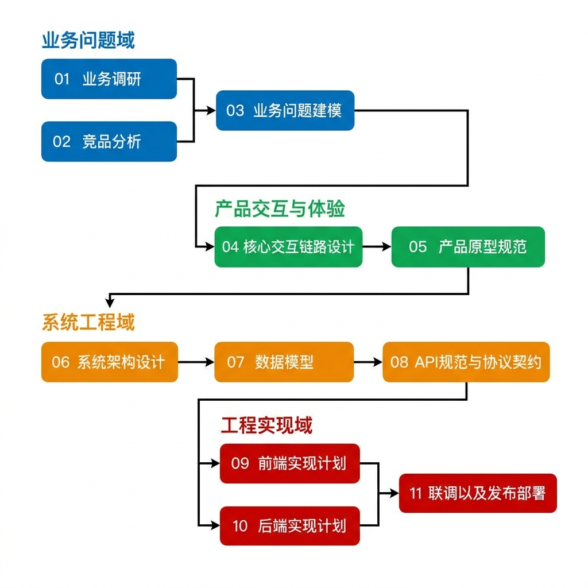

# 项目生命周期管理与执行规范

> [!NOTE]
> 本技能定义了从项目初始化开始、贯穿整个开发生命周期的标准化步骤与协作机制。
> 本文件仅作为生命周期的高层步骤索引，具体执行规范采用**渐进式披露**形式，链接至具体的执行细则中。

---

## 生命周期步骤与执行指引

> [!IMPORTANT]
> **执行顺序约束**：
> Step 1（工程物理初始化）完成后，**必须立即执行** Step 2（引导用户确立项目级别规则）。

| 步骤名称 | 职责说明 | 执行标准与细则 |
| :--- | :--- | :--- |
| **Step 1：项目工程物理初始化与多 Agent 协作规范** | 负责仓库标准目录结构（`frontend/`、`backend/`、`docs/` 及其下 11 个分层子目录）的物理创建，以及协作边界契约 [AGENTS.md](../../AGENTS.md) 的编写。 | 请深入阅读并严格遵循 [Step 1 详细执行标准](./references/step1_initialization.md)。 |
| **Step 2：引导用户添加项目级别的 Rule 过程** | 在项目开发启动时或日常演进中，引导人类用户定义项目专有的协作与技术规则，并持久化到项目规则配置中。 | 请深入阅读并严格遵循 [Step 2 详细执行标准](./references/step2_project_rules.md)。 |
| **Step 3：业务调研、反向审查与 Lead 审批规范** | 指导 Agent 在项目开发前进行正向需求对齐与反向防御设计，并扮演专业 Lead 对技术与业务边界进行审批裁决，汇总输出业务总结报告。 | 请深入阅读并严格遵循 [Step 3 详细执行标准](./references/step3_business_research.md)。 |
| **Step 4：竞品分析调研、防线决策与 Lead 审批规范** | 指导 Agent 分别从业务流程与交互呈现两个维度对核心功能模块进行竞品分析，挖掘系统的核心差异化突破口，并扮演专业 Lead 进行评审裁决，汇总输出竞品决策裁决前置文档。 | 请深入阅读并严格遵循 [Step 4 详细执行标准](./references/step4_competitor_analysis.md)。 |
| **Step 5：业务建模、数据建模与系统设计前置契约规范** | 指导 Agent 基于正向调研与竞品裁决文档进行业务建模，明确系统的核心业务问题、用户目标，划分业务场景与 MVP 边界，设计核心实体 ER 关系，并固化系统架构与交互前置技术红线契约。 | 请深入阅读并严格遵循 [Step 5 详细执行标准](./references/step5_business_modeling.md)。 |
| **Step 6 及后续步骤** | *(待后续生命周期演进时扩展并在此添加引用)* | *(待后续生命周期演进时扩展)* |

---

## 全链路流程规范

> [!WARNING]
> **智能体视觉解析禁令**：
> AI 智能体在解析和执行本规范时，严禁使用多模态视觉能力加载或解读此流程图图片。本图仅供人类用户视觉参考。

### 全链路分步定义

| 领域划分 | 规范目录及分步 (01 - 11) | 核心推进动作 (结合大图主线) |
| :--- | :--- | :--- |
| **业务问题域** | 01. 业务调研 02. 竞品分析 03. 业务问题建模 | 理解审核业务，拆解竞品并借鉴 提炼核心业务领域能力，确定业务问题建模 |
| **产品交互域** | 04. 核心交互链路设计 05. 产品原型规范 | 梳理核心交互流程与完整体验 规划页面状态 (空态/处理/异常) 并协同 |
| **技术架构域** | 06. System Architecture 设计 07. 数据模型 08. API 规范与协议契约 | 系统架构选型评估、对齐数据模型 锁定各模块解耦边界、接口与协议规范 |
| **工程实现域** | 09. 前端实现计划 10. 后端实现计划 11. 联调以及发布部署 | 交互表现层组件编写 核心服务逻辑自治编写与开发实现 集成联调交付、部署与发布 |

### 流程示意图

