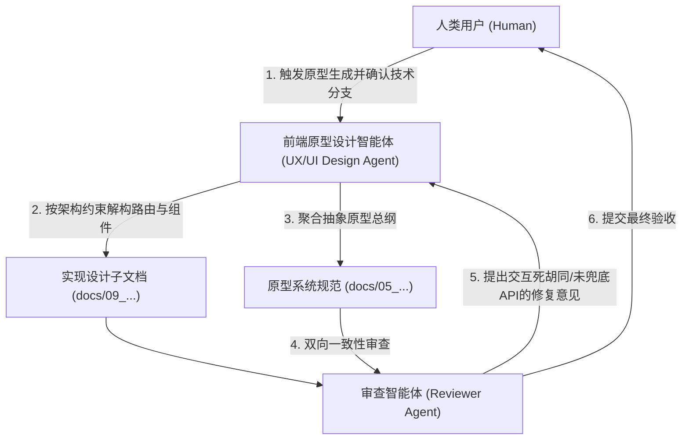

# Step 10 详细执行标准：UX 原型与前端实现规范生成

> [!NOTE]
> 本规范为项目生命周期 Step 10 的通用执行细则，旨在定义从系统架构设计向前端交互原型与实现蓝图过渡的标准化构建方法论。重点关注如何基于底层 API 契约与宏观架构，抽象出路由结构、组件状态流转及核心交互链路规范，而不绑定具体的业务领域或特定前端框架的具体实现细节。

---

## 一、 执行顺序约束铁律

> [!IMPORTANT]
> **前置依赖与产出路径约束**：
> 1. **前置依赖**：必须在前端逻辑架构设计（Step 6）、交互链路规范（Step 4）以及 API 规范（Step 9）确立并评审通过后方可启动。前端原型必须与底层 API 契约严密对齐。
> 2. **物理产出路径**：详细的前端分层实现规范必须输出至 `docs/09_frontend_implementation_plan/` 目录下；聚合的原型系统蓝图必须输出至 `docs/05_ux_specification/` 目录下。
> 3. **真理之源演进**：本阶段产出的文档将作为前端团队开展实质性页面重构、组件库开发及与后端接口联调的唯一基准蓝图。

---

## 二、 前端原型与实现建模方法论与核心要素

前端原型的设计与文档化不仅是页面的简单堆砌，必须基于工程化范式进行解构设计。执行阶段须关注以下核心要素：

### 1. 路由拓扑与页面流转抽象 (Routing & Pages)
* **路由范式确立**：明确系统采用的路由风格（如基于配置的数据路由、基于文件系统的路由等），并定义静态视图与动态参数（Params/Query）的映射关系。
* **数据预加载边界**：定义在路由跳转发生前，哪些关键数据需要被提前拉取或检查（Loader/Guard 机制），以及在相关 API 接口缺失时，前端实施 Mock（本地拦截垫片）的标准策略。

### 2. 组件解构与状态管理抽象 (Components & State)
* **物理分层隔离**：遵循架构规范（如 FSD、DDD 在前端的投影等），将庞大的 UI 界面拆解为“纯表现层组件 (Dumb)”与“智能容器组件 (Smart)”。
* **Props 与事件契约**：明确各类卡片、列表与表单的核心输入状态 (Props)、内部纳管状态机制，以及必须向外派发 (Emits) 的交互事件。
* **状态同步双轨制**：严格界定“全局 UI 交互状态”与“服务端数据缓存同步状态”的边界，禁止状态的越权污染。

### 3. 核心人机交互与异常兜底策略 (HCI & Error Handling)
* **心流防打断机制**：针对长耗时任务、实时流式推送（如打字机动效、复杂拓扑连线计算）等场景，定义无缝的微交互动效（如脉冲高亮、平滑滚动、局部遮罩），避免粗暴的全屏跳转。
* **分级降级展现**：基于后端的标准化错误结构（如 RFC 7807），明确前端的 UI 捕获分级处理策略（从轻量级 Toast 到表单红字，再到强制模态框拦截或局部崩溃兜底）。

---

## 三、 角色职责与协作机制

### 1. 前端原型设计智能体 (UX/UI Design Agent) 职责
* **架构投影**：将抽象的系统架构规范映射为具象的路由树、页面容器以及细粒度的前端组件。
* **降级容错填补**：在比对 API 契约时，主动发现“未开发”的后置接口，并在文档中强制植入前端 Mock 垫片策略，确保联调不被阻塞。

### 2. 审查智能体 (Reviewer Agent) 职责
* **死胡同审查**：排查所有交互链路是否构成闭环。如：模态框是否有关闭路径、长列表是否有分页终点、复杂表单是否有防抖限制。
* **一致性校验**：核对产出文档中组件定义的数据字段是否超越或遗漏了底层 API 契约提供的信息范围。

### 3. 人类用户 (Human) 职责
* **宏观分支裁决**：通过深度交互，决断路由底层引擎选型、UI 基础库拼装策略等可能影响全局体验走向的宏观决策。
* **蓝图验收**：最终审查聚合的 UX 规范系统文档，确立联调开发标准。

---

## 四、 成果产出标准规范

本阶段执行完毕后，必须在对应的目录下收敛产出结构化的 markdown 蓝图体系：

### 1. 详细前端实现规划文档 (输出至 `docs/09_frontend_implementation_plan/`)
* **页面与路由规范** (如 `01_frontend_pages_routing_vX.X.md`)：涵盖路由结构图、路径字典及预加载/Mock 数据契约。
* **组件处理与展示规范** (如 `02_frontend_components_vX.X.md`)：涵盖分层组件结构划分及内部状态机映射。
* **人机交互流程与UI设计规范** (如 `03_frontend_interaction_ui_vX.X.md`)：涵盖复杂微动效实现路径及分层异常报错 UI 呈现。

### 2. 聚合原型总纲 (输出至 `docs/05_ux_specification/`)
* **《[系统名称] UX 原型与前端实现规范》** (如 `ux_spec_vX.X.md`)：将上述 09 目录中的三份技术指导文件提炼整合，形成业务与设计视角的高度抽象，作为交付测试的说明手册。

---

## 五、 输出与排版标准

* **强结构化描述**：所有组件解构及路由设计必须使用高可读性的表格或规范化的代码块呈现。
* **相对路径引用**：文档内所有涉及前置文档的超链接，必须使用合规的**相对路径**。
* **无 Emoji 限制**：所有文档标题与正文严禁携带任何 Emoji 图标，以保障工程规范的严肃性。
* **强调体验红线**：善用 GitHub 警示框（如 `> [!TIP]`、`> [!WARNING]`）去凸显可能引发严重体验降级或心流阻断的关键交互设计卡点。
