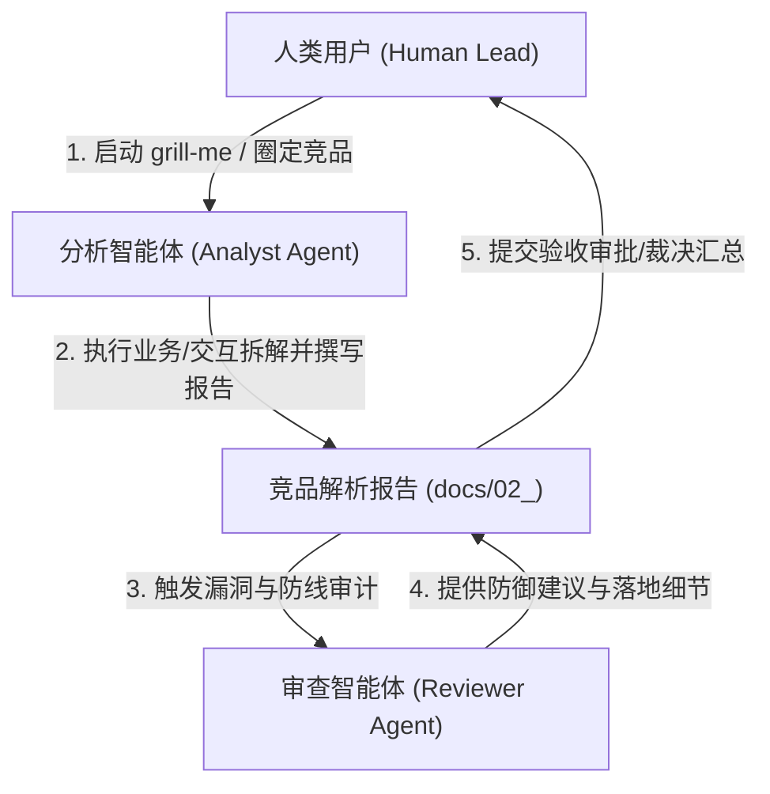

# Step 4 详细执行标准：竞品分析调研与落地规范

> [!NOTE]
> 本规范为项目生命周期 Step 4 的具体执行细则，旨在定义竞品分析调研的标准化方法论，明确各智能体与人类用户在调研过程中的角色职责与协作契约，确立竞品分析成果的 Lead 评审与决策汇总机制，确保调研成果能有效指导后续的产品设计与架构落地。

---

## 一、 执行顺序约束铁律

> [!IMPORTANT]
> **前置依赖与产出路径约束**：
> 1. **前置依赖**：竞品分析调研必须在 Step 3（业务调研前置总结文档）评审裁决通过后方可启动，确保调研范围严格收敛于已界定的业务边界与首期开发范围内。
> 2. **物理产出路径**：竞品分析的所有成果文件及最终的评审汇总文档必须归档至项目根目录下的 `docs/02_competitor_analysis/` 目录中。
> 3. **真理之源演进**：竞品分析是前置裁决总结的延伸，其产出的设计与技术建议在获得批准后，将作为后续详细设计（产品交互设计与系统架构设计）的输入底座。

---

## 二、 竞品分析方法论

在执行竞品调研时，分析人员（智能体或人类）必须遵循以下标准分析方法论，以实现对标产品的深度解构：

### 1. 竞品矩阵的定义方法
竞品库的定义必须采取“主辅结合”的矩阵化筛选机制，避免盲目泛化：
* **核心竞品（深度分析）**：选择在当前系统核心赛道中定位最契合、业务重合度最高的主流产品，进行全流程剖析。
* **辅助竞品（特性与交互参考）**：选择在局部业务模块、特定技术引擎或微细交互上拥有极致体验、行业公认优秀的工具作为特定环节的参考。

### 2. 业务流程拆解方法论（Business Workflow Analysis）
业务视角的拆解重点在于各竞品的底层数据处理逻辑与实体生命周期。调研中对每个模块的剖析必须严格遵守以下结构进行归纳：
*   **主导实体**：解析该模块下竞品所定义的核心业务实体模型与数据结构。
*   **业务逻辑**：梳理竞品如何处理数据从输入、加工到流转的核心后台逻辑。
*   **设计原则**：总结竞品在此处的取舍和底层设计原则（如简化启动成本或倾向用户高控制权）。

### 3. 交互与结果呈现分析方法论（Interaction & UI Presentation Analysis）
交互视角的拆解重点在于前台界面布局、触点响应以及人机协同的状态流转。调研中对每个交互模块的剖析必须严格遵守以下结构进行归纳：
*   **视觉布局**：分析竞品在此处的视区划分、页面自适应和关键组件呈现。
*   **触点交互**：剖析用户与 AI 协同的触发时机、手势/按键响应以及低打扰的启发式引导机制。
*   **动态反馈**：梳理系统在加载、状态挂起、冲突或拦截校验时的动态视觉反馈和状态机转换效果。

### 4. 差异化与破局点分析方法论
* **竞品盲区挖掘**：通过对比，寻找现有竞品在“业务闭环”或“交互体验”上的缺陷（如知行断层、过于干扰沉浸体验或缺乏人类校验的安全控制）。
* **差异化机会推导**：基于竞品盲区，推导出本系统的“杀手锏”差异化设计，确立产品破局的核心优势。

---

## 三、 角色职责与协作机制

在竞品分析的整个生命周期中，多智能体与人类用户应各司其职，遵循以下协作边界：

### 1. 分析智能体 (Analyst Agent) 职责
* **数据解构**：负责对圈定竞品的核心模块和交互进行全量解构，整理横向对比矩阵。
* **机会推导**：负责基于竞品盲区进行产品差异化推导，并在项目根目录的指定路径下生成竞品解析文档初稿。

### 2. 审查智能体 (Reviewer Agent) 职责
* **防御映射**：负责基于 Step 3 的反向审查报告中所识别出的高危架构风险（如体验打扰、运行成本、逻辑死锁、安全越权等），在竞品设计中审计并寻找对应的防守线索与落地细节。
* **防线细化**：将竞品的优秀防线设计转化为可供本项目直接采纳的具象化落地建议（包含前端组件与后端控制逻辑）。

### 3. 人类用户 (Human Lead) 职责
* **范围核定**：在启动阶段，通过交互式采访（如 `/grill-me`）与智能体进行沟通，核定竞品选择是否合理、分析维度是否全面。
* **成果验收**：对智能体提交的最终竞品分析报告拥有最终审批权，通过核对“对本项目的建议”来裁决后续产品设计与架构实现的走向。

---

## 四、 专业 Lead 评审与竞品决策汇总规范

在完成业务流程与交互设计两份竞品解析报告后，必须由 Agent 扮演“专业 Lead”角色对调研成果与防线建议进行评审与裁决，并汇总输出决策文档。

本阶段的 Lead 评审执行标准遵循通用的 **[Lead 评审参考标准](./lead_review.md)**。

### 1. 评审前置依赖与双文档输入
> [!IMPORTANT]
> **多源信息输入与深度研判约束**：
> 在执行评审与输出决策汇总报告前，扮演“专业 Lead”的 Agent **必须同时完整阅读并综合研判** 以下两份独立成文的原始文档，严禁在文档不全的情况下擅自开展评审：
> 1.  **业务流程与知识库管理竞品解析报告**：`docs/02_competitor_analysis/business_workflow_analysis.md`
> 2.  **交互流程与结果呈现竞品解析报告**：`docs/02_competitor_analysis/interaction_design_analysis.md`

### 2. 职责边界与汇总定位
* **职责红线**：Lead 负责对两份解析文档中的“关键发现”和“对本系统的建议”进行技术合理性与研发性价比裁决。**严禁直接修改或涂改两份原始解析报告的主题内容**，所有研发边界划定和交互规范确认均须且仅能体现在决策汇总文档中。
* **汇总文档物理位置**：裁决结果必须统一输出到独立的决策总结前置文档：`docs/02_competitor_analysis/competitor_analysis_summary.md`。该文档为后续详细设计（交互设计、数据建模、API 规范）的直接前置输入与底层真理之源。

### 3. 竞品分析特化总结文档模板
`competitor_analysis_summary.md` 必须包含以下核心板块：
*   **一、 Lead 整体评审结论**：对竞品分析的广度和对本项目的借鉴深度给出宏观评价，并正式批准通过进入详细设计阶段。
*   **二、 核心差异化特色落地决策**：锁定本项目最终确定采用的、相较于竞品的核心杀手锏设计与特色功能清单。
*   **三、 核心模块技术与交互防线锁定**：针对前置报告中提出的 PA 风险点，针对 8 个核心模块，明确裁决并最终锁定要借鉴和落地的**后台控制技术手段**与**前台 UI 交互规格**（例如：明确章节弱挂起交互触发百分比、技能沙箱依赖冲突标红与阻断规则、以及 Session 挂起持久化恢复的触发条件），作为研发实现的直接接口契约。
*   **四、 后续详细设计阶段指引**：明确向后续核心交互链路设计与系统架构设计推进的分工与任务分步指引。

---

## 五、 成果产出标准规范

竞品调研最终必须在 `docs/02_competitor_analysis/` 下产出两份面向不同视角的解析报告：
1. **《业务流程与知识库管理竞品解析报告》** (`business_workflow_analysis.md`)：专注于解构底层数据生命周期、核心实体定义及技术方案选型对比。
2. **《交互流程与结果呈现竞品解析报告》** (`interaction_design_analysis.md`)：专注于解构前端界面布局、AI 启发式引导、以及挂起/冲突等状态的人机交互反馈。

每份解析报告必须严格包含以下五个章节板块：
* **一、 调用概述**：定义调研背景，明确指明针对前置裁决中的何种核心范围开展调研。
* **二、 各竞品流程拆解详情**：依据本规范中“业务流程拆解”或“交互呈现分析”的方法论要求，对系统各核心功能模块进行结构化卡片详情剖析。
* **三、 横向比对矩阵**：构建包含各功能模块与各竞品对比维度的表格。
* **四、 关键发现与差异化机会**：挖掘竞品盲区并提炼本项目的杀手锏设计。
* **五、 对本项目的建议**：针对前置报告识别出的特定架构与交互风险，给出直接可用于后续产品详细设计与实现落地的具体工程建议。

---

## 六、 输出与排版标准

* **相对路径引用**：文档内所有涉及前置总结文件或同级文件的超链接，必须使用合规的**相对路径**（例如：`[前置总结前置文档](../01_business_research/business_summary.md)`），严禁使用绝对路径。
* **无 Emoji 限制**：所有文档及报告标题中严禁包含任何 Emoji 图标，确保文档在不同编译与渲染环境下的兼容性。
* **排版美观度**：深度应用 Markdown 语法，必须使用带有对齐方式的对比表格，以及 GitHub 警示框（如 `> [!IMPORTANT]`、`> [!TIP]`、`> [!WARNING]`）来突出关键的决策边界和技术红线。
