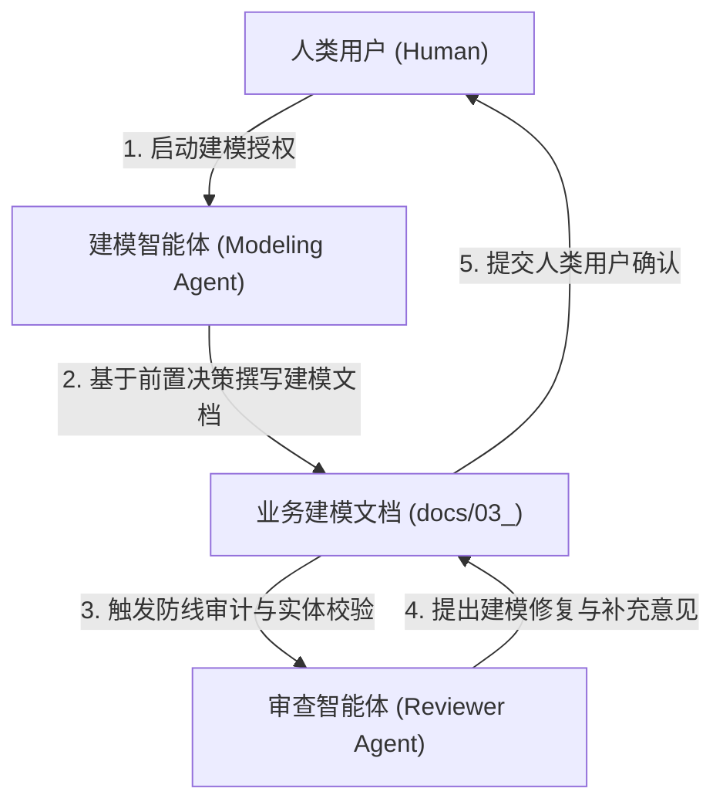

# Step 5 详细执行标准：业务与数据建模及设计契约规范

> [!NOTE]
> 本规范为项目生命周期 Step 5 的通用执行细则，旨在定义系统业务建模、数据实体抽象与系统设计前置技术/交互契约的标准化方法论，确保前期的调研与决策总结能被精确沉淀为指导后续系统架构、数据模型与前端原型设计的真理之源。

---

## 一、 执行顺序约束铁律

> [!IMPORTANT]
> **前置依赖与产出路径约束**：
> 1. **前置依赖**：业务建模必须在前置的业务调研总结与竞品分析决策（如 Step 3 与 Step 4 阶段的总结报告）均评审通过后方可启动，确保建模范围严格限制在已界定的业务边界与首期开发范围内。
> 2. **物理产出路径**：业务建模的收口文件及相关概念结构必须归档至项目根目录下的 `docs/03_business_modeling/` 目录中。
> 3. **真理之源演进**：业务建模是调研阶段的收口总结。本文档在生成并被人类用户确认后，直接作为后续详细设计（包括交互设计、数据建模、API 规范）的唯一真理之源与底层契约底座。

---

## 二、 业务建模方法论与核心要素

在执行业务建模时，建模智能体必须严格基于前置决策与调研总结，解构并输出以下五大核心要素：

### 1. 系统核心业务问题定义 (Core Business Problems)
必须明确指出系统核心要解决的业务痛点及技术挑战，并进行分类定义，至少应解构为以下几个维度：
*   **业务本源痛点**：当前业务流程中存在的本质断层或物理壁垒。
*   **资源与成本瓶颈**：系统在核心技术方案实现下面临的计算成本、资源占用或运行开销限制。
*   **逻辑稳定性风险**：数据或指令流转过程中易产生死锁、冲突或崩溃的关键节点。
*   **安全与越权风险**：系统在运行、外部数据导入或工具调用时必须防范的越权和系统破坏红线。

### 2. 用户目标模型定义 (User Goals)
定义目标用户的核心诉求与使用痛点，并将其直接转化为系统技术及设计层面的**“技术与设计映射契约”**。要求使用清晰的表格，将“用户诉求维度”一一对应到“具体的技术指标/设计规范”。

### 3. 业务场景与 MVP 边界划分 (Scenarios & MVP Domain)
通过清晰的对比表格界定首期 MVP 的核心场景 (In-Scope) 与非 MVP 场景 (Out-of-Scope)。必须针对每个场景列出具体的功能界限与限制条件，以防在系统架构和开发阶段出现范围蔓延。

### 4. 核心实体与概念数据模型 (Data Entities & ER Model)
预先提取和抽象系统中的核心业务概念实体，明确说明每个实体的定义、核心属性与状态流转生命周期。

> [!IMPORTANT]
> **强制性 ER 图规范**：
> 业务建模文档中**必须绘制 Mermaid 格式的实体关系图 (ER 图)**，清晰定义核心实体之间的一对一、一对多、多对多关系及主键属性，作为后续数据库表结构与类设计的直接依据。

### 5. 系统设计前置技术与交互契约 (Design & Tech Contract)
明确后续详细设计阶段必须强制遵守的技术红线与交互约束。应至少包含：
*   **安全隔离契约**：明确 Agent 或敏感模块运行时的权限隔离红线。
*   **逻辑校验与阻断契约**：明确在界面交互或数据写入时必须实施的错误阻断与校验规则。
*   **高性价比/低成本同步契约**：明确计算密集型、Token 消耗型或高开销操作的闲时/异步同步规则。
*   **休眠与重载契约**：明确长周期会话/状态的超时释放与优雅重载机制。

---

## 三、 角色职责与协作机制

在业务建模生命周期中，多智能体与人类用户应遵循以下协作边界进行推进：

### 1. 建模智能体 (Modeling Agent) 职责
* **实体与关系提炼**：负责基于前置阶段的业务调研与竞品分析决策，提炼核心数据实体、定义属性、状态流转与拓扑关系。
* **边界与契约勾勒**：负责详细起草 MVP 场景对比表与技术前置契约，在指定路径下生成业务建模文档。

### 2. 审查智能体 (Reviewer Agent) 职责
* **一致性校验**：审查业务建模文档中的所有实体、场景与契约是否 100% 对齐并采纳了前期各决策总结报告中的各项技术与业务裁决，识别逻辑漏洞与风险防线缺失。
* **数据规范性校验**：检查实体属性命名、状态生命周期设计以及 Mermaid ER 图的语法与表示合规性。

### 3. 人类用户 (Human) 职责
* **成果确认**：对智能体提交的业务建模文档进行评估与确认，无需复杂的 Lead 评审。确认通过后，允许后续系统架构设计、前端原型设计与数据模型设计工作解封启动。

---

## 四、 成果产出标准规范

业务建模最终必须在 `docs/03_business_modeling/` 目录下产出唯一的收口报告：
* **《[项目名称]业务建模》** (`business_model.md`)

该文档必须严格包含以下五个章节板块：
*   **一、 系统需要解决的核心业务问题**：分段解构业务本源、资源成本、逻辑风险及安全隔离等问题。
*   **二、 当前的用户目标**：列表/表格呈现用户目标到技术与设计的映射契约。
*   **三、 业务场景与 MVP 边界划分**：以对比表格明确 In-Scope 与 Out-of-Scope 的边界和细化约束。
*   **四、 核心实体与概念数据模型**：包含直观的 Mermaid 格式实体关系图 (ER 图)，并逐个列明实体定义、属性与流转规则。
*   **五、 系统设计前置技术与交互契约**：明确在系统后续架构与详细设计中必须严格强制遵守的硬性规则与红线（如物理特权隔离、逻辑死锁阻断、低成本异步同步、会话休眠与重载等）。

---

## 五、 输出与排版标准

* **相对路径引用**：文档内所有涉及前置文档或同级文件的超链接，必须使用合规的**相对路径**，严禁使用绝对路径。
* **无 Emoji 限制**：所有文档及报告正文与标题中严禁包含任何 Emoji 图标，确保文档的专业度与系统兼容性。
* **排版美观度**：深度应用 Markdown 语法，必须使用表格呈现目标映射与边界对比，并利用 GitHub 警示框（如 `> [!IMPORTANT]`、`> [!CAUTION]`、`> [!WARNING]`）来突出设计红线与安全隔离约束。
