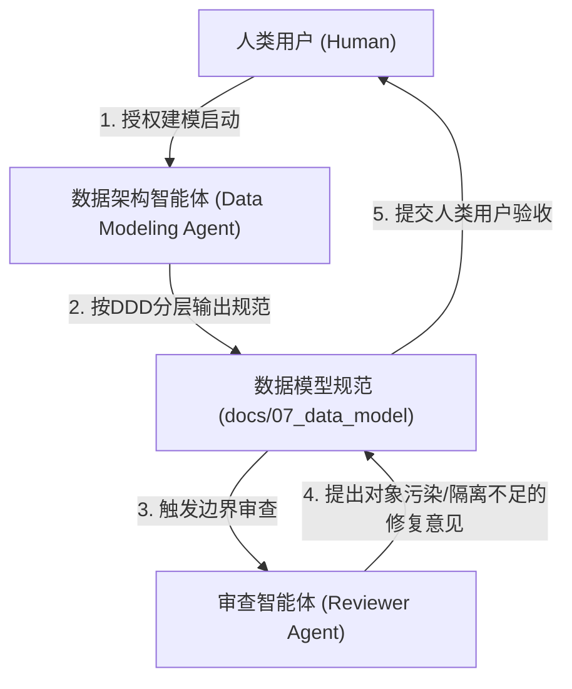

# Step 8 详细执行标准：数据建模与模型层设计

> [!NOTE]
> 本规范为项目生命周期 Step 8 的通用执行细则，旨在定义系统基于 DDD（领域驱动设计）原则进行数据模型抽象的标准化方法论。重点关注如何将前期业务模型映射为具备清晰边界的底层实体与内存对象架构，避免与具体业务细节绑定。

---

## 一、 执行顺序约束铁律

> [!IMPORTANT]
> **前置依赖与产出路径约束**：
> 1. **前置依赖**：必须在核心交互链路设计（Step 6）与前后端边界（Step 7）评审通过后方可启动，确保建模有完备的业务用例作为支撑。
> 2. **物理产出路径**：数据模型的收口规范文件必须归档至项目根目录下的 `docs/07_data_model/` 目录中。
> 3. **真理之源演进**：本阶段产出的文档是后端持久层设计、应用层领域装载、以及前端数据承接的唯一真理之源。

---

## 二、 数据建模方法论与核心要素

数据建模绝不能停留在简单的数据库表结构扁平罗列，必须基于领域驱动设计（DDD）划分界限。智能体或人类在构建对应能力时，必须关注并解构以下核心要素：

### 1. 领域限界上下文划分 (Bounded Contexts)
* 依据业务正交属性，将系统拆分为若干内聚的上下文。
* 明确标记出核心业务域、支撑域及基础设施域，并确立聚合根（Aggregate Root）与具体实体的统辖归属关系。

### 2. 全局数据策略 (Global Data Policies)
必须依据产品特性与底层约束，明确全局层面的数据基调：
* **租户与隔离策略**：明确定义业务是本地优先单机形态（Single-Tenant）还是云端多用户隔离形态（Multi-Tenant），以此决定是否引入基础鉴权和用户实体。
* **物理删除策略**：明确在生命周期终结时，采用硬删除（Hard Delete，极致轻量）还是软删除（Soft Delete / `is_deleted`，安全溯源）。
* **存储架构映射**：界定数据模型依赖的核心持久化介质（如轻量级关系型库、向量库、物理文件基底等）。

### 3. 三层分层对象映射架构 (DO vs Domain vs VO)
为杜绝后端领域逻辑受到持久层框架污染，或向前端泄露沉重的聚合内存对象，所有聚合实体模型必须严格按照以下三层形态进行正交切分：
* **(1) 实体对象 (Data Object - DO)**：
  * **定位**：落库模型。
  * **职责约束**：仅包含基础数据类型与主外键 ID，严格与底层持久化数据库表结构或物理文件元数据挂钩，**严禁**直接装载包含业务对象树的集合（如 `List<SubEntity>`）。
* **(2) 上下文对象 (Domain Object)**：
  * **定位**：内存充血模型（应用层/领域层运行实体）。
  * **职责约束**：继承 DO 基础属性，直接在内存中装载具体的子实体集合、聚合根内的强/弱引用网状关系。承载高内聚的业务逻辑与状态流转校验，完全脱离面向数据库编程的束缚。
* **(3) 前端使用对象 (View Object - VO / DTO)**：
  * **定位**：视图交互模型。
  * **职责约束**：剔除厚重的后端内存集合结构，附加上仅供前端视图渲染的各类衍生计算状态（如：进度百分比、UI 临时高亮状态、透明度与样式标识等）。保障数据流至表现层时的彻底解耦。

---

## 三、 角色职责与协作机制

### 1. 数据架构智能体 (Data Modeling Agent) 职责
* **上下文抽象**：基于前期业务与交互规范，准确划定边界上下文与各聚合根。
* **三段式拆解实施**：严格贯彻 DO / Domain Object / VO 的切分原则，并输出结构清晰的分层数据字典对照。

### 2. 审查智能体 (Reviewer Agent) 职责
* **跨层污染与泄漏校验**：严格审查产生的数据字典表。如发现持久层对象 (DO) 中出现领域实体集合，或前端视图对象 (VO) 中直接暴露了敏感底层外键关联，必须打回修正。
* **一致性溯源**：核验实体核心属性及其衍生 UI 状态，是否能完全满足前置交互设计规范（Step 6/7）中涉及的所有用例链路。

### 3. 人类用户 (Human) 职责
* **原则裁决**：对关键的全局数据策略（如多租户模式、软硬删除决策）进行访谈对齐与最终拍板。
* **架构验收**：审查三层隔离的架构映射，确认通过后放行后续开发。

---

## 四、 成果产出标准规范

数据建模执行完毕后，必须在 `docs/07_data_model/` 目录下收敛产出一份核心文件：
* **《[系统名称]数据模型与领域驱动设计规范》** (如 `data_model_spec_vX.X.md`)

产出文档的结构框架必须严格涵盖：
* **一、 领域限界上下文 (Bounded Contexts)**
* **二、 全局数据策略 (Global Data Policies)**
* **三、 实体与分层数据模型详解**：按照各限界上下文展开，对辖下的聚合根及实体逐个呈现 **DO/Domain/VO 三段式**对照描述。

---

## 五、 输出与排版标准

* **强制三段式表格重构**：在呈现模型字典时，必须针对每一个实体单独分出三个维度的子表格（分别罗列 DO、上下文对象、前端对象），明确用继承语义和附加字段阐述层级间的演变，禁止将前后端属性扁平揉杂在一张表中。
* **相对路径引用**：文档内所有涉及前置文档或同级文件超链接，必须使用合规的**相对路径**，绝对禁止硬编码绝对路径。
* **无 Emoji 限制**：所有文档标题与正文严禁携带任何 Emoji 图标，以保障工程规范的严肃性。
* **强调隔离边界**：善用 GitHub 警示框（如 `> [!IMPORTANT]`）去凸显架构红线，明确区分出物理落库和内存充血两种形态的根本区别。
