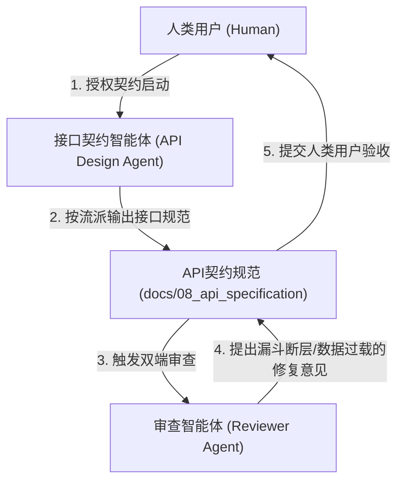

# Step 9 详细执行标准：API 规范与协议契约

> [!NOTE]
> 本规范为项目生命周期 Step 9 的通用执行细则，旨在定义系统前后端通信的标准化接口契约构建方法论。重点关注如何基于底层数据模型与前端交互原型，抽象出稳定、高效且具备高扩展性的通信协议边界，而不涉及具体技术栈的实现细节。

---

## 一、 执行顺序约束铁律

> [!IMPORTANT]
> **前置依赖与产出路径约束**：
> 1. **前置依赖**：必须在前端原型需求（Step 7）与数据建模设计（Step 8）评审通过后方可启动，确保 API 设计既满足视图交互的消费需求，又具备底层实体的支撑能力。
> 2. **物理产出路径**：API 规范收口文件必须归档至项目根目录下的 `docs/08_api_specification/` 目录中。
> 3. **真理之源演进**：本阶段产出的文档是前后端联调开发、双端 Agent 并行执行的唯一联调契约。

---

## 二、 API 契约建模方法论与核心要素

API 的设计不仅是简单的路由罗列，必须基于统一的通信范式进行架构。设计阶段必须关注并确立以下核心要素：

### 1. 通信风格与路由语义
* 明确核心接口的通信流派：定义哪些场景适合基于资源的 **RESTful** 设计，哪些业务动作更适合引入 **RPC** 子资源操作。
* 确立统一的路由前缀、版本控制策略（如是否存在版本号）以及资源路径命名规范。

### 2. 状态推送与长连接策略
* 针对大模型生成、长耗时任务编译等渐进式流式数据，必须明确定义长连接通信机制。
* 明确流式推送技术的选型逻辑（如按需短生命周期流式连接 SSE、WebSocket 等），并严格定义生命周期管理与断开策略。

### 3. 分页查询混合策略
* 依据不同 UI 层面的数据加载特性，制定全局统一的分页混合使用法则。
* 例如：针对信息流瀑布流加载场景设计基于 **Cursor** 的分页策略；针对后台大盘列表设计基于 **Offset** 的传统分页。严禁两者在设计上发生混用。

### 4. 异常隔离与错误状态机 (Error Handling)
* 统一全局异常返回范式。推荐基于 **RFC 7807 (Problem Details for HTTP APIs)** 标准化错误响应结构。
* 明确区分传输层异常与业务领域层错误，明确前端应如何通过统一的拓展字段完成重调度或错误展现（如：触发拦截弹窗、渲染骨架重试态、抖动警告等）。

---

## 三、 角色职责与协作机制

### 1. 接口契约智能体 (API Design Agent) 职责
* **契约翻译**：将 Step 7 的交互事件与 Step 8 的领域对象 (VO) 映射为标准的 API 路由与输入输出结构。
* **策略实施**：严格贯彻路由命名、混合分页与统一异常封装策略。

### 2. 审查智能体 (Reviewer Agent) 职责
* **过载与黑洞审查**：检查接口返回的载荷是否过度膨胀（不该返回的厚重领域对象），或输入参数是否出现“信息黑洞”（缺失关键查询参数）。
* **环路与死锁排查**：在涉及异步重调度或复杂状态扭转的 RPC 接口中，验证状态机逻辑闭环是否合理。

### 3. 人类用户 (Human) 职责
* **流派裁决**：对关键的通信流派混合（如何时使用 REST，何时破例使用 RPC）进行架构把关。
* **契约验收**：审查最终的 API 契约文档，确认通过后放行后续的前后端实质性开发。

---

## 四、 成果产出标准规范

API 设计执行完毕后，必须在 `docs/08_api_specification/` 目录下收敛产出一份核心文件：
* **《[系统名称] API 接口与通信协议规范》** (如 `api_spec_vX.X.md`)

产出文档的结构框架必须严格涵盖：
* **一、 全局协议与数据规范**（异常透传标准、分页策略数据结构等）
* **二、 核心 API 接口定义**（按模块维度展开，列清路径、Payload 载荷与响应结构）
* **三、 业务约束与前端联动契约**（注明复杂接口调用后的前端必做动作，如缓存失效、重载等）

---

## 五、 输出与排版标准

* **强结构化描述**：所有接口细节必须使用高可读性的表格或规范化的代码块呈现请求体与响应体 JSON。
* **相对路径引用**：文档内所有涉及前置文档（特别是原型与数据模型规范）的超链接，必须使用合规的**相对路径**。
* **无 Emoji 限制**：所有文档标题与正文严禁携带任何 Emoji 图标，以保障工程规范的严肃性。
* **强调跨端契约**：善用 GitHub 警示框（如 `> [!TIP]`、`> [!WARNING]`）去凸显接口调用的前置业务要求或可能引发的级联异常。
