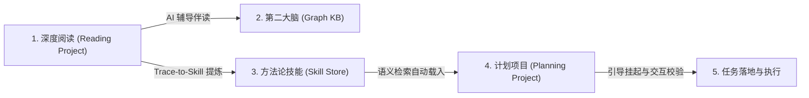

# i-have-a-plan

> **我有一个计划 (i-have-a-plan)**：一个基于 AI Agent 技术的智能阅读辅导、个人第二大脑（知识图谱）构建与方法论技能沉淀的闭环计划管理系统。

---

## 核心业务愿景：知行协同环 (The Action-Knowledge Loop)

本项目突破了传统阅读笔记与任务管理工具的割裂状态，通过统一的 **项目 (Project)** 模型，构筑起从知识输入到行动输出的闭环：

---

## 项目文档生命周期体系 (Docs Module)

项目开发与设计严格遵循标准化生命周期规范，所有核心文档归档于 `docs/` 目录中。各分层文档的职责与负责智能体角色定义如下：

| 阶段编号 / 文档目录 | 相对路径索引 | 负责智能体角色 (Owner) | 目录职责与交付作用 | 开发状态 |
| :--- | :--- | :--- | :--- | :--- |
| **01. 业务调研** | [docs/01_business_research/](./docs/01_business_research/) | Lead Agent & Devil's Advocate | 承载正向场景目标、技术反向质疑防御与最终技术裁决契约。 | **[已落定 - 阶段归档]** |
| **02. 竞品分析** | [docs/02_competitor_analysis/](./docs/02_competitor_analysis/) | Product Agent | 剖析行业竞品交互与功能，提炼本系统差异化优势。 | [待启动 - 尚未激活] |
| **03. 业务问题建模** | [docs/03_business_modeling/](./docs/03_business_modeling/) | Product Agent | 提炼核心业务领域能力，对项目、任务与技能进行领域建模。 | [待启动 - 尚未激活] |
| **04. 核心交互链路** | [docs/04_interaction_design/](./docs/04_interaction_design/) | Frontend Agent | 梳理系统级核心交互流程，建立人机协同的关键时序与路由。 | [待启动 - 尚未激活] |
| **05. 产品原型规范** | [docs/05_ux_specification/](./docs/05_ux_specification/) | Frontend Agent | 规划页面在空态、处理中、异常等多种 UX 状态下的表现规范。 | [待启动 - 尚未激活] |
| **06. System Architecture**| [docs/06_system_architecture/](./docs/06_system_architecture/) | Architect Agent | 进行技术栈评估、核心数据库与图谱选型及全局架构拓扑设计。 | [待启动 - 尚未激活] |
| **07. 数据模型设计** | [docs/07_data_model/](./docs/07_data_model/) | Architect Agent | 定义实体关系（ERD），确定数据库表结构、约束与存储方案。 | [待启动 - 尚未激活] |
| **08. API 规范与契约** | [docs/08_api_specification/](./docs/08_api_specification/) | Architect Agent | 锁定前后端强解耦的 HTTP/WebSocket API 协议交互契约。 | [待启动 - 尚未激活] |
| **09. 前端实现计划** | [docs/09_frontend_implementation_plan/](./docs/09_frontend_implementation_plan/) | Frontend Agent | 规划表现层组件拆解与实现时序，明确前端独立测试用例。 | [待启动 - 尚未激活] |
| **10. 后端实现计划** | [docs/10_backend_implementation_plan/](./docs/10_backend_implementation_plan/) | Backend Agent | 规划领域服务接口、状态机控制逻辑与安全防线工程落地手段。 | [待启动 - 尚未激活] |
| **11. 联调与发布部署** | [docs/11_integration_and_deployment/](./docs/11_integration_and_deployment/) | DevOps Agent | 规划前后端集成联调方案、自动化测试校验及 CI/CD 部署策略。 | [待启动 - 尚未激活] |

---

## 本阶段已归档文档 (Business Research Summary)

目前第一阶段 **01. 业务调研** 已完成评审与决策落定，具体归档文件明细如下：

> [!TIP]
> ### 1. 业务底座正向调研：[business_research.md](./docs/01_business_research/business_research.md)
> * **核心作用**：定义“项目”这一系统核心承载体，特化出“计划项目”与“阅读项目”。
> * **关键产出**：设计了融合章节与方法论的“AI 辅导章节任务链”生成逻辑，确立了“双向驱动”伴读交互与 Trace-to-Skill 编译大图。

> [!WARNING]
> ### 2. 反向质疑与安全防御：[business_research_adversarial.md](./docs/01_business_research/business_research_adversarial.md)
> * **核心作用**：扮演“魔鬼代言人”对正向方案进行安全性、体验打扰和成本漏洞分析。
> * **关键产出**：输出业务/技术难点评估矩阵，针对 Graph RAG 运行成本、Trace-to-Skill 编译幻觉及 Prompt 注入威胁制定了多方案 A/B 折中对比。

> [!NOTE]
> ### 3. Lead 裁决与边界契约：[business_summary.md](./docs/01_business_research/business_summary.md)
> * **核心作用**：遵循 `lead_review.md` 模板编写，由 Lead 智能体对业务边界与高危 PA 进行最终裁决。
> * **关键产出**：锁定“异步图谱合并、技能沙箱人类门控、最小化 API 权限沙箱”三大防御方案，排除一期多源同步，确立三道技术防线。
