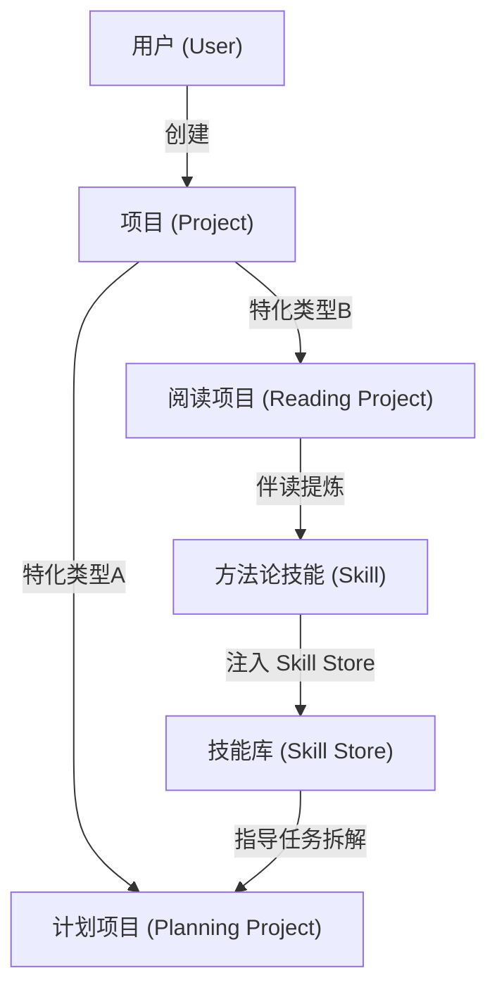
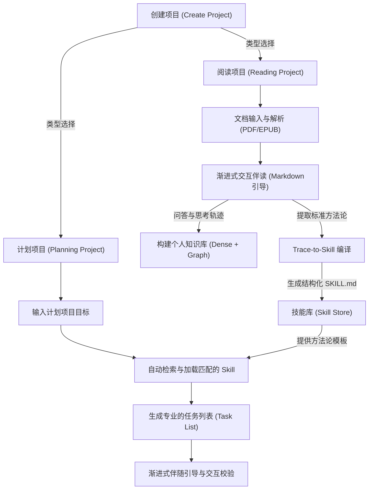

# 辅助阅读与知识技能沉淀系统：正向业务调研报告

本报告系统化地梳理了以“项目（Project）”为核心底座的计划制定、个人深度阅读、知识库构建以及方法论技能沉淀在 AI Agent 技术下的场景应用与架构设计，作为系统后续设计与开发的真理之源。

---

## 一、 场景目标定义

在知识工作者的日常场景中，深度阅读与计划制定是不可分割的孪生环：人们通过阅读获取方法论，再将方法论应用于实际项目的规划与执行中。然而，传统模式在这两个领域之间存在严重的割裂：

### 1. 计划制定与任务管理痛点 (Lack of Methodology)
> [!IMPORTANT]
> **“缺乏章法”：计划无法落地**
> * **任务拆解流于形式**：用户在面对复杂或陌生的工作目标时，缺乏科学的系统方法论指导，拆解出的任务列表过于宽泛、无序，导致执行阶段难以落地，项目进度失控。
> * **计划与知识脱节**：即使读者在阅读中接触过先进的项目管理方法论，在实际创建新项目、制定计划时，也无法高效、规范地将这些方法论套用为具体的执行步骤，所学知识无法指导行动。

### 2. 深度阅读与知识内化痛点 (Information Sinking)
> [!IMPORTANT]
> **“沙漏效应”与“知行脱节”：知识流失严重**
> * **高遗忘率与整理成本过高**：深度阅读书籍或论文时的即时感悟与关键论点，在阅读后数天内迅速流失。而手写整理笔记（如 Obsidian、Notion）需要消耗极高的人类心智成本，导致大部分笔记“收藏即吃灰”。
> * **方法论无法转化为执行力**：文献中的核心价值往往是其沉淀出的“标准工作流”（如 PDCA 循环、双盲实验等）。这些静态文字无法被直接编译为可由 Agent 加载并自动执行的结构化 Skill，形成了“知”与“行”的物理断层。

---

## 二、 业务概念统一：以“项目（Project）”为核心底座

为了彻底打通知识获取与计划执行，本系统将所有用户活动统一抽象在**“项目（Project）”**这一业务领域模型下。

### 1. 项目的双重特化类型

* **计划项目 (Planning Project)**
  > 以“达成具体目标、生成可执行计划”为导向的项目。用户可以单独创建此类项目，由**计划辅导 Agent** 引导用户逐步完成项目目标。
* **阅读项目 (Reading Project) — 项目的一种**
  > 确定好类型的特色项目。系统上传书籍或论文后，融合实际章节与所选的阅读方法论自动生成结构化的“章节阅读任务链”，由**阅读辅助 Agent 进行 AI 辅导**并结合方法论 Markdown 共同引导与辅导用户逐步完成阅读，并在过程中自动提取和沉淀方法论技能。

---

## 三、 目标人群画像

本系统专注于服务个人终身学习者和深度研究人员，打通其从“输入阅读”到“输出计划”的闭环。

| 目标人群 | 核心习惯与场景 | 关键痛点 | 核心诉求 |
| :--- | :--- | :--- | :--- |
| **个人终身学习者** | * 深度阅读经典书籍（管理、商业、方法论等） * 单独创建各种工作/生活项目并制定计划 | * 读完书就忘，无法学以致用。 * 个人项目计划制定粗糙，缺乏专业方法指导。 | * **伴读知识网状化**：零整理成本构建个人第二大脑。 * **方法论转化计划**：能将书中的方法论提炼为标准 Skill，在创建新计划项目时自动套用该 Skill 进行任务拆解。 |
| **学术及行业研究人员** | * 阅读大量前沿学术论文、行业报告。 * 独立创建科研项目、撰写研究报告和实验规划。 | * 论文的核心方法与实验框架难以高效整理。 * 制定科研项目的研究计划时缺乏标准流程。 | * **科研模型提取**：自动将文献中的评估方法与算法步骤提炼为结构化技能。 * **科研项目计划制定**：在创建论文写作或实验项目时，加载沉淀的文献 Skill 生成专业的执行路径。 |

---

## 四、 技术选型对比与决策

为支撑“项目计划制定、渐进伴读、图谱知识库构建、Trace-to-Skill 编译”的多维诉求，系统底层技术方案决策如下：

### 1. 备选方案对比

| 评估维度 | 方案一：标准 RAG (Dense RAG) | 方案二：Graph RAG (知识图谱增强) | 方案三：Trace-to-Skill (轨迹到技能) |
| :--- | :--- | :--- | :--- |
| **工作原理** | 基于段落分块与向量匹配检索，支持单篇文档的局部事实快速问答。 | 提取文档中的实体关系构建图谱，通过社区摘要支撑跨文档宏观总结与概念联想。 | 追踪人机交互轨迹，将非结构化的文本描述编译为包含 Schema 的结构化 Skill 文件。 |
| **在系统中的定位** | 支撑阅读项目下的快速细节查询与高亮问答。 | 支撑个人知识库构建，实现跨书籍、论文概念的实体网络关联，构筑第二大脑。 | 支撑将阅读项目中提炼的方法论，转化为可用于计划项目任务拆解的程序技能。 |
| **主要限制** | 无法提供宏观的方法论提炼，缺乏概念间的网状关联。 | 索引构建成本高，实时图谱查询与推理链路长。 | 对方法论的提取准确度要求极高，需具备完善的边界逻辑与校验机制。 |

### 2. 最终选型决策与关键共识

> [!IMPORTANT]
> **“双轨三引擎”架构决策与技术落地方案**：
> 1. **顶层项目管理底座**：所有工程活动均封装在“项目”实体中，支持计划项目与阅读项目的独立创建与关联。
> 2. **知识库构建引擎**：标准向量 RAG 与轻量级 Graph RAG 协同工作，提供段落定位与跨文档全局概念联想，帮助用户无缝构建个人第二大脑。
> 3. **Trace-to-Skill 技能编译规范**：在阅读项目中识别到的方法论，自动编译为**结构化 Markdown 技能文件 (类似 SKILL.md)**。文件包含 YAML 元数据定义（如 `name` 与 `description`）以及标准的 Markdown 步骤指引，确保人机双向友好，用户可随时查阅修改，Agent 可解析执行。
> 4. **动态技能检索与匹配**：当用户创建普通的“计划项目”时，**计划辅导 Agent** 会根据用户输入的初始目标和描述进行语义检索，自动检测并主动推荐最匹配的沉淀技能，经用户确认后一键套用于计划拆解。

---

## 五、 全链路业务流程设计

本系统的核心生命周期流程涵盖了从项目的创建，到阅读伴读、技能提炼，直至最终指导新项目计划制定的全过程：

### 1. 全链路业务流程图

### 2. 核心阶段详细设计

| 阶段划分 | 核心业务动作 | 技术与逻辑处理机制 |
| :--- | :--- | :--- |
| **阶段 1：项目创建与分类** | 用户在系统主入口创建项目，选择“阅读项目”或“计划项目”。 | * 创建阅读项目时上传一本书或论文，系统自动解析。 * 创建计划项目时输入该项目要达成的具体目标。 |
| **阶段 2：AI辅导伴读与建库** | 开启伴读模式。阅读辅助 Agent 扮演导师结合书籍目录与方法论，以双向驱动方式开展启发式辅导。 | * 根据书籍类型智能匹配或由用户选择预设方法论，并融合章节生成结构化的“章节阅读任务链”。 * 伴读中的高亮划线、感悟及对话轨迹，被异步抽取为实体关系，写入个人知识图谱（Graph RAG）和向量库，构建网状第二大脑。 |
| **阶段 3：Trace-to-Skill编译** | 伴读中当识别到书籍或论文里包含结构化工作流或方法论决策框架时，启动编译流。 | * 自动将非结构化文字编译为包含 YAML 元数据的标准的 `SKILL.md` 格式文件并存入技能库中。 |
| **阶段 4：动态技能注入与计划制定** | 用户在普通的“计划项目”中输入目标并启动计划制定。 | * 计划辅导 Agent 通过语义检索，主动向用户推荐相匹配的沉淀技能，经用户确认后一键载入。 * 动态生成 Task List，并采取“引导挂起与交互校验”的渐进式推进：遇到关键决策节点时挂起并引导用户输入，校验确认后方可解锁并推进任务状态。 |
