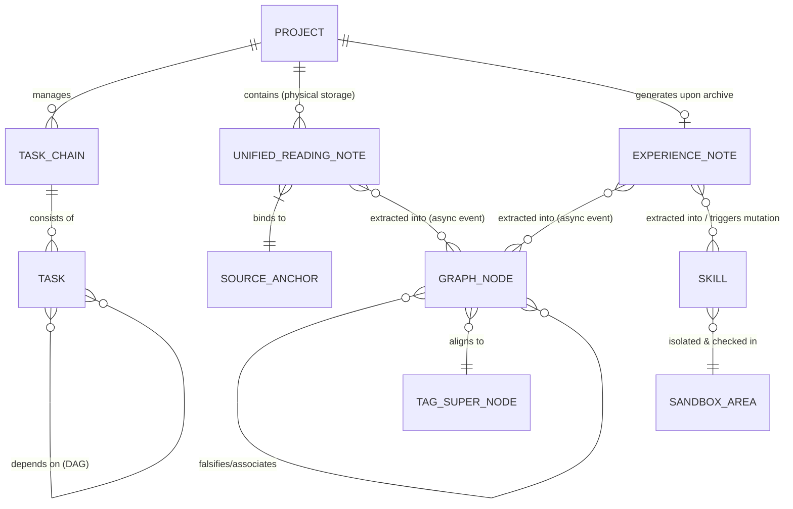

# 辅助阅读与知识技能沉淀系统业务建模

> [!IMPORTANT]
> 本文档是基于 [决策总结与技术裁决前置文档 (业务调研阶段)](../01_business_research/business_summary.md) 与 [决策总结与技术裁决前置文档 (竞品分析阶段)](../02_competitor_analysis/competitor_analysis_summary.md) 进行的收口业务建模。本文档严格基于前置裁决结果进行逻辑推导，不进行发散，旨在为后续系统架构、前端原型及数据模型设计提供坚实的契约底座与真理之源（Source of Truth）。

---

## 一、 系统需要解决的核心业务问题

系统核心要解决的是**“知”与“行”的物理断层**，以及在大模型赋能下如何保障系统的**成本可行性、逻辑稳定性与运行安全性**。具体可解构为以下八个核心问题：

### 1. 知识输入与行动执行的物理断层
* **业务痛点**：传统的知识管理工具（如 NotebookLM、Heptabase）偏向于信息输入、消化与卡片盒整理；而任务执行工具（如 Taskade、Motion）偏向于纯粹的项目与任务管理。这两类系统之间存在天然的技术壁垒，用户阅读和学习提炼出来的方法论，无法直接且低损耗地转化为可执行的任务。
* **建模要求**：系统需定义一种机制，将非结构化文本中的“方法论”编译为机器可读的“技能模版 (Skill)”，并能够无缝注入到“计划项目”的日常任务树中，实现知行闭环。

### 2. 混合知识库构建的大模型 Token 成本红线
* **业务痛点**：Graph RAG 能够通过实体关系提供强大的网状联想体验（构建用户的“第二大脑”），但在长文本阅读或划线时，若每次都实时触发大模型进行实体关系提取，将产生极高昂的 API Token 费用，导致商业或个人使用在经济上不可持续。
* **建模要求**：需设计“密集向量检索 (Dense RAG) 临时缓存”与“低频闲时后台异步建图 (Graph RAG)”的混合更新机制，实现成本与体验的折中。

### 3. Trace-to-Skill 提炼漏斗幻觉与执行死锁
* **业务痛点**：将非结构化方法论转换为结构化技能模版（包含依赖关系的任务步骤）时，大模型极易产生“编译幻觉”。如果生成的步骤包含循环依赖（如步骤 A 依赖步骤 B，步骤 B 又依赖步骤 A）或关键参数缺失，将导致执行端 Agent 解析并制定计划时发生逻辑死锁或系统崩溃。
* **建模要求**：需在编译层与入库层之间建立物理隔离的“沙箱技能区”，并通过拓扑排序等算法对步骤依赖进行严格的合法性校验。

### 4. 长周期执行中的状态死锁与会话开销
* **业务痛点**：计划项目的执行往往跨越较长周期，若为用户保持无限期的 LLM 会话长连接，会造成服务器资源的极大消耗与连接死锁；但若直接清除会话，又会导致上下文丢失，影响任务执行的连续性。
* **建模要求**：建立“超时自动休眠挂起”与“一键状态重载唤醒”的会话生命周期管理机制机制。

### 5. 伴读 Agent 的特权注入与越权执行风险
* **业务痛点**：用户上传的电子书或外部文献中可能暗含针对 LLM 的恶意注入指令（Prompt Injection）。若伴读 Agent 拥有本地 Shell 调用、网络请求或敏感 API 执行权限，恶意指令将直接威胁用户本地系统与数据安全。
* **建模要求**：建立物理层的特权隔离，伴读 Agent 仅具有“只读当前章节”与“控制台对话框文字输出”特权，从根本上杜绝命令越权执行的可能。

### 6. 读书笔记与辅导对话笔记的孤岛化割裂
* **业务痛点**：用户在沉浸式阅读中会产生两种高价值沉淀：基于原文段落的“主观读书笔记”，以及与伴读 Agent 探讨所产生的“客观辅导对话笔记”。传统系统通常将这两者物理隔离（批注与对话流分离），导致用户在回顾时无法将主观感悟与 AI 的延展解答有机串联，造成认知链条断裂。
* **建模要求**：系统需引入统一的“融合阅读笔记 (Unified Reading Note)”实体，在数据底层同构“划词写笔记”与“对话一键转笔记”双通道捕获的数据。打破模块隔离，将用户的读书感悟与 AI 辅导的对话上下文深度整合在同一知识单元内，实现碎片的统一归集。

### 7. 跨项目知识的碎片化与关联管理缺失
* **业务痛点**：随着阅读项目增多，散落在各个独立书籍/项目中的笔记会形成信息孤岛。若缺乏有效的跨项目关联机制，用户无法将不同时期、不同领域的知识点串联成网；而完全依赖手动打双链又会导致极高的维护心智负担。
* **建模要求**：系统需采用“Graph RAG 自动抽取为主 + 扁平全局标签手动打标为辅”的混合驱动模式。标签在图谱中作为“超节点”聚拢散落笔记，同时利用后台 LLM 进行同义词标签（如 `#AI` 与 `#人工智能`）的自动对齐合并，降低管理负担。

### 8. 从理论到实践的单向流与经验沉淀缺失
* **业务痛点**：用户基于理论知识或 Skill 模版执行计划项目时，在实操过程中往往会遇到“坑”或总结出“最佳实践”。但传统系统在项目结束后，这些宝贵的复盘经验便随之流失，导致“理论->行动”只有单向输出，无法实现“行动->经验”的知识回流闭环。
* **建模要求**：引入“经验笔记 (Experience Note)”机制，在计划项目归档时强制或引导用户进行复盘。这些实战经验将作为独立的知识实体，与阅读笔记一样喂入全局图谱，依靠实体概念的自然碰撞，无缝融入用户的认知网络中。

---

## 二、 当前的用户目标与核心诉求

随着系统业务模式的深度推演，用户的核心目标已从单纯的“阅读辅助”升华为**“知、行、悟”三位一体的知识生命周期管理**。具体可解构为以下三大维度、六项核心诉求：

### 维度一：【知】—— 沉浸式获取与极简沉淀
本维度的核心在于降低知识输入的阻力，打破信息孤岛。

| 诉求子项 | 目标描述 | 技术与设计映射契约 |
| :--- | :--- | :--- |
| **1. 高效伴读与知识内化** | 在沉浸式阅读书籍或论文时，不受频繁弹窗干扰，但能在关键节点获得 AI 导师的启发式伴读与任务引导。 | * 左右分栏布局（左阅读右交互） * 章节末 5% 推荐气泡 * 章节任务链引导 |
| **2. 笔记孤岛整合与追溯** | 将主观阅读感悟与伴读 Agent 的客观辅导对话深度整合为统一单元，并在回顾时能一秒定位物理原文。 | * 三栏式联动工作空间（阅读-笔记-伴读） * 划词与对话一键转存双通道融合 * Trace-to-Source 双向跳转脉冲高亮 |

### 维度二：【行】—— 技能编译与实战闭环
本维度的核心在于打通“纸上谈兵”到“落地实操”的壁垒，并让经验回流。

| 诉求子项 | 目标描述 | 技术与设计映射契约 |
| :--- | :--- | :--- |
| **3. 方法论可靠提炼** | 能将散落的笔记与章节精华，宏观打包并 100% 正确地转化为机器与人均可读的“技能模版”。 | * Trace-to-Skill 三级提炼漏斗 * `SKILL.md` 标准规范 * 物理隔离的沙箱卡片编辑器 |
| **4. 知行闭环与经验反哺** | 启动新项目时一键导入 Skill 模版指导实操；项目结束时引导复盘，将实战经验沉淀回知识库。 | * 计划项目初始化与 Skill 自动装载 * 归档时的经验复盘引导机制 * 经验笔记 (Experience Note) 同步喂入图谱 |

### 维度三：【悟】—— 全局俯瞰与认知进化
本维度的核心是构建个人“第二大脑”，通过全局视角进行自我认知定位与新陈代谢。

| 诉求子项 | 目标描述 | 技术与设计映射契约 |
| :--- | :--- | :--- |
| **5. 全局图谱与认知定位** | 跳出单本资料局限，在全局交互视图中俯瞰知识网络；通过知识库沉淀，看清自己的“认知坐标”与边界。 | * 独立全屏图谱视图 (Global Knowledge Graph) * 标签超节点聚拢散落笔记 * 跨项目沉浸式浮窗预览 (Quick Peek) |
| **6. 低成本的安全大脑** | 拥有网状联想的实体图谱且具备自我迭代能力，但不承担高昂 Token 账单，绝对保障数据隐私。 | * 闲时后台异步增量构建 Graph RAG * 时序衰变与反向抑制边（知识新陈代谢） * 纯本地脱敏与离线大模型支持 |

---

## 三、 业务场景与 MVP 边界划分

基于 Lead 的 P1 与 P2 级裁决，首期开发范围已严格限定。以下为业务场景的详细划分与 MVP 约束：

### 1. 业务场景总览表

| 业务场景 | 场景详述 | MVP 纳入范围 (In-Scope) | 排除或推迟范围 (Out-of-Scope) |
| :--- | :--- | :--- | :--- |
| **项目生命周期管理** | 创建管理实体，为学习或实践提供承载容器，并在完结时收口。 | * “计划项目”与特化的“阅读项目”双轨初始化 * 结合截止时间硬约束与关联 Agent 绑定 * **项目归档或完结时的复盘引导与经验抽取** | * 多端数据源（微信读书、Obsidian 等）无感实时同步（仅限本地上传及 Zotero 导入） |
| **文档解析与渲染** | 解析用户上传的资料，为阅读与提炼准备底层物料。 | * 多格式文本解析、切片绑定与阅读进度条 * 级联折叠大纲树渲染 | * 复杂的跨源云端图谱合并与实时同步 |
| **渐进式伴读与笔记捕获** | 读思记问一体，提供启发式伴读及低心智笔记沉淀。 | * 三栏式联动布局，划词 Discuss 对话 * 划词高亮写笔记与对话一键转笔记双通道 * 章节末 5% 范围弱打扰气泡提示 | * 强制弹窗打扰，或完全没有独立笔记面板、只有扁平列表导致笔记无法结构化整理的局限布局 |
| **全局知识库构建与图谱漫游** | 构建与可视化展示全局跨项目的笔记实体关系，提供全局俯瞰视角。 | * 基于 Dense RAG 的即时临时缓存检索问答 * 低频后台闲时异步增量构建跨项目的 Graph RAG 关系图谱 * **提供独立的交互式可视化图谱画布，节点支持点击展开与 Quick Peek 浮窗追溯** | * 每次划线实时触发 LLM 建图（避免昂贵 Token 开销） * 高并发跨源云端图谱自动合并机制 |
| **技能编译与沉淀** | 支持单点/章节/项目的宏观打包，将方法论编译为可执行的 Skill。 | * Trace-to-Skill 三级提炼漏斗，输出为 `SKILL.md`（含 YAML 元数据与 Markdown 步骤大纲） | * 无需审批的自动且静默入库运行 |
| **沙箱编辑与审批** | 人机协同纠错与确认。 | * `skills/sandbox/` 物理隔离区 * 独立卡片流编辑器（拖拽排序、依赖连线） * **拓扑排序阻断**：检测到环路依赖时，卡片红色发光、连线变红抖动，锁定并变灰“批准入库”按钮 | * 后台无监管全自动技能上线与入库 |
| **计划推荐与注入** | 技能模版自动装载到计划。 | * 新建普通项目时语义检索 Skill 并推荐 * 大纲骨架屏渐进式分层渲染出结构化任务树 | * 允许越权或无依赖的列表直接运行 |
| **任务执行与重调度** | 任务执行过程中的调度与异常管理。 | * 逾期冲突时的挂起重调度 * **超时优雅休眠**：24小时无交互自动释放会话，状态 Redis持久化，重登时毛玻璃提示，一键唤醒并水波纹重载 | * 长连接无限挂起（导致服务器死锁） |

---

## 四、 核心实体与概念数据模型

为确保后续系统架构与数据模型设计的一致性，本阶段定义以下核心业务实体关系模型：

### 1. 项目实体 (Project)
* **定义**：一切学习与执行任务的最高层级承载容器。
* **核心属性**：`id`, `title`, `type` (READING / PLAN), `status` (ACTIVE / ARCHIVED / SUSPENDED), `deadline`, `assigned_agent_id`。
* **业务规则**：
  * “阅读项目”是项目的特化类型。底层完全复用项目的生命周期管理。
  * 阅读项目关联具体的文档切片大纲树与伴读 Agent。

### 2. 任务/章节任务链实体 (Task / Task Chain)
* **定义**：项目中具体的执行步骤或阅读章节任务。
* **核心属性**：`id`, `project_id`, `title`, `sequence_order`, `status` (PENDING / RUNNING / COMPLETED / BLOCKED), `parent_task_id`, `depends_on_task_ids` (前置依赖项)。
* **业务规则**：
  * 在阅读项目中，任务链对应书籍/论文的章节目录。
  * 在计划项目中，任务链是由 Skill 注入后拆解生成的结构化任务树。

### 3. 技能实体 (Skill)
* **定义**：由经验笔记或阅读笔记提炼出的一段可执行辅助脚本或 Prompt 工作流，作为 Agent 执行任务时的“外挂工具”。
* **存储介质**：`SKILL.md` (Markdown 文本 + 头部 YAML 元数据)，存储在物理沙箱文件夹中。
* **核心结构**：
  * **YAML Frontmatter**：包含 `name`, `description`, `version`, `author`, `tags`。
  * **Markdown Body**：包含具体的执行 Prompt 或脚本指令流。
* **业务规则**：
  * **非数据库模板绑定**：Skill 在底层并非任务表的外键父级。它是应用层在“项目初始化拆解任务”或“运行时调度”时，由 LLM 动态挂载读取的工具库。
  * **状态流转**：`sandbox` (沙箱待审批) -> `active` (批准入库已激活)。

### 4. 沙箱编辑区实体 (Sandbox Area)
* **定义**：新编译技能入库前的物理隔离区与可视化校验编辑器。
* **校验规则**：
  * **拓扑排序 (Topological Sorting)**：载入卡片流时，必须对步骤之间的依赖关系进行拓扑排序校验。
  * **死锁阻断**：若校验结果中存在有向环（Cycle），则判定为“依赖死锁”，标记为不合法状态。
  * **入库门禁**：仅当合法性校验通过且用户点击“批准入库”后，Skill 状态才转为 `active` 并移出沙箱目录。

### 5. 知识图谱实体 (Graph Domain)
* **定义**：独立于笔记域的下游数据消费者。它是基于 SQLite 向量扩展 (sqlite-vec) 驱动的混合检索引擎，包含 Dense RAG 向量缓存与 Graph RAG 图谱关系。
* **存储实体**：
  * **图谱节点 (Graph Node)**：通过监听笔记生成的领域事件，异步调用 LLM 从笔记中抽取的原子知识实体及其关系边。
  * **标签超节点 (Tag Super Node)**：用于将带有相同全局标签的跨项目节点逻辑聚拢。
* **生命周期与对齐机制**：
  * **异步事件驱动**：当笔记域发生 `NoteUpdatedEvent` 时，图谱域在闲时异步调用 LLM 进行增量建图，绝不阻塞前端的记笔记操作。
  * **标签语义对齐 (Tag Alias)**：后台自动扫描用户标签，合并同义词节点。
  * **知识新陈代谢 (Knowledge Metabolism)**：当新的复盘经验与旧认知冲突时，图谱生成一条“Falsifies（证伪）”边。在检索与图谱渲染时，旧认知权重自动衰减降级。

### 6. 融合阅读笔记实体 (Note Domain)
* **定义**：将基于原文的主观读书感悟与客观探讨记录进行整合的独立综合知识单元。它与具体的执行任务（Task）彻底解绑，仅作为数据资产物理挂载在 Project 文件夹下。
* **核心属性**：`id`, `project_id`, `source_type`, `tags`, `content`, `source_anchor` (绑定的物理原文段落与偏移量)。
* **业务规则 (File-first 存储)**：
  * **真理之源**：笔记内容必须作为标准的 Markdown 文件真实物理落盘。SQLite 仅仅作为提供极速检索索引与元数据映射的“读缓存库”，保证笔记极高的跨系统（如 Obsidian、Notion）可移植性。
  * **纯物理锚点 (SourceAnchor)**：笔记与子 Task 无关联，仅根据源文档的物理段落位置进行锚定，避免高频变更的任务调度导致底层笔记孤立。
  * **物理追溯 (Trace-to-Source)**：前端可基于 `source_anchor` 精准实现跨项目的原文段落追溯（Quick Peek 沉浸式浮窗）及脉冲高亮定位。

### 7. 经验笔记实体 (Experience Note)
* **定义**：在“计划项目”执行完毕或归档时，由系统引导用户复盘所产生的实战经验总结（如避坑指南、最佳实践），是实现知行闭环的关键知识单元。
* **核心属性**：`id`, `project_id`, `associated_skill_id` (可选，关联最初生成该项目的 Skill), `tags` (全局扁平标签数组), `content` (富文本/Markdown 复盘内容)。
* **业务规则**：
  * **自然实体碰撞**：经验笔记在底层等同于阅读笔记，作为一等公民（First-class citizen）被送入大模型提取实体。只要经验笔记中提到了与理论书籍相同的概念词汇，大模型在图谱中会自然将其连往同一概念节点，无需强制硬编码追踪链路。
  * **实战闭环标记**：在全局知识图谱中，源自经验笔记的实体关系边可带有特殊的视觉标识（如虚线或特殊的 Icon），直观向用户呈现“哪些认知仅仅是纸上谈兵的理论，哪些认知已经过实操检验”。
  * **驱动工具进化 (Skill Mutation)**：当经验笔记明确指出了最初关联的 `Skill` 存在缺陷或优化空间时，系统会自动在 `SANDBOX_AREA` 沙箱区中派生出一个该 Skill 的修订分支 (Draft Branch)，由 Agent 根据复盘内容自动改写执行步骤，等待用户审批升级版本，赋予工具库自我进化的能力。

---

## 五、 系统设计前置技术与交互契约

后续的详细设计阶段必须强制遵守以下技术与交互红线契约：

> [!CAUTION]
> **安全隔离契约 (PA-05)**：
> 伴读 Agent 的运行权限必须受限于物理沙箱。严禁伴读 Agent 拥有调用外部网络、执行本地 Shell 命令或写入系统核心文件的特权。其全部输入输出均必须通过隔离的管道（Pipe）且仅向控制台输出纯文字。

> [!WARNING]
> **环路依赖阻断契约 (PA-03)**：
> 沙箱编辑器在渲染卡片流前必须执行拓扑排序。一旦检测到环路，前端界面必须将“批准入库”按钮设为禁用状态（变灰、不可点击），并在受影响卡片及连线上呈现红色发光与抖动动效，直至人类手动解除依赖环路。

> [!TIP]
> **低成本同步契约 (PA-02)**：
> 杜绝高频的实时 Graph RAG 构建。前端必须提供明显的“闲时同步图谱”按钮或在项目归档时启动后台异步任务，以实现 Token 成本的显著优化。

> [!NOTE]
> **优雅休眠与重载契约 (PA-04)**：
> 服务端对 LLM 会话长连接的超时时间设定为 24 小时。超时后，必须将会话状态（上下文、未完成的任务链 Trace 等）持久化保存至 Redis。用户重登时，前端必须呈现毛玻璃提示气泡，提供“一键重载”按钮，点击后通过水波纹刷新重调度，恢复会话。

> [!CAUTION]
> **数据隐私与本地脱敏契约 (PA-06)**：
> 个人笔记与思考卡片必须 100% 物理加密存储于本地沙箱。调用 LLM 进行 RAG 与图谱建图时，前端必须执行本地脱敏，且系统必须支持用户自主配置离线大模型来运行图谱抽取服务，从物理上隔离敏感知识产权资产的外泄可能。

> [!NOTE]
> **全局图谱漫游契约 (PA-07)**：
> 系统必须提供一个独立的全屏或大屏可视化空间（Global Knowledge Graph View），允许用户在一个可交互的网状画布中俯瞰所有跨项目的知识节点（自动提取实体与标签超节点）。该画布中的节点必须是可交互点击的，并且在点击后必须通过 Quick Peek 浮窗机制直接展现源笔记与物理上下文，禁止强制发生粗暴的跨项目页面跳转。
