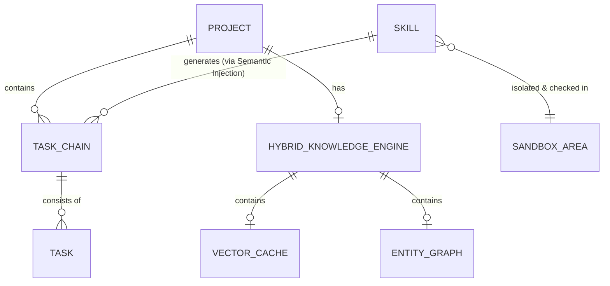

# 辅助阅读与知识技能沉淀系统业务建模

> [!IMPORTANT]
> 本文档是基于 [决策总结与技术裁决前置文档 (业务调研阶段)](../01_business_research/business_summary.md) 与 [决策总结与技术裁决前置文档 (竞品分析阶段)](../02_competitor_analysis/competitor_analysis_summary.md) 进行的收口业务建模。本文档严格基于前置裁决结果进行逻辑推导，不进行发散，旨在为后续系统架构、前端原型及数据模型设计提供坚实的契约底座与真理之源（Source of Truth）。

---

## 一、 系统需要解决的核心业务问题

系统核心要解决的是**“知”与“行”的物理断层**，以及在大模型赋能下如何保障系统的**成本可行性、逻辑稳定性与运行安全性**。具体可解构为以下五个子问题：

### 1. 知识输入与行动执行的物理断层
* **业务痛点**：传统的知识管理工具（如 NotebookLM、Heptabase）偏向于信息输入、消化与卡片盒整理；而任务执行工具（如 Taskade、Motion）偏向于纯粹的项目与任务管理。这两类系统之间存在天然的技术壁垒，用户阅读和学习提炼出来的方法论，无法直接且低损耗地转化为可执行的任务。
* **建模要求**：系统需定义一种机制，将非结构化文本中的“方法论”编译为机器可读的“技能模版 (Skill)”，并能够无缝注入到“计划项目”的日常任务树中，实现知行闭环。

### 2. 混合知识库构建的大模型 Token 成本红线
* **业务痛点**：Graph RAG 能够通过实体关系提供强大的网状联想体验（构建用户的“第二大脑”），但在长文本阅读或划线时，若每次都实时触发大模型进行实体关系提取，将产生极高昂的 API Token 费用，导致商业或个人使用在经济上不可持续。
* **建模要求**：需设计“密集向量检索 (Dense RAG) 临时缓存”与“低频闲时后台异步建图 (Graph RAG)”的混合更新机制，实现成本与体验的折中。

### 3. Trace-to-Skill 编译幻觉与执行死锁
* **业务痛点**：将非结构化方法论转换为结构化技能模版（包含依赖关系的任务步骤）时，大模型极易产生“编译幻觉”。如果生成的步骤包含循环依赖（如步骤 A 依赖步骤 B，步骤 B 又依赖步骤 A）或关键参数缺失，将导致执行端 Agent 解析并制定计划时发生逻辑死锁或系统崩溃。
* **建模要求**：需在编译层与入库层之间建立物理隔离的“沙箱技能区”，并通过拓扑排序等算法对步骤依赖进行严格的合法性校验。

### 4. 长周期执行中的状态死锁与会话开销
* **业务痛点**：计划项目的执行往往跨越较长周期，若为用户保持无限期的 LLM 会话长连接，会造成服务器资源的极大消耗与连接死锁；但若直接清除会话，又会导致上下文丢失，影响任务执行的连续性。
* **建模要求**：建立“超时自动休眠挂起”与“一键状态重载唤醒”的会话生命周期管理机制机制。

### 5. 伴读 Agent 的特权注入与越权执行风险
* **业务痛点**：用户上传的电子书或外部文献中可能暗含针对 LLM 的恶意注入指令（Prompt Injection）。若伴读 Agent 拥有本地 Shell 调用、网络请求或敏感 API 执行权限，恶意指令将直接威胁用户本地系统与数据安全。
* **建模要求**：建立物理层的特权隔离，伴读 Agent 仅具有“只读当前章节”与“控制台对话框文字输出”特权，从根本上杜绝命令越权执行的可能。

---

## 二、 当前的用户目标

用户目标可分为四项核心诉求，它们直接映射为系统设计的交互边界和技术指标：

| 用户目标维度 | 目标描述 | 技术与设计映射契约 |
| :--- | :--- | :--- |
| **高效伴读与知识内化** | 在沉浸式阅读书籍或论文时，不受频繁弹窗干扰，但能在关键节点（如章节末）获得 AI 导师的启发式伴读与任务引导。 | * 左右分栏布局（左阅读右交互） * 章节末 5% 推荐气泡 * 章节任务链引导 |
| **方法论技能可靠沉淀** | 能将伴读对话或阅读片段中提炼的个人方法论，100% 正确地转化为可重复利用的技能模版。 | * Trace-to-Skill 技能编译器 * `SKILL.md` (YAML + Markdown 步骤) 规范 * 物理隔离的沙箱卡片编辑器 |
| **知行统一的计划指导** | 在启动新的实践项目时，无需从零拆解任务，可一键导入自己沉淀或系统推荐的 Skill 模版，生成实操任务链。 | * 普通计划项目初始化引导 * 语义检索匹配 Skill 并一键载入 * 任务树骨架屏渐进式分层渲染 |
| **低成本且安全的个人大脑** | 能够拥有网状联想的实体关系知识图谱，但无需承担高昂 Token 账单，同时绝对确信个人数据的物理安全性。 | * 闲时后台异步增量构建图谱 * 限制伴读 Agent 本地/网络工具特权 * 纯人类审批把关的技能入库门禁 |

---

## 三、 业务场景与 MVP 边界划分

基于 Lead 的 P1 与 P2 级裁决，首期开发范围已严格限定。以下为业务场景的详细划分与 MVP 约束：

### 1. 业务场景总览表

| 业务场景 | 场景详述 | MVP 纳入范围 (In-Scope) | 排除或推迟范围 (Out-of-Scope) |
| :--- | :--- | :--- | :--- |
| **项目初始化** | 创建管理实体，为学习或实践提供承载容器。 | * “计划项目”与特化的“阅读项目”双轨初始化 * 结合截止时间硬约束与关联 Agent 绑定 | * 多端数据源（微信读书、Obsidian 等）无感实时同步（仅限本地上传及 Zotero 导入） |
| **文档解析与渲染** | 解析用户上传的资料，为阅读与提炼准备底层物料。 | * 多格式文本解析、切片绑定与阅读进度条 * 级联折叠大纲树渲染 | * 复杂的跨源云端图谱合并与实时同步 |
| **渐进式伴读** | 读练结合，提供双向驱动的启发式伴读辅导。 | * 左右分栏，划词浮动菜单 Discuss 一键对话 * 章节末 5% 范围弱打扰气泡提示 | * 强制弹窗打扰或完全依赖人类手动建立双链（缺乏 AI 引导）的极端方案 |
| **知识库网状构建** | 构建与可视化展示实体关系。 | * 基于 Dense RAG 的即时临时缓存检索问答 * 低频后台闲时异步增量构建 Graph RAG 关系图谱 * 物理连线图谱展现（带有文字描述的贝塞尔弹性双链连线，支持点击数字原文脉冲闪烁） | * 每次划线实时触发 LLM 建图（避免昂贵 Token 开销） * 高并发跨源云端图谱自动合并机制 |
| **技能编译与沉淀** | 方法论编译为可执行的 Skill。 | * Trace-to-Skill 方法论编译器，输出为 `SKILL.md`（含 YAML 元数据与 Markdown 步骤大纲） | * 无需审批的自动且静默入库运行 |
| **沙箱编辑与审批** | 人机协同纠错与确认。 | * `skills/sandbox/` 物理隔离区 * 独立卡片流编辑器（拖拽排序、依赖连线） * **拓扑排序阻断**：检测到环路依赖时，卡片红色发光、连线变红抖动，锁定并变灰“批准入库”按钮 | * 后台无监管全自动技能上线与入库 |
| **计划推荐与注入** | 技能模版自动装载到计划。 | * 新建普通项目时语义检索 Skill 并推荐 * 大纲骨架屏渐进式分层渲染出结构化任务树 | * 允许越权或无依赖的列表直接运行 |
| **任务执行与重调度** | 任务执行过程中的调度与异常管理。 | * 逾期冲突时的挂起重调度 * **超时优雅休眠**：24小时无交互自动释放会话，状态 Redis持久化，重登时毛玻璃提示，一键唤醒并水波纹重载 | * 长连接无限挂起（导致服务器死锁） |

---

## 四、 核心实体与概念数据模型

为确保后续系统架构与数据模型设计的一致性，本阶段定义以下核心业务实体关系模型：

### 1. 项目实体 (Project)
* **定义**：一切学习与执行任务的最高层级承载容器。
* **核心属性**：`id`, `title`, `type` (READING / PLAN), `status` (ACTIVE / ARCHIVED / SUSPENDED), `deadline`, `assigned_agent_id`。
* **业务规则**：
  * “阅读项目”是项目的特化类型。底层完全复用项目的生命周期管理。
  * 阅读项目关联具体的文档切片大纲树与伴读 Agent。

### 2. 任务/章节任务链实体 (Task / Task Chain)
* **定义**：项目中具体的执行步骤或阅读章节任务。
* **核心属性**：`id`, `project_id`, `title`, `sequence_order`, `status` (PENDING / RUNNING / COMPLETED / BLOCKED), `parent_task_id`, `depends_on_task_ids` (前置依赖项)。
* **业务规则**：
  * 在阅读项目中，任务链对应书籍/论文的章节目录。
  * 在计划项目中，任务链是由 Skill 注入后拆解生成的结构化任务树。

### 3. 技能实体 (Skill)
* **定义**：由非结构化文本中提炼出的方法论结构化模板。
* **存储介质**：`SKILL.md` (Markdown 文本 + 头部 YAML 元数据)。
* **核心结构**：
  * **YAML Frontmatter**：包含 `name`, `description`, `version`, `author`, `tags`。
  * **Markdown Body**：包含结构化的步骤指引、各步骤的依赖关系声明。
* **状态流转**：`sandbox` (沙箱待审批) -> `active` (批准入库已激活)。

### 4. 沙箱编辑区实体 (Sandbox Area)
* **定义**：新编译技能入库前的物理隔离区与可视化校验编辑器。
* **校验规则**：
  * **拓扑排序 (Topological Sorting)**：载入卡片流时，必须对步骤之间的依赖关系进行拓扑排序校验。
  * **死锁阻断**：若校验结果中存在有向环（Cycle），则判定为“依赖死锁”，标记为不合法状态。
  * **入库门禁**：仅当合法性校验通过且用户点击“批准入库”后，Skill 状态才转为 `active` 并移出沙箱目录。

### 5. 混合知识库与图谱实体 (Hybrid Knowledge Engine)
* **定义**：结合 Dense RAG 密集向量缓存与 Graph RAG 关系的混合检索引擎。
* **存储实体**：
  * **向量缓存 (Vector Cache)**：基于文本切片（Chunk）的密集向量索引，用于低延迟伴读问答。
  * **实体关系图谱 (Entity Graph)**：图数据库中的实体节点与关系边（含文本描述属性），作为用户的“第二大脑”联想图谱。
* **生命周期**：
  * 向量缓存实时写入与查询。
  * 图谱实体仅在项目归档或用户手动触发同步时，通过后台异步批处理任务（闲时）提取并合并。

---

## 五、 系统设计前置技术与交互契约

后续的详细设计阶段必须强制遵守以下技术与交互红线契约：

> [!CAUTION]
> **安全隔离契约 (PA-05)**：
> 伴读 Agent 的运行权限必须受限于物理沙箱。严禁伴读 Agent 拥有调用外部网络、执行本地 Shell 命令或写入系统核心文件的特权。其全部输入输出均必须通过隔离的管道（Pipe）且仅向控制台输出纯文字。

> [!WARNING]
> **环路依赖阻断契约 (PA-03)**：
> 沙箱编辑器在渲染卡片流前必须执行拓扑排序。一旦检测到环路，前端界面必须将“批准入库”按钮设为禁用状态（变灰、不可点击），并在受影响卡片及连线上呈现红色发光与抖动动效，直至人类手动解除依赖环路。

> [!TIP]
> **低成本同步契约 (PA-02)**：
> 杜绝高频的实时 Graph RAG 构建。前端必须提供明显的“闲时同步图谱”按钮或在项目归档时启动后台异步任务，以实现 Token 成本的显著优化。

> [!NOTE]
> **优雅休眠与重载契约 (PA-04)**：
> 服务端对 LLM 会话长连接的超时时间设定为 24 小时。超时后，必须将会话状态（上下文、未完成的任务链 Trace 等）持久化保存至 Redis。用户重登时，前端必须呈现毛玻璃提示气泡，提供“一键重载”按钮，点击后通过水波纹刷新重调度，恢复会话。
