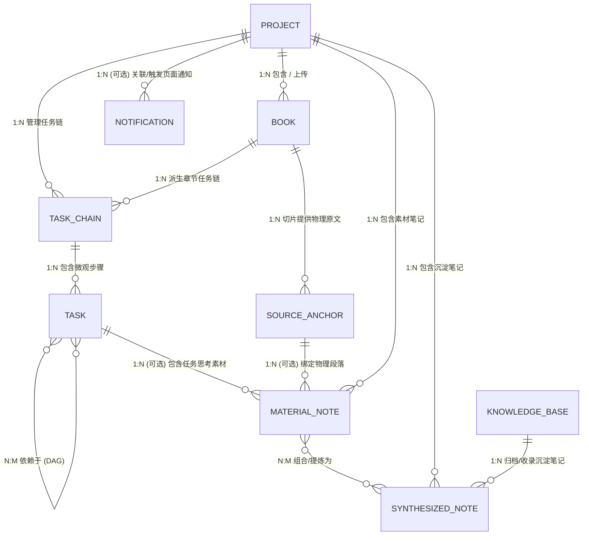
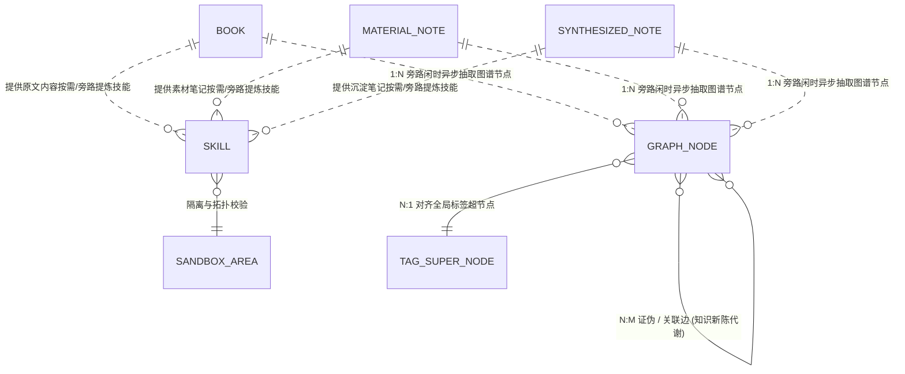

# 辅助阅读与知识技能沉淀系统业务建模

> [!IMPORTANT]
> 本文档是基于 [决策总结与技术裁决前置文档 (业务调研阶段)](../01_business_research/business_summary.md) 与 [决策总结与技术裁决前置文档 (竞品分析阶段)](../02_competitor_analysis/competitor_analysis_summary.md) 进行的收口业务建模。本文档严格基于前置裁决结果进行逻辑推导，不进行发散，旨在为后续系统架构、前端原型及数据模型设计提供坚实的契约底座与真理之源（Source of Truth）。

---

## 一、 系统需要解决的核心业务问题

系统核心要解决的是**“知”与“行”的物理断层**，以及在大模型赋能下如何保障系统的**成本可行性、逻辑稳定性与运行安全性**。具体可解构为以下八个核心问题：

### 1. 知识输入与行动执行的物理断层
* **业务痛点**：传统的知识管理工具（如 NotebookLM、Heptabase）偏向于信息输入、消化与卡片盒整理；而任务执行工具（如 Taskade、Motion）偏向于纯粹的项目与任务管理。这两类系统之间存在天然的技术壁垒，用户阅读和学习提炼出来的方法论，无法直接且低损耗地转化为可执行的任务。
* **建模要求**：系统需定义一种机制，将非结构化文本中的“方法论”编译为机器可读的“技能模版 (Skill)”，并能够无缝注入到“计划项目”的日常任务树中，实现知行闭环。

### 2. 混合知识库构建的大模型 Token 成本红线
* **业务痛点**：Graph RAG 能够通过实体关系提供强大的网状联想体验（构建用户的“第二大脑”），但在长文本阅读或划线时，若每次都实时触发大模型进行实体关系提取，将产生极高昂的 API Token 费用，导致商业或个人使用在经济上不可持续。
* **建模要求**：需设计“密集向量检索 (Dense RAG) 临时缓存”与“低频闲时后台异步建图 (Graph RAG)”的混合更新机制，实现成本与体验的折中。

### 3. Trace-to-Skill 提炼漏斗幻觉与执行死锁
* **业务痛点**：将非结构化方法论转换为结构化技能模版（包含依赖关系的任务步骤）时，大模型极易产生“编译幻觉”。如果生成的步骤包含循环依赖（如步骤 A 依赖步骤 B，步骤 B 又依赖步骤 A）或关键参数缺失，将导致执行端 Agent 解析并制定计划时发生逻辑死锁或系统崩溃。
* **建模要求**：需在编译层与入库层之间建立物理隔离的“沙箱技能区”，并通过拓扑排序等算法对步骤依赖进行严格的合法性校验。

### 4. 长周期执行中的状态死锁与会话开销
* **业务痛点**：计划项目的执行往往跨越较长周期，若为用户保持无限期的 LLM 会话长连接，会造成服务器资源的极大消耗与连接死锁；但若直接清除会话，又会导致上下文丢失，影响任务执行的连续性。
* **建模要求**：建立“超时自动休眠挂起”与“一键状态重载唤醒”的会话生命周期管理机制机制。

### 5. 伴读 Agent 的特权注入与越权执行风险
* **业务痛点**：用户上传的电子书或外部文献中可能暗含针对 LLM 的恶意注入指令（Prompt Injection）。若伴读 Agent 拥有本地 Shell 调用、网络请求或敏感 API 执行权限，恶意指令将直接威胁用户本地系统与数据安全。
* **建模要求**：建立物理层的特权隔离，伴读 Agent 仅具有“只读当前章节”与“控制台对话框文字输出”特权，从根本上杜绝命令越权执行的可能。

### 6. 读书笔记与辅导对话笔记的孤岛化割裂
* **业务痛点**：用户在沉浸式阅读中会产生两种高价值沉淀：基于原文段落的“主观读书笔记”，以及与伴读 Agent 探讨所产生的“客观辅导对话笔记”。传统系统通常将这两者物理隔离（批注与对话流分离），导致用户在回顾时无法将主观感悟与 AI 的延展解答有机串联，造成认知链条断裂。
* **建模要求**：系统需引入统一的“融合阅读笔记 (Unified Reading Note)”实体，在数据底层同构“划词写笔记”与“对话一键转笔记”双通道捕获的数据。打破模块隔离，将用户的读书感悟与 AI 辅导的对话上下文深度整合在同一知识单元内，实现碎片的统一归集。

### 7. 跨项目知识的碎片化与关联管理缺失
* **业务痛点**：随着阅读项目增多，散落在各个独立书籍/项目中的笔记会形成信息孤岛。若缺乏有效的跨项目关联机制，用户无法将不同时期、不同领域的知识点串联成网；而完全依赖手动打双链又会导致极高的维护心智负担。
* **建模要求**：系统需采用“Graph RAG 自动抽取为主 + 扁平全局标签手动打标为辅”的混合驱动模式。标签在图谱中作为“超节点”聚拢散落笔记，同时利用后台 LLM 进行同义词标签（如 `#AI` 与 `#人工智能`）的自动对齐合并，降低管理负担。

### 8. 从理论到实践的单向流与经验沉淀缺失
* **业务痛点**：用户基于理论知识或 Skill 模版执行计划项目时，在实操过程中往往会遇到“坑”或总结出“最佳实践”。但传统系统在项目结束后，这些宝贵的复盘经验便随之流失，导致“理论->行动”只有单向输出，无法实现“行动->经验”的知识回流闭环。
* **建模要求**：引入“经验笔记 (Experience Note)”机制，在计划项目归档时强制或引导用户进行复盘。这些实战经验将作为独立的知识实体，与阅读笔记一样喂入全局图谱，依靠实体概念的自然碰撞，无缝融入用户的认知网络中。

---

## 二、 当前的用户目标与核心诉求

随着系统业务模式的深度推演，用户的核心目标已从单纯的“阅读辅助”升华为**“知、行、悟”三位一体的知识生命周期管理**。具体可解构为以下三大维度、六项核心诉求：

### 维度一：【知】—— 沉浸式获取与极简沉淀
本维度的核心在于降低知识输入的阻力，打破信息孤岛。

| 诉求子项                  | 目标描述                                                                                       | 技术与设计映射契约                                                                                             |
| :------------------------ | :--------------------------------------------------------------------------------------------- | :------------------------------------------------------------------------------------------------------------- |
| **1. 高效伴读与知识内化** | 在沉浸式阅读书籍或论文时，不受频繁弹窗干扰，但能在关键节点获得 AI 导师的启发式伴读与任务引导。 | * 左右分栏布局（左阅读右交互）<br>* 章节末 5% 推荐气泡<br>* 章节任务链引导                                     |
| **2. 笔记孤岛整合与追溯** | 将主观阅读感悟与伴读 Agent 的客观辅导对话深度整合为统一单元，并在回顾时能一秒定位物理原文。    | * 三栏式联动工作空间（阅读-笔记-伴读）<br>* 划词与对话一键转存双通道融合<br>* Trace-to-Source 双向跳转脉冲高亮 |

### 维度二：【行】—— 技能编译与实战闭环
本维度的核心在于打通“纸上谈兵”到“落地实操”的壁垒，并让经验回流。

| 诉求子项                  | 目标描述                                                                              | 技术与设计映射契约                                                                                           |
| :------------------------ | :------------------------------------------------------------------------------------ | :----------------------------------------------------------------------------------------------------------- |
| **3. 方法论可靠提炼**     | 能将散落的笔记与章节精华，宏观打包并 100% 正确地转化为机器与人均可读的“技能模版”。    | * Trace-to-Skill 三级提炼漏斗<br>* `SKILL.md` 标准规范<br>* 物理隔离的沙箱卡片编辑器                         |
| **4. 知行闭环与经验反哺** | 启动新项目时一键导入 Skill 模版指导实操；项目结束时引导复盘，将实战经验沉淀回知识库。 | * 计划项目初始化与 Skill 自动装载<br>* 归档时的经验复盘引导机制<br>* 经验笔记 (Experience Note) 同步喂入图谱 |

### 维度三：【悟】—— 全局俯瞰与认知进化
本维度的核心是构建个人“第二大脑”，通过全局视角进行自我认知定位与新陈代谢。

| 诉求子项                  | 目标描述                                                                                     | 技术与设计映射契约                                                                                             |
| :------------------------ | :------------------------------------------------------------------------------------------- | :------------------------------------------------------------------------------------------------------------- |
| **5. 全局图谱与认知定位** | 跳出单本资料局限，在全局交互视图中俯瞰知识网络；通过知识库沉淀，看清自己的“认知坐标”与边界。 | * 独立全屏图谱视图 (Global Knowledge Graph)<br>* 标签超节点聚拢散落笔记<br>* 跨项目沉浸式浮窗预览 (Quick Peek) |
| **6. 低成本的安全大脑**   | 拥有网状联想的实体图谱且具备自我迭代能力，但不承担高昂 Token 账单，绝对保障数据隐私。        | * 闲时后台异步增量构建 Graph RAG<br>* 时序衰变与反向抑制边（知识新陈代谢）<br>* 纯本地脱敏与离线大模型支持     |

---

## 三、 业务场景与 MVP 边界划分

基于 Lead 的 P1 与 P2 级裁决，首期开发范围已严格限定。以下为业务场景的详细划分与 MVP 约束：

### 1. 业务场景总览表

| 业务场景                     | 场景详述                                                     | MVP 纳入范围 (In-Scope)                                                                                                                                                          | 排除或推迟范围 (Out-of-Scope)                                                          |
| :--------------------------- | :----------------------------------------------------------- | :------------------------------------------------------------------------------------------------------------------------------------------------------------------------------- | :------------------------------------------------------------------------------------- |
| **项目生命周期管理**         | 创建管理实体，为学习或实践提供承载容器，并在完结时收口。     | * “计划项目”与特化的“阅读项目”双轨初始化<br>* 结合截止时间硬约束与关联 Agent 绑定<br>* **项目归档或完结时的复盘引导与经验抽取**                                                  | * 多端数据源（微信读书、Obsidian 等）无感实时同步（仅限本地上传及 Zotero 导入）        |
| **文档解析与渲染**           | 解析用户上传的资料，为阅读与提炼准备底层物料。               | * 多格式文本解析、切片绑定与阅读进度条<br>* 级联折叠大纲树渲染                                                                                                                   | * 复杂的跨源云端图谱合并与实时同步                                                     |
| **渐进式伴读与笔记捕获**     | 读思记问一体，提供启发式伴读及低心智笔记沉淀。               | * 三栏式联动布局，划词 Discuss 对话<br>* 划词高亮写笔记与对话一键转笔记双通道<br>* 章节末 5% 范围弱打扰气泡提示                                                                  | * 强制弹窗打扰，或完全没有独立笔记面板、只有扁平列表导致笔记无法结构化整理的局限布局   |
| **全局知识库构建与图谱漫游** | 构建与可视化展示全局跨项目的笔记实体关系，提供全局俯瞰视角。 | * 基于 Dense RAG 的即时临时缓存检索问答<br>* 低频后台闲时异步增量构建跨项目的 Graph RAG 关系图谱<br>* **提供独立的交互式可视化图谱画布，节点支持点击展开与 Quick Peek 浮窗追溯** | * 每次划线实时触发 LLM 建图（避免昂贵 Token 开销）<br>* 高并发跨源云端图谱自动合并机制 |
| **技能编译与沉淀**           | 支持单点/章节/项目的宏观打包，将方法论编译为可执行的 Skill。 | * Trace-to-Skill 三级提炼漏斗，输出为 `SKILL.md`（含 YAML 元数据与 Markdown 步骤大纲）                                                                                           | * 无需审批的自动且静默入库运行                                                         |
| **沙箱编辑与审批**           | 人机协同纠错与确认。                                         | * `skills/sandbox/` 物理隔离区<br>* 独立卡片流编辑器（拖拽排序、依赖连线）<br>* **拓扑排序阻断**：检测到环路依赖时，卡片红色发光、连线变红抖动，锁定并变灰“批准入库”按钮         | * 后台无监管全自动技能上线与入库                                                       |
| **计划推荐与注入**           | 技能模版自动装载到计划。                                     | * 新建普通项目时语义检索 Skill 并推荐<br>* 大纲骨架屏渐进式分层渲染出结构化任务树                                                                                                | * 允许越权或无依赖的列表直接运行                                                       |
| **任务执行与重调度**         | 任务执行过程中的调度与异常管理。                             | * 逾期冲突时的挂起重调度<br>* **超时优雅休眠**：24小时无交互自动释放会话，状态 Redis持久化，重登时毛玻璃提示，一键唤醒并水波纹重载                                               | * 长连接无限挂起（导致服务器死锁）                                                     |

---

## 四、 核心实体与概念数据模型

为确保后续系统架构与数据模型设计的一致性，本阶段定义以下核心业务实体关系模型与旁路消费模型：

### 1. 业务关系模型图谱

#### (1) 核心业务实体关系模型 (Main Business Domain)



#### (2) 旁路知识图谱消费与对齐模型 (Bypass Graph Sidecar Domain)



---

### 2. 核心实体规范与业务规则

### 1. 项目实体 (Project)
* **定义**：一切学习与执行任务的最高层级承载容器。
* **核心属性表**：

| 属性名                      | 类型     | 约束 / 可选性                       | 含义与说明                      |
| :-------------------------- | :------- | :---------------------------------- | :------------------------------ |
| `id`                        | String   | 主键 (UUID)                         | 项目全局唯一标识                |
| `title`                     | String   | 必填                                | 项目名称                        |
| `type`                      | Enum     | `READING` / `PLAN`                  | 项目类型（阅读项目 / 计划项目） |
| `status`                    | Enum     | `ACTIVE` / `ARCHIVED` / `SUSPENDED` | 生命周期状态                    |
| `deadline`                  | DateTime | 可选                                | 截止时间约束                    |
| `assigned_agent_id`         | String   | 必填                                | 绑定的沙箱伴读 Agent ID         |
| `created_at` / `updated_at` | DateTime | 必填                                | 系统审计时间戳                  |

* **业务规则**：
  * **生命周期统一**：“阅读项目”是项目的特化类型，底层完全复用项目的生命周期管理流转。
  * **物料与 Agent 绑定**：阅读项目主关联一本或多本书籍，绑定伴读 Agent 并生成切片任务大纲树。

---

### 2. 任务链实体 (Task Chain) - 里程碑
* **定义**：项目中中观层级的容器（在阅读项目中表现为章节大纲链，在计划项目中表现为阶段/功能模块任务链）。
* **核心属性表**：

| 属性名                       | 类型     | 约束 / 可选性                                   | 含义与说明                 |
| :--------------------------- | :------- | :---------------------------------------------- | :------------------------- |
| `id`                         | String   | 主键 (UUID)                                     | 任务链唯一标识             |
| `project_id`                 | String   | 外键 (Project)                                  | 归属项目 ID                |
| `book_id`                    | String   | 可选 (Book)                                     | 阅读项目关联的书籍 ID      |
| `chapter_id` / `section_ref` | String   | 可选                                            | 关联书籍章节标识与阅读范围 |
| `title`                      | String   | 必填                                            | 章节/阶段里程碑标题        |
| `sequence_order`             | Number   | 必填                                            | 中观链条的物理物理排序     |
| `status`                     | Enum     | `PENDING` / `RUNNING` / `COMPLETED` / `BLOCKED` | 阶段完成状态               |
| `type`                       | Enum     | `READING_CHAPTER` / `PLAN_STAGE` / `DEFAULT`    | 任务链业务类型             |
| `created_at` / `updated_at`  | DateTime | 必填                                            | 审计时间戳                 |

* **业务规则 (通用容器原则)**：
  > [!IMPORTANT]
  > **1. 统一三层范式**：系统底层统一遵循 `Project -> Task Chain -> Task` 范式。`Task Chain` 作为通用中观容器，消除不同项目类型在 DB 与 API 上的结构差异。
  > **2. 阅读项目表现 (1 Chapter = 1 Task Chain)**：电子书解析后的每个独立章节（Chapter）精准实例化为一个 `Task Chain`。
  > **3. 计划项目表现**：由 Skill 模版或 LLM 解构生成的阶段性功能模块/里程碑实例化为 `Task Chain`；若为纯扁平列表，底层自动挂载隐式 `Task Chain`。

---

### 3. 任务实体 (Task)
* **定义**：任务链下的具体微观可执行单元（如段落精读、划词对话、卡片写笔记、代码编写等独立步骤）。
* **核心属性表**：

| 属性名                      | 类型          | 约束 / 可选性                                   | 含义与说明                             |
| :-------------------------- | :------------ | :---------------------------------------------- | :------------------------------------- |
| `id`                        | String        | 主键 (UUID)                                     | 任务唯一标识                           |
| `task_chain_id`             | String        | 外键 (TaskChain)                                | 归属任务链 ID                          |
| `title`                     | String        | 必填                                            | 任务具体名称                           |
| `description`               | String        | 可选                                            | 任务详细执行要求与说明                 |
| `sequence_order`            | Number        | 必填                                            | 同一 TaskChain 内的序号                |
| `status`                    | Enum          | `PENDING` / `RUNNING` / `COMPLETED` / `BLOCKED` | 微观任务状态                           |
| `parent_task_id`            | String        | 可选 (Task)                                     | 子任务父节点 ID                        |
| `depends_on_task_ids`       | Array<String> | JSON 数组                                       | 有向无环图 (DAG) 前置依赖 Task ID 列表 |
| `created_at` / `updated_at` | DateTime      | 必填                                            | 审计时间戳                             |

* **业务规则**：
  * **DAG 依赖控制**：同级或跨任务链的 Task 之间可通过 `depends_on_task_ids` 建立依赖，前置任务未完成时，当前任务状态锁定为 `BLOCKED`。
  * **Agent 调度粒度**：调度引擎与伴读 Agent 以 `Task` 为最小驱动与事件触发单元。

---

### 4. 书籍实体 (Book)
* **定义**：承载原读书籍/电子文档物理文件及其全生命周期解析状态、物料拆解与目录大纲映射的核心实体。
* **核心属性表**：

| 属性名                      | 类型     | 约束 / 可选性                                                | 含义与说明                            |
| :-------------------------- | :------- | :----------------------------------------------------------- | :------------------------------------ |
| `id`                        | String   | 主键 (UUID)                                                  | 书籍唯一标识                          |
| `project_id`                | String   | 外键 (Project)                                               | 关联阅读项目 ID                       |
| `file_name`                 | String   | 必填                                                         | 原始物理文件名                        |
| `file_type`                 | Enum     | `PDF` / `EPUB` / `TXT` / `MD`                                | 电子书物理格式                        |
| `file_size`                 | Number   | 必填                                                         | 字节大小                              |
| `storage_path`              | String   | 必填                                                         | 沙箱磁盘原书物理路径                  |
| `content_json_path`         | String   | 必填                                                         | 沙箱中 `parsed_content.json` 切片路径 |
| `parsing_status`            | Enum     | `PENDING` / `UPLOADING` / `PARSING` / `COMPLETED` / `FAILED` | 解析全生命周期状态                    |
| `parsed_structure`          | Object   | JSON 结构                                                    | 目录树 `TocNode` 数据库索引数据       |
| `total_chapters`            | Number   | 必填                                                         | 提取的总章节数                        |
| `total_word_count`          | Number   | 必填                                                         | 全书总字数                            |
| `error_message`             | String   | 可选                                                         | 解析异常时的报错日志                  |
| `created_at` / `updated_at` | DateTime | 必填                                                         | 审计时间戳                            |

* **通用解析数据结构契约 (Universal Parsed Book Schema)**：
  根据 **File-first (文件优先)** 原则，电子书解析后的大体量正文数据在沙箱 `content_json_path` 落盘为 `parsed_content.json`，数据库 `Book` 记录仅存储目录大纲树索引。

  > [!NOTE]
  > **通用目录大纲树 (`TocNode`)**：
  > 抹平 EPUB NCX/NAV 与 PDF Outline 差异的递归树结构。
  > * `id`: 目录节点 ID (`toc_chap_01`)
  > * `title`: 目录标题
  > * `level`: 层级深度 (1, 2, 3...)
  > * `target_chapter_id`: 目标章节 ID (`chapter_id`)
  > * `target_block_id` (可选): 章节内精确跳转的段落 Block ID
  > * `target_page` (可选): PDF 物理页码 (1-based)
  > * `children`: `TocNode[]` 子目录列表

  > [!NOTE]
  > **章节与原子正文块切片模型 (`BookChapter` & `ContentBlock`)**：
  > 正文按照 `BookChapter` 进行划分，各章节包含顺序排列的 `ContentBlock`（原子段落块）：
  > * `chapter_id`: 章节/页容器 ID (`chap_01` 或 `page_12`)
  > * `chapter_index`: 阅读物理顺序索引 (0-based)
  > * `blocks`: `ContentBlock[]` 数组。每个 Block 包含：
  >   * `block_id`: 段落全局唯一 ID (`b_01_005`)
  >   * `block_type`: `HEADING` / `PARAGRAPH` / `CODE` / `IMAGE` / `TABLE` / `QUOTE`
  >   * `sequence_index`: 章节内段落序号
  >   * `text`: 纯文本内容 (供搜索、摘要生成与上下文注入)
  >   * `html_or_markdown`: 格式化渲染内容 (针对 EPUB / MD)
  >   * `page_number`: PDF 物理页码 (PDF 专属)
  >   * `bbox`: `[x, y, w, h]` 矩形边界框坐标 (PDF 专属)
  >   * `char_start` / `char_end`: 段落字符起止偏移量

* **数据结构真实 JSON 示例 (Parsed Data Examples)**：

  **(1) 数据库 `parsed_structure` 字段存储的目录树 JSON 示例**：
  ```json
  [
    {
      "id": "toc_c01",
      "title": "第一章：领域驱动设计核心理念",
      "level": 1,
      "target_chapter_id": "chap_01",
      "target_block_id": "b_01_001",
      "target_page": 1,
      "children": [
        {
          "id": "toc_c01_s01",
          "title": "1.1 统一语言与限界上下文",
          "level": 2,
          "target_chapter_id": "chap_01",
          "target_block_id": "b_01_003",
          "target_page": 3,
          "children": []
        }
      ]
    }
  ]
  ```

  **(2) 沙箱 `content_json_path` 下物理文件 `parsed_content.json` 示例**：
  ```json
  {
    "book_id": "bk_9b8a7c6f-5e4d-3c2b-1a0f-9e8d7c6b5a4f",
    "total_chapters": 12,
    "chapters": [
      {
        "chapter_id": "chap_01",
        "chapter_index": 0,
        "title": "第一章：领域驱动设计核心理念",
        "total_words": 3500,
        "blocks": [
          {
            "block_id": "b_01_001",
            "block_type": "HEADING",
            "sequence_index": 0,
            "text": "第一章：领域驱动设计核心理念",
            "html_or_markdown": "<h1>第一章：领域驱动设计核心理念</h1>",
            "page_number": 1,
            "bbox": [50.0, 100.0, 500.0, 35.0],
            "char_start": 0,
            "char_end": 14
          },
          {
            "block_id": "b_01_002",
            "block_type": "PARAGRAPH",
            "sequence_index": 1,
            "text": "领域驱动设计 (DDD) 强调以业务领域为核心，构建清晰的限界上下文与统一语言。",
            "html_or_markdown": "<p>领域驱动设计 (DDD) 强调以业务领域为核心，构建清晰的限界上下文与统一语言。</p>",
            "page_number": 1,
            "bbox": [50.0, 145.0, 500.0, 80.0],
            "char_start": 15,
            "char_end": 56
          }
        ]
      }
    ]
  }
  ```

* **解析全生命周期流程**：
  1. **上传与初始化**：上传文件入沙箱 `storage_path`，状态设为 `PENDING` -> `UPLOADING`。
  2. **异步解析与切片**：后台解析文本、生成物理切片 `parsed_content.json` 入 `content_json_path`，状态切换为 `PARSING`。
  3. **结构树映射与任务化**：提取目录树到 `parsed_structure`，自动为每个章节生成一个 `TASK_CHAIN`，完成后状态置为 `COMPLETED`。
  4. **阅读与锚点服务**：为阅读器提供按章 API 拉取段落 Block 驱动虚拟列表，支持伴读 Agent 对话、划词高亮 `Source Anchor` 生成。
  5. **归档与物理清理**：项目归档时级联清理或归档文件存储。

---

### 5. 物理原文锚点实体 (Source Anchor)
* **定义**：记录素材笔记在阅读场景下对应的物理源文档中的精准段落位置、多维偏移坐标与文本快照，为划词记笔记和反向定位原文提供基准。
* **核心属性表**：

| 属性名              | 类型     | 约束 / 可选性    | 含义与说明                    |
| :------------------ | :------- | :--------------- | :---------------------------- |
| `id`                | String   | 主键 (UUID)      | 锚点唯一标识                  |
| `book_id`           | String   | 外键 (Book)      | 归属书籍 ID                   |
| `chapter_id`        | String   | 必填             | 所属章节/页 ID                |
| `block_id`          | String   | 必填             | 归属段落 ContentBlock ID      |
| `char_start_offset` | Number   | 必填             | Block 内选中文本起始字符偏移  |
| `char_end_offset`   | Number   | 必填             | Block 内选中文本终止字符偏移  |
| `page_number`       | Number   | 可选 (PDF 专属)  | PDF 物理页码 (1-based)        |
| `pdf_rects`         | Object   | 可选 (PDF 专属)  | PDF 多划词矩形框坐标数组 JSON |
| `epub_cfi`          | String   | 可选 (EPUB 专属) | EPUB CFI 锚点定位串           |
| `text_snippet`      | String   | 必填             | 划词选中的物理原文切片快照    |
| `prefix_context`    | String   | 必填             | 划词前置 20 字符上下文        |
| `suffix_context`    | String   | 必填             | 划词后置 20 字符上下文        |
| `content_hash`      | String   | 必填             | 快照与上下文校验 SHA-256 Hash |
| `created_at`        | DateTime | 必填             | 锚点生成时间                  |

* **业务规则与解算机制**：
  > [!IMPORTANT]
  > **三层定位解算与容错机制 (Three-Tier Anchor Resolution)**：
  > * **层级 1 (绝对定位)**：阅读器优先基于 `block_id` + `char_start_offset` / `char_end_offset`（PDF 结合 `pdf_rects`，EPUB 结合 `epub_cfi`）实现毫秒级精准点亮。
  > * **层级 2 (上下文模糊重锚定)**：若电子书重新解析或文本微调导致字符偏移失效，系统自动使用 `text_snippet` 结合 `prefix_context` 与 `suffix_context` 进行前后 20 字符的字符串模糊匹配，重新计算并更新锚点。
  > * **层级 3 (降级段落高亮与失效警示)**：若重锚定依旧失败，系统将高亮范围降级为 `block_id` 对应的整个段落，并在前端界面将锚点状态标记为警示，提示用户“原文本位置发生轻微变动”。

---

### 6. 素材笔记实体 (Material Note)
* **定义**：原子级知识素材卡片，既可在阅读过程中基于原文片段生成，也可在 Task/计划项目执行过程中挂载到具体 Task 下记录思考。
* **核心属性表**：

| 属性名                      | 类型          | 约束 / 可选性       | 含义与说明                |
| :-------------------------- | :------------ | :------------------ | :------------------------ |
| `id`                        | String        | 主键 (UUID)         | 素材笔记唯一标识          |
| `project_id`                | String        | 外键 (Project)      | 归属项目 ID               |
| `task_id`                   | String        | 可选 (Task)         | 关联的具体 Task ID        |
| `book_id`                   | String        | 可选 (Book)         | 关联的书籍 ID             |
| `source_anchor_id`          | String        | 可选 (SourceAnchor) | 关联物理原文段落锚点 ID   |
| `original_snippet`          | String        | 可选                | 划词原文/参考资料片段快照 |
| `paraphrase`                | String        | 必填                | 个人转述与理解说明        |
| `scenario_context`          | String        | 可选                | 关联到自己的经历/应用情景 |
| `tags`                      | Array<String> | JSON 数组           | 全局扁平标签数组          |
| `created_at` / `updated_at` | DateTime      | 必填                | 审计时间戳                |

* **业务规则**：
  * **三位一体结构**：统一由“素材/参考片段” + “个人转述” + “知识点关联自身经历/情景”三要素构成。
  * **非强绑定与通用复用**：`source_anchor_id` 与 `book_id` 为可选字段。在阅读项目中绑定物理锚点；在计划项目中关联 `task_id` 灵活记录思考素材。

---

### 7. 沉淀笔记实体 (Synthesized Note)
* **定义**：基于若干素材笔记与结构化思考文案组合而成的独立综合知识文档，代表系统化的认知产出。
* **核心属性表**：

| 属性名                      | 类型          | 约束 / 可选性            | 含义与说明                              |
| :-------------------------- | :------------ | :----------------------- | :-------------------------------------- |
| `id`                        | String        | 主键 (UUID)              | 沉淀笔记唯一标识                        |
| `project_id`                | String        | 外键 (Project)           | 归属项目 ID                             |
| `knowledge_base_id`         | String        | 可选 (KnowledgeBase)     | 归属知识库 ID                           |
| `title`                     | String        | 必填                     | 沉淀笔记标题                            |
| `type`                      | Enum          | `GENERAL` / `EXPERIENCE` | 笔记类型（常规认知沉淀 / 结项经验总结） |
| `material_note_ids`         | Array<String> | JSON 数组                | 绑定的素材笔记 ID 列表                  |
| `content`                   | String        | File-first               | Markdown 物理文件相对路径或内存全文     |
| `tags`                      | Array<String> | JSON 数组                | 全局扁平标签数组                        |
| `created_at` / `updated_at` | DateTime      | 必填                     | 审计时间戳                              |

* **业务规则 (File-first 存储)**：
  * **独立落盘**：作为标准的 Markdown 文件在物理项目或知识库目录下真实落盘。
  * **素材聚合与追溯**：通过 `material_note_ids` 聚合多条素材笔记，前端支持逐条浮窗追溯（Trace-to-Source）。
  * **知识库归档与经验复盘**：可归档至知识库，结项经验总结 (`EXPERIENCE`) 可触发 Skill 进化与图谱“实战验证”边标记。

---

### 8. 知识库实体 (Knowledge Base)
* **定义**：独立于单一项目生命周期的长效知识资产管理容器，用于统一分类收录、管理与组织沉淀笔记。
* **核心属性表**：

| 属性名                      | 类型          | 约束 / 可选性 | 含义与说明             |
| :-------------------------- | :------------ | :------------ | :--------------------- |
| `id`                        | String        | 主键 (UUID)   | 知识库唯一标识         |
| `title`                     | String        | 必填          | 知识库名称             |
| `description`               | String        | 可选          | 知识库简述与分类说明   |
| `category`                  | String        | 必填          | 主导领域分类           |
| `storage_path`              | String        | 必填          | 物理落盘磁盘文件夹路径 |
| `tags`                      | Array<String> | JSON 数组     | 全局标签数组           |
| `note_count`                | Number        | 默认 0        | 收录的沉淀笔记统计数量 |
| `created_at` / `updated_at` | DateTime      | 必填          | 审计时间戳             |

* **业务规则 (File-first 架构)**：
  * **物理存储隔离**：每个知识库对应磁盘上一个独立的文件夹结构。
  * **跨项目资产沉淀**：跨项目的沉淀笔记可随时归档收录，形成长效积累。

---

### 9. 技能实体 (Skill)
* **定义**：由经验笔记、素材笔记或阅读原文切片提炼出的一段可执行辅助脚本或 Prompt 工作流，作为 Agent 执行任务时的“外挂工具”。在业务层采用 `Skill 1 -- N SkillStep` 的聚合根与关联子实体模型。
* **核心实体属性表 (Skill - 聚合根)**：

| 属性名                      | 类型     | 约束 / 可选性 | 含义与说明                                                                                                  |
| :-------------------------- | :------- | :------------ | :---------------------------------------------------------------------------------------------------------- |
| `id`                        | String   | 主键 (UUID)   | 技能唯一标识                                                                                                |
| `name`                      | String   | 必填          | 技能名称                                                                                                    |
| `description`               | String   | 必填          | 技能方法论简述与应用场景                                                                                    |
| `version`                   | String   | 必填          | 语义化版本号 (例如 `1.0.0`)                                                                                 |
| `author`                    | String   | 必填          | 提炼者 (用户 / Agent 自动生成)                                                                              |
| `status`                    | Enum     | 必填          | 状态枚举：`SANDBOX` (沙箱待审批) / `ACTIVE` (批准入库) / `MUTATED_DRAFT` (变异草稿) / `DEPRECATED` (已废弃) |
| `source_type`               | Enum     | 必填          | 提炼来源：`SINGLE_NOTE` (单点) / `CHAPTER` (章节) / `BOOK_FULL` (全书)                                      |
| `source_id`                 | String   | 可选          | 关联的源实体 ID (素材笔记 / 沉淀笔记 / 电子书 ID)                                                           |
| `created_at` / `updated_at` | DateTime | 必填          | 审计时间戳                                                                                                  |

* **技能步骤实体属性表 (SkillStep - 关联子实体)**：

| 属性名               | 类型          | 约束 / 可选性 | 含义与说明                                    |
| :------------------- | :------------ | :------------ | :-------------------------------------------- |
| `id`                 | String        | 主键          | 步骤本地唯一标识 (如 `step_1`)                |
| `skill_id`           | String        | 外键 (Skill)  | 归属的 Skill 聚合根 ID                        |
| `title`              | String        | 必填          | 步骤名称 / 节点标题                           |
| `instruction_prompt` | String        | 必填          | 该步骤的具体 Prompt 指令或操作大纲            |
| `depends_on`         | Array<String> | JSON 数组     | 前置步骤 ID 数组 (用于定义步骤间的依赖有向边) |

* **业务规则与拓扑解算**：
  * **非数据库模板绑定**：Skill 在底层并非任务表的外键父级。它是应用层在“项目初始化拆解任务”或“运行时调度”时，由 LLM 动态挂载读取的工具库。
  * **无强依赖提炼机制**：技能提炼无强制实体依赖，可以基于素材笔记、沉淀笔记或书籍原文文本进行提炼。
  * **系统拓扑校验与死锁阻断 (PA-03 契约)**：
    * 一个 `Skill` 聚合根包含的所有 `SkillStep` 集合 $V$ 以及由 `depends_on` 产生的前置依赖关系 $E$，在内存中构建有向图 $G = (V, E)$。
    * 沙箱阶段必须对有向图 $G$ 执行拓扑解环算法。若检测到有向环 (Cycle)，判定存在“依赖死锁”，强行阻断批准入库。
---

### 10. 沙箱实体与安全隔离中枢 (Sandbox Domain)
* **定义**：贯穿系统运行安全隔离、审校校验、预处理暂存与隐私脱敏的核心通用支撑容器与安全隔离中枢 (Sandbox Domain)。
* **核心属性表 (Sandbox Context - 通用上下文)**：

| 属性名 | 类型 | 约束 / 可选性 | 含义与说明 |
| :--- | :--- | :--- | :--- |
| `id` | String | 主键 (UUID) | 沙箱上下文全局唯一标识 |
| `type` | Enum | 必填 | 沙箱职责类型：`AGENT_RUNTIME` (Agent 运行) / `SKILL_VALIDATION` (技能审校) / `BOOK_PARSING` (解析暂存) / `PRIVACY_REDACTION` (隐私脱敏) |
| `target_entity_id` | String | 可选 | 绑定的目标实体 ID (Agent / Skill / Book / Note ID) |
| `security_level` | Enum | 必填 | 安全隔离等级：`STRICT_ISOLATED` (独立隔离进程) / `READ_ONLY` (只读通道) / `EPHEMERAL_STAGING` (临时暂存区) |
| `validation_status` | Enum | 必填 | 状态：`PENDING` (准备中) / `VALIDATED` (解算通过) / `DEADLOCK_BLOCKED` (死锁阻断) / `PARSED` (物料解析完成) |
| `isolation_policy` | Object | JSON 结构 | 安全策略 (如 `no_network: true`, `no_shell: true`, `pipe_only: true`) |
| `created_at` / `updated_at` | DateTime | 必填 | 审计时间戳 |

* **沙箱四大职责体系与业务规则**：

| 职责分类 | 核心业务用途 | 核心隔离与校验机制 (契约) |
| :--- | :--- | :--- |
| **职责 A：Agent 安全运行沙箱** | 绑定伴读 Agent 与计划监督 Agent 运行 | **PA-05 契约**：独立受限进程，封禁 Shell 执行、外部网络调用与核心磁盘写入权限，仅保留只读与 Pipe 通信管道。 |
| **职责 B：技能与工作流审校沙箱** | 审校与解算未入库技能卡片依赖 | **PA-03 契约**：拓扑解算算子实时检测成环死锁，若存在环路（`DEADLOCK_BLOCKED`），强行阻断批准入库。 |
| **职责 C：物料解析与暂存沙箱** | 电子书文件上传与 `parsed_content.json` 切片暂存 | 隔离大体量原书与拆解切片物料，防止解析中途崩溃或格式坏损污染主数据库模型。 |
| **职责 D：知识隐私与脱敏隔离沙箱** | 本地加密资产与脱敏防护 | 个人私密笔记与知识资产在喂入全局 RAG 或外挂 LLM 图谱抽取前的本地解密、脱敏与隔离防护。 |

* **关键流程契约 (死锁阻断与门禁流转)**：
  > [!CAUTION]
  > **PA-03 死锁强行阻断**：在技能审校场景下，当 `validation_status == DEADLOCK_BLOCKED` 时，业务逻辑层强行禁用“批准入库”操作，杜绝环路依赖的技能进入线上库。
  > **PA-05 权限越权熔断**：在 Agent 运行场景下，若检测到非法网络请求或 Shell 执行尝试，进程沙箱强制安全熔断并销毁句柄。

---

### 11. 知识图谱与混合 RAG 实体 (Graph & RAG Domain)
* **定义**：独立于主业务生命周期的**旁路消费服务 (Bypass Sidecar Consumer)**。基于 SQLite 向量扩展 (sqlite-vec) 驱动混合检索引擎，包含 Dense RAG 向量与 Graph RAG 图谱，驱动跨项目漫游与知识新陈代谢。

* **密集向量切片索引表 (VectorChunkIndex - Dense RAG 检索缓存)**：

| 属性名 | 类型 | 约束 / 可选性 | 含义与说明 |
| :--- | :--- | :--- | :--- |
| `id` | String | 主键 (UUID) | 向量切片全局唯一标识 |
| `source_type` | Enum | 必填 | 切片来源类型：`BOOK_BLOCK` (图书段落块) / `NOTE_CARD` (思考笔记卡片) / `DISCUSS_MSG` (伴读对话) |
| `source_id` | String | 必填 | 归属主体 ID (`book_id` / `note_id` / `session_id`) |
| `block_id` | String | 可选 | 物理段落块 ID (对应 `ContentBlock.block_id`，用于原文 Trace-to-Source 闪烁高亮) |
| `embedding` | FloatArray / Blob | 必填 | 文本切片生成的高维 Dense Vector (存入 `sqlite-vec` 虚表驱动余弦相似度检索) |
| `text_hash` | String | 必填 | 原始文本哈希值 (SHA-256)，用于去重更新与增量缓存校验 |
| `created_at` / `updated_at` | DateTime | 必填 | 审计时间戳 |

* **核心实体属性表 (GraphNode - 知识原子节点)**：

| 属性名 | 类型 | 约束 / 可选性 | 含义与说明 |
| :--- | :--- | :--- | :--- |
| `id` | String | 主键 (UUID) | 知识节点全局唯一标识 |
| `name` | String | 必填 | 概念/实体名称 (LLM 提取的规范化原子知识点) |
| `aliases` | Array<String> | JSON 数组 (可选) | 同义词/英文缩写/别名列表 (如 `["AI", "人工智能"]`，由 LLM 闲时归一化提炼) |
| `source_type` | Enum | 必填 | 提炼来源：`BOOK_CHAPTER` (客观章节) / `NOTE` (主观笔记) |
| `source_id` | String | 必填 | 关联的源实体 ID (电子书 ID 或 笔记 ID) |
| `block_ids` | Array<String> | JSON 数组 (可选) | 提炼出该概念节点的物理切片 ID 列表 (关联 `VectorChunkIndex.block_id` / `ContentBlock.block_id`，用于 Quick Peek 反查与物理硬锚定) |
| `status` | Enum | 必填 | 旁路生命周期状态：`PENDING_EXTRACT` (待抽取) / `EXTRACTING` (抽取中) / `MERGED` (已入库合并) / `FALSIFIED` (已证伪) / `DECAYED` (已衰变) |
| `weight` | Float | 必填 | 节点置信度与检索权重 (范围 0.0 ~ 1.0，被证伪衰变后降低) |
| `created_at` / `updated_at` | DateTime | 必填 | 审计时间戳 |

* **标签超节点属性表 (TagSuperNode - 跨项目聚拢节点)**：

| 属性名 | 类型 | 约束 / 可选性 | 含义与说明 |
| :--- | :--- | :--- | :--- |
| `id` | String | 主键 (UUID) | 超节点全局唯一标识 |
| `tag_name` | String | 必填 | 全局标签名称 (如 `架构设计`, `状态机`) |
| `node_ids` | Array<String> | JSON 数组 | 将相同标签下的跨项目 GraphNode 逻辑聚拢 |
| `created_at` / `updated_at` | DateTime | 必填 | 审计时间戳 |

* **图谱关系边属性表 (GraphEdge - 关系连接)**：

| 属性名 | 类型 | 约束 / 可选性 | 含义与说明 |
| :--- | :--- | :--- | :--- |
| `id` | String | 主键 (UUID) | 关系边全局唯一标识 |
| `source_id` | String | 外键 (GraphNode) | 起始知识节点 ID |
| `target_id` | String | 外键 (GraphNode) | 目标知识节点 ID |
| `relation_type` | Enum | 必填 | 关系类型：`ASSOCIATES` (概念关联) / `FALSIFIES` (证伪修正) |
| `weight` | Float | 必填 | 边权重 (关联强度或反驳强度) |
| `created_at` | DateTime | 必填 | 审计时间戳 |

* **双通道旁路异步构建与业务规则**：
  * **旁路解耦契约**：知识图谱构建 100% 旁路运行，主业务流落盘即返回，绝不受图谱建图耗时或 API 限额影响。
  * **Dense RAG 向量即时切片与物理存储分离契约**：
    * **即时编码**：在 `Book` 完成解析切片落盘或新生成 `Note` 时，系统自动异步将段落切片转为高维向量写入 `sqlite-vec`（`VectorChunkIndex`）。
    * **只存索引不冗余原文**：向量库仅保存 `embedding` 与反查指针（`source_id` + `block_id`），真实长文本 100% 留在磁盘沙箱 `parsed_content.json` 中，避免主库与向量库膨胀。
  * **语义实体链接与同义词对齐契约 (Semantic Entity Linking)**：
    * **闲时对齐**：LLM 旁路分析器在提炼概念实体时，自动将表达同一含义的别名与英文缩写归一化写入 `aliases`。
    * **多重匹配链路**：图拓扑检索避免单纯的 `name` 字符串精确匹配，按优先级采用：
      1. **切片反查**：基于 Dense RAG 检索命中的 `block_id` 反查对应的 `GraphNode.block_ids`（最精准）。
      2. **别名模糊匹配**：对比 `name` 和 `aliases` 集合。
      3. **节点语义向量链接**：针对未命中实体执行基于节点名称与描述的 Embedding 相似度检索，彻底解决同义词漏召回问题。
  * **通道 A (Book 原物料视角)**：后台自动扫描 `Book` 解析切片，提取客观书本概念实体与章节上下文关联。
  * **通道 B (Note 认知视角)**：笔记产生或变更时，旁路服务抽取用户主观思考、经验总结与实战卡片实体。
  * **低 Token 成本闲时同步 (PA-02 契约)**：杜绝高频实时构建。由低频后台闲时任务调度，或由用户在归档项目时/手动点击“闲时同步”触发抽取。
  * **知识新陈代谢 (Knowledge Metabolism) 规则**：
    * 当新生成的实战复盘笔记与已有理论节点产生矛盾时，LLM 旁路分析器自动建立 `FALSIFIES` 关系边。
    * 被证伪节点状态扭转为 `FALSIFIED`，触发衰变后转为 `DECAYED`。其检索权重 `weight` 自动衰减（如降至 0.4 以下），在网状画布中表现为透明度暗化与视觉弱化。
  * **全局图谱漫游与 Quick Peek 契约 (PA-07)**：
    * 提供独立大屏可视化空间，跨项目逻辑聚拢原子节点与 `TagSuperNode`。
    * 点击节点弹出 Quick Peek 浮窗，直接预览源笔记/图书物理上下文，禁止粗暴的跨项目全页跳转。

---

### 12. 消息通知实体 (Notification)
* **定义**：记录系统异步处理结果、状态变更通知、操作就绪提醒以及系统告警的消息通知实体，用于实时推送至前端页面或在通知中心进行异步展现。
* **核心属性表**：

| 属性名 | 类型 | 约束 / 可选性 | 含义与说明 |
| :--- | :--- | :--- | :--- |
| `id` | String | 主键 (UUID) | 消息通知全局唯一标识 |
| `title` | String | 必填 | 消息通知标题 |
| `content` | String | 必填 | 消息正文文本 / JSON 载荷 |
| `type` | Enum | 必填 | 消息类型：`PROJECT_READY` (项目初始化就绪) / `BOOK_PARSED` (电子书解析完成) / `TASK_OVERDUE` (任务逾期提醒) / `SYSTEM_ALERT` (系统异常告警) |
| `level` | Enum | 必填 | 消息级别：`INFO` (提示) / `SUCCESS` (成功) / `WARNING` (警告) / `ERROR` (错误) |
| `status` | Enum | 必填 | 读取状态：`UNREAD` (未读) / `READ` (已读) / `DISMISSED` (已忽略) |
| `target_entity_type` | String | 可选 | 关联实体类型 (如 `PROJECT`, `BOOK`, `TASK`) |
| `target_entity_id` | String | 可选 | 关联实体 ID (用于页面点击消息直接精准定位跳转) |
| `created_at` / `updated_at` | DateTime | 必填 | 审计时间戳 |

* **业务规则与推送机制**：
  * **异步通信桥梁**：当后台异步任务（如电子书解析完成、项目状态自动扭转为 `ACTIVE`、24h 会话超时挂起等）处理完毕后，持久化落盘 `Notification` 记录。
  * **多通道页面推送**：后端支持通过 SSE (Server-Sent Events) / WebSocket 向前端页面实时推送，或由前端通知中心定时轮询/拉取。
  * **跳转定位契约**：携带 `target_entity_type` 与 `target_entity_id`，支持用户在前端通知面板中点击消息后一键定位跳转至对应的项目大盘、任务节点或图书阅读页面。

---

## 五、 系统设计前置技术与交互契约

后续的详细设计阶段必须强制遵守以下技术与交互红线契约：

> [!CAUTION]
> **安全隔离契约 (PA-05)**：
> 伴读 Agent 的运行权限必须受限于物理沙箱。严禁伴读 Agent 拥有调用外部网络、执行本地 Shell 命令或写入系统核心文件的特权。其全部输入输出均必须通过隔离的管道（Pipe）且仅向控制台输出纯文字。

> [!WARNING]
> **环路依赖阻断契约 (PA-03)**：
> 沙箱编辑器在渲染卡片流前必须执行拓扑排序。一旦检测到环路，前端界面必须将“批准入库”按钮设为禁用状态（变灰、不可点击），并在受影响卡片及连线上呈现红色发光与抖动动效，直至人类手动解除依赖环路。

> [!TIP]
> **低成本同步契约 (PA-02)**：
> 杜绝高频的实时 Graph RAG 构建。前端必须提供明显的“闲时同步图谱”按钮或在项目归档时启动后台异步任务，以实现 Token 成本的显著优化。

> [!NOTE]
> **优雅休眠与重载契约 (PA-04)**：
> 服务端对 LLM 会话长连接的超时时间设定为 24 小时。超时后，必须将会话状态（上下文、未完成的任务链 Trace 等）持久化保存至 Redis。用户重登时，前端必须呈现毛玻璃提示气泡，提供“一键重载”按钮，点击后通过水波纹刷新重调度，恢复会话。

> [!CAUTION]
> **数据隐私与本地脱敏契约 (PA-06)**：
> 个人笔记与思考卡片必须 100% 物理加密存储于本地沙箱。调用 LLM 进行 RAG 与图谱建图时，前端必须执行本地脱敏，且系统必须支持用户自主配置离线大模型来运行图谱抽取服务，从物理上隔离敏感知识产权资产的外泄可能。

> [!NOTE]
> **全局图谱漫游契约 (PA-07)**：
> 系统必须提供一个独立的全屏或大屏可视化空间（Global Knowledge Graph View），允许用户在一个可交互的网状画布中俯瞰所有跨项目的知识节点（自动提取实体与标签超节点）。该画布中的节点必须是可交互点击的，并且在点击后必须通过 Quick Peek 浮窗机制直接展现源笔记与物理上下文，禁止强制发生粗暴的跨项目页面跳转。
