# 辅助阅读与知识技能沉淀系统交互链路 v1.0

本文档基于 [业务模型规范](../03_business_modeling/business_model.md) 与 [交互状态规范 v1.0](flow_state_spec-v1.0.md) 编写，旨在明确系统中核心概念、角色互动以及关键交互链路的时序过程与流程约束，为后续系统架构、前端原型及数据模型设计提供坚实的契约底座。

---

## 一、 项目核心交互时序图 (Core Sequence Diagrams)

### 1. 阅读项目交互

> [!NOTE]
> **阅读项目统一模型范式**：
> 系统遵循 `Project -> Task Chain -> Task` 统一三层范式。阅读项目的底层逻辑与计划项目一致，本质同样是一个 Task 项目——电子书解析后的各个章节大纲被自动实例化为 `Task Chain`（`READING_CHAPTER`），章节内的段落精读、划词讨论与内化实践对应微观可执行单元 `Task`。

#### 1.1 图书解析与阅读项目初始化交互时序

展示用户上传电子书后，系统物理切片、异步大纲生成、根据章节自动拆解 Task 任务树、绑定伴读 Agent 并推送通知自动转为 `ACTIVE` 状态的关键交互过程。

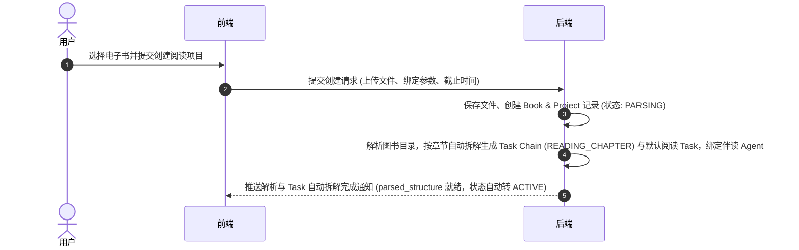

> [!NOTE]
> **旁路建图与伴读隔离契约 (PA-02 & PA-05)**：
> 图书解析过程仅生成阅读所需的文本切片与大纲结构，知识图谱抽取为后台闲时旁路服务，不阻塞 Book 状态转为 `COMPLETED`。伴读 Agent 在独立沙箱中物理隔离运行，仅能通过管道进行文字交互。

---

#### 1.2 阅读项目浏览与内容阅读交互时序

展示用户加载阅读项目列表、点击查看图书目录大纲，以及点击目录章节查看具体正文切片内容的关键交互过程。

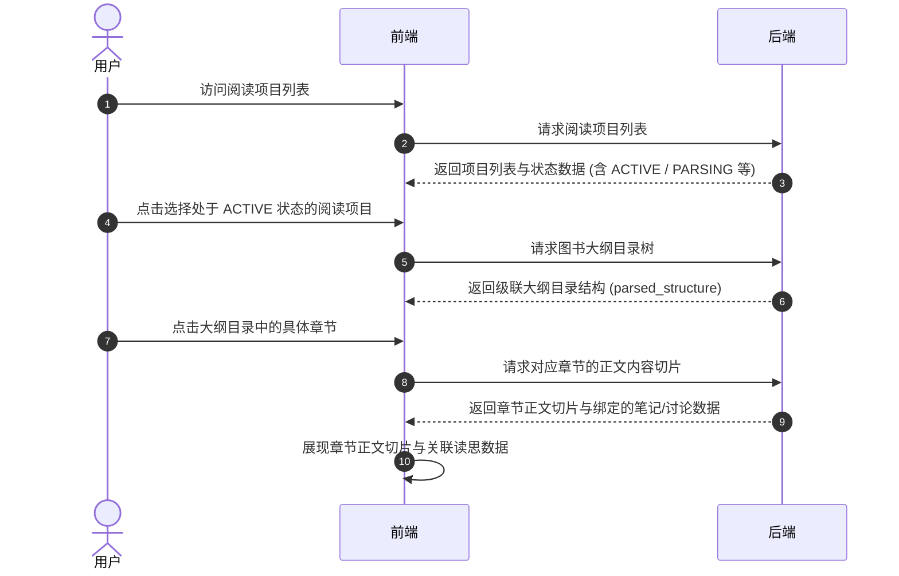

---

#### 1.3 素材笔记沉淀与原文双向锚点定位交互时序

展示用户在阅读时通过“章节末推荐引导”或“划词动作”生成笔记、注入内化 Task，以及系统基于 `Source Anchor` 进行双向跳转定位的关键交互过程。

> [!NOTE]
> **阅读项目笔记与 Task 关联契约**：
> 阅读项目中的笔记与计划项目一样，均统一物理关联至对应的微观 `Task` 实体（如绑定本章节/本段落的阅读 Task），同时携带有物理原文锚点 `Source Anchor`。

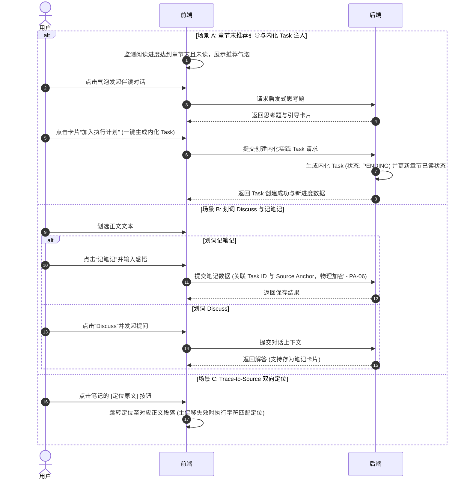

---

#### 1.4 24小时超时优雅休眠与一键唤醒交互时序 (PA-04 契约)

展示用户长时间无交互时阅读项目自动释放连接持久化会话，以及用户重新访问时进行一键唤醒重载的关键交互过程。

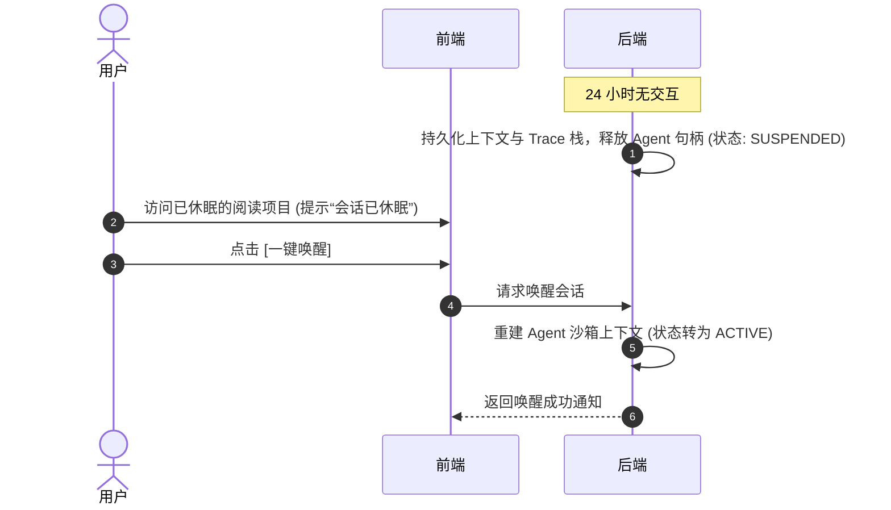

---

#### 1.5 AI 伴读与沙箱 Agent 双模交互时序

展示用户在阅读正文时发起划词 Discuss 被动解答（含 SSE 流式响应与 Action Cards 附带）、章节末尾 5% 范围触发对话流内部主动推送（Active Messages），以及伴读对话一键转存思考笔记与双向高亮追溯的完整交互过程。

> [!IMPORTANT]
> **伴读交互原则 (PA-05 & PA-08)**：
> 1. **对话流内部主动推送**：伴读 Agent 避免在主视图中使用阻塞式弹窗打扰用户。章节末尾 5%（95% 滚动位置）的主动推送直接插入侧边栏对话流底部，单章限制推送 1 次。
> 2. **智能转笔记与双向追溯**：伴读回答卡片一键转化为 `MaterialNote`（`source_type="COMPANION_CONVERTED"`），后端自动持久化关联的 `SourceAnchor` 物理原文快照，支持阅读器与笔记面板的双向闪烁跳转。

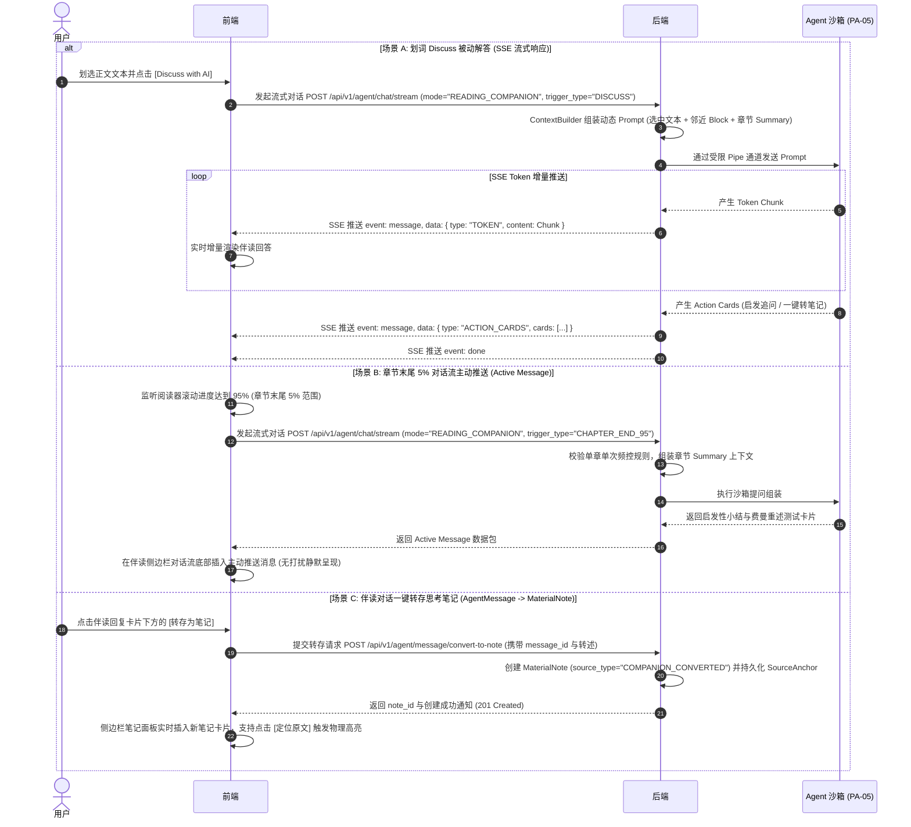

---

### 2. 计划项目交互

#### 2.1 计划项目初始化与 Skill 任务拆解交互时序

展示用户创建计划项目时选择/搜索 Active 技能模板注入，通过监督 Agent 对话微调并确认需创建的 Task 任务树，最终将项目状态由 `INIT` 扭转为 `ACTIVE` 的关键交互过程。

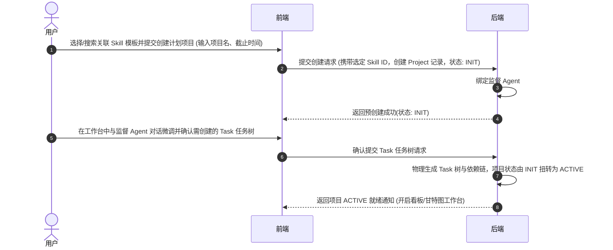

---

#### 2.2 计划项目推进与 Task 笔记补充交互时序

展示用户在推进计划项目执行时，标记 Task 启动与完成状态、在 Task 卡片中补充记录笔记感悟，以及后端物理关联 Task ID 的关键交互过程。

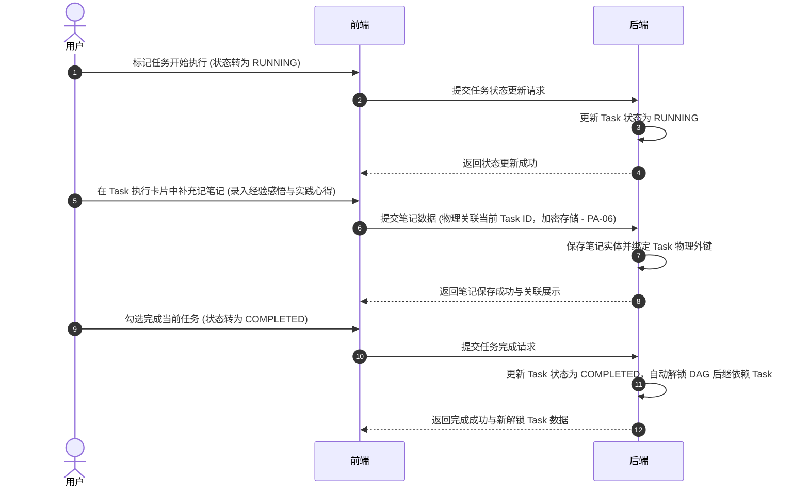

---

#### 2.3 项目完结生成复盘 Task 与归档交互时序 (全项目通用机制)

展示当项目内所有常规 Task 完成后，系统自动创建末尾特殊复盘 Task（类型为 `RETROSPECTIVE`），引导用户在该 Task 中录入经验笔记（Experience Note）并勾选完成，进而触发项目归档、旁路构建 `Falsifies` 证伪边以及驱动底层 Skill 产生变异草稿（Skill Mutation）的关键交互过程。

> [!NOTE]
> **全项目通用复盘 Task 契约**：
> 明确当项目内所有常规 Task 完成后，系统仅推送完成通知并呈现复盘引导卡片；只有在用户**点击【复盘卡片】**后，才触发发送创建请求追加生成类型为 RETROSPECTIVE 的特殊 Task。

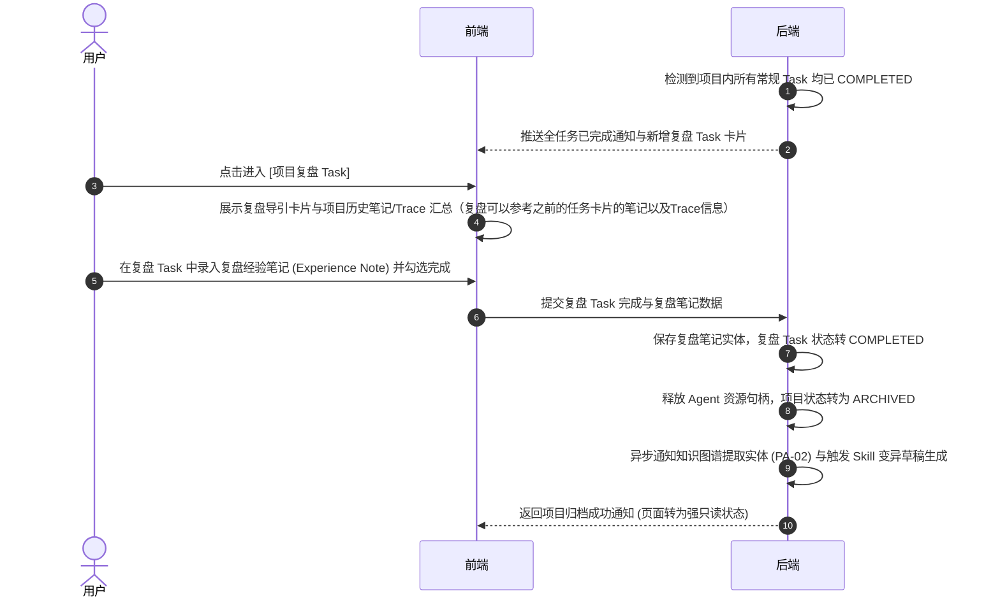

---

#### 2.4 任务逾期阻碍诊断与半自动重调度交互时序

展示任务超出截止时间后，系统标记 `BLOCKED` 状态、诊断阻碍瓶颈，以及用户通过“一键顺延”或“甘特图拖拽”进行半自动重调度的关键交互过程。

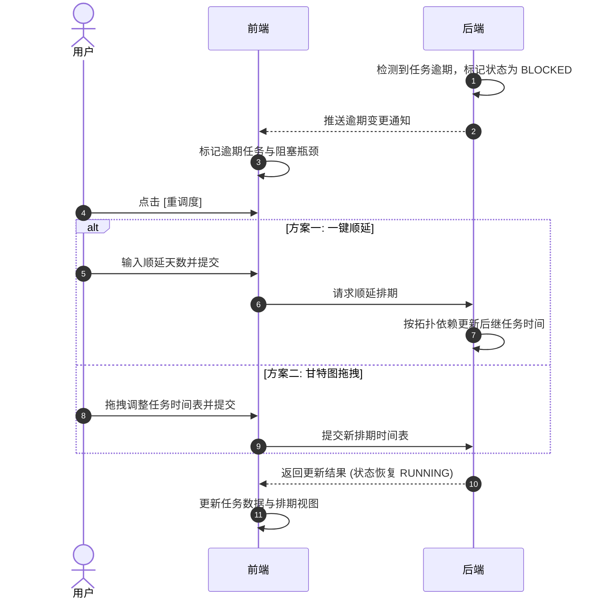

---

### 3. 技能提炼与沙箱拓扑交互

> [!NOTE]
> **Trace-to-Skill 多源提炼契约**：
> 技能提炼支持跨来源上下文，L1（碎片单点）、L2（章节/板块）、L3（全书/项目）三级提炼的输入既可以是阅读项目的图书正文切片，也可以是用户积累的各类笔记内容（包含划词感悟、Discuss 问答记录与复盘经验笔记）。

#### 3.1 Trace-to-Skill 三级提炼与沙箱拓扑阻断交互时序 (PA-03 契约)

展示从多源上下文（图书正文或笔记内容）提炼 Prompt 技能，并在沙箱编辑器中进行依赖解算、环路阻断（禁用“批准入库”）及解环入库的关键交互过程。

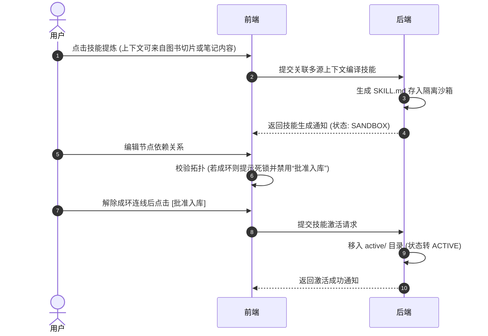

---

### 4. 知识库管理交互

#### 4.1 创建知识库目录交互时序

展示用户在知识库管理中心创建新目录/分类树节点，后端初始化目录记录并同步更新前端知识库目录树的关键交互过程。

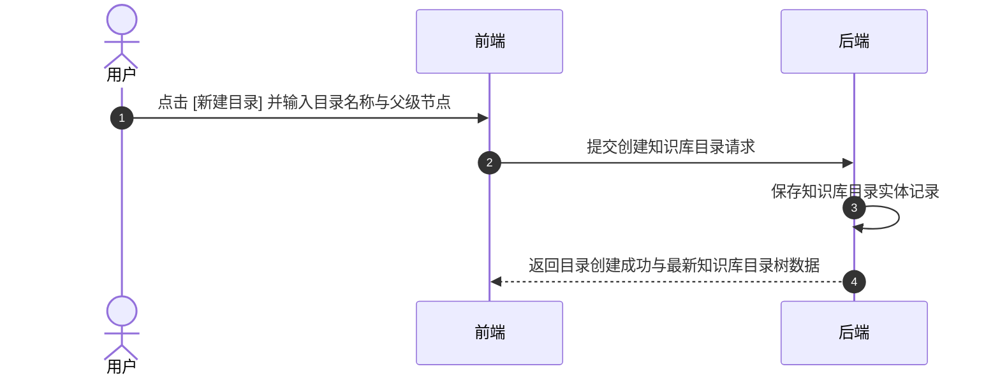

---

#### 4.2 沉淀笔记创建与素材笔记引用交互时序

展示用户在知识库中创建内化转述笔记（Synthesized Note）时，检索选择素材笔记（Material Note / Highlight Note）建立关联引用的关键交互过程。

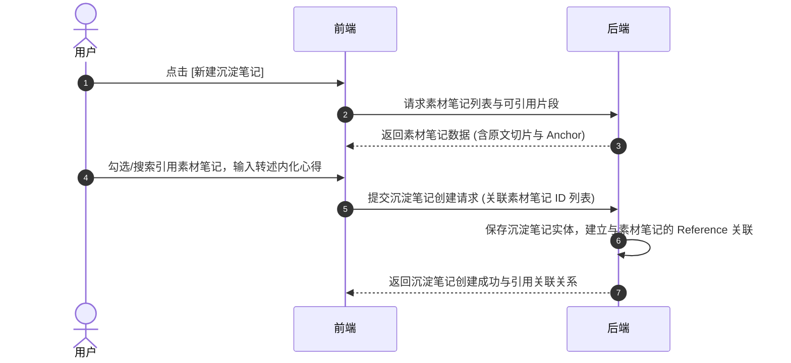

---

#### 4.3 沉淀笔记转化为知识图谱节点与 Skill 技能交互时序

展示用户在知识库中选择沉淀笔记（Synthesized Note），触发将其提炼转化为知识图谱节点（GraphNode）以及转化编译为 Active Skill 技能的关键交互过程。

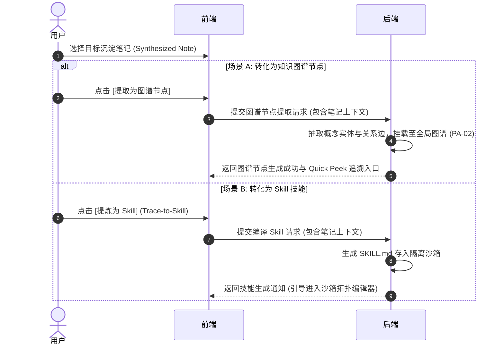

---

### 5. 知识图谱漫游交互

#### 5.1 全局图谱漫游与 Quick Peek 沉浸式追溯交互时序 (PA-07 契约)

展示用户在图谱中漫游时点击节点或证伪边，通过 Quick Peek 浮窗追溯上下文的关键交互过程。

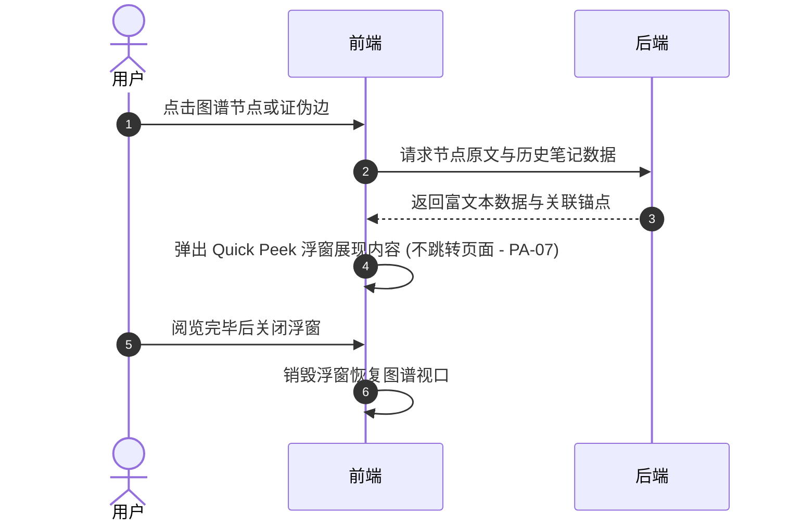
