# 辅助阅读与知识技能沉淀系统交互链路与状态规范 v1.0

本文档基于 [业务模型规范](../03_business_modeling/business_model.md) 编写，旨在明确系统中核心实体的状态流转、角色互动以及关键交互链路的页面流转与异常处理逻辑，为后续系统架构、前端原型及数据模型设计提供坚实的契约底座。

---

## 一、 核心实体状态机规范

### 1. 项目实体 (Project) 状态机

项目是一切学习与执行任务的最高层级承载容器。根据业务模型，项目分为“阅读项目 (READING)”与“计划项目 (PLAN)”双轨，其生命周期共用同一状态机。

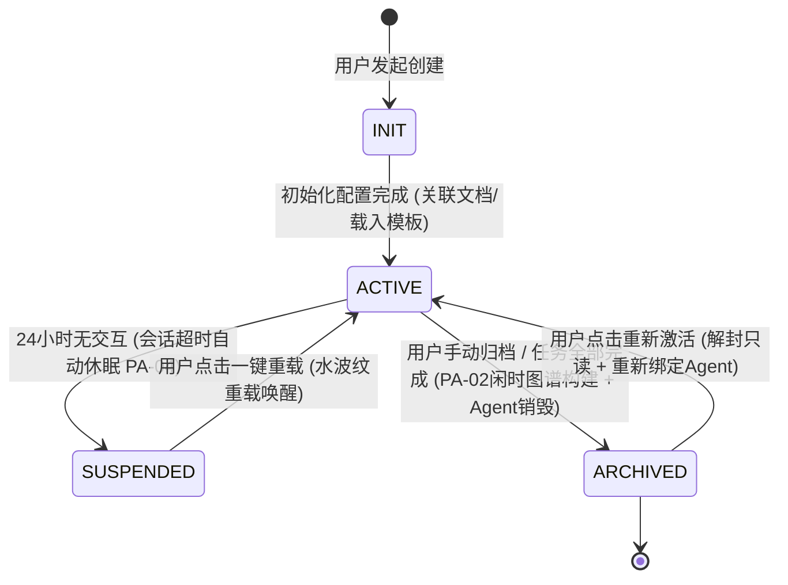

| 源状态        | 目标状态      | 触发事件                    | 前后端数据扭转与行为契约                                                                                                                            |
| :------------ | :------------ | :-------------------------- | :-------------------------------------------------------------------------------------------------------------------------------------------------- |
| **[*]**       | **INIT**      | 用户点击新建项目            | 前端加载项目创建表单。后端生成临时项目 ID 并置状态为 `INIT`。                                                                                       |
| **INIT**      | **ACTIVE**    | 配置完成并提交              | **阅读项目**：上传/关联 Book 实体就绪且物理绑定沙箱伴读 Agent。 **计划项目**：关联截止时间且可选载入 Skill 模板。后端将状态改为 `ACTIVE`。       |
| **ACTIVE**    | **SUSPENDED** | 24 小时无交互               | 后端定时任务检测到会话超时（**PA-04 契约**），断开 LLM 活跃连接，将当前上下文及任务 Trace 持久化至服务端 Redis 会话存储中，状态扭转为 `SUSPENDED`。 |
| **SUSPENDED** | **ACTIVE**    | 用户重新登入并激活          | 前端弹出毛玻璃提示，用户点击“一键唤醒”，后端从服务端 Redis 中读取状态重建 LLM 沙箱会话，状态恢复为 `ACTIVE`。                                       |
| **ACTIVE**    | **ARCHIVED**  | 用户点击归档 / 任务全部完成 | 后端触发闲时增量图谱构建任务（**PA-02 契约**），彻底销毁伴读/监督 Agent 沙箱句柄，归档项目置为强只读 `ARCHIVED`。                                   |
| **ARCHIVED**  | **ACTIVE**    | 用户点击重新激活            | 前端横幅点击“重新激活”，后端解封读写 API 并静默重新绑定唤醒 Agent 进程，状态恢复为 `ACTIVE`。                                                       |

---

### 2. 任务链实体 (Task Chain) 状态机

任务链是项目中观层级的通用容器（在阅读项目中表现为电子书章节大纲链 `READING_CHAPTER`，在计划项目中表现为阶段/功能模块任务链 `PLAN_STAGE`）。系统遵循 `Project -> Task Chain -> Task` 统一三层范式。

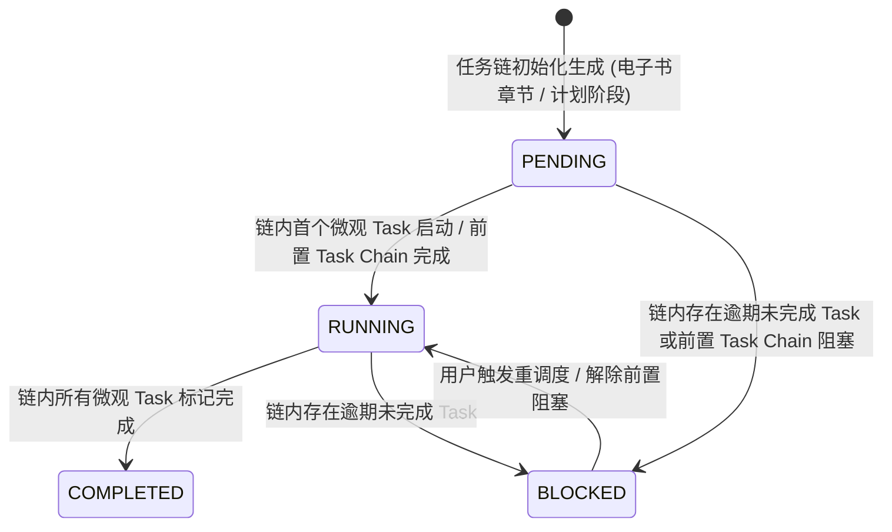

| 源状态                | 目标状态      | 触发事件                    | 前后端数据扭转与行为契约                                                                                                               |
| :-------------------- | :------------ | :-------------------------- | :------------------------------------------------------------------------------------------------------------------------------------- |
| **[*]**               | **PENDING**   | 解析完成或 Skill 注入       | 电子书解析后各章节实例化为 `Task Chain`；或计划项目解构出阶段里程碑 `Task Chain`，初始状态均设为 `PENDING`。                           |
| **PENDING**           | **RUNNING**   | 首个 Task 启动 / 前置链完成 | 当用户点击开始阅读/执行该链下的第一个 Task，或前置依赖 Task Chain 状态转为 `COMPLETED` 时，本 Task Chain 自动解锁转为 `RUNNING`。      |
| **RUNNING**           | **COMPLETED** | 所有微观 Task 均完成        | 当归属于该 Task Chain 的所有微观 Task 状态均变为 `COMPLETED` 时，后端自动将该 Task Chain 标记为 `COMPLETED`，更新中观进度。            |
| **PENDING / RUNNING** | **BLOCKED**   | 存在逾期 Task / 前置阻塞    | 定时任务检测到链内包含未完成且已超过截止时间的 Task，或前置依赖的 Task Chain 发生阻塞，本 Task Chain 自动降级为 `BLOCKED` 并高亮红边。 |
| **BLOCKED**           | **RUNNING**   | 执行重调度 / 解除阻塞       | 用户在看板中点击“重调度”执行一键顺延，或手动解锁前置依赖链后，Task Chain 状态恢复为 `RUNNING`。                                        |

---

### 3. 任务实体 (Task) 状态机

任务是 Task Chain 下具体的微观可执行单元（如段落精读、划词对话、卡片写笔记、代码编写等）。Task 间可通过 `depends_on_task_ids` 构建有向无环图 (DAG) 依赖。

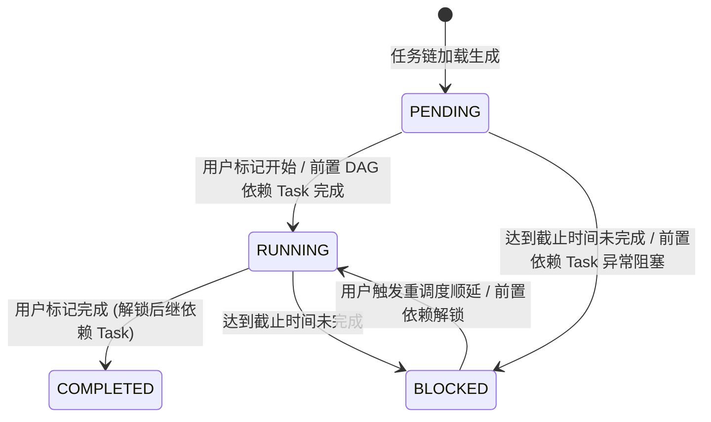

| 源状态                | 目标状态      | 触发事件                    | 前后端数据扭转与行为契约                                                                                       |
| :-------------------- | :------------ | :-------------------------- | :------------------------------------------------------------------------------------------------------------- |
| **[*]**               | **PENDING**   | 项目启动 / 任务链生成       | 伴读或计划项目生成微观 Task。若存在 `depends_on_task_ids` 且前置 Task 未完成，前端将其置灰锁死。               |
| **PENDING**           | **RUNNING**   | 用户标记开始 / 前置依赖完成 | 用户手动启动任务，或其 DAG 前置依赖 Task 全部变为 `COMPLETED`，系统自动解锁该 Task 并恢复可操作态。            |
| **RUNNING**           | **COMPLETED** | 用户标记完成                | 用户手动勾选完成（如读完段落或提交实践交付物）。后端将状态置为 `COMPLETED`，级联触发后继依赖 Task 的解锁事件。 |
| **PENDING / RUNNING** | **BLOCKED**   | 超出截止时间未完成          | 定时检测到当前时间已超出任务 `deadline` 且状态非 `COMPLETED`，前端卡片展现淡红背景与呼吸闪烁，提示重调度。     |
| **BLOCKED**           | **RUNNING**   | 用户触发半自动重调度        | 用户点击“一键顺延”或手动在甘特图中拖拽调整时间后，系统重新更新后继依赖链的截止时间，状态恢复为 `RUNNING`。     |

---

### 4. 书籍实体 (Book) 状态机

书籍实体承载用户上传的电子书（PDF / EPUB / TXT / MD），记录其上传、文本解析切片、`parsed_structure` 目录树构建及沙箱磁盘物理文件 `parsed_content.json` 的全生命周期状态 (`parsing_status`)。

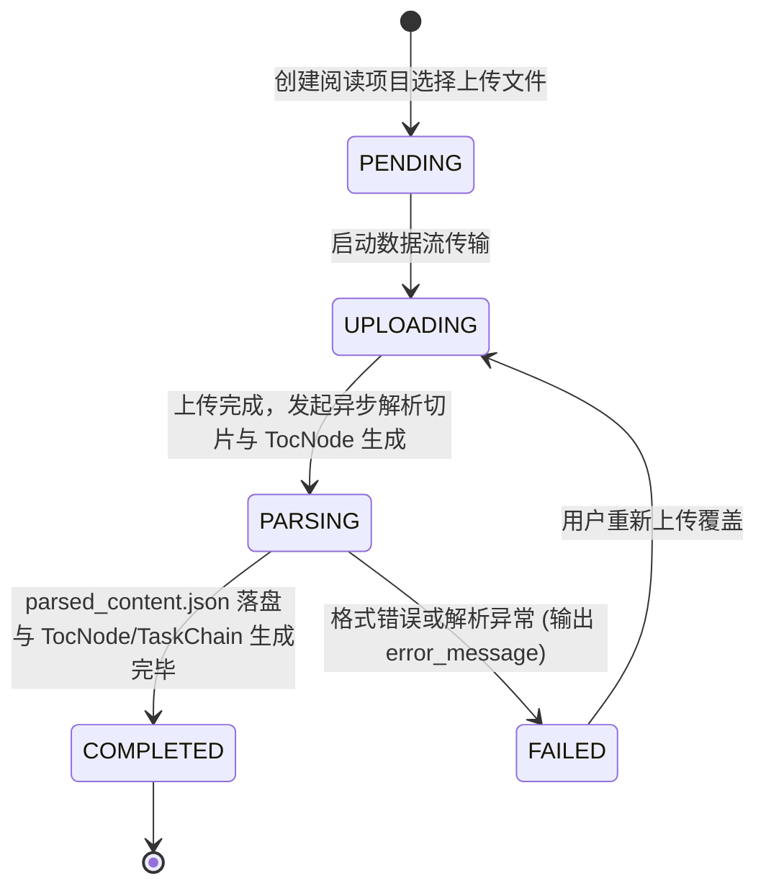

| 源状态        | 目标状态      | 触发事件                 | 前后端数据扭转与行为契约                                                                                                                                     |
| :------------ | :------------ | :----------------------- | :----------------------------------------------------------------------------------------------------------------------------------------------------------- |
| **[*]**       | **PENDING**   | 用户选择上传文件         | 前端初始化文件上传任务，后端分配 Book UUID 并建立磁盘物理路径框架，状态设为 `PENDING`。                                                                      |
| **PENDING**   | **UPLOADING** | 数据流传输开始           | 前端展示文件上传进度条。后端接收二进制流并写入磁盘沙箱存储 `storage_path`。                                                                                  |
| **UPLOADING** | **PARSING**   | 上传完成                 | 后端触发文本切片与目录树解析服务，状态转为 `PARSING`。前端切换为级联大纲树骨架屏并展示波光解析动画。                                                         |
| **PARSING**   | **COMPLETED** | 切片与大纲解析完成       | 正文切片落盘为 `parsed_content.json`，目录树写入 DB 字段 `parsed_structure`，并自动为每个章节实例化一个 `TASK_CHAIN`。状态转为 `COMPLETED`，前端渲染大纲树。 |
| **PARSING**   | **FAILED**    | 解析过程发生不可恢复异常 | 解析器捕获损坏或格式不支持异常，写入 `error_message`。状态转为 `FAILED`，前端大纲树展示红色报错与“重新上传”按钮。                                            |

> [!NOTE]
> **旁路建图解耦契约**：`Book` 实体的 `parsing_status` 仅记录基础解析与阅读物料切片生命周期。后台知识图谱（Graph Node）抽取为独立的旁路异步服务，不阻塞 `Book` 状态向 `COMPLETED` 的转化。

---

### 5. 物理原文锚点实体 (Source Anchor) 状态机

物理原文锚点记录素材笔记对应的物理段落位置、偏移坐标与上下文快照。系统通过三层定位解算算法保障划词高亮在文档排版微调时的容错性与平滑降级。

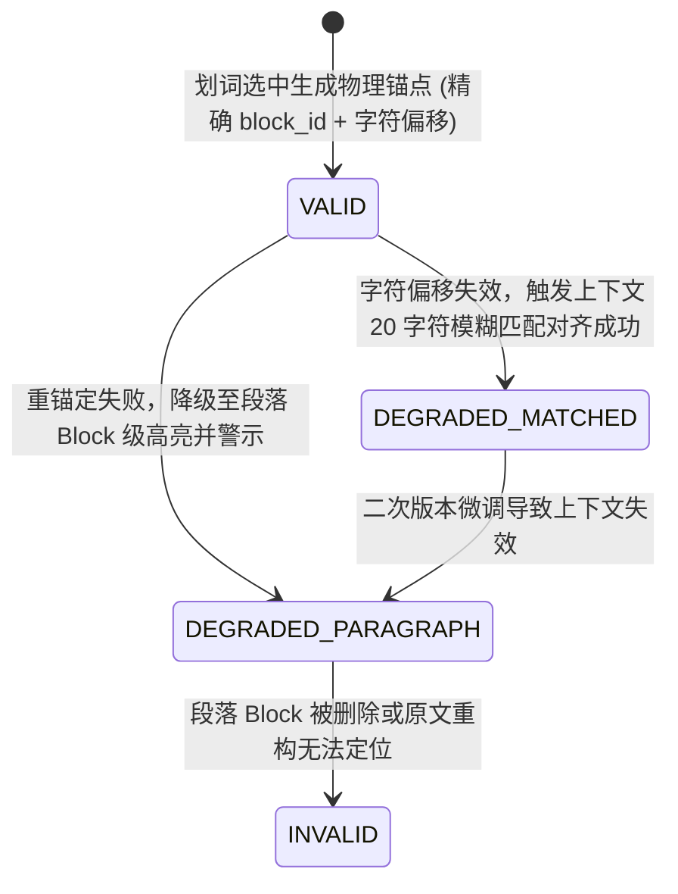

| 源状态                       | 目标状态               | 触发事件                  | 前后端数据扭转与行为契约                                                                                                    |
| :--------------------------- | :--------------------- | :------------------------ | :-------------------------------------------------------------------------------------------------------------------------- |
| **[*]**                      | **VALID**              | 划词生成笔记              | 前端捕捉选区，记录 `block_id`、起止字符偏移、PDF 矩形框/EPUB CFI 及 20 字符前置/后置上下文与 SHA-256 哈希，状态为 `VALID`。 |
| **VALID**                    | **DEGRADED_MATCHED**   | 物理字符偏移解算失败      | 电子书重新排版导致字符偏移错位，系统触发 Level 2 上下文模糊重锚定成功。定位标记呈黄色星号，提示：“已模糊对齐至最接近原文”。 |
| **VALID / DEGRADED_MATCHED** | **DEGRADED_PARAGRAPH** | 模糊重锚定依然失败        | 特征字符匹配得分 < 0.85，系统触发 Level 3 降级解算，将高亮范围扩大至整个段落 `block_id`，并在卡片槽区展示黄色警告图标。     |
| **DEGRADED_PARAGRAPH**       | **INVALID**            | 段落 Block 被删除或重重构 | 段落节点已被物理删除，彻底无法对齐。锚点转为 `INVALID`，笔记卡片头部的“定位原文”按钮置灰，展示“原位置已物理移除”提示。      |

---

### 6. 素材笔记实体 (Material Note) 状态机

素材笔记是原子级知识卡片，统一由“素材/参考片段” + “个人转述” + “关联自身经历/情景”三要素构成。可基于阅读划词生成，也可挂载到计划 Task 下。

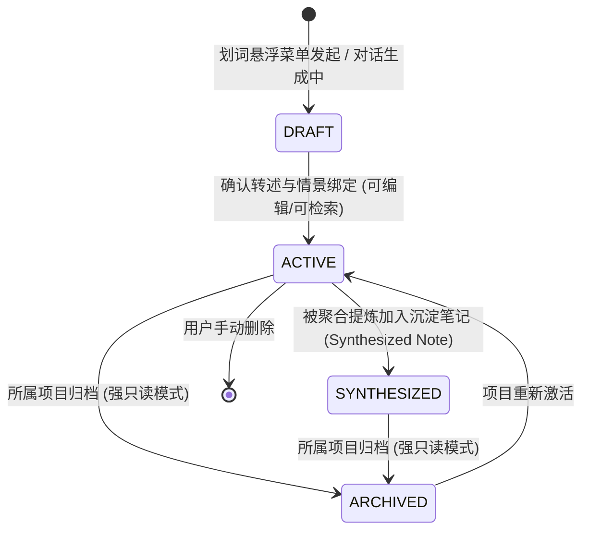

| 源状态                   | 目标状态        | 触发事件                        | 前后端数据扭转与行为契约                                                                                                   |
| :----------------------- | :-------------- | :------------------------------ | :------------------------------------------------------------------------------------------------------------------------- |
| **[*]**                  | **DRAFT**       | 点击“高亮记笔记” / 对话一键转存 | 前端中栏笔记面板滑出并增量渲染卡片，自动注入原文快照或对话，光标聚焦输入框，状态为 `DRAFT`。                               |
| **DRAFT**                | **ACTIVE**      | 用户录入转述并停止输入 500ms    | 触发防抖自动落盘与本地物理加密（**PA-06 契约**），状态恢复为正式活动态 `ACTIVE`，可被局部/全局语义检索。                   |
| **ACTIVE**               | **SYNTHESIZED** | 被组合提炼入沉淀笔记            | 用户选择多条素材笔记合成 `Synthesized Note`，后端在素材笔记记录中追加 `synthesized_note_id` 映射，状态转为 `SYNTHESIZED`。 |
| **ACTIVE / SYNTHESIZED** | **ARCHIVED**    | 所属项目标记归档                | 后端封锁写 API，前端读思面板整体呈置灰强只读态（Opacity 60%），隐藏编辑删除组件，鼠标呈禁止样式。                          |
| **ARCHIVED**             | **ACTIVE**      | 项目重新激活                    | 后端解封 API，前端恢复完全可编辑与对话态。                                                                                 |

---

### 7. 沉淀笔记实体 (Synthesized Note) 状态机

沉淀笔记是基于若干素材笔记与结构化思考文案组合而成的独立综合知识文档（File-first 存储为 Markdown）。分为常规认知沉淀（`GENERAL`）与结项经验总结（`EXPERIENCE`）。

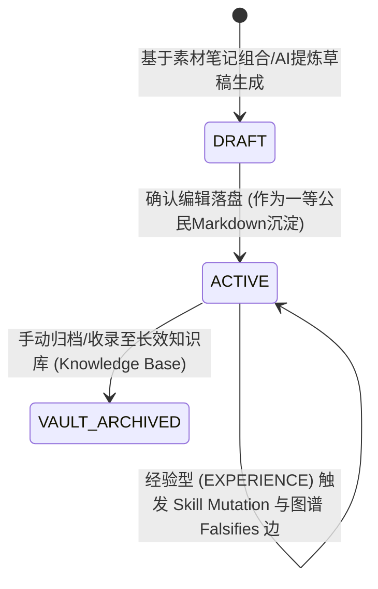

| 源状态                  | 目标状态                | 触发事件                      | 前后端数据扭转与行为契约                                                                                                                                           |
| :---------------------- | :---------------------- | :---------------------------- | :----------------------------------------------------------------------------------------------------------------------------------------------------------------- |
| **[*]**                 | **DRAFT**               | 点击“合成沉淀笔记” / 复盘触发 | 系统聚合多条 `Material Note`，在编辑器中渲染 Markdown 草稿，状态为 `DRAFT`。                                                                                       |
| **DRAFT**               | **ACTIVE**              | 用户确认保存                  | 正式生成 Markdown 文件物理落盘，写入 DB 索引，状态转为 `ACTIVE`。前端提供 Trace-to-Source 浮窗追溯绑定的素材笔记。                                                 |
| **ACTIVE (EXPERIENCE)** | **ACTIVE (EXPERIENCE)** | 结项复盘提交经验              | 若类型为 `EXPERIENCE`（结项经验总结），自动触发后台 Graph RAG 提取实体并建立 `Falsifies` 证伪边，同时自动在沙箱中生成对应 Skill 的变异草稿分支 (`MUTATED_DRAFT`)。 |
| **ACTIVE**              | **VAULT_ARCHIVED**      | 用户选择收录入知识库          | 将沉淀笔记物理文件复制/移入目标 `Knowledge Base` 存储目录，绑定 `knowledge_base_id`，状态转为 `VAULT_ARCHIVED`。                                                   |

---

### 8. 知识库实体 (Knowledge Base) 状态机

知识库是独立于单一项目生命周期的长效知识资产管理容器，用于统一分类收录、管理与组织沉淀笔记。

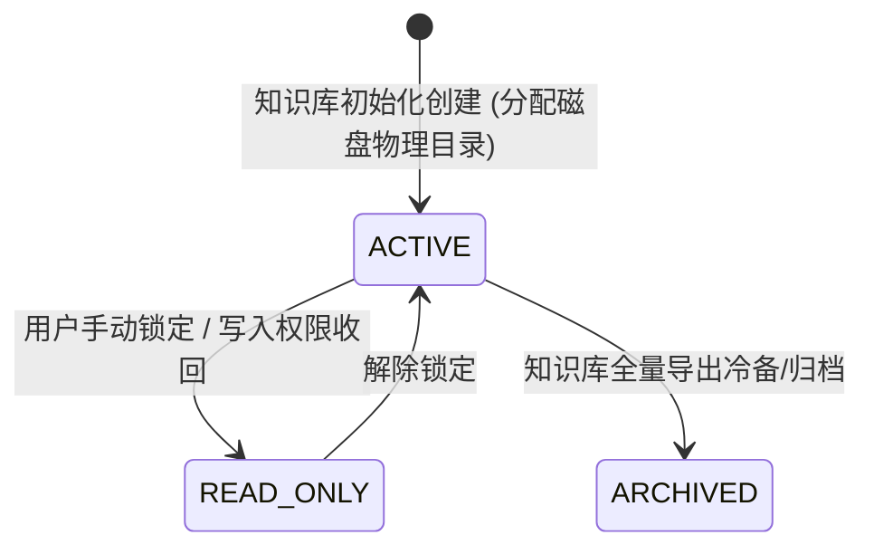

| 源状态        | 目标状态      | 触发事件           | 前后端数据扭转与行为契约                                                           |
| :------------ | :------------ | :----------------- | :--------------------------------------------------------------------------------- |
| **[*]**       | **ACTIVE**    | 创建新知识库       | 用户录入名称与分类，后端在磁盘分配独立落盘文件夹 `storage_path`，状态为 `ACTIVE`。 |
| **ACTIVE**    | **READ_ONLY** | 用户手动锁定知识库 | 后端禁止向该知识库新增或修改沉淀笔记，前端界面呈现只读保护锁标识。                 |
| **READ_ONLY** | **ACTIVE**    | 用户解锁知识库     | 恢复正常知识读写与笔记归档功能。                                                   |
| **ACTIVE**    | **ARCHIVED**  | 全量导出或冷备归档 | 系统打包知识库为压缩包供用户本地冷备，底层目录标注为历史归档态。                   |

---

### 9. 技能实体 (Skill) 状态机

技能是由方法论提炼而成的可执行 Prompt 工作流或脚本，采用物理隔离区 (`skills/sandbox/`) 与人工拓扑校验门禁保障安全。

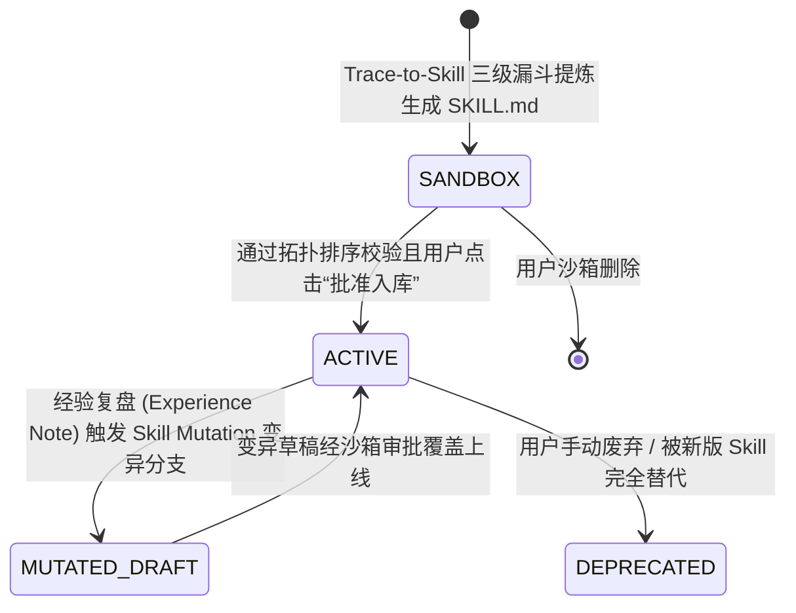

| 源状态            | 目标状态          | 触发事件                    | 前后端数据扭转与行为契约                                                                                                                         |
| :---------------- | :---------------- | :-------------------------- | :----------------------------------------------------------------------------------------------------------------------------------------------- |
| **[*]**           | **SANDBOX**       | Trace-to-Skill 三级漏斗提炼 | 无论是 L1 单点、L2 章节还是 L3 全书提炼，编译器均生成 `SKILL.md` 并写入物理隔离区 `skills/sandbox/`，状态为 `SANDBOX`。                          |
| **SANDBOX**       | **ACTIVE**        | 人工确认并通过拓扑校验      | 遵循 **PA-03 契约**，系统拓扑校验无依赖环路且用户点击“批准入库”，后端将文件移入 `skills/active/` 目录，状态转为 `ACTIVE`，可被计划项目检索注入。 |
| **ACTIVE**        | **MUTATED_DRAFT** | 结项经验指出 Skill 缺陷     | 系统在 `skills/sandbox/` 下生成该 Skill 的修订草稿分支 (Draft Branch)，界面推送提示引导用户审批。                                                |
| **MUTATED_DRAFT** | **ACTIVE**        | 变异草稿审批通过            | 修订草稿覆盖线上原 Skill，更新 `version` 版本号，状态恢复为 `ACTIVE`。                                                                           |
| **ACTIVE**        | **DEPRECATED**    | 用户废弃或旧版淘汰          | 标记为 `DEPRECATED`，不再在计划新建时推荐，但历史已注入的项目不受影响。                                                                          |

---

### 10. 沙箱编辑区 (Sandbox Area) 拓扑校验状态机

沙箱编辑区是新编译技能入库前的可视化校验编辑器，负责实时监控依赖网络并执行有向环 (Cycle) 死锁阻断。

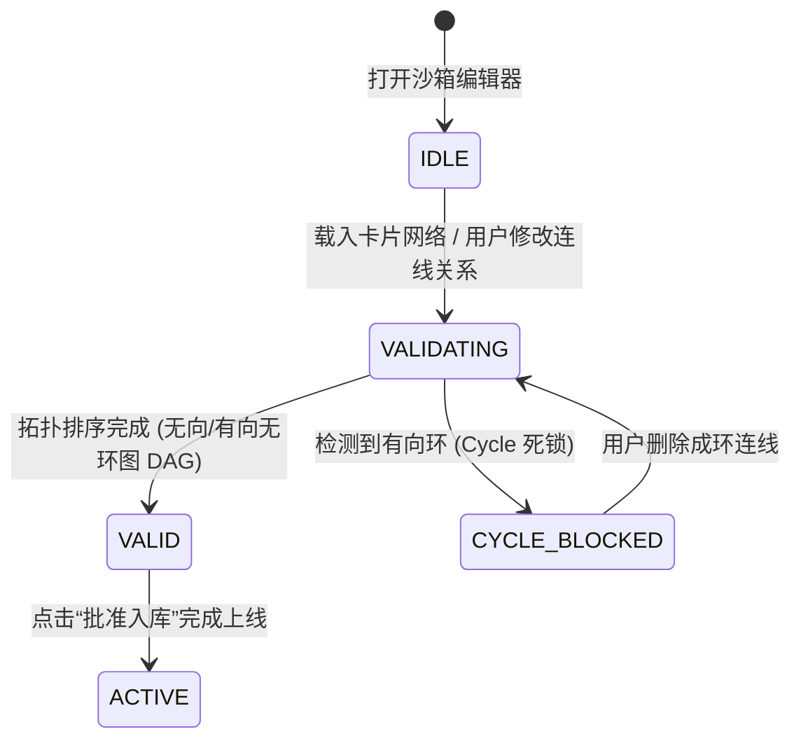

| 源状态            | 目标状态          | 触发事件                 | 前后端数据扭转与行为契约                                                                                                  |
| :---------------- | :---------------- | :----------------------- | :------------------------------------------------------------------------------------------------------------------------ |
| **[*]**           | **IDLE**          | 进入沙箱编辑器           | 前端加载 `skills/sandbox/` 下的目标 `SKILL.md`，准备解析连线节点。                                                        |
| **IDLE / VALID**  | **VALIDATING**    | 用户拖拽连线 / 修改卡片  | 前端实时触发拓扑排序校验算法。                                                                                            |
| **VALIDATING**    | **VALID**         | 拓扑排序算法校验无环     | 连线呈淡蓝色正常样式，“批准入库”按钮处于激活状态，可随时提交。                                                            |
| **VALIDATING**    | **CYCLE_BLOCKED** | 检测到有向依赖环路       | 触发 **PA-03 契约**：成环卡片与连线呈**红色发光与高频抖动**，右侧展开环路警报路径列表，**“批准入库”按钮强制禁用并置灰**。 |
| **CYCLE_BLOCKED** | **VALIDATING**    | 用户点击连线断开成环路径 | 删除成环连线后，前端自动重新触发拓扑校验算法。                                                                            |

---

### 11. 知识图谱实体 (Graph Domain) 旁路状态机

知识图谱是独立于主业务生命周期的**旁路消费服务 (Bypass Sidecar Consumer)**。包含 Graph Node、Tag Super Node 及 Graph Edge，驱动跨项目漫游与知识新陈代谢。

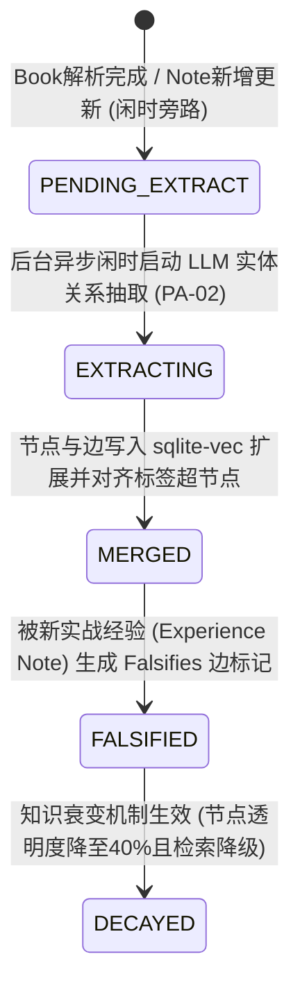

| 源状态              | 目标状态            | 触发事件                     | 前后端数据扭转与行为契约                                                                                 |
| :------------------ | :------------------ | :--------------------------- | :------------------------------------------------------------------------------------------------------- |
| **[*]**             | **PENDING_EXTRACT** | 业务落盘完成                 | 主业务流落盘即返回。旁路服务捕捉到 Book 或 Note 的变动，生成待抽取队列任务。                             |
| **PENDING_EXTRACT** | **EXTRACTING**      | 闲时或用户手动点击同步       | 遵循 **PA-02 契约**，后台低频闲时调用 LLM 抽取实体关系，前台界面呈现微弱静默进度指示，不影响伴读阅读。   |
| **EXTRACTING**      | **MERGED**          | 图谱构建与合并完成           | 新抽取节点与边写入 `sqlite-vec` 引擎，跨项目与 `TAG_SUPER_NODE` 标签超节点自动逻辑聚拢，刷新可视化画布。 |
| **MERGED**          | **FALSIFIED**       | 收到反驳性的 Experience Note | 结项经验笔记与旧理论冲突时，生成 `Falsifies` 反向抑制边。                                                |
| **FALSIFIED**       | **DECAYED**         | 图谱重绘与衰变计算           | 被证伪节点在视觉上自动变暗（透明度降至 40%），并在 RAG 检索权重中降级，直观呈现“知识新陈代谢”。          |

---