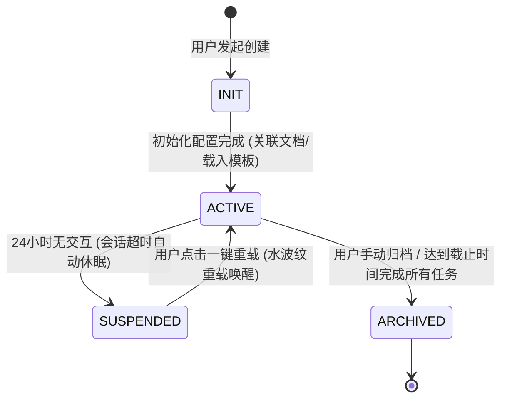
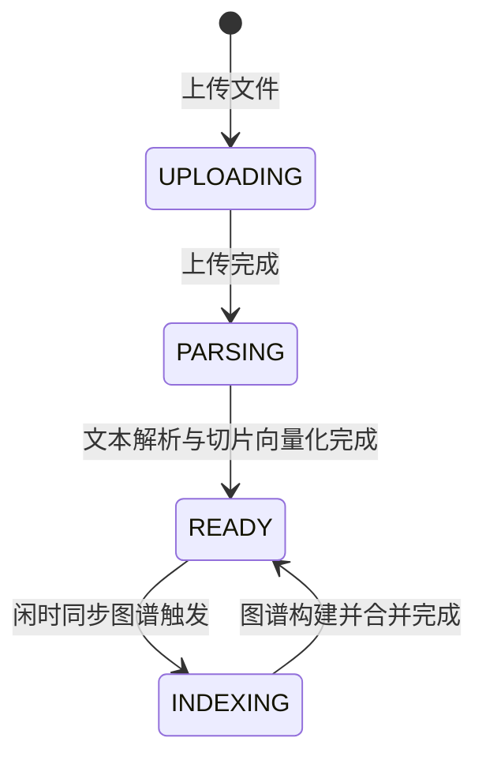
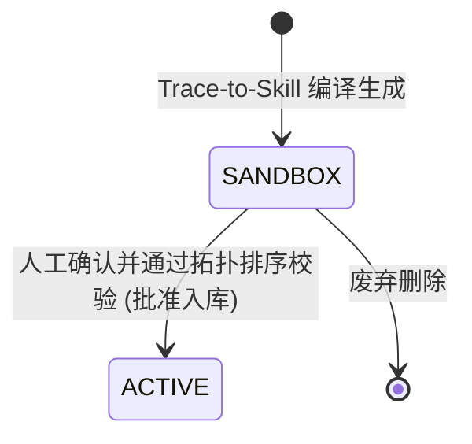
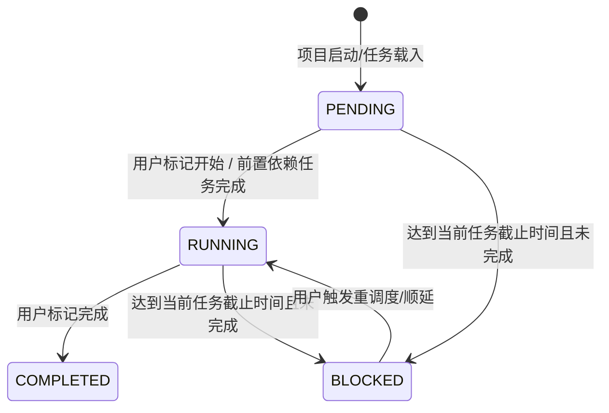
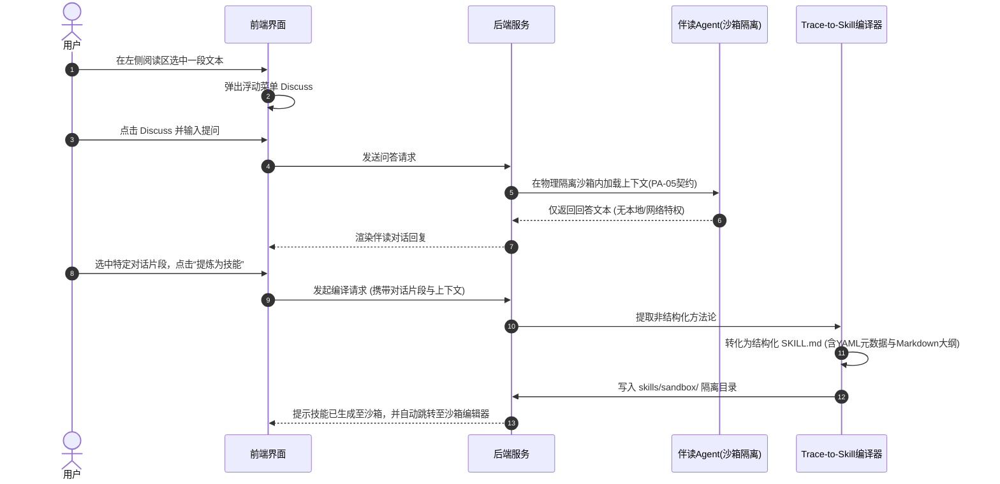
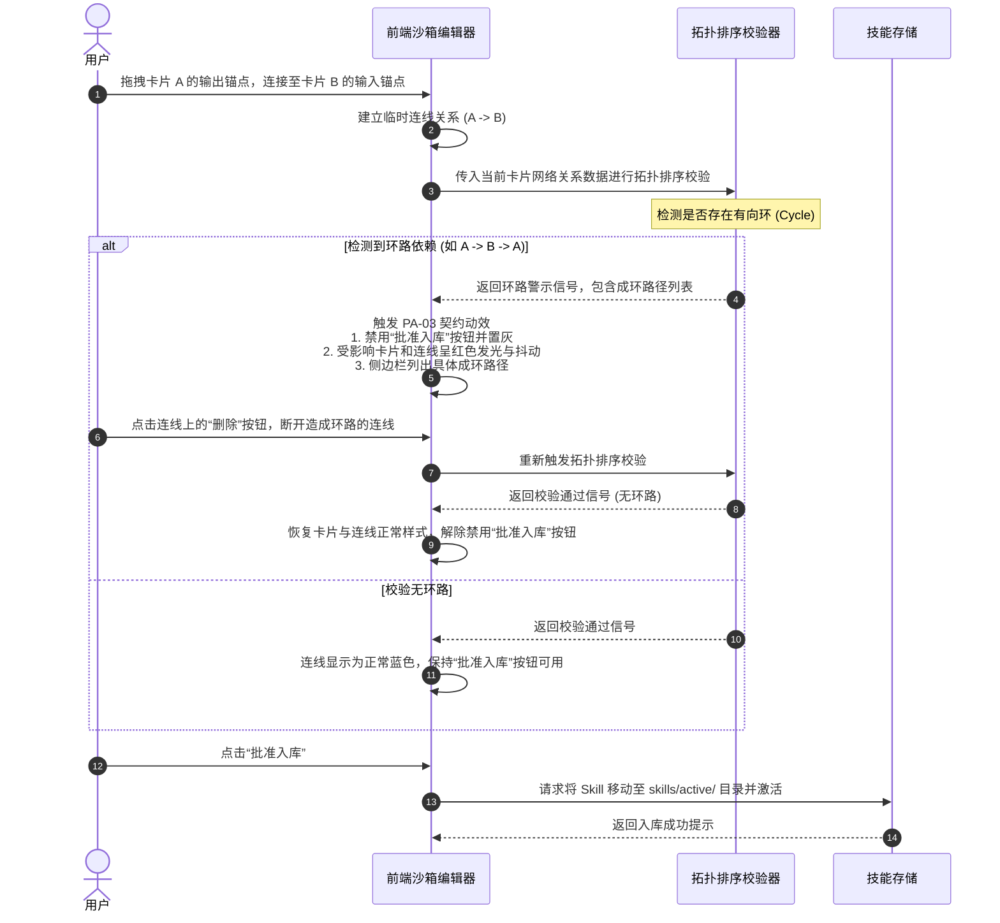
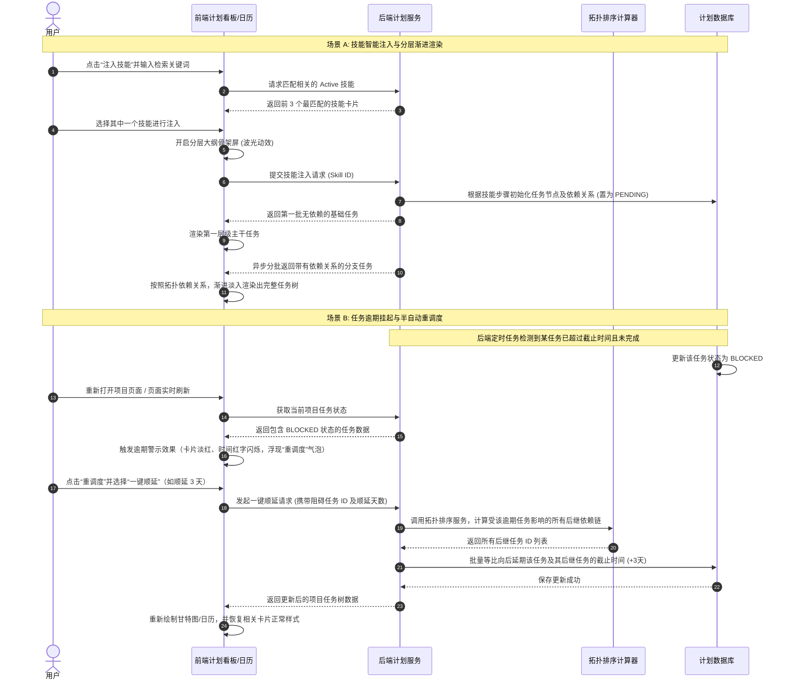
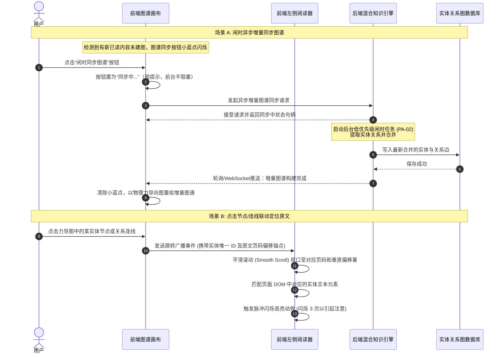

# 辅助阅读与知识技能沉淀系统交互链路与状态规范 v1.0

本文档基于 [业务模型规范](../03_business_modeling/business_model.md) 编写，旨在明确系统中核心实体的状态流转、角色互动以及关键交互链路的页面流转与异常处理逻辑，为后续系统架构、前端原型及数据模型设计提供坚实的契约底座。

---

## 一、 核心实体状态机规范

### 1. 项目实体 (Project) 状态机

项目是一切学习与执行任务的最高层级承载容器。根据业务模型，项目分为“阅读项目 (READING)”与“计划项目 (PLAN)”双轨，其生命周期共用同一状态机。



| 源状态 | 目标状态 | 触发事件 | 前后端数据扭转与行为契约 |
| :--- | :--- | :--- | :--- |
| **[*]** | **INIT** | 用户点击新建项目 | 前端加载项目创建表单。后端生成临时项目 ID 并置状态为 `INIT`。 |
| **INIT** | **ACTIVE** | 配置完成并提交 | **阅读项目**：上传/关联文档就绪且绑定沙箱伴读 Agent。<br>**计划项目**：关联截止时间且可选载入 Skill 模板。后端将状态改为 `ACTIVE`。 |
| **ACTIVE** | **SUSPENDED** | 24小时无交互 | 后端定时任务检测到会话超时（PA-04 契约），断开 LLM 活跃连接，将当前上下文及任务 Trace 持久化至服务端会话存储中，状态扭转为 `SUSPENDED`。 |
| **SUSPENDED** | **ACTIVE** | 用户重新登入并激活 | 前端弹出毛玻璃提示，用户点击“一键唤醒”，后端从服务端会话存储中读取状态重建 LLM 会话，状态恢复为 `ACTIVE`。 |
| **ACTIVE** | **ARCHIVED** | 用户点击归档 / 任务全部完成 | 后端触发闲时增量图谱构建任务（PA-02 契约），并归档项目，状态置为 `ARCHIVED`。 |

---

### 2. 文档实体 (Document) 状态机

文档实体承载用户上传的电子书、论文等阅读资料，直接与混合知识库引擎的向量索引及关系图谱绑定。



| 状态 | 描述 | 前后端交互契约 |
| :--- | :--- | :--- |
| **UPLOADING** | 正在上传文件至服务器 | 前端展示进度条，后端写入临时存储。 |
| **PARSING** | 服务器正在解析文本并进行切片，同时同步生成密集向量索引 (Vector Cache) | 前端展示解析动效与级联大纲树骨架屏，后端调用大纲解析及向量化服务（实时）。 |
| **READY** | 文本解析与向量缓存就绪，可供即时低延迟伴读问答 | 前端渲染可阅读的级联折叠大纲树，右侧伴读 Agent 可通过 Dense RAG 检索回答。 |
| **INDEXING** | 后台正在异步提取实体关系并构建图谱 (Entity Graph) | **PA-02 契约**：前端提供闲时同步按钮，点击后显示“后台图谱构建中”状态（弱提示）。后端以低优先级闲时任务运行，不影响前台伴读。 |

---

### 3. 技能实体 (Skill) 状态机

技能是由非结构化方法论编译而成的结构化模板，通过物理隔离与人工门禁保障其安全性与正确性。



* **SANDBOX (沙箱待审批)**：技能文件存放在项目隔离区 `skills/sandbox/` 下。此时无法被其他计划项目检索或引用。
* **ACTIVE (激活入库)**：技能通过拓扑排序校验且用户手动点击“批准入库”，移至 `skills/active/` 目录。可被全局检索并注入到任意计划项目中。

---

### 4. 任务实体 (Task) 状态机

任务是项目下具体的执行步骤。在阅读项目中对应“章节阅读”，在计划项目中对应“Skill 注入生成的任务树步骤”。



* **PENDING (待启动)**：任务处于队列中。若存在前置依赖任务，则当前任务前端表现为灰度不可操作。
* **RUNNING (进行中)**：任务可执行。前置依赖全部完成，或者无依赖限制。
* **COMPLETED (已完成)**：用户手动标记或系统判定完成。会触发解锁后续依赖它的任务。
* **BLOCKED (已逾期/阻塞)**：当前时间已超过任务设定的截止日期且任务未完成。前端高亮为红色，并提示进行挂起重调度。

---

## 二、 角色互动时序图

### 1. 伴读与 Trace-to-Skill 触发互动时序

展示用户在阅读文献时，如何通过伴读 Agent 的对话提炼出方法论，并将其编译进沙箱技能区的过程。



---

### 2. 沙箱卡片连线与拓扑解环互动时序

展示用户在沙箱卡片编辑器中编辑依赖关系，系统触发拓扑排序并实施死锁阻断的交互过程。



---

### 3. 计划项目任务注入与半自动重调度互动时序

展示用户在计划项目中通过智能技能注入生成任务树，以及在任务逾期时触发系统半自动重调度的交互与数据扭转过程。



---

### 4. Graph RAG 图谱闲时同步与可视化联动时序

展示用户手动触发图谱增量构建的“低成本闲时同步”过程，以及在图谱中点击实体节点/关系连线后，左侧阅读器自动跳转定位并高亮原文的联动交互机制。



---

## 三、 四大核心交互链路详细设计

### 3.1 项目的创建与管理

项目管理是系统的入口层，采用“双轨项目独立入口”的原则，确保高内聚和低耦合。

```
[ 项目仪表盘 ] 
      │
      ├─► [ 点击创建阅读项目 ] ────► [ 上传文档 (强制) ] ──► [ 设定阅读截止时间 ] ──► [ 自动静默绑定受限 Agent ]
      │
      └─► [ 点击创建计划项目 ] ────► [ 设定实践截止时间 ] ──► [ 语义检索载入 Skill ] ──► [ 生成初始任务树 ]
```

#### 3.1.1 阅读项目初始化流程

> [!IMPORTANT]
> **阅读项目创建约束**：
> 1. **文档强制性**：创建阅读项目时，用户必须同时上传或选择已有文档，否则无法提交创建。
> 2. **伴读 Agent 物理受限 (PA-05)**：阅读项目创建后，系统将自动静默绑定伴读 Agent。该 Agent 在独立进程沙箱中运行，无网络和本地 Shell 读写权限，仅能通过输入输出管道进行文字交互。

1. **界面布局**：
   - 独立的“新建阅读项目”表单页。
   - 顶部提供“上传文献文件”区域，支持拖拽 PDF、TXT、Markdown 格式。
   - 下方提供“项目目标与约束”配置：
     - **项目名称**（默认填充文件名，可修改）。
     - **阅读截止时间**（时间选择器，硬性约束：不可晚于当前时间，不可为空）。
2. **交互行为与校验**：
   - 点击“确定创建”时，若未上传文件，前端在上传区呈现红色外框警示，并弹出气泡提示：“阅读项目必须关联一份初始文档”。
   - 提交后，前端显示“文档解析中”大纲树骨架屏，后端异步启动文本切片。

#### 3.1.2 计划项目初始化流程

1. **界面布局**：
   - 独立的“新建计划项目”表单页。
   - 配置字段：**项目名称**、**实践截止时间**（硬性约束：不允许小于当前时间）。
   - 提供“智能技能注入”搜索框，支持语义检索。
2. **交互行为与校验**：
   - 用户输入项目名称后，“智能技能注入”框将根据名称自动执行后台语义匹配，并在下方推荐 3 个相关的 Active 技能模板（如用户输入“写一篇论文”，下方自动推荐“学术论文写作规范”技能卡片）。
   - 用户点击“载入技能”后，该技能对应的任务树大纲骨架屏将在表单下方渐进式渲染出来。用户点击“创建项目”完成初始化。
   - **计划监督 Agent 静默绑定 (PA-05)**：计划项目创建后，系统同样在后台自动静默绑定一个“计划监督与重调度 Agent”会话。该 Agent 同样在独立沙箱进程中运行，遵循 PA-05 安全隔离契约。它不具备任何网络和本地写特权，主要通过消息管道在用户更新任务状态时提供冲突校验，并在任务逾期时为半自动重调度算法提供优化排期建议。

#### 3.1.3 项目归档与只读生命周期管理

当项目完成其历史使命，或用户手动发起收尾时，项目将进入归档生命周期，旨在释放活跃资源并固化知识。

1. **归档触发机制**：
   - **手动归档**：在项目看板或阅读界面的右上角，提供“归档项目”操作按钮。
   - **自动触发引导**：当计划项目下的所有任务被标记为 `COMPLETED`，或者阅读项目大纲的所有章节均被标记为“已读/已讨论”时，系统将弹出浮动对话框提示：“当前项目内任务均已完成，是否立即归档此项目？”。
2. **后台归档数据扭转行为**：
   - 用户确认归档后，后端将项目状态 `status` 更新为 `ARCHIVED`。
   - **触发最终图谱增量构建 (PA-02契约)**：系统在后台静默发起最后一次闲时实体关系提取任务，将未入图的零散实体关系与全局项目图谱进行最终合并。
   - **安全会话释放**：彻底安全销毁绑定的伴读 Agent 或计划监督 Agent 沙箱进程句柄，释放系统内存与会话连接。
3. **前端只读页面交互规范**：
   - 归档后，整个项目页面进入**强只读模式**：
     - **组件置灰**：所有的输入框（如 Discuss 输入框）、拖拽手柄、连线锚点、“提炼为技能”、“标记完成”等交互组件全部置灰变暗。
     - **交互限制提示**：当鼠标悬浮在置灰交互按钮上时，鼠标指针呈现“禁止 (not-allowed)”样式，并显示气泡提示：“已归档项目，仅供只读”。
     - **激活横幅提示**：页面顶部常驻一条灰蓝色窄边提示横幅：“当前项目已归档，所有内容均为只读状态。若需编辑，请点击 [重新激活] 恢复”。
4. **重新激活与重载**：
   - 点击横幅中的“重新激活”按钮，后端将状态置回 `ACTIVE` 并自动静默重新绑定和唤醒对应 Agent 进程。前端横幅淡出，项目页面恢复完全可编辑态。

---

### 3.2 文档解析与渲染流程

文档解析渲染链路是沉浸式阅读与知识提炼的核心。

#### 3.2.1 大纲树渐进式渲染与分栏布局

* **分栏布局**：
  - 界面采用经典的**左右二分栏**设计。
  - 左侧为 **阅读与大纲区**，顶部为项目名称与总体阅读进度条。
  - 右侧为 **伴读交互区**，承载与伴读 Agent 的对话聊天窗口。
* **总体阅读进度条更新与联动逻辑**：
  - **进度条计算规则**：
    - **阅读项目**：进度条拒绝使用简单的纯页面滚动高度（防止用户通过快速拖拽滚动条刷进度）。系统引入“双维度加权算法”计算阅读真实进度：
      `总体进度 = 已标记“已读/已讨论”章节比例 * 60% + 各章节已读切片 (Chunks) 比例之和 * 40%`
    - **计划项目**：进度条等于 `(已完成的任务数 COMPLETED / 总计划任务数) * 100%`。
  - **大纲联动跳转**：
    - 进度条上以微小刻度标记（Tick Marks）标示出书籍各个大章节的物理分布。
    - **悬停交互**：鼠标悬浮在进度条某个刻度上时，以小气泡（Tooltip）悬浮呈现对应章节的标题和累计阅读时间。
    - **点击交互**：点击进度条上的某个刻度，左侧大纲树自动定位、展开并高亮对应章节，阅读器主体平滑滚动（Smooth Scroll）至该章节的起始位置。
* **渐进式大纲渲染**：
  - 文档上传后，状态处于 `PARSING`。左侧大纲区展示带有波光动效的骨架屏（Skeleton Screen）。
  - 后端优先解析文档目录结构并返回，前端立刻渲染出**级联折叠大纲树**，用户可以点击任意章节展开。
  - 此时若文本切片和向量化尚未完全结束，对应未就绪的章节大纲右侧会显示微小的“索引中...”弱提示，已就绪的显示“可讨论”状态。

#### 3.2.2 渐进式伴读交互与 RAG 协同

* **划词 Discuss 浮动菜单**：
  - 用户在左侧阅读器中用鼠标划选任意文本时，文本高亮为淡黄色，且在划选结束处正上方弹出带有 `Discuss` 按钮的浮动菜单。
  - 点击 `Discuss` 按钮，右侧对话框自动聚焦，并自动在输入框中注入引用上下文（如：`引用“...”：`），同时输入框进入编辑状态，允许用户向伴读 Agent 提问。
* **章节末 5% 推荐气泡**：
  - 当用户在左侧阅读区滚动页面，阅读进度达到当前章节最后 5% 的高度时，页面右下角会以淡入动效滑出一个微小的弱打扰推荐气泡。
  - 气泡内容为 AI 伴读提示，例如：“已读完本章，AI 导师已为你整理了本章的 3 个关键方法论，是否进行伴读对话？”。
  - 点击气泡，右侧对话框展开，AI 发送预先提炼的本章方法论总结并引导提问。若用户忽略并继续向下滚动，气泡在滚动过章后自动淡出消失。
* **混合知识库同步 (PA-02)**：
  - **向量缓存**：在文档处于 `READY` 状态时，Dense RAG 密集向量缓存自动在后台更新就绪，保障用户在使用划词 `Discuss` 时获得毫秒级的实时上下文检索响应。
  - **网状图谱可视化与闲时同步**：
    - 前端左侧提供“图谱”切换页签。展示当前项目的实体关系联想图谱。
    - 图谱使用物理力导向图呈现，节点为概念/实体，贝塞尔弹性曲线连接两个有关联的节点，连线上标明关系文字描述。
    - 为了避免高昂的 Token 费用，图谱不随阅读实时更新。前端提供明显的“闲时同步图谱”按钮（当有新阅读内容未建图时，按钮右上角有小蓝点提示）。
    - 用户点击同步，或在项目手动归档时，系统触发后台闲时任务进行增量建图。
    - 交互亮点：点击图谱中的关系连线或实体节点，页面自动高亮并脉冲闪烁实体在左侧文档原文中出现的所有位置，同时定位到对应的页码。

---

### 3.3 技能沙箱编辑交互

技能沙箱是方法论向行动转化的过滤器，通过可视化设计实现依赖关系的直观管理与安全校验。

#### 3.3.1 Trace-to-Skill 双通道触发

Trace-to-Skill 支持以下两种触发方式，抓取上下文生成 `skills/sandbox/` 下的 `SKILL.md`。

1. **阅读区划词触发**：
   - 用户在左侧阅读区选中一段包含方法论的文本。
   - 划词浮动菜单除了提供 `Discuss` 外，还提供 `提炼为技能` 操作。
   - 点击后，前端弹出小弹窗让用户命名该技能，点击确认后，后端将所选文本发送给 Trace-to-Skill 编译器，自动编译步骤并写入沙箱。
2. **对话历史消息触发**：
   - 在右侧伴读会话中，鼠标悬停在 AI 发送的某条方法论总结消息，或者用户自己总结的消息上。
   - 消息右上角出现功能按钮组（如复制、重试），其中包含 `提炼为技能` 图标。
   - 点击该图标，系统自动抓取当前对话及其上下文，调用编译器将其转化为结构化技能，并写入沙箱。

#### 3.3.2 沙箱卡片流编辑器与环路阻断 (PA-03)

技能编译成功后，前端右下角弹出浮动通知：“新技能已编译并存入沙箱，点击前往编辑”。点击后跳转至沙箱可视化编辑器。

```
[ 步骤卡片 A ] ────(蓝色连线)────► [ 步骤卡片 B ] 
     ▲                                   │
     │                                   │ (用户拖拽连线成环)
     └───────────(红色抖动连线)──────────┘
           【 批准入库 按钮置灰禁用 】
```

* **画布布局**：
  - 画布上呈现在沙箱中的技能步骤，每个步骤为一个**卡片节点**，卡片上展示步骤名称、描述和耗时预估。
  - 每个卡片左侧为“输入锚点”（依赖的前置步骤），右侧为“输出锚点”（依赖的后续步骤）。
  - 用户可以拖拽卡片调整布局，拖拽卡片 A 的输出锚点并连线到卡片 B 的输入锚点，即代表“步骤 B 依赖步骤 A 完成”。
  - 允许无依赖的“悬空卡片”存在，代表可以与其他任务并行启动。
* **环路依赖阻断交互 (PA-03 契约)**：
  - 每次用户建立、修改或删除连线时，前端画布会在本地立即执行一次**拓扑排序算法**。
  - **触发阻断**：若算法检测到依赖环路（例如用户建立了 A 依赖 B，而 B 先前已依赖 A）：
    1. **视觉警示**：成环路径上的所有卡片边框立刻触发**红色高斯模糊发光**，且卡片发生**小幅度高频抖动**。成环的连线由蓝色变为**红黑相间的虚线并伴有电流波动效**。
    2. **控制台阻断提示**：画布右侧侧边栏弹窗滑出红色警报面板，列出成环的具体路径：“检测到环路死锁：步骤 A -> 步骤 B -> 步骤 A”，帮助用户快速定位。
    3. **按钮禁用**：底部的“批准入库”按钮立刻变为置灰状态，并在鼠标悬浮时展示气泡提示：“存在依赖环路，请解除后再试”。
  - **手动解环**：
    - 用户将鼠标悬停在成环的红色连线上，连线中央会出现一个白色的“X”断开按钮。
    - 点击“X”删除连线，前端重新执行拓扑排序。
    - 校验通过后，卡片红光与抖动消失，连线变回正常淡蓝色，警报面板收回，“批准入库”按钮恢复为可点击的蓝色激活状态。
* **批准入库**：
  - 用户点击“批准入库”，系统将 Skill 状态置为 `active`。
  - 后端将对应的 `SKILL.md` 文件从物理隔离的 `skills/sandbox/` 移入 `skills/active/` 目录。

---

### 3.4 计划制定与执行交互

计划制定与执行是将沉淀的技能应用到具体实践，并对长周期执行进行异常管控的生命周期闭环。

#### 3.4.1 智能注入与骨架屏分层渲染

* **智能注入**：
  - 用户在创建完普通的计划项目后，点击项目面板的“注入技能”按钮。
  - 系统弹出语义匹配推荐弹窗，展示匹配度最高的 3 个 Active 技能卡片。
  - 用户点击其中一个卡片，即可将其注入到当前项目中。
* **骨架屏分层渲染**：
  - 注入 Skill 后，由于技能步骤可能很多且需要生成对应的具体任务实体，前端界面采用**分层渐进式渲染**。
  - 看板或大纲树上首先出现任务结构的“骨架屏”，从上至下呈波光动效。
  - 后端分批生成任务节点并返回，前端首先渲染第一层级的主干任务（无依赖的首批任务），随后根据依赖关系，以渐进淡入动效渲染出分支子任务，保障界面的流畅感与掌控感。

#### 3.4.2 任务逾期挂起与重调度

* **逾期高亮与挂起提示**：
  - 当项目内有任务的截止日期早于当前时间，且状态不是 `COMPLETED` 时，该任务在看板/日历上自动被标记为 `BLOCKED` 状态，卡片背景变为淡红色，截止时间字体变红并闪烁。
  - 界面顶部或任务卡片右上角出现一个醒目的“重调度”快捷气泡。
* **半自动重调度交互**：
  - 点击“重调度”气泡，弹出轻量级操作面板，提供两种重排期方案：
    1. **一键顺延**：系统自动调用拓扑排序。用户只需在面板中选择顺延天数（如顺延 3 天），系统将基于该任务的拓扑依赖链，自动将所有后继任务的截止时间等比延后 3 天，而与该任务无依赖关系的并行任务时间保持不变。
    2. **手动拖拽微调**：用户点击后进入时间甘特图/日历模式，逾期任务的后继依赖链会在甘特图上以虚线发光连接。用户手动拖拽逾期任务至新时间，所有相连的依赖任务会像“橡皮筋”一样跟随联动拖拽，但用户可以对单个任务单独微调。
  - 两种方式均不强力阻断与该逾期任务不相干的其他独立任务的执行，保持任务流的可操作性。

#### 3.4.3 超时优雅休眠与重载唤醒 (PA-04)

为避免大模型长连接对服务器造成的开销，系统引入超时自动休眠与一键唤醒重载机制。

* **超时休眠 (24小时)**：
  - 当用户在项目中持续 24 小时没有任何交互（包括伴读对话、任务状态标记、页面操作等），后端会将该项目的 LLM 会话（包含上下文、对话 Trace 栈、临时变量）序列化并持久化存入服务端会话存储，然后优雅释放服务器活跃会话通道，项目状态扭转为 `SUSPENDED`。
* **重载唤醒交互**：
  - 当休眠后用户重新打开该项目页面时，系统根据项目类型呈现差异化的唤醒交互：
    1. **阅读项目（伴读区分栏覆盖）**：
       - **毛玻璃遮罩弱提示**：仅在右侧伴读交互区上方覆盖一层微透明的**毛玻璃遮罩**（左侧阅读区仍可正常只读浏览），遮罩中央浮现通知：“伴读会话已优雅休眠”。
       - **一键重载与水波纹**：遮罩中央提供“一键唤醒”按钮。点击后，毛玻璃遮罩以按钮为中心向外扩散出**半透明的水波纹动效并逐渐淡出**，伴读对话区重新以渐进淡入效果恢复活性。
    2. **计划项目（全局画布覆盖）**：
       - **全局毛玻璃遮罩**：由于计划项目以看板/甘特图作为核心工作区，休眠遮罩将**全局覆盖整个屏幕画布**，将整个看板置于不可交互的模糊态，中央浮现通知：“计划执行会话已休眠”。
       - **一键重载与全局水波纹**：点击中央“一键唤醒”按钮，水波纹重载动效在整个屏幕上向外扩散，模糊的看板逐渐变清晰，并重新渲染恢复为完全可拖拽和编辑的激活态。
    3. **后端会话重建**：后端在收到重载请求后，从服务端 Redis 中读取持久化的上下文状态（包括大纲进度、对话 Trace 栈、任务树状态机数据），在 500ms 内快速重建伴读 Agent 或计划监督 Agent 的物理沙箱会话上下文，用户无缝继续之前的操作，历史无损。

### 3.5 项目与任务大盘 (Dashboard) 交互设计

项目与任务大盘旨在为用户提供清晰的宏观学习进度视图与微观项目瓶颈分析，帮助用户合理规划并主动调优学习进程。

#### 3.5.1 多项目全局大盘 (Global Dashboard)

全局大盘作为系统的主入口层之一，提供跨项目的多维度统计与进度横向对比，帮助用户快速感知整体状态。

1. **界面布局与核心指标组件**：
   - **大盘指标卡 (Metric Cards)**：位于顶部，采用微发光磨砂玻璃（Glassmorphism）卡片，展示：
     - **进行中项目**：当前处于 `ACTIVE` 状态的项目总数（区分阅读/计划双轨）。
     - **本周任务达成率**：已完成任务占本周所有计划任务的百分比。
     - **知识沉淀总量**：已移入 `skills/active/` 目录的技能实体总数。
   - **双轨项目网格 (Project Matrix Grid)**：
     - 采用**左右两分栏**分别呈列“阅读项目”与“计划项目”的活动卡片。
     - 每个项目卡片展示项目名称、关联文档/Skill、截止日期以及**项目总体进度条**。

2. **进度条联动与时间预警交互**：
   - **进度条计算机制**：
     - **阅读项目**：总体进度 = 已读/已讨论章节比例 * 60% + 各章节已读切片 (Chunks) 比例之和 * 40%。
     - **计划项目**：总体进度 = 已完成任务数 (COMPLETED) / 总计划任务数 * 100%。
   - **时间预警分级表现**：
     - **正常态**：剩余时间 > 3 天，截止日期标签呈淡蓝色。
     - **临期态**：剩余时间 ≤ 3 天，截止日期标签背景转为淡黄色，鼠标悬浮时提示：“项目即将到期，请合理安排时间”。
     - **逾期态**：当前时间已超过截止日期且项目未归档，截止日期标签背景呈淡红色，且文字伴随呼吸闪烁效果，大盘顶部常驻气泡提示：“当前项目已逾期，点击 [前往重调度] 一键顺延”。
   - **卡片转场**：点击项目卡片，卡片以中心微发光扩散的无缝缩放动画（Hero Transition）转场至对应的单项目深度大盘。

#### 3.5.2 单项目深度大盘 (Single-Project Dashboard)

单项目大盘根据项目类型的双轨属性（阅读项目 vs 计划项目）呈现差异化的精细分析组件。

##### 1. 阅读项目深度大盘 (Reading Project Dashboard)

针对以文献/书籍阅读为主的阅读项目，大盘核心展示阅读热力与效率预测。

* **阅读大纲热力图 (Reading Heatmap)**：
  - 以树状图或热力水平轴的形式展示整本书籍的目录大纲。
  - 各章节根据“用户停留时长”与“划词 Discuss 提问频次”显示不同的颜色饱和度（颜色越深代表讨论与研究越深入），帮助用户一眼识别知识吸收的重点区域。
* **阅读速率与逾期预测器 (Velocity Predictor)**：
  - **预测机制**：系统根据用户最近 3 天的平均阅读速率（如平均每日标记已读字数或切片数），结合书籍未读的剩余切片数，计算出预计读完的实际天数。
  - **异常警示横幅**：若预测实际读完时间晚于截止时间，大盘顶部滑出**淡橙色警示横幅**：
    > [!WARNING]
    > **进度滞后警示**：按照当前阅读速率，预计将晚于截止日期 2.5 天完成阅读。建议：
    > 1. 点击 [调整截止时间] 延长项目期限；
    > 2. 点击 [AI辅助章节精简] 筛选低热度章节以聚焦核心。

##### 2. 计划项目深度大盘 (Plan Project Dashboard)

针对以实践与任务执行为主的计划项目，大盘着重于任务瓶颈诊断与拓扑关键路径分析。

* **任务状态漏斗与燃尽图 (Funnel & Burndown Chart)**：
  - **状态漏斗**：展示 `PENDING` / `RUNNING` / `COMPLETED` / `BLOCKED` 四种状态的任务比例环形图。
  - **燃尽图**：横轴为时间，纵轴为未完成的任务点数/任务数。界面绘制“理想燃尽斜线”与“实际执行曲线”，直观展示项目是否偏离既定轨道。
* **关键路径高亮与阻碍瓶颈分析 (Critical Path & Bottleneck)**：
  - **拓扑关键路径 (Critical Path)**：
    - 系统自动分析任务间的拓扑依赖网，计算出没有任何时间缓冲、决定项目最早完工时间的“关键路径”。
    - 关键路径上的任务在界面中以**橙红色高亮卡片**以及**带方向指示的虚线**连接展示，提醒用户这些任务不能有任何延期。
  - **瓶颈节点诊断 (Bottleneck Identification)**：
    - **阻碍瓶颈提醒**：若某个前置任务处于 `BLOCKED`（已逾期且未完成）状态，且阻碍了后续多个分支任务的启动，系统会将该任务卡片放大至大盘中央的“核心瓶颈”区域，并给出数据说明。例如：
      > [!CAUTION]
      > **核心阻塞警告**：任务“搭建系统原型”已逾期 2 天，因拓扑依赖关系，当前正在阻碍后续 4 个子任务的解锁启动。请点击 [立即重调度] 进行任务顺延或标记为人工干预。

---

## 四、 关键契约与边界设计汇总表

为了便于前后端开发团队严格对齐，以下汇总了所有在交互设计中必须严格遵守的技术与设计契约（与 [业务模型规范](../03_business_modeling/business_model.md) 保持一致）：

| 契约编号 | 契约名称 | 交互与设计硬性指标要求 | 物理边界与限制 |
| :--- | :--- | :--- | :--- |
| **PA-02** | **低成本同步契约** | 图谱不随阅读实时自动构建。前端必须提供带蓝点提示的“闲时同步图谱”按钮或在项目手动归档时异步增量构建。 | 杜绝高频的实时 LLM 建图，将 Graph RAG API 成本控制在低频闲时。 |
| **PA-03** | **环路依赖阻断契约** | 沙箱卡片连线时前端实时拓扑排序。成环时受影响卡片 and 连线红色发光抖动，侧边栏显示成环路径，禁用且置灰“批准入库”按钮。 | 严禁环路依赖的技能入库，从源头杜绝执行端的死锁崩溃。 |
| **PA-04** | **优雅休眠与重载契约** | 24小时无交互自动释放会话，上下文及 Trace 持久化到服务端会话存储。重登时展示毛玻璃提示与“一键重载”按钮，点击后通过水波纹动效重载会话。 | 释放服务器 LLM 活跃连接句柄，防范连接死锁与资源溢出。 |
| **PA-05** | **安全隔离契约** | 伴读 Agent 运行权限严格受限，仅在独立进程沙箱运行，屏蔽网络、Shell 及核心文件读写权限。所有输入输出均通过管道隔离。 | 伴读 Agent 仅具有只读当前章节与向控制台输出纯文本特权，杜绝 Prompt 注入越权风险。 |
