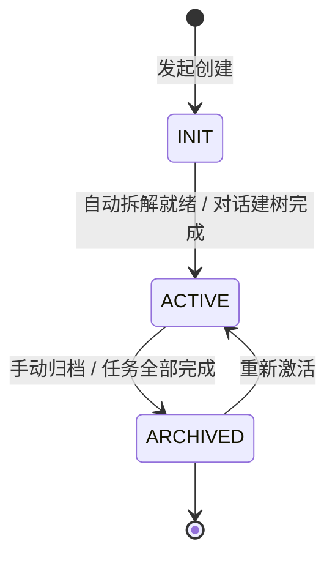
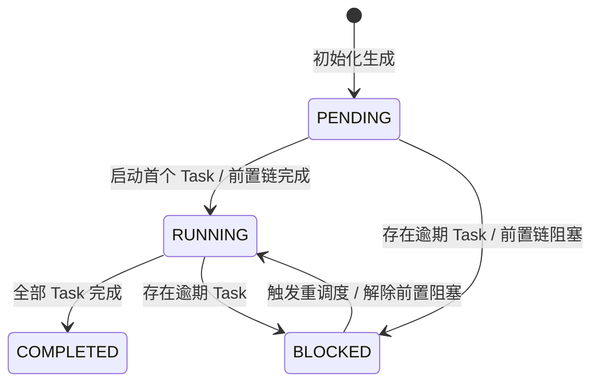
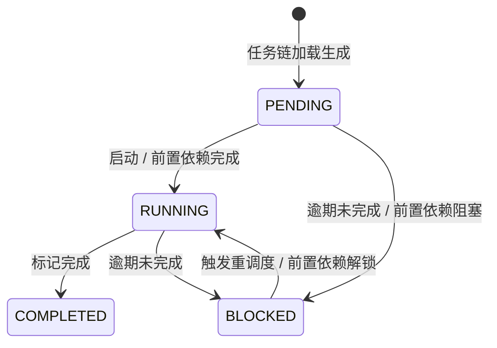
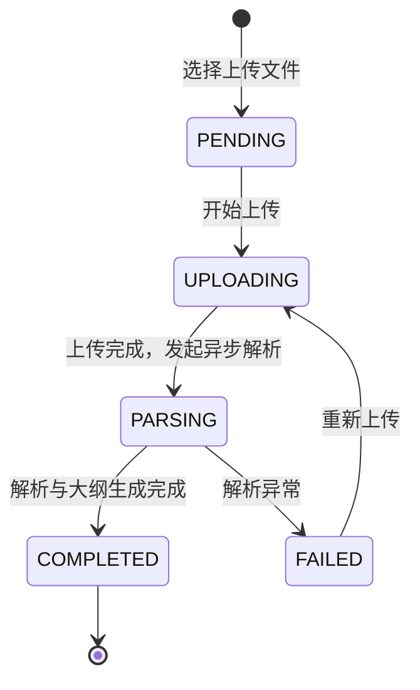
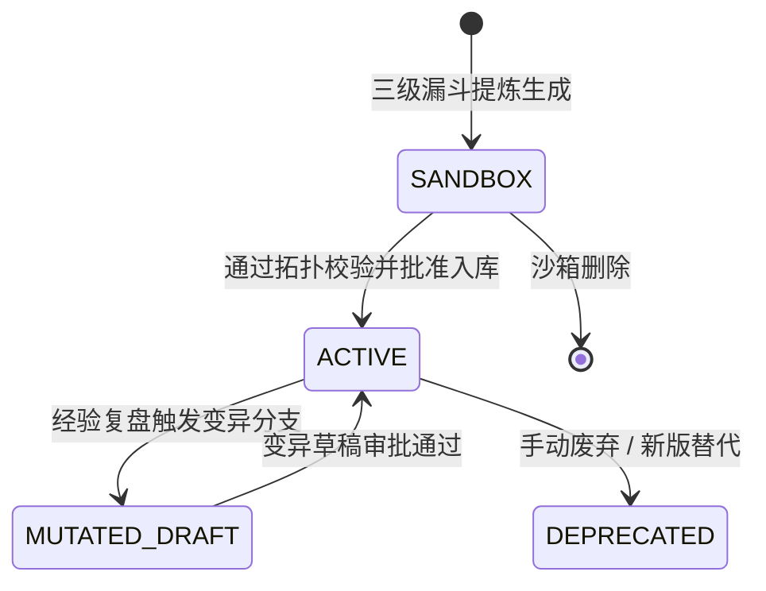
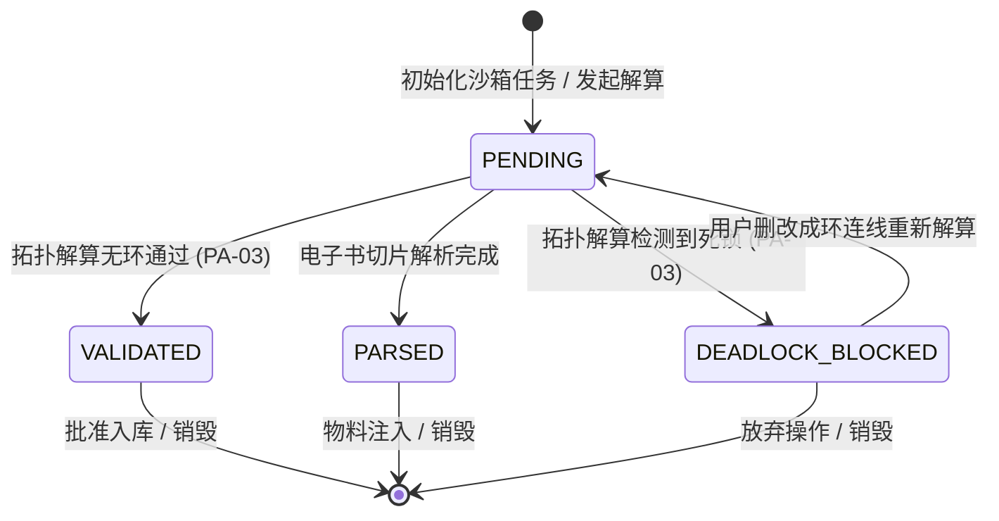
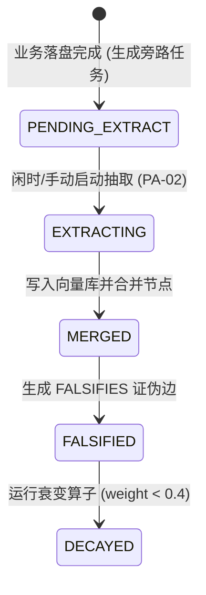

# 辅助阅读与知识技能沉淀系统交互状态规范 v1.0

本文档基于 [业务模型规范](../03_business_modeling/business_model.md) 编写，旨在明确系统中核心实体的服务端状态流转以及前端交互/算法解算逻辑，为后续系统架构、前端原型及数据模型设计提供坚实的契约底座。

---

## 一、 服务端核心实体状态机规范 (Backend Core State Machines)

本章节定义的实体状态均为持久化于服务端数据库或 Redis 缓存中的核心生命周期字段。

### 1. 项目实体 (Project) 状态机

项目是一切学习与执行任务的最高层级承载容器。根据业务模型，项目分为“阅读项目 (READING)”与“计划项目 (PLAN)”双轨，其生命周期共用同一状态机。在单机本地化 (Local-First) 与对话实时落盘架构下，状态极简为 3 个持久化状态：

> [!NOTE]
> **句柄内存解耦原则**：Agent 受限进程/句柄在软件关闭或闲置时的物理销毁与重新拉起，属于后端的内存缓存管理行为 (Runtime LRU Manager)，不改变项目在数据库中的 `ACTIVE` 业务状态。

| 源状态 | 目标状态 | 触发事件 | 前后端数据扭转与行为契约 |
| :--- | :--- | :--- | :--- |
| **[*]** | **INIT** | 用户点击新建项目 | 前端加载创建表单。后端生成项目实体，置状态为 `INIT`。 |
| **INIT** | **ACTIVE** | 阅读: 自动拆解 / 计划: 对话自动建树 | **阅读项目**：电子书解析完成，系统自动按章节生成 TaskChain 及默认 Task，状态**自动扭转为 `ACTIVE`**。 **计划项目**：与监督 Agent 对话完成后，系统自动挂载 Task 任务树，后端将状态由 `INIT` 扭转为 `ACTIVE`。 |
| **ACTIVE** | **ARCHIVED** | 用户点击归档 / 任务全部完成 | 触发闲时增量图谱构建任务（**PA-02 契约**），将项目及挂载任务置为只读 `ARCHIVED` 状态。 |
| **ARCHIVED** | **ACTIVE** | 用户点击重新激活 | 前端点击“重新激活”，后端恢复项目读写权限，状态恢复为 `ACTIVE`。 |

---

### 2. 任务链实体 (Task Chain) 状态机

任务链是项目中观层级的通用容器（在阅读项目中表现为电子书章节大纲链 `READING_CHAPTER`，在计划项目中表现为阶段/功能模块任务链 `PLAN_STAGE`）。系统遵循 `Project -> Task Chain -> Task` 统一三层范式。

| 源状态                | 目标状态      | 触发事件                    | 前后端数据扭转与行为契约                                                                                                               |
| :-------------------- | :------------ | :-------------------------- | :------------------------------------------------------------------------------------------------------------------------------------- |
| **[*]**               | **PENDING**   | 解析完成或 Skill 注入       | 电子书解析后各章节实例化为 `Task Chain`；或计划项目解构出阶段里程碑 `Task Chain`，初始状态均设为 `PENDING`。                           |
| **PENDING**           | **RUNNING**   | 首个 Task 启动 / 前置链完成 | 当用户点击开始阅读/执行该链下的第一个 Task，或前置依赖 Task Chain 状态转为 `COMPLETED` 时，本 Task Chain 自动解锁转为 `RUNNING`。      |
| **RUNNING**           | **COMPLETED** | 所有微观 Task 均完成        | 当归属于该 Task Chain 的所有微观 Task 状态均变为 `COMPLETED` 时，后端自动将该 Task Chain 标记为 `COMPLETED`，更新中观进度。            |
| **PENDING / RUNNING** | **BLOCKED**   | 存在逾期 Task / 前置阻塞    | 定时任务检测到链内包含未完成且已超过截止时间的 Task，或前置依赖的 Task Chain 发生阻塞，本 Task Chain 自动降级为 `BLOCKED` 并高亮红边。 |
| **BLOCKED**           | **RUNNING**   | 执行重调度 / 解除阻塞       | 用户在看板中点击“重调度”执行一键顺延，或手动解锁前置依赖链后，Task Chain 状态恢复为 `RUNNING`。                                        |

---

### 3. 任务实体 (Task) 状态机

任务是 Task Chain 下具体的微观可执行单元（如段落精读、划词对话、卡片写笔记、代码编写等）。Task 间可通过 `depends_on_task_ids` 构建有向无环图 (DAG) 依赖。

| 源状态                | 目标状态      | 触发事件                    | 前后端数据扭转与行为契约                                                                                       |
| :-------------------- | :------------ | :-------------------------- | :------------------------------------------------------------------------------------------------------------- |
| **[*]**               | **PENDING**   | 项目启动 / 任务链生成       | 伴读或计划项目生成微观 Task。若存在 `depends_on_task_ids` 且前置 Task 未完成，前端将其置灰锁死。               |
| **PENDING**           | **RUNNING**   | 用户标记开始 / 前置依赖完成 | 用户手动启动任务，或其 DAG 前置依赖 Task 全部变为 `COMPLETED`，系统自动解锁该 Task 并恢复可操作态。            |
| **RUNNING**           | **COMPLETED** | 用户标记完成                | 用户手动勾选完成（如读完段落或提交实践交付物）。后端将状态置为 `COMPLETED`，级联触发后继依赖 Task 的解锁事件。 |
| **PENDING / RUNNING** | **BLOCKED**   | 超出截止时间未完成          | 定时检测到当前时间已超出任务 `deadline` 且状态非 `COMPLETED`，前端卡片展现淡红背景与呼吸闪烁，提示重调度。     |
| **BLOCKED**           | **RUNNING**   | 用户触发半自动重调度        | 用户点击“一键顺延”或手动在甘特图中拖拽调整时间后，系统重新更新后继依赖链的截止时间，状态恢复为 `RUNNING`。     |

---

### 4. 书籍实体 (Book) 状态机

书籍实体承载用户上传的电子书（PDF / EPUB / TXT / MD），记录其上传、文本解析切片、`parsed_structure` 目录树构建及沙箱磁盘物理文件 `parsed_content.json` 的全生命周期状态 (`parsing_status`)。

| 源状态        | 目标状态      | 触发事件                 | 前后端数据扭转与行为契约                                                                                                                                     |
| :------------ | :------------ | :----------------------- | :----------------------------------------------------------------------------------------------------------------------------------------------------------- |
| **[*]**       | **PENDING**   | 用户选择上传文件         | 前端初始化文件上传任务，后端分配 Book UUID 并建立磁盘物理路径框架，状态设为 `PENDING`。                                                                      |
| **PENDING**   | **UPLOADING** | 数据流传输开始           | 前端展示文件上传进度条。后端接收二进制流并写入磁盘沙箱存储 `storage_path`。                                                                                  |
| **UPLOADING** | **PARSING**   | 上传完成                 | 后端触发文本切片与目录树解析服务，状态转为 `PARSING`。前端切换为级联大纲树骨架屏并展示波光解析动画。                                                         |
| **PARSING**   | **COMPLETED** | 切片与大纲解析完成       | 正文切片落盘为 `parsed_content.json`，目录树写入 DB 字段 `parsed_structure`，并自动为每个章节实例化一个 `TASK_CHAIN`。状态转为 `COMPLETED`，前端渲染大纲树。 |
| **PARSING**   | **FAILED**    | 解析过程发生不可恢复异常 | 解析器捕获损坏或格式不支持异常，写入 `error_message`。状态转为 `FAILED`，前端大纲树展示红色报错与“重新上传”按钮。                                            |

> [!NOTE]
> **旁路建图解耦契约**：`Book` 实体的 `parsing_status` 仅记录基础解析与阅读物料切片生命周期。后台知识图谱（Graph Node）抽取为独立的旁路异步服务，不阻塞 `Book` 状态向 `COMPLETED` 的转化。

---

### 5. 技能实体 (Skill) 状态机

技能是由方法论提炼而成的可执行 Prompt 工作流或脚本，采用物理隔离区 (`skills/sandbox/`) 与人工拓扑校验门禁保障安全。

| 源状态            | 目标状态          | 触发事件                    | 前后端数据扭转与行为契约                                                                                                                         |
| :---------------- | :---------------- | :-------------------------- | :----------------------------------------------------------------------------------------------------------------------------------------------- |
| **[*]**           | **SANDBOX**       | Trace-to-Skill 三级漏斗提炼 | 无论是 L1 单点、L2 章节还是 L3 全书提炼，编译器均生成 `SKILL.md` 并写入物理隔离区 `skills/sandbox/`，状态为 `SANDBOX`。                          |
| **SANDBOX**       | **ACTIVE**        | 人工确认并通过拓扑校验      | 遵循 **PA-03 契约**，系统拓扑校验无依赖环路且用户点击“批准入库”，后端将文件移入 `skills/active/` 目录，状态转为 `ACTIVE`，可被计划项目检索注入。 |
| **ACTIVE**        | **MUTATED_DRAFT** | 结项经验指出 Skill 缺陷     | 系统在 `skills/sandbox/` 下生成该 Skill 的修订草稿分支 (Draft Branch)，界面推送提示引导用户审批。                                                |
| **MUTATED_DRAFT** | **ACTIVE**        | 变异草稿审批通过            | 修订草稿覆盖线上原 Skill，更新 `version` 版本号，状态恢复为 `ACTIVE`。                                                                           |
| **ACTIVE**        | **DEPRECATED**    | 用户废弃或旧版淘汰          | 标记为 `DEPRECATED`，不再在计划新建时推荐，但历史已注入的项目不受影响。                                                                          |

---

### 6. 沙箱实体 (Sandbox Context) 状态机

沙箱实体状态完全由 `validation_status` 驱动，仅包含纯粹的沙箱生命周期状态，与 [business_model.md](../03_business_modeling/business_model.md#L480) 保持 100% 同频对齐。

| 源状态                                    | 目标状态             | 触发事件                   | 前后端数据扭转与行为契约                                                                                                                                                           |
| :---------------------------------------- | :------------------- | :------------------------- | :--------------------------------------------------------------------------------------------------------------------------------------------------------------------------------- |
| **[*]**                                   | **PENDING**          | 沙箱任务初始化             | 后端生成 `Sandbox Context` 记录，状态置为 `PENDING`，发起依赖解算或物料切片解析。                                                                                                  |
| **PENDING**                               | **VALIDATED**        | 拓扑解算无环通过           | 技能审校场景下，拓扑算子解算完成且 `has_cycle == false`（遵从 **PA-03 契约**），状态转为 `VALIDATED`，前端解除“批准入库”按钮禁用。                                                 |
| **PENDING**                               | **DEADLOCK_BLOCKED** | 拓扑解算检测到依赖成环     | 技能审校场景下，算子检测到 `SkillStep.depends_on` 存在闭环 (`has_cycle == true`)。遵从 **PA-03 契约**，状态转为 `DEADLOCK_BLOCKED`，右下角报警并强行禁用“批准入库”按钮。           |
| **DEADLOCK_BLOCKED**                      | **PENDING**          | 用户删改成环连线           | 用户在画布上删改成环连线后，前端重新触发解算，状态转回 `PENDING` 重新校验。                                                                                                        |
| **PENDING**                               | **PARSED**           | 物料切片与大纲解析完成     | 图书解析场景下，物理切片 `parsed_content.json` 与大纲解析完成，状态转为 `PARSED`。                                                                                                 |
| **VALIDATED / PARSED / DEADLOCK_BLOCKED** | **[*]**              | 批准入库 / 物料注入 / 销毁 | **VALIDATED**：用户点击“批准入库”，触发 `Skill.status` 转为 `ACTIVE`，沙箱销毁。 **PARSED**：物料注入完成，沙箱销毁。 **DEADLOCK_BLOCKED**：用户放弃编辑关闭沙箱，释放资源。 |

---

### 7. 知识图谱实体 (Graph Domain) 旁路状态机

知识图谱是独立于主业务生命周期的**旁路消费服务 (Bypass Sidecar Consumer)**。包含 Graph Node、Tag Super Node 及 Graph Edge，驱动跨项目漫游与知识新陈代谢。

| 源状态 | 目标状态 | 触发事件 | 前后端数据扭转与行为契约 |
| :--- | :--- | :--- | :--- |
| **[*]** | **PENDING_EXTRACT** | 业务落盘完成 | **双通道解耦落盘**：主业务流落盘即返回。旁路服务捕捉到 `Book` 切片 (通道 A) 或 `Note` 产生/变更 (通道 B)，生成待抽取队列任务。 |
| **PENDING_EXTRACT** | **EXTRACTING** | 闲时或用户手动点击同步 | **PA-02 低成本契约**：后台低频闲时或项目归档时调用 LLM 抽取实体与关系，前台界面呈现微弱静默进度指示，不干扰伴读阅读。 |
| **EXTRACTING** | **MERGED** | 图谱构建与合并完成 | 新抽取节点与边写入 `sqlite-vec` 引擎，跨项目与 `TagSuperNode` 标签超节点自动逻辑聚拢，刷新网状可视化画布。 |
| **MERGED** | **FALSIFIED** | 收到反驳性的 Experience Note | **冲突识别**：当实战复盘笔记与旧理论冲突时，LLM 旁路分析器自动建立 `FALSIFIES` 反向证伪边，目标节点标记为 `FALSIFIED`。 |
| **FALSIFIED** | **DECAYED** | 图谱重绘与衰变计算 | **知识新陈代谢与降级**：衰变算子按周期下调节点置信度权重 `weight`。当 `weight < 0.4` 时状态转为 `DECAYED`；RAG 检索打分大幅下调避免旧理论噪音污染，前端画布透明度自动降至 40% 且连线转灰虚线。 |

---
