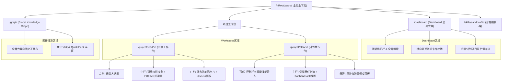

# 辅助阅读与知识技能沉淀系统 UX 原型与前端实现全景规范 v1.0

> [!IMPORTANT]
> 本文档聚合了前台体验与工程实现的**全部核心细节**，专为 UI/UX 设计师（及 Figma AI 生成）、前端研发人员编写。
> 它是业务原型设计、组件库开发、状态流转与边界异常处理的“唯一真理之源”。

---

## 第一部分：核心页面布局与路由拓扑 (Layout & Routing)

> [!TIP]
> 界面原型设计需遵循“沉浸、无干扰”的排版原则。路由直接映射至 FSD 架构中的 `Pages` 层，并由 React Router v6 Data API 驱动预加载。

### 1. 全局视窗导航拓扑

### 2. 页面区域详述与数据装载契约

| 路由路径 | 页面模块 | 布局结构与组件要求 | 数据预加载契约 (Loader) |
| :--- | :--- | :--- | :--- |
| `/dashboard` | **全局大盘页** | 顶部导航栏（含全局搜索） + 主内容区（卡片轮播 + 双栏项目瀑布流）。提供悬浮按钮呼出图谱。 | `GET /api/projects?status=ACTIVE` |
| `/project/read/:id` | **沉浸式阅读工作台** | 自适应双/三栏布局。左栏：级联大纲；中栏：双维度进度条+主阅读器；右栏：瀑布流笔记+Discuss。 | 获取项目详情及首屏 `notes` 缓存。 |
| `/project/plan/:id` | **计划执行工作台** | 顶部控制栏 + 核心任务看板/甘特图。注入技能时支持骨架屏任务流。 | 获取任务树依赖拓扑 (Mock 垫片)。 |
| `/graph` | **全局知识图谱** | 全屏力导向交互画布。弹窗交互需使用 `Quick Peek` 居中毛玻璃，绝对禁止页面跳转。 | 预加载主干节点快照。 |
| `/skills/sandbox/:id` | **技能沙箱** | 可视化连线画布，带拓扑死锁报警侧边栏。 | 加载技能卡片节点及依赖边数据。 |

---

## 第二部分：核心 UI 组件解构 (Components I/O)

前端全面采用 **Feature-Sliced Design (FSD)** 范式。组件拆分为纯洁的基础积木 (`Shared`) 与包含业务逻辑的卡片容器 (`Entities` / `Features`)。

### 1. Shared 层基础组件库规范 (UI 积木)

基础 UI 统一基于 **shadcn/ui** 封装，利用 Tailwind CSS 提供像素级控制。

* **`Button`**：扩展 `variant="glass"`（毛玻璃磨砂效果）用于悬浮菜单；扩展 `isLoading` 状态替代原生 `disabled`。
* **`Modal`**：强制背景加入 `backdrop-blur-sm` 高斯模糊遮罩；拦截 `Esc` 和外部点击，保障心流不被打断。
* **`Toast`**：用于非阻断性通知，定制错误色系。
* **`Popover`**：用于微型弱打扰气泡与划词菜单。要求附带 300ms 渐进滑出 (Slide In) 动效。

### 2. 核心特征组件详述 (Entities & Features)

> [!IMPORTANT]
> 前端组件严格遵循以下状态输入（Props/State）与交互输出（Events/Emits）契约，以保证前后端数据一致性。

**A. 融合笔记卡片 (Unified Note Card)**
* **功能描述**：承载主观笔记、原文高亮引用与 AI 辅导的统一组件。
* **数据流转**：
  * `Props`: `noteId`, `sourceAnchor` (物理定位坐标), `quoteContent` (微透明浅绿斜体背景), `userContent` (富文本), `isReadOnly` (归档状态下置灰禁用)。
  * `Emits`: `onLocateSource` (点击头部定位按钮，触发平滑滚动与脉冲高亮), `onContentChange` (富文本变更时包裹 500ms 防抖提交)。

**B. 双维度动态进度条 (Dual-metric Progress Bar)**
* **功能描述**：用于中栏顶部，双向展示阅读与切片解析进度。
* **数据流转**：
  * `Props`: `chapterReadRatio` (已读比例), `chunkParsedRatio` (解析比例), `chapterMarkers` (章节物理坐标标记)。
  * `Emits`: 悬浮刻度触发气泡展示预估耗时，点击刻度触发阅读器平滑滚动。

**C. 拓扑排序卡片节点 (Topological Node Card - 沙箱专属)**
* **功能描述**：沙箱中支持拖拽连线的编排节点。
* **数据流转**：
  * `Props`: `nodeId`, `dependencies`, `hasCycleError` (死锁死否)。当 `hasCycleError=true`，激活红色高斯模糊与高频抖动动效，底部按钮立刻禁用。
  * `Emits`: `onConnectionCreate/Delete` (连线改变时，触发本地拓扑检测算法)。

**D. 微型弱打扰气泡 (Recommendation Bubble)**
* **功能描述**：章节末尾静默滑出的提示组件。
* **数据流转**：
  * `Props`: `triggerCondition` (阅读超过95%时激活), `message` (AI 提示语)。
  * `Emits`: 用户滚动离开触发区，派发 `onDismiss` 自动销毁。点击触发 `onActionClick` 展开侧边栏。

**E. 伴读消息气泡 (MessageBubble)**
* **功能描述**：打字机动效载体与右侧交互面板。
* **事件特效**：内含 `[存为笔记]` 图标。点击触发 `onSaveAsNote`，界面生成抛物线粒子特效，将内容砸入中栏产生实体卡片。

---

## 第三部分：沉浸式人机交互流水线 (Interaction Pipelines)

### 1. 划词溯源与精准定位 (Trace-to-Source)
1. **划词捕获**：阅读器中选取文本，正上方弹出极简浮动菜单（Discuss/记笔记）。点击后文本原地留痕高亮，中栏滑出空白新卡片。
2. **溯源对齐**：点击笔记中的引用，阅读器容器调用原生 `element.scrollIntoView({ behavior: 'smooth', block: 'center' })`，使原文档落入屏幕中心。
3. **脉冲发光**：目标 DOM 触发 3 次脉冲闪烁动效：
   `backgroundColor: ['#fef3c7', 'transparent', '#fef3c7', 'transparent']` (持续 1.5s)。
4. **容错机制**：由于文本位置可能偏移，内置 Levenshtein 距离模糊匹配，自动查找相似度最高的锚点并提供黄星提示。

### 2. 伴读对话的 SSE 打字机流
* 用户点击发送，调用 `POST /api/discuss`。
* 前端通过 `EventSource` 监听 `event: chunk`，将推送碎片实时追加进 Zustand 状态，驱动底部 Markdown 渲染器生成打字机渐显特效。流结束即断开连接。

### 3. 一键顺延与甘特图拓扑重调度
* 当任务逾期，卡片边框渲染 `ring-red-500`。
* 用户点击悬浮“重调度”输入顺延天数后，前端直接抛给后端 `POST /api/tasks/reschedule`，并利用 React Query `invalidateQueries()` 触发全量任务树缓存失效刷新，界面恢复清爽蓝色 `RUNNING` 态。

### 4. 数据衰变与 Quick Peek 无界漫游 (PA-07 契约)
* **知识衰变**：图谱中若节点存在 `is_falsified=true`，其材质不透明度降至 `0.4`，连线采用虚线 `stroke-dasharray="5,5"`，呈现被新经验推翻后的衰减感。
* **Quick Peek 溯源**：点击散落节点，前端**绝不跳页**，而是在当前画布上方直接呼出带有毛玻璃背板的中央浮窗，展示历史长文。点击遮罩即收起。

---

## 第四部分：状态视觉映射与异常兜底策略

### 1. 项目全局状态联动映射
| 项目/实体状态 | 界面视觉与交互限制表现 |
| :--- | :--- |
| **`ACTIVE`** (激活) | 正常蓝绿系交互配色，所有输入与编排组件可用。 |
| **`SUSPENDED`** (休眠) | 界面被全局或局部毛玻璃遮罩覆盖，底层不可点击。中央显示“一键唤醒”按钮。点击后触发全屏水波纹扩散动效唤醒。 |
| **`ARCHIVED`** (归档) | 顶部常驻提示横幅。所有子组件 `isReadOnly=true`，输入框与提交按钮深度置灰，鼠标指针变为 `not-allowed` 禁行标志。 |
| **`PARSING`** (解析中) | 大纲与正文区渲染为连绵起伏的骨架屏波光动效 (Skeleton)，屏蔽点击事件直到渲染完成。 |

### 2. 基于 RFC 7807 的异常展现分级
系统绝不向用户抛出冰冷的 JSON 报错或白屏，严格按严重程度分层阻断：

| 错误级别 / RFC 特征 | 交互展现形式 (UI Pattern) | 行为约束 |
| :--- | :--- | :--- |
| **轻量级警告** (2xx 波动) | 顶部右侧悬浮 `<Sonner Toast />` | 3 秒自动消失，绝不遮挡主操作区。 |
| **参数/表单校验** (422) | **Inline 表单内联红字提示** | 依据 `extension_fields.invalid_params`，锁定出错 Input 框边框变红+左右 Shake 抖动。 |
| **死锁/拓扑环路** (400) | **画布原位阻断** | 严禁使用 Toast。解析 `cycle_path`，沙箱成环连线变为红色虚线并抖动，底部主按钮强行禁用。 |
| **配额耗尽/越权** (403) | **居中模态对话框 (Modal)** | 高斯模糊遮罩底布。必须附带显式的“去升级”操作按钮，拦截一切后续操作。 |
| **局部区域崩溃** (500) | **区块隔离重试图 (ErrorBoundary)**| 若某图表挂掉，仅在该区块渲染“点击重试”占位插画。严防全局白屏。 |

### 3. 未开发 API 的前台 Mock 垫片拦截
因部分接口（详见 `api_spec_v1.0.md`）后端暂未开发，为保障 Figma 生成及独立 UI 开发进度，必须内置 MSW 拦截逻辑：
* `GET /api/projects/:id` (获取详情)：返回固定虚拟概览及模拟激活态。
* `GET /api/projects/:id/tasks` (拉取拓扑树)：返回多级嵌套依赖的静态 JSON 节点。
* `GET /api/graph/all` (图谱全貌)：随机生成 50 个节点坐标与 Falsified 衰变标识连线，供 Canvas 测试用。
