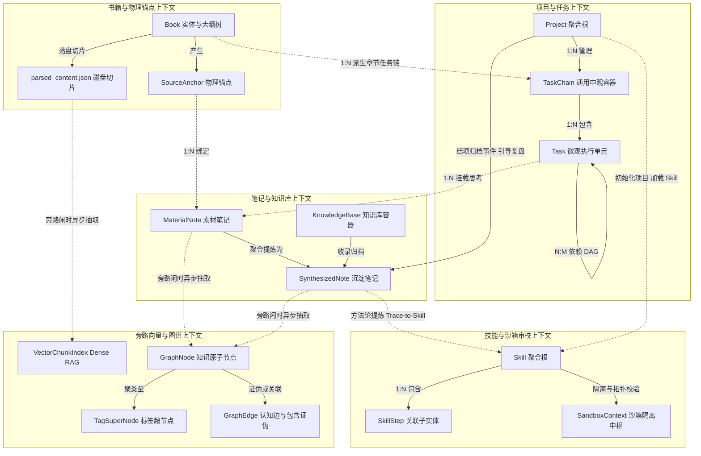
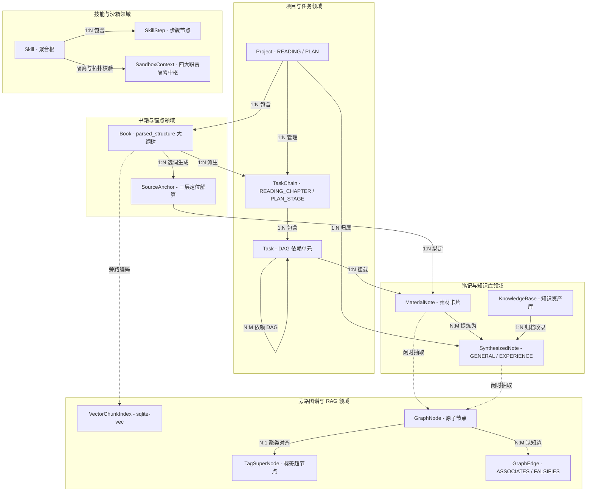

# 后端系统核心模块架构设计规范 v1.0

> [!IMPORTANT]
> 本文档基于 [前后端功能边界与通信协议规范](./frontend_backend_boundary_spec_v1.0.md) 与 [系统业务建模](../03_business_modeling/business_model.md) 编写。
> **核心架构基调**：单机本地化应用 (Local-First Software Package)。采用 **六边形架构 (Hexagonal Architecture)** 与 **DDD 规范**，业务大脑与基础设施解耦。知识图谱与向量索引定位为 **旁路消费服务 (Bypass Sidecar Engine)**，100% 异步隔离。

---

## 一、 技术栈选型

| 维度 | 选型方案 | 核心设计依据 |
| :--- | :--- | :--- |
| **基础语言与框架** | Python + FastAPI | 异步高并发、原生支持 SSE 流式推流与 Python AI 生态 |
| **依赖注入 (DDD)** | FastAPI `Depends` 显式注入 | 务实解耦，Domain 层零框架依赖，App 层拉取 Ports 注入 |
| **打包与运行** | PyInstaller + 原生浏览器 | 本地打包可执行文件，FastAPI 挂载前端 `dist`，开机拉起浏览器 |
| **AI 编排引擎** | LangChain + LangGraph | 复杂伴读与编译逻辑编排，基于 LangGraph 支撑人机协同沙箱 |
| **存储与持久化** | File-first + SQLite / sqlite-vec | 大体量切片存 `parsed_content.json`，笔记落盘 MD；元数据与 Dense 向量存 SQLite |
| **后台异步队列** | Python `asyncio` | 内置守护队列处理旁路闲时建图与向量切片编码 |

---

## 二、 六边形架构解构

| 架构分层 | 核心职责 | 防腐接口 (Ports) 放置与约束 |
| :--- | :--- | :--- |
| **1. 领域层 (Domain Layer)** | 纯业务大脑（实体 `Project`, `TaskChain`, `Task`, `Book`, `SourceAnchor`, `MaterialNote`, `SynthesizedNote`, `KnowledgeBase`, `Skill`, `SkillStep`, `SandboxContext` 及 DAG/锚点/拓扑算法） | 定义 **Domain Ports**（如 `RepositoryPort`），绝对隔离框架与物理 I/O |
| **2. 应用层 (Application Layer)** | 业务外观与中枢（编排伴读、物料解析、Trace-to-Skill 编译、结项归档等用例） | 定义 **Application Ports**（如 `LLMPort`, `SandboxPort`），编排领域逻辑 |
| **3. 基础设施层 (Infrastructure Layer)** | 被动适配器（磁盘文件存储、SQLite 引擎、受限沙箱进程、大模型通信） | 实现 Ports 接口，仅作为被动支撑方 |
| **4. 接入层 (Driving Adapters)** | 主动适配器（FastAPI REST API、SSE 推流、静态资源挂载） | 转换外部请求为领域语言，驱动 App 层 |
| **5. 旁路消费服务 (Sidecar Engine)** | 独立旁路引擎（Dense RAG 编码、Graph RAG 闲时建图与新陈代谢） | 监听领域事件，100% 异步独立执行，主业务 API 零等待 |

---

## 三、 核心架构图解

### 1. 六边形系统全局架构图 (Hexagonal Architecture)

```mermaid
graph TD
    subgraph DrivingAdapters ["主动适配器 接入层"]
        REST["REST API - FastAPI"]
        SSE["SSE Streaming - FastAPI"]
        UI["Web UI 挂载 - StaticFiles"]
    end

    subgraph Hexagon ["系统边界 六边形内部"]
        subgraph AppLayer ["应用层 Application Layer"]
            UC1["渐进伴读与笔记捕获编排"]
            UC2["Trace-to-Skill 编译与沙箱审校流"]
            UC3["结项归档与经验沉淀流"]
            UC4["项目初始化与 Skill 任务拆解流"]
            UC5["文档解析切片与大纲映射流"]
        end

        subgraph DomainLayer ["领域层 Domain Layer"]
            PTO["项目与任务领域 - Project, TaskChain, Task"]
            BND["书籍与物理锚点领域 - Book, TocNode, SourceAnchor"]
            NTD["笔记与知识库领域 - MaterialNote, SynthesizedNote"]
            SCS["技能与沙箱审校领域 - Skill, SkillStep, SandboxContext"]
            EventBus["领域内部事件分发中枢"]
        end
        
        subgraph Ports ["防腐接口层 Ports"]
            Port_EventBus["EventBus Port - 事件总线接口"]
            Port_LLM["LLM Port - 大模型接口"]
            Port_Sandbox["Sandbox Port - 安全沙箱接口"]
            Port_DB["Repository Port - 仓储接口"]
        end
        
        UC1 -->|"捕获笔记"| NTD
        UC1 -->|"定位原文"| BND
        UC2 -->|"拓扑死锁校验"| SCS
        UC3 -->|"生成复盘"| PTO
        UC4 -->|"加载 Skill 模版"| PTO
        UC5 -->|"映射大纲树"| BND
        
        NTD -.->|"NoteCreated or Updated"| EventBus
        PTO -.->|"ProjectArchived"| EventBus
        BND -.->|"BookParsed"| EventBus
        
        AppLayer -.->|"端口调用"| Ports
        DomainLayer -.->|"端口调用"| Ports
    end

    subgraph DrivenAdapters ["被动适配器 基础设施层"]
        subgraph EventBusAdapter ["事件总线适配器"]
            AsyncioBus["后台异步任务队列 asyncio task"]
        end
        subgraph AIAdapter ["大模型适配器"]
            LLM["大模型通信接口 LangChain/LangGraph API"]
        end
        subgraph SandboxAdapter ["安全隔离适配器"]
            Sandbox["本地安全隔离引擎 受限进程与管道"]
        end
        subgraph StorageAdapter ["存储适配器"]
            FileStorage["本地物理文件存储 parsed_content.json 与 MD File-first"]
        end
        subgraph CacheAdapter ["持久化与缓存适配器"]
            SQLiteDB["SQLite 数据库 元数据表与 sqlite-vec 向量索引"]
        end
    end

    subgraph SidecarEngine ["旁路消费服务 Sidecar Engine"]
        DenseRAG["Dense RAG 即时切片编码 sqlite-vec"]
        GraphRAG["Graph RAG 闲时异步建图 GraphNode与代谢图谱"]
    end

    DrivingAdapters -->|"触发业务编排"| AppLayer
    Ports -.->|"适配器底层实现"| DrivenAdapters
    
    AsyncioBus -.->|"旁路事件监听"| SidecarEngine
    SidecarEngine -.->|"读写向量与图谱"| SQLiteDB
```

### 2. 限界上下文与实体边界交互图 (Bounded Context Map)

### 3. 核心领域实体关系图 (Domain ERD)

---

## 四、 核心 I/O 流职责路径

| 核心交互链路 | 分层流转路径 |
| :--- | :--- |
| **文档解析与切片流** | `接入层` 接收文件 -> `应用层` 发起解析 -> `沙箱` 隔离切片并落盘 `parsed_content.json` -> `领域层` 生成大纲树与 TaskChain -> `存储层` 事务落盘 |
| **划词 / 对话转笔记流** | `接入层` 接收捕获 -> `应用层` 编排 -> `领域层` 三层定位解算校验 SourceAnchor 与 MaterialNote -> `存储层` 落盘并发送 EventBus |
| **Trace-to-Skill 编译流** | `接入层` SSE 建立 -> `应用层` 编排 LLM -> `领域层` 组装 SkillStep 并作 DAG 拓扑解环 -> `沙箱` 校验阻断 (PA-03) 或写入暂存区 |
| **半自动重调度流** | `接入层` REST 接收拖拽 -> `应用层` 发起重排 -> `领域层` 拓扑遍历计算新 Deadline -> `存储层` 事务落盘 |
| **结项归档与经验沉淀** | `接入层` 触发归档 -> `应用层` 引导复盘 -> `领域层` 生成 SynthesizedNote (EXPERIENCE) -> `存储层` MD 落盘并触发旁路事件 |
| **旁路闲时 Graph RAG 构建** | `EventBus` 异步唤醒 -> `旁路引擎` 扫盘 -> `应用层` LLM 抽取实体与同义词对齐 -> `领域层` 评估代谢边 (FALSIFIES) -> `存储层` 写入 SQLite / sqlite-vec |
| **24h 会话休眠与重载** | `守护线程` 24h 超时 -> `应用层` 挂起 -> `存储层` 持久化上下文至 LocalCache/Redis；重登后 `应用层` 校验状态并水波纹重载恢复 |

---

## 五、 关键技术契约 (Policies)

> [!CAUTION]
> **PA-05 安全隔离契约**：伴读/监督 Agent 权限限定在 `SandboxContext` 内，禁外网调用、禁 Shell 执行、禁写核心磁盘，仅允许管道 (Pipe) 输出纯文本。

> [!WARNING]
> **PA-03 依赖死锁阻断契约**：技能审校必须执行拓扑解环排序。一旦检测到依赖环路 (`DEADLOCK_BLOCKED`)，后端强行禁止技能批准入库。

> [!TIP]
> **PA-02 低成本旁路构建契约**：拒绝高频实时图谱构建。Graph RAG 100% 作为旁路 Sidecar 运行，由闲时守护任务或归档显式触发，控制 Token 成本。

> [!NOTE]
> **PA-04 优雅休眠与重载契约**：服务端 LLM 连接 24 小时超时后自动持久化上下文。用户重登触发水波纹刷新与会话重调度恢复。

> [!CAUTION]
> **PA-06 隐私与本地脱敏契约**：个人笔记 100% 本地加密存储。外部 LLM 调用前强制本地脱敏，且完全兼容本地离线 LLM 运行。

> [!NOTE]
> **PA-07 全局图谱漫游契约**：图谱查询支持拓扑邻接与 `TagSuperNode` 聚类，输出 `block_ids` 供前端 Quick Peek 浮窗无缝定位。
