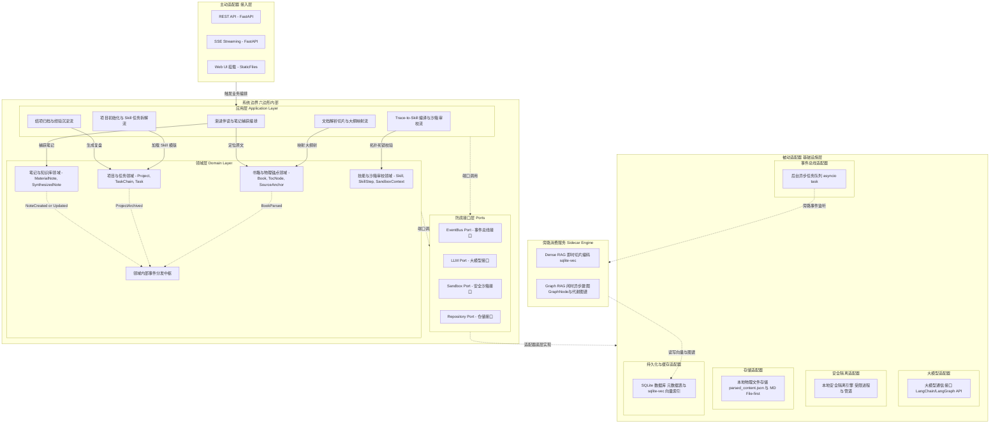
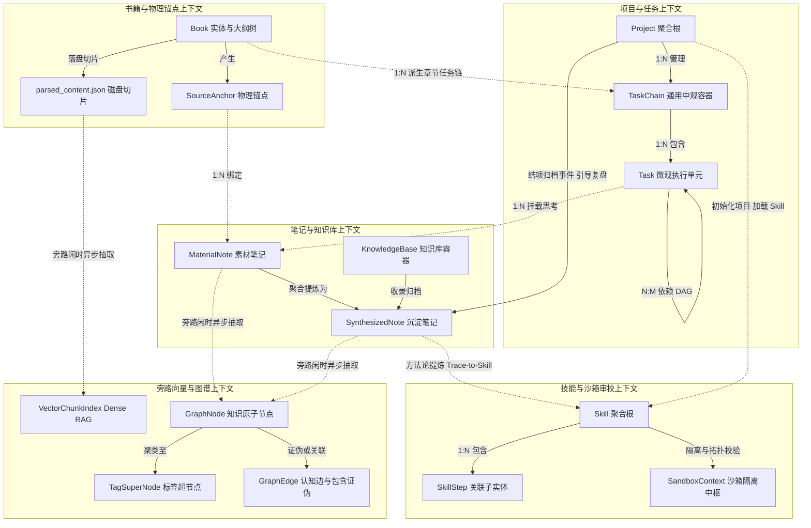
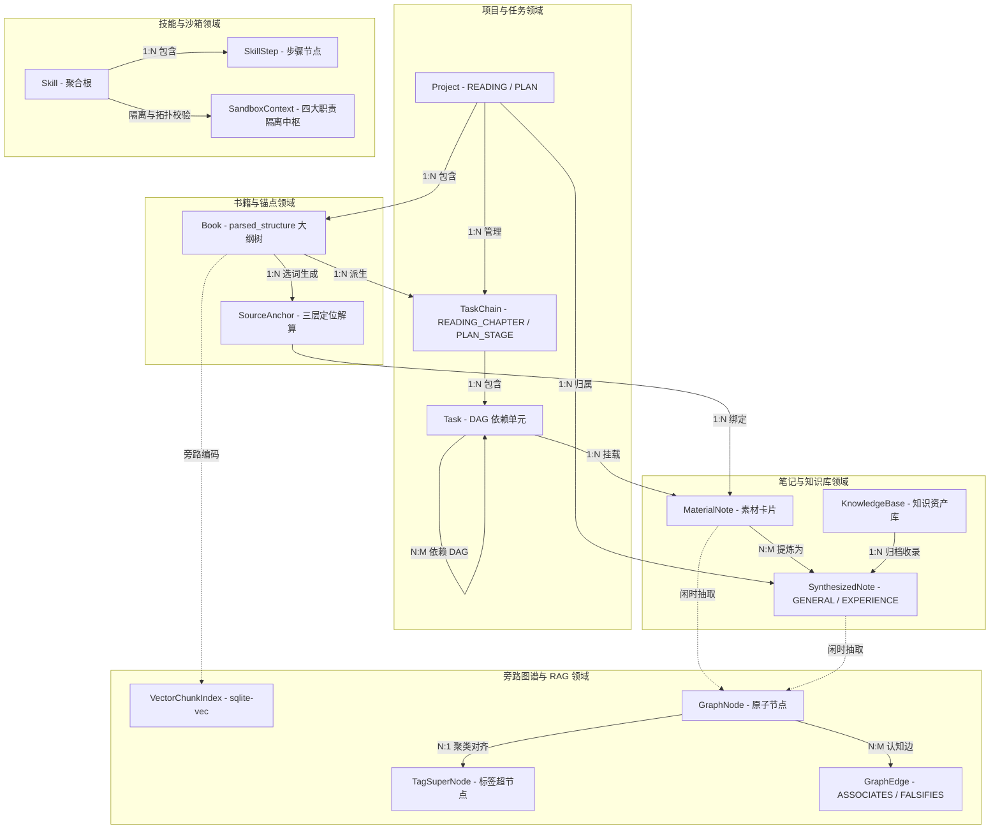

# 后端系统核心模块架构设计规范 v1.0

> [!IMPORTANT]
> 本文档基于 [《前后端功能边界与通信协议规范》](./frontend_backend_boundary_spec_v1.0.md) 以及 [《系统业务建模》](../03_business_modeling/business_model.md) 编写。
> **架构核心基调**：摒弃传统中心化 SaaS Web 服务架构，系统以**本地化独立软件包 (Local-First Software Package)** 的形态运行。根据最新技术裁决，后端遵循**六边形架构 (Hexagonal Architecture)** 与**领域驱动设计 (DDD)** 规范，将纯业务逻辑与底层技术支撑（如隔离沙箱、存储机制）严格物理解耦。同时，知识图谱与向量索引定位为**旁路消费服务 (Bypass Sidecar Consumer)**，与主业务生命周期平滑解耦。

## 一、 系统架构定位与技术栈选型

考虑到系统的强隐私要求、离线运行诉求以及“开箱即用”的数据迁移体验，后端系统采取轻量级嵌入式设计。

### 1. 核心选型决策
* **基础语言与应用框架**：**Python + FastAPI**
  * 完美支持异步并发与 SSE (Server-Sent Events) 流式输出，无缝接入 Python 原生 AI 生态。
* **依赖注入与 DDD 落地 (Dependency Inversion)**：**务实派 FastAPI Depends 结合显式注入**
  * 放弃重度注解注入框架。接入层 (Router) 直接利用 FastAPI `Depends` 拉取基础设施实现；核心领域层 (Domain) 保持绝对的 Pythonic（无任何框架依赖），通过显式参数传递完成解耦。测试时依托 `app.dependency_overrides` 替换 Mock。
* **软件分发与网关策略**：**极简原生浏览器流 (PyInstaller + Webbrowser)**
  * 作为单机本地化软件运行，废弃 Nginx 等独立网关。后端采用 PyInstaller 打包为可执行程序，由 FastAPI 内部直挂前端 Web 产物 (`dist`)。用户双击启动后，自动拉起系统默认浏览器展示界面，Uvicorn 统揽全局。
* **AI 调度引擎**：**LangChain + LangGraph**
  * 用于编排复杂的伴读、提炼编译逻辑及 RAG 工作流；依托 LangGraph 支撑“人机协同沙箱 (Human-in-the-loop)”的状态流转。
* **数据存储与持久化 (File-first + SQLite)**：
  * **File-first 物理存取**：大体量原书与解析正文存放在磁盘沙箱的 `parsed_content.json` 中；沉淀笔记直接落盘为 Markdown 物理文件。
  * **SQLite 元数据与向量图谱**：业务实体元数据、项目/任务结构、索引指针及 sqlite-vec 密集向量存在独立的 `.sqlite` 文件中，落于对应的 Project/Vault 文件夹下。
* **异步守护队列**：**Python 内置异步队列 (`asyncio`)**
  * 无须部署 RabbitMQ 等外部中间件，直接在后台守护进程中处理旁路闲时建图与向量切片编码任务。

---

## 二、 核心架构解构 (基于六边形架构)

> [!IMPORTANT]
> 遵循端口与适配器模式，系统自内向外严格分为四个层级，核心目标是**彻底将“业务大脑”与“技术底座（沙箱、存储等）”剥离**。

| 架构分层 (自内向外) | 核心定位与职责 | 设计约束与特点 |
| :--- | :--- | :--- |
| **1. 领域层 (Domain Layer)** | **纯业务逻辑大脑** 定义核心实体（如 `Project`, `TaskChain`, `Task`, `Book`, `SourceAnchor`, `MaterialNote`, `SynthesizedNote`, `KnowledgeBase`, `Skill`, `SkillStep`, `SandboxContext`）与领域服务（如 DAG 依赖拓扑校验、死锁阻断、三层锚点解算、重调度算法）。 | **最严格约束**：绝对屏蔽框架、LLM 和物理 I/O，保持最内层业务纯粹性。 |
| **2. 应用层 (Application Layer)** | **业务外观与智能中枢** 作为工作流编排器，收敛所有的 LangGraph Agent 交互与业务用例协调（如伴读流、物料解析流、Trace-to-Skill 编译流、结项归档流）。 | **依赖反转**：通过接口 (Port) 调用基础设施，不对底层组件进行硬编码。 |
| **3. 基础设施层 (Infrastructure Layer)** | **技术支撑底座 (被动适配器)** 提供具体技术实现：物理沙箱隔离引擎、文件/SQLite 存储引擎、大模型适配器。 | **受控调用**：仅作为被动支撑方，负责数据持久化、安全性拦截与外部通信。 |
| **4. 接入层 (Driving Adapters)** | **通信入口 (主动适配器)** 依托 FastAPI 提供 RESTful API 与 SSE 流式推流。 | **边界转化**：负责接收前端触发，将外部数据转化为内部领域语言并驱动应用层。 |
| **5. 旁路消费服务 (Bypass Sidecar Engine)** | **闲时异步知识引擎** 作为独立旁路（Sidecar），扫描落盘物料与笔记，处理 `VectorChunkIndex` (sqlite-vec) 即时切片编码与 `GraphNode` / `TagSuperNode` / `GraphEdge` 低频闲时异步建图与新陈代谢。 | **解耦隔离**：100% 异步执行，主业务 API 落盘即返回，主流程零等待、不受建图延迟或 Token 额度影响。 |

> [!NOTE]
> **防腐接口 (Ports) 的代码放置规范 (契约编程)**
> 遵循“务实派分层”理念，防腐接口的定义完全归属于“调用方（即六边形内部）”：
> * **领域级接口 (Domain Ports)**：如 `RepositoryPort`（仓储接口）。定义在 **Domain 层**。允许 Domain Service 依赖这些接口执行必要的数据校验，由基础设施层负责实现和运行时注入。
> * **应用级接口 (Application Ports)**：如 `LLMPort`（模型通信）、`SandboxPort`（沙箱隔离）。定义在 **App 层**。由业务用例 (Use Cases) 统筹调用，Domain 层对这些纯技术驱动的能力完全无感知。

---

## 三、 核心架构图解 (Architecture Diagrams)

### 1. 六边形系统全局架构图 (Hexagonal Architecture)
展示内外层的解耦关系，突出业务逻辑（核心域）与技术基础设施（沙箱、存储）以及旁路消费引擎的物理抽离。

### 2. 限界上下文与实体边界交互图 (Bounded Context Map)
展示各个限界上下文（Domain）的边界划分、内部核心实体，以及跨上下文（Context Mapping）的事件流转与交互契约。

### 3. 核心领域实体关系图 (Domain ERD)
展示核心领域层在物理与 SQLite 中的数据模型逻辑关联，重点收口各主实体与旁路实体的约束映射。

---

## 四、 对齐核心 I/O 流的职责映射

后端在响应前端触发的核心链路时的层级流转路径如下：

| 交互核心流 | 架构层级流转路径 (Layer Flow) |
| :--- | :--- |
| **文档解析与切片流** | `接入层` 接收上传文件 -> `应用层` 发起解析 -> `沙箱引擎` 隔离解析并将正文切片落盘至 `parsed_content.json` -> `领域层` 生成 `Book` 大纲树与 `TaskChain` -> `存储引擎` 数据库事务落盘。 |
| **划词/对话转笔记流** | `接入层` 接收前端捕获 -> `应用层` 协调解算 -> `领域层` 基于三层定位容错算法校验 `SourceAnchor` 与 `MaterialNote` -> `存储引擎` 落盘并推送到 `事件总线`。 |
| **Trace-to-Skill 编译流** | `接入层` SSE 建立 -> `应用层` 编排 LLM 抽取 -> `领域层` 组装 `Skill` & `SkillStep` 并进行 DAG 拓扑解环校验 -> `沙箱引擎` 触发 PA-03 死锁阻断或写入 `skills/sandbox/` 暂存区。 |
| **半自动重调度计算流** | `接入层` REST 接收拖拽 -> `应用层` 发起重排 -> `领域层` 拓扑遍历计算受影响 TaskChain/Task 的新 Deadline -> `存储引擎` 事务落盘。 |
| **结项归档与经验沉淀流** | `接入层` 触发归档 -> `应用层` 引导复盘 -> `领域层` 生成 `SynthesizedNote` (TYPE=EXPERIENCE) -> `存储引擎` Markdown 落盘并触发旁路事件。 |
| **旁路闲时 Graph RAG 构建流** | `事件总线` 异步唤醒 -> `旁路消费引擎` 扫盘 -> `应用层` 调用 LLM 提炼 `GraphNode` 与同义词对齐 -> `领域层` 评估知识新陈代谢 (FALSIFIES 边) -> `存储引擎` 写入 SQLite 与 `sqlite-vec`。 |
| **24h 会话优雅休眠与重载流** | `守护线程` 检测 24h 无交互 -> `应用层` 挂起会话 -> `存储引擎` 持久化上下文至 LocalCache/Redis；用户重登触发 -> `应用层` 校验状态并水波纹重载恢复会话。 |

---

## 五、 关键技术契约与红线规范

后端系统开发必须严格遵循以下红线契约 (Policy Agreements)：

> [!CAUTION]
> **安全隔离契约 (PA-05)**：
> 伴读 Agent 与监督 Agent 的运行权限必须严格限定在 `SandboxContext` 中。后端强制禁用 Agent 进程调用外部网络、执行本地 Shell 命令或写入系统核心文件。通信仅允许通过控制台管道（Pipe）输出文本。

> [!WARNING]
> **环路依赖与死锁阻断契约 (PA-03)**：
> 技能审校场景下，领域服务必须对 `SkillStep` 构成的有向图执行拓扑排序。一旦检测到依赖环路 (`DEADLOCK_BLOCKED`)，后端 API 必须返回阻断错误代码，强行禁止技能入库。

> [!TIP]
> **低成本旁路构建契约 (PA-02)**：
> 拒绝高频实时图谱构建。知识图谱的提取与网状关联 100% 作为旁路异步任务（Sidecar Task）运行，由低频后台闲时任务或项目归档显式触发，杜绝 API Token 滥用。

> [!NOTE]
> **优雅休眠与重载契约 (PA-04)**：
> 服务端对 LLM 会话长连接的超时时间硬性设定为 24 小时。超时后会话状态自动持久化。重新登录时前端提示“一键重载”，后端校验状态并重调度恢复上下文。

> [!CAUTION]
> **数据隐私与本地脱敏契约 (PA-06)**：
> 个人笔记与敏感思考卡片 100% 物理加密存储于本地沙箱。向外部 LLM 发送 RAG 请求前，后端必须在本地执行脱敏处理，并全面兼容本地离线 LLM 模型。

> [!NOTE]
> **全局图谱漫游契约 (PA-07)**：
> 后端图谱查询 API 必须支持以中心节点为基准的拓扑邻接查询与标签超节点（`TagSuperNode`）聚类，并输出包含 `block_ids` 的 Quick Peek 上下文信息，支持前端浮窗精准点亮与反查。
