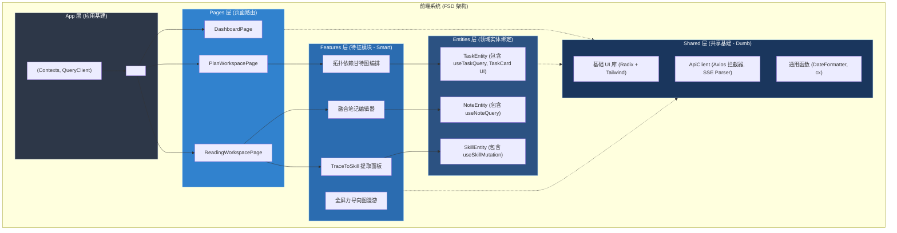
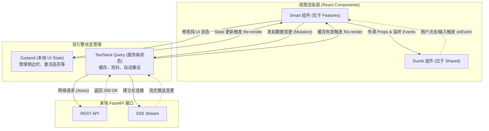

# 前端系统核心逻辑架构设计规范 v1.0

> [!IMPORTANT]
> 本文档基于 [《前后端功能边界与通信协议规范》](./frontend_backend_boundary_spec_v1.0.md) 编写。纯视觉与 UI 交互规范请参考 [《前端 UI 原型与交互规范》](./frontend_ux_design_spec_v1.0.md)。
> **架构核心基调**：摒弃传统前端项目组件与状态肆意耦合的乱象。鉴于项目复杂的拖拽编排、图谱渲染与服务端推送 (SSE) 特性，前端全面采用 **Feature-Sliced Design (FSD, 特征切片架构)** 范式，通过极致的**物理层级隔离**保障代码的可维护性与模块化。

## 一、 系统架构定位与技术栈选型

前端作为“本地化独立软件包”的用户代理界面，其运行特征为极低网络延迟与单节点直挂部署。

### 1. 核心选型决策
* **基础语言与应用框架**：**React 18 + TypeScript**
  * 依托其强大的生态支撑复杂的 DOM 操控与视图渲染（如力导向图谱、流式 Markdown）。
* **构建发布与部署策略**：**Vite SPA 纯静态化 (Static Host)**
  * 完全剔除 Node.js 服务端渲染 (SSR)。Vite 极速打包出 `dist`，生产态交由后端的 FastAPI 通过 `StaticFiles` 同域直接挂载，免除任何跨域 (CORS) 烦恼。开发态则依赖 Vite Dev Server Proxy。
* **双重状态管理驱动引擎**：
  * **服务端状态同步**：**TanStack Query (React Query)**。位于前端实体层，接管所有 Fetch/REST/SSE 请求，处理缓存命中、并发竞态、加载态展示与失败重试。
  * **客户端 UI 状态**：**Zustand**。轻量级原子化 Store，仅负责本地无持久化诉求的交互状态（如面板折叠、全局主题、高亮焦点）。
* **样式与无头组件系统**：**Tailwind CSS + Radix UI**
  * 放弃重型组件库，通过 Headless UI 保留底层无障碍访问与弹出层逻辑，外观完全由 Tailwind 结合 Figma Design Tokens 映射。

---

## 二、 核心架构解构 (基于 Feature-Sliced Design)

> [!IMPORTANT]
> 遵循 FSD 范式，前端代码 (src) 严格按照**自底向上、单向依赖**的原则分为五大物理层级。**上层可以引用下层，下层绝不允许反向引用上层，同层之间尽量解耦。**

| 架构分层 (自上向下) | 核心定位与职责 | 设计约束与特点 |
| :--- | :--- | :--- |
| **1. App (应用层)** | **系统初始化底座** 提供全局 Context 注入（Theme, QueryClient）、路由树 (Router) 挂载、全局异常捕获 (ErrorBoundary)。 | 仅做组装装配，严禁包含任何具体的业务 UI 代码。 |
| **2. Pages (页面层)** | **路由级视图容器** 基于路由路径组装页面。将不同 Feature 模块组装进 Layout 骨架中。 | **无自身逻辑**：本质上是一个“乐高拼装台”，仅通过组合下层的 Features 来呈现页面。 |
| **3. Features (特性层)** | **业务逻辑的心脏 (Smart Components)** 按领域（如 auth, plan, graph）高内聚打包代码。承载具体的用户交互用例，包含自身专属的 Hook 和 Store。 | **高度内聚**：某个 Feature 的组件只能调用自己领域或下游 Entities 的接口，禁止跨 Feature 交叉引用。 |
| **4. Entities (实体层)** | **业务模型在前端的投影** 对齐后端的 DDD 实体（如 Task, Note）。封装该实体相关的 React Query 钩子 (API 层)、Zustand 切片及基础卡片展示。 | **与业务脱钩**：它只知道“数据长什么样、怎么获取”，不关心“数据被用来干什么交互”。 |
| **5. Shared (共享层)** | **通用技术基建 (Dumb Components)** 纯粹的 UI 积木（Button, Input, Modal）、通用工具函数 (Utils)、底层 Axios/Fetch 实例封装。 | **绝对纯洁**：没有任何业务属性，禁止引入 Entities 或 Features。完全靠 Props 驱动。 |

---

## 三、 核心架构图解 (Architecture Diagrams)

### 1. FSD 系统全局架构拓扑图 (Frontend Layering)
展示单向依赖限制，确保前端项目不会演化为面条代码。

### 2. 状态机与数据流拓扑 (State Data Flow)
前端彻底抛弃传统的 Redux 全局树，采用“双驱动模型”处理数据闭环。

---

## 四、 对齐核心 I/O 流的职责流转映射

为了与后端领域的职责划分对应，以下定义了前端接收用户指令后，在 FSD 各层中向下穿透的核心流转路径。

| 核心交互链路 | 前端内部 FSD 架构流转穿透路径 (Layer Flow) |
| :--- | :--- |
| **划词高亮写笔记** | `Shared` (用户在 PDF 阅读器划词，触发 onSelect) -> `Features/Reading` (阅读器捕捉选区，构造锚点对象) -> `Entities/Note` (调用 useCreateNote 钩子发起 Mutation) -> `Shared/API` (发送 POST 请求至后端)。 |
| **基于拓扑的任务拖拽重排** | `Shared` (dnd-kit 捕捉拖拽放置，计算列内坐标差) -> `Features/Plan` (甘特图组件接管校验，计算新前置依赖树) -> `Entities/Task` (调用 useRescheduleTask 钩子提交) -> 乐观更新 UI 等待后端响应。 |
| **Trace-to-Skill AI 流式编译** | `Features/Skill` (点击触发提炼) -> `Shared/API` (建立 EventSource 监听) -> `Entities/Skill` (接收 SSE 片段并实时写入 Zustand 临时草稿缓存) -> UI 层根据状态机逐步渲染出骨架屏与最终卡片。 |
| **知识图谱的漫游与悬浮溯源** | `Entities/Graph` (首次挂载即利用 React Query 请求图谱全量轻快照并放入 Cache) -> `Features/GraphCanvas` (将快照送入 react-force-graph 渲染画布) -> 用户点击节点 -> 触发 `Zustand` 的全局 `activePeekNodeId` 状态变更 -> 呼出毛玻璃浮窗。 |
