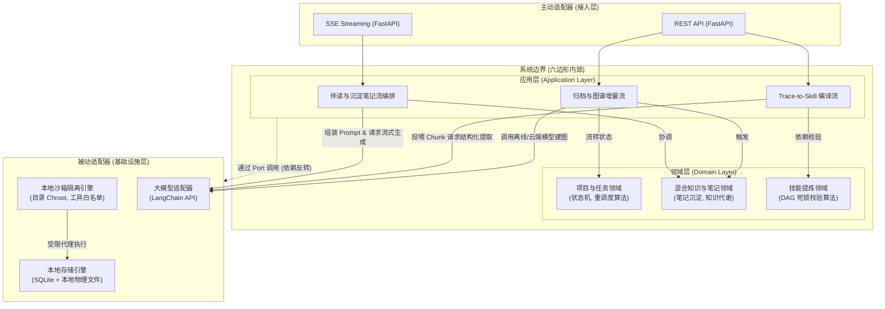
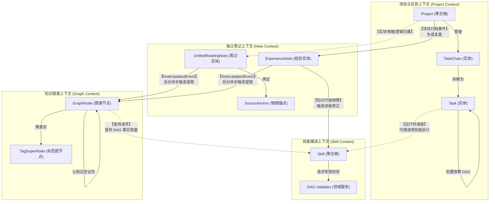
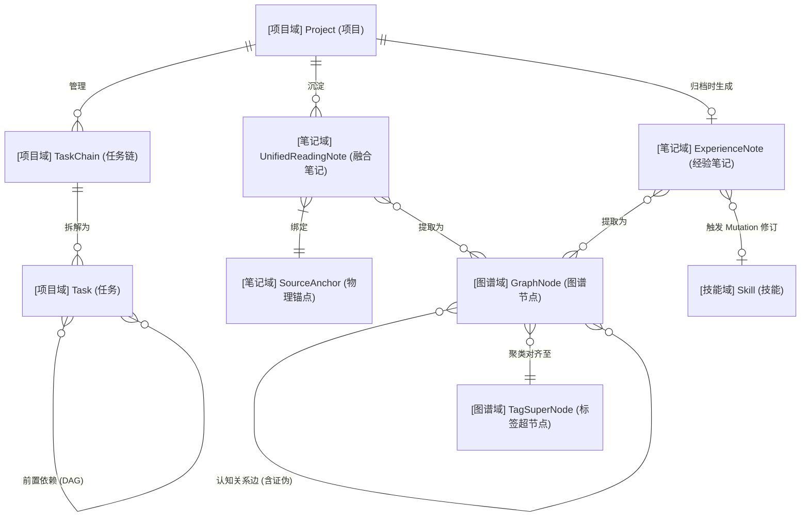

# 后端系统核心模块架构设计规范 v1.0

> [!IMPORTANT]
> 本文档基于 [《前后端功能边界与通信协议规范》](./frontend_backend_boundary_spec_v1.0.md) 以及 [《系统业务建模》](../03_business_modeling/business_model.md) 编写。
> **架构核心基调**：摒弃传统中心化 SaaS Web 服务架构，系统以**本地化独立软件包 (Local-First Software Package)** 的形态运行。根据最新技术裁决，后端遵循**六边形架构 (Hexagonal Architecture)** 与**领域驱动设计 (DDD)** 规范，将纯业务逻辑与底层技术支撑（如隔离沙箱、存储机制）严格物理解耦。

## 一、 系统架构定位与技术栈选型

考虑到系统的强隐私要求、离线运行诉求以及“开箱即用”的数据迁移体验，后端系统采取轻量级嵌入式设计。

### 1. 核心选型决策
* **基础语言与应用框架**：**Python + FastAPI**
  * 完美支持异步并发与 SSE (Server-Sent Events) 流式输出，无缝接入 Python 原生 AI 生态。
* **AI 调度引擎**：**LangChain + LangGraph**
  * 用于编排复杂的伴读、提炼编译逻辑及 RAG 工作流；依托 LangGraph 支撑“人机协同沙箱 (Human-in-the-loop)”的状态流转。
* **数据存储与持久化**：**项目制本地物理文件夹 + SQLite**
  * 抛弃中心化数据库，所有业务实体（笔记、图谱节点、配置）存放在独立的物理 `.sqlite` 文件中，落于对应的 Project 文件夹下，实现极简数据迁移。
* **异步守护队列**：**Python 内置异步队列 (`asyncio`)**
  * 无须部署 RabbitMQ 等外部中间件，直接在后台守护进程中处理闲时构建任务。

---

## 二、 核心架构解构 (基于六边形架构)

遵循端口与适配器模式，系统自内向外严格分为四个层级，彻底将“业务大脑”与“技术肌肉（沙箱、存储等）”剥离。

### 1. 领域层 (Domain Layer) - 纯业务逻辑
系统的心脏，绝对屏蔽任何外部技术实现细节（无框架依赖、无大模型依赖、无文件 I/O）。本层细分为“实体 (Entity)”与“领域服务 (Domain Service)”：
* **实体 (Entities)**：定义 `Unified Reading Note`、`Experience Note` 与 `Skill` 等核心数据结构。
* **无状态领域服务 (Domain Services)**：
  * **拓扑与调度服务**：封装有向无环图 (DAG) 拓扑排序算法以处理沙箱死锁阻断，以及计算逾期顺延。
  * **跨域同步服务 (事件驱动)**：定义诸如 `NoteUpdatedEvent` 的领域事件，实现独立笔记域 (Note Domain) 与图谱域 (Graph Domain) 的完全异步解耦。

### 2. 应用层 (Application Layer) - 用例与智能编排
充当系统外观，协调领域对象与基础设施，对外暴露业务用例 (Use Cases)。**本层的一个核心职责是作为“智能编排器”，所有的 LangChain/LangGraph 工作流均收敛于此，以此保证核心领域层对大模型框架零依赖**。
* **伴读与沉淀笔记流编排 (LangGraph)**：定义智能体状态机，协调划词输入、注入上下文、调用底层 LLM 生成解答，并落盘为阅读笔记实体。
* **Trace-to-Skill 编译流编排**：编排“拉取数据 -> 投喂 LLM 提取大纲 -> 调用领域层执行 DAG 逻辑校验 -> 经由沙箱端口写入文件”的端到端防呆流程。
* **依赖反转与流程组装**：通过定义 Port 接口 (如 `SandboxPort`, `NoteRepository`)，利用依赖注入 (DI) 在运行时组装基础组件，协调增量建图等任务。

### 3. 基础设施层 (Infrastructure Layer) - 技术支撑与被动适配器
> **核心设计重构**：将系统安全性（沙箱隔离）与物理 I/O 作为独立的技术组件抽离，应用层仅通过接口（Port）调用。

* **本地沙箱隔离引擎 (Local Sandbox Engine)**：
  * **职责**：作为纯技术底座，提供受限的代码执行环境与文件 I/O 安全拦截。
  * **实现机制 (PA-05 落地方案)**：实现目录越权拦截 (Chroot 机制) 确保文件操作不跃出 `projectId` 根目录。提供受严格控制的 LangChain Tool 白名单注册器，阻断一切非授权 Shell 执行。应用层的任何编译落地与 Agent 交互都必须包裹在此引擎内运行。
* **本地存储引擎 (Local Storage Engine)**：
  * **File-first 策略 (真理之源)**：笔记内容完全作为标准 Markdown 文件真实物理落盘，保证其 100% 的外部系统可移植性。
  * **SQLite 缓存与图谱**：SQLite 仅作为笔记元数据的快速检索“缓存库”，同时持久化向量扩展 (sqlite-vec) 支撑的图谱网络。
* **大模型适配器 (LLM Adapter)**：
  * 封装对外部 LLM (如 OpenAI、Ollama) 的 API 调用，进行网络请求与 Token 限流管理。

### 4. 接入层 (Driving Adapters) - 主动适配器
* **FastAPI Router**：暴露 RESTful API 响应前端拖拽与提交，暴露 SSE (Server-Sent Events) 服务提供流式对话推流。

---

## 三、 核心架构图解 (Architecture Diagrams)

### 1. 六边形系统全局架构图 (Hexagonal Architecture)
展示内外层的解耦关系，突出业务逻辑（核心域）与技术基础设施（沙箱、存储）的物理抽离。

### 2. 限界上下文与实体边界交互图 (Bounded Context Map)
展示各个限界上下文（Domain）的边界划分、内部核心实体，以及跨上下文（Context Mapping）的事件流转与交互契约。

### 3. 核心领域实体关系图 (Domain ERD)
展示核心领域层在 SQLite 中的数据模型逻辑关联，其中特别强化了“经验反哺”与“知识代谢”的链路。

---

## 四、 对齐核心 I/O 流的职责映射

基于解耦后的架构，后端在响应前端触发的核心链路时的层级流转如下：

| 交互核心流 | 架构层级流转路径 (Layer Flow) |
| :--- | :--- |
| **划词写笔记与一键转存** | `接入层` 鉴权 -> `应用层` 编排入库逻辑 -> `领域层` 校验笔记实体与锚点合法性 -> `本地存储引擎` 执行 SQLite 落盘。 |
| **Trace-to-Skill 编译流** | `接入层` SSE 建立 -> `应用层` 协调大模型抽取与推流 -> `领域层` 进行步骤 DAG 排序 -> `沙箱引擎` 拦截非法 I/O 后安全落盘。 |
| **半自动重调度计算流** | `接入层` REST 接收拖拽 -> `应用层` 发起重排 -> `领域层` 拓扑遍历计算出所有受影响的任务链新 Deadline -> `存储引擎` 事务落盘。 |
| **归档与经验沉淀流** | `接入层` 接收复盘 -> `应用层` 挂载异步任务 -> `领域层` 检测认知缺陷产生 Mutation -> `沙箱引擎` 安全生成修改草稿。 |
