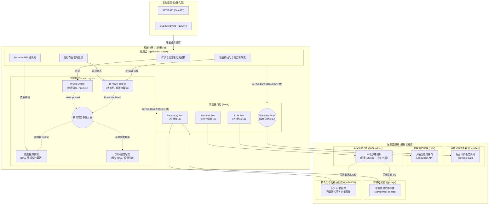
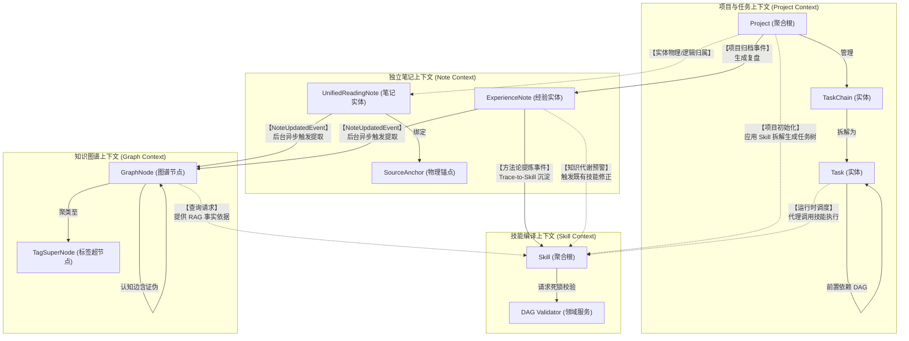
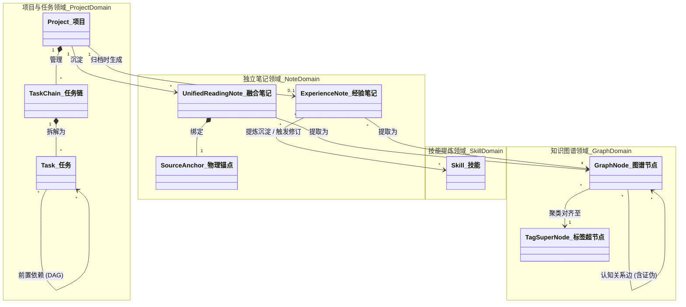

# 后端系统核心模块架构设计规范 v1.0

> [!IMPORTANT]
> 本文档基于 [《前后端功能边界与通信协议规范》](./frontend_backend_boundary_spec_v1.0.md) 以及 [《系统业务建模》](../03_business_modeling/business_model.md) 编写。
> **架构核心基调**：摒弃传统中心化 SaaS Web 服务架构，系统以**本地化独立软件包 (Local-First Software Package)** 的形态运行。根据最新技术裁决，后端遵循**六边形架构 (Hexagonal Architecture)** 与**领域驱动设计 (DDD)** 规范，将纯业务逻辑与底层技术支撑（如隔离沙箱、存储机制）严格物理解耦。

## 一、 系统架构定位与技术栈选型

考虑到系统的强隐私要求、离线运行诉求以及“开箱即用”的数据迁移体验，后端系统采取轻量级嵌入式设计。

### 1. 核心选型决策
* **基础语言与应用框架**：**Python + FastAPI**
  * 完美支持异步并发与 SSE (Server-Sent Events) 流式输出，无缝接入 Python 原生 AI 生态。
* **AI 调度引擎**：**LangChain + LangGraph**
  * 用于编排复杂的伴读、提炼编译逻辑及 RAG 工作流；依托 LangGraph 支撑“人机协同沙箱 (Human-in-the-loop)”的状态流转。
* **数据存储与持久化**：**项目制本地物理文件夹 + SQLite**
  * 抛弃中心化数据库，所有业务实体（笔记、图谱节点、配置）存放在独立的物理 `.sqlite` 文件中，落于对应的 Project 文件夹下，实现极简数据迁移。
* **异步守护队列**：**Python 内置异步队列 (`asyncio`)**
  * 无须部署 RabbitMQ 等外部中间件，直接在后台守护进程中处理闲时构建任务。

---

## 二、 核心架构解构 (基于六边形架构)

> [!IMPORTANT]
> 遵循端口与适配器模式，系统自内向外严格分为四个层级，核心目标是**彻底将“业务大脑”与“技术底座（沙箱、存储等）”剥离**。

| 架构分层 (自内向外) | 核心定位与职责 | 设计约束与特点 |
| :--- | :--- | :--- |
| **1. 领域层 (Domain Layer)** | **纯业务逻辑大脑** 定义核心实体（如笔记、技能、任务链）与领域服务（如拓扑排序、跨域事件）。 | **最严格约束**：绝对屏蔽框架、LLM 和物理 I/O，保持最内层业务纯粹性。 |
| **2. 应用层 (Application Layer)** | **业务外观与智能中枢** 作为工作流编排器，收敛所有的 LangGraph Agent 交互与业务用例协调。 | **依赖反转**：通过接口 (Port) 调用基础设施，不对底层组件进行硬编码。 |
| **3. 基础设施层 (Infrastructure Layer)** | **技术支撑底座 (被动适配器)** 提供具体技术实现：本地沙箱隔离机制、文件/SQLite 存储引擎、大模型适配。 | **受控调用**：仅作为被动支撑方，负责数据持久化、安全性拦截与外部通信。 |
| **4. 接入层 (Driving Adapters)** | **通信入口 (主动适配器)** 依托 FastAPI 提供 RESTful API 与 SSE 流式通信推流。 | **边界转化**：负责接收前端触发，将外部数据转化为内部领域语言并驱动应用层。 |

> [!NOTE]
> **防腐接口 (Ports) 的代码放置规范 (契约编程)**
> 遵循“务实派分层”理念，防腐接口的定义完全归属于“调用方（即六边形内部）”：
> * **领域级接口 (Domain Ports)**：如 `RepositoryPort`（仓储接口）。定义在 **Domain 层**。允许 Domain Service 依赖这些接口执行必要的数据校验，由基础设施层负责实现和运行时注入。
> * **应用级接口 (Application Ports)**：如 `LLMPort`（模型通信）、`SandboxPort`（沙箱隔离）。定义在 **App 层**。由业务用例 (Use Cases) 统筹调用，Domain 层对这些纯技术驱动的能力完全无感知。

---

## 三、 核心架构图解 (Architecture Diagrams)

### 1. 六边形系统全局架构图 (Hexagonal Architecture)
展示内外层的解耦关系，突出业务逻辑（核心域）与技术基础设施（沙箱、存储）的物理抽离。

### 2. 限界上下文与实体边界交互图 (Bounded Context Map)
展示各个限界上下文（Domain）的边界划分、内部核心实体，以及跨上下文（Context Mapping）的事件流转与交互契约。

### 3. 核心领域实体关系图 (Domain ERD)
展示核心领域层在 SQLite 中的数据模型逻辑关联，其中特别强化了“经验反哺”与“知识代谢”的链路。

---

## 四、 对齐核心 I/O 流的职责映射

基于解耦后的架构，后端在响应前端触发的核心链路时的层级流转如下：

| 交互核心流 | 架构层级流转路径 (Layer Flow) |
| :--- | :--- |
| **划词写笔记与一键转存** | `接入层` 鉴权 -> `应用层` 编排入库逻辑 -> `领域层` 校验笔记实体与锚点合法性 -> `本地存储引擎` 执行 SQLite 落盘。 |
| **Trace-to-Skill 编译流** | `接入层` SSE 建立 -> `应用层` 协调大模型抽取与推流 -> `领域层` 进行步骤 DAG 排序 -> `沙箱引擎` 拦截非法 I/O 后安全落盘。 |
| **半自动重调度计算流** | `接入层` REST 接收拖拽 -> `应用层` 发起重排 -> `领域层` 拓扑遍历计算出所有受影响的任务链新 Deadline -> `存储引擎` 事务落盘。 |
| **归档与经验沉淀流** | `接入层` 接收复盘 -> `应用层` 挂载异步任务 -> `领域层` 检测认知缺陷产生 Mutation -> `沙箱引擎` 安全生成修改草稿。 |
