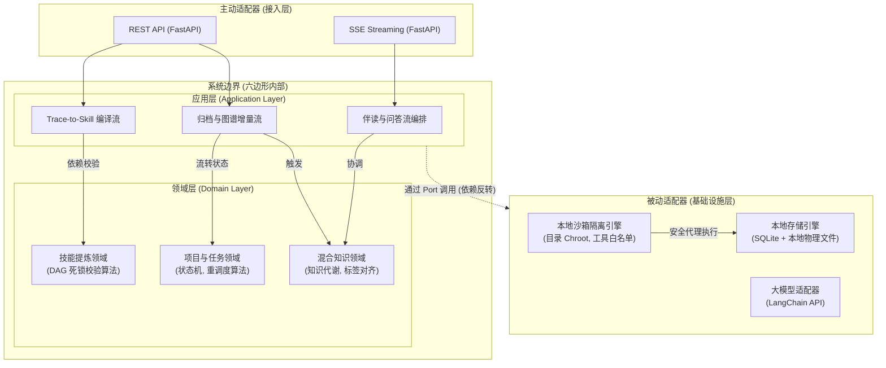
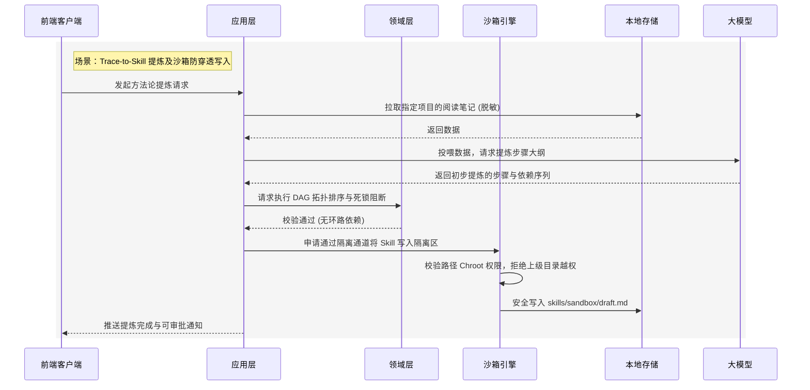

# 后端系统核心模块架构设计规范 v1.0

> [!IMPORTANT]
> 本文档基于 [《前后端功能边界与通信协议规范》](./frontend_backend_boundary_spec_v1.0.md) 以及 [《系统业务建模》](../03_business_modeling/business_model.md) 编写。
> **架构核心基调**：摒弃传统中心化 SaaS Web 服务架构，系统以**本地化独立软件包 (Local-First Software Package)** 的形态运行。根据最新技术裁决，后端遵循**六边形架构 (Hexagonal Architecture)** 与**领域驱动设计 (DDD)** 规范，将纯业务逻辑与底层技术支撑（如隔离沙箱、存储机制）严格物理解耦。

## 一、 系统架构定位与技术栈选型

考虑到系统的强隐私要求、离线运行诉求以及“开箱即用”的数据迁移体验，后端系统采取轻量级嵌入式设计。

### 1. 核心选型决策
* **基础语言与应用框架**：**Python + FastAPI**
  * 完美支持异步并发与 SSE (Server-Sent Events) 流式输出，无缝接入 Python 原生 AI 生态。
* **AI 调度引擎**：**LangChain + LangGraph**
  * 用于编排复杂的伴读、提炼编译逻辑及 RAG 工作流；依托 LangGraph 支撑“人机协同沙箱 (Human-in-the-loop)”的状态流转。
* **数据存储与持久化**：**项目制本地物理文件夹 + SQLite**
  * 抛弃中心化数据库，所有业务实体（笔记、图谱节点、配置）存放在独立的物理 `.sqlite` 文件中，落于对应的 Project 文件夹下，实现极简数据迁移。
* **异步守护队列**：**Python 内置异步队列 (`asyncio`)**
  * 无须部署 RabbitMQ 等外部中间件，直接在后台守护进程中处理闲时构建任务。

---

## 二、 核心架构解构 (基于六边形架构)

遵循端口与适配器模式，系统自内向外严格分为四个层级，彻底将“业务大脑”与“技术肌肉（沙箱、存储等）”剥离。

### 1. 领域层 (Domain Layer) - 纯业务逻辑
系统的心脏，绝对屏蔽任何外部技术实现细节（无框架依赖、无文件 I/O）。
* **项目与任务领域 (Project & Task Domain)**：封装项目状态流转规则、Task Chain 的逾期计算与拓扑重调度算法。
* **混合知识领域 (Hybrid Knowledge Domain)**：定义 `Unified Reading Note` 与 `Experience Note` 的结构。封装标签对齐、知识新陈代谢（Falsifies 被证伪关系衍生）的业务策略规则。
* **技能提炼领域 (Skill Domain)**：定义 Skill 模板结构。封装有向无环图 (DAG) 拓扑排序算法，专门处理卡片依赖的死锁阻断（PA-03）纯逻辑校验。

### 2. 应用层 (Application Layer) - 用例与流程编排
充当系统外观，协调领域对象与基础设施，对外暴露业务用例 (Use Cases)。
* **伴读与问答流编排**：协调输入流、注入上下文并调用大模型生成回复。
* **Trace-to-Skill 编译流编排**：编排“拉取源数据 -> LLM 提炼 -> 领域层 DAG 校验 -> 沙箱写入”的端到端流程。
* **项目归档与图谱建图流编排**：挂载异步队列，协调增量建图的离线运算流程。

### 3. 基础设施层 (Infrastructure Layer) - 技术支撑与被动适配器
> **核心设计重构**：将系统安全性（沙箱隔离）与物理 I/O 作为独立的技术组件抽离，应用层仅通过接口（Port）调用。

* **本地沙箱隔离引擎 (Local Sandbox Engine)**：
  * **职责**：作为纯技术底座，提供受限的代码执行环境与文件 I/O 安全拦截。
  * **实现机制 (PA-05 落地方案)**：实现目录越权拦截 (Chroot 机制) 确保文件操作不跃出 `projectId` 根目录。提供受严格控制的 LangChain Tool 白名单注册器，阻断一切非授权 Shell 执行。应用层的任何编译落地与 Agent 交互都必须包裹在此引擎内运行。
* **本地存储引擎 (Local Storage Engine)**：
  * 封装 SQLite 关系操作及向量扩展 (sqlite-vec)，对接知识检索请求。
  * 封装底层的文件系统句柄，管理 Markdown 笔记及图片的落盘。
* **大模型适配器 (LLM Adapter)**：
  * 封装对外部 LLM (如 OpenAI、Ollama) 的 API 调用，进行网络请求与 Token 限流管理。

### 4. 接入层 (Driving Adapters) - 主动适配器
* **FastAPI Router**：暴露 RESTful API 响应前端拖拽与提交，暴露 SSE (Server-Sent Events) 服务提供流式对话推流。

---

## 三、 核心架构图解 (Architecture Diagrams)

### 1. 六边形系统全局架构图 (Hexagonal Architecture)
展示内外层的解耦关系，突出业务逻辑（核心域）与技术基础设施（沙箱、存储）的物理抽离。

### 2. 六边形解耦下的核心交互流转图 (Sequence Diagram)
以技能提炼场景为例，演示基础设施层（沙箱）、应用层（流程编排）与领域层（核心业务算法）是如何分工协作的。

---

## 四、 对齐核心 I/O 流的职责映射

基于解耦后的架构，后端在响应前端触发的核心链路时的层级流转如下：

| 交互核心流 | 架构层级流转路径 (Layer Flow) |
| :--- | :--- |
| **划词写笔记与一键转存** | `接入层` 鉴权 -> `应用层` 编排入库逻辑 -> `领域层` 校验笔记实体与锚点合法性 -> `本地存储引擎` 执行 SQLite 落盘。 |
| **Trace-to-Skill 编译流** | `接入层` SSE 建立 -> `应用层` 协调大模型抽取与推流 -> `领域层` 进行步骤 DAG 排序 -> `沙箱引擎` 拦截非法 I/O 后安全落盘。 |
| **半自动重调度计算流** | `接入层` REST 接收拖拽 -> `应用层` 发起重排 -> `领域层` 拓扑遍历计算出所有受影响的任务链新 Deadline -> `存储引擎` 事务落盘。 |
| **归档与经验沉淀流** | `接入层` 接收复盘 -> `应用层` 挂载异步任务 -> `领域层` 检测认知缺陷产生 Mutation -> `沙箱引擎` 安全生成修改草稿。 |
