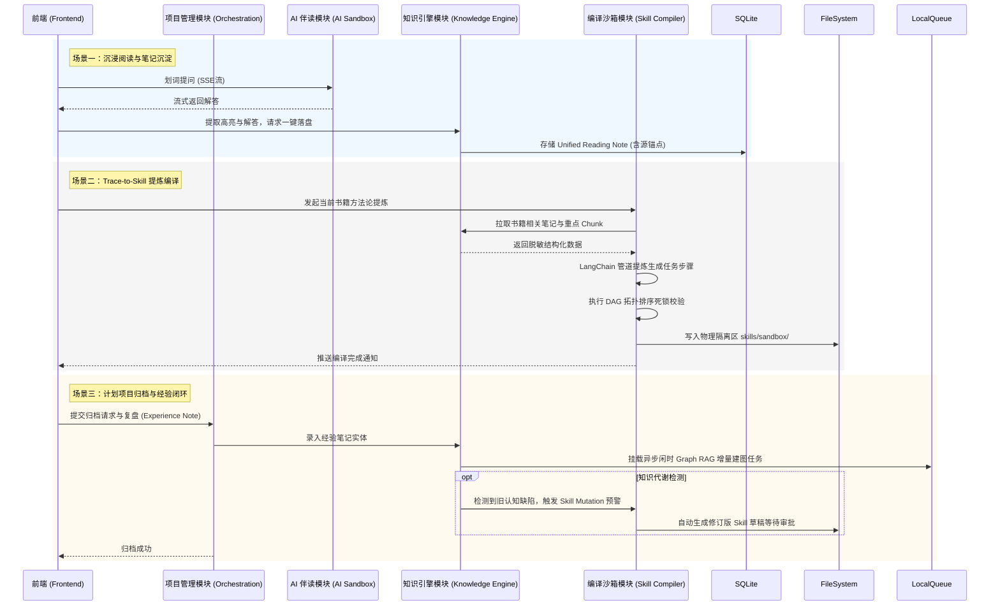

# 后端系统核心模块架构设计规范 v1.0

> [!IMPORTANT]
> 本文档基于 [《前后端功能边界与通信协议规范》](./frontend_backend_boundary_spec_v1.0.md) 以及 [《系统业务建模》](../03_business_modeling/business_model.md) 编写。
> **架构核心基调**：摒弃传统中心化 SaaS Web 服务架构，系统以**本地化独立软件包 (Local-First Software Package)** 的形态运行。后端服务作为本地引擎嵌入，在保障极简分发与数据隐私的前提下，承载复杂的 AI 工作流与核心业务模型。

## 一、 系统架构定位与技术栈选型

考虑到系统的强隐私要求、离线运行诉求以及“开箱即用”的数据迁移体验，后端系统采取轻量级嵌入式设计。

### 1. 核心选型决策
* **基础语言与应用框架**：**Python + FastAPI**
  * 完美支持异步并发与 SSE (Server-Sent Events) 流式输出，并无缝接入 Python 丰富的原生 AI 生态。
* **AI 调度引擎**：**LangChain + LangGraph**
  * 用于编排复杂的伴读、提炼编译逻辑及 RAG 工作流；依托 LangGraph 支撑“人机协同沙箱 (Human-in-the-loop)”的状态流转。
* **数据存储与持久化**：**项目制本地物理文件夹 + SQLite**
  * 所有业务实体（笔记、图谱节点、配置）存放在独立的物理 `.sqlite` 数据库文件中，放置于用户指定的 Project 文件夹下，数据迁移仅需操作系统层面的文件夹拷贝。
* **任务调度**：**Python 内置异步队列 (`asyncio`)**
  * 无须部署 RabbitMQ 等外部中间件，直接在后台守护进程中处理闲时构建任务。

---

## 二、 核心业务逻辑架构分解 (Business Logical Architecture)

结合业务建模，后端按照**领域驱动设计 (DDD)** 的思想划分为以下四大核心业务模块，各模块内部封闭其状态流转逻辑。

### 1. 项目与任务生命周期管理模块 (Project & Task Orchestration)
> **业务职责**：管理“阅读项目”与“计划项目”的容器生命周期，维护任务状态机。

* **容器隔离与挂载**：根据前端传入的 `projectId`，动态挂载本地对应的项目文件夹。所有后续的 CRUD 读写操作均限定在此文件夹上下文中。
* **任务依赖链状态机**：维护 `PENDING -> RUNNING -> COMPLETED` 的单向流转。特别提供**半自动重调度算法引擎**：当逾期或顺延指令触发时，递归计算任务依赖链（Task Chain），更新受影响的后继任务 Deadline，并以事务方式批量落盘。
* **超时休眠守护 (PA-04)**：后台监控会话心跳。若检测到 24 小时无交互，主动释放 LLM 会话资源与上下文内存，将未完成的 Task Chain 断点状态序列化至 SQLite 中。再次唤醒时执行反序列化重载。

### 2. 混合知识引擎模块 (Hybrid Knowledge Engine)
> **业务职责**：收口管理“输入态”的阅读笔记与“输出态”的经验笔记，构建双擎知识网络。

* **融合笔记底座**：提供统一的底层数据结构，将来自用户划词的“主观高亮”与伴读 Agent 的“客观问答”统一为 `Unified Reading Note`。写入时强制绑定物理原文锚点（`source_anchor`），以支持前端的 Quick Peek 追溯。
* **Dense RAG 即时检索**：处理高频即时问答。基于文档切片构建向量数据（如使用 sqlite-vec 轻量扩展），支撑伴读 Agent 的即时上下文检索。
* **Graph RAG 闲时后台构建 (PA-02)**：
  * **增量抽取**：监听笔记与复盘数据的落盘事件，推入本地低频任务队列。利用闲置 CPU 周期，调用大模型提取实体关系，写入 SQLite 模拟的图谱表中。
  * **标签对齐与知识代谢**：定时任务扫描离散标签并对齐为超节点（Super Node）；若捕获到冲突的经验笔记，则向早期理论笔记插入“被证伪 (Falsifies)”关系边，自动降权。

### 3. Trace-to-Skill 提炼编译与沙箱模块 (Skill Compiler & Sandbox)
> **业务职责**：负责方法论的结构化提炼，以及保障知行转换的逻辑合法性。

* **三级漏斗提炼管道**：基于 LangChain 封装提取链路，接收宏观文本片段后，分步骤提取出 `SKILL.md` (含 YAML 元数据与任务步骤)。
* **依赖死锁阻断 (PA-03)**：接收沙箱编辑器的卡片连线数据，在后端利用有向无环图 (DAG) 算法执行**拓扑排序校验**。若发现环路（Cycle），立即抛出阻断异常，拒绝落盘至激活库。
* **经验驱动进化 (Skill Mutation)**：当【混合知识引擎】收到归档项目时提交的 `Experience Note`，且该经验指出了既有 Skill 的缺陷时，本模块自动在 `skills/sandbox/` 物理目录派生修订分支（Draft Branch），待用户审批迭代。

### 4. AI 伴读调度与特权沙箱模块 (AI Companion & Privilege Sandbox)
> **业务职责**：管控 LLM 交互行为，严守本地安全性红线。

* **SSE 流式分发中心**：通过 FastAPI `StreamingResponse` 与 LangChain `CallbackHandler`，将大模型的实时 Token 流转封装为标准 Server-Sent Events，驱动前端打字机渲染。
* **强制降权沙箱隔离 (PA-05)**：
  * **应用层工具白名单**：初始化 Agent 时，仅注入极少数安全的 Tool（如“阅读当前章节”、“查询特定节点”），**绝对禁用**如 `os.system` 或任意外部网络请求工具。
  * **目录越权拦截 (Chroot)**：拦截所有文件读写动作，在 Python 层进行路径规范化 (Path Normalization)。凡是超出当前挂载 `projectId` 文件夹树路径的操作，直接抛出非法越权错误。

---

## 三、 核心架构图解 (Architecture Diagrams)

为了更直观地呈现后端系统的结构边界与协作机制，以下提供“静态架构全局图”与“核心动态交互流转图”。

### 1. 系统全局架构图 (Static Architecture)
展示了前端、FastAPI 接入层、核心四大业务模块，以及与本地文件系统、大模型的层级调用关系。

```mermaid
graph TD
    %% 前端层
    subgraph Frontend [前端客户端 (Client)]
        UI[Vue/React UI 组件]
        Store[状态管理 & 本地防抖计算]
    end

    %% 后端 API 层
    subgraph APILayer [接入层 (FastAPI)]
        REST[RESTful API Router]
        SSE[SSE Streaming Router]
    end

    %% 核心业务模块层
    subgraph CoreModules [核心业务模块 (DDD Core)]
        PTO[项目与任务生命周期管理\nProject & Task Orchestration]
        HKE[混合知识引擎\nHybrid Knowledge Engine]
        SCS[提炼编译与沙箱\nSkill Compiler & Sandbox]
        ACS[AI 伴读与特权沙箱\nAI Companion & Privilege Sandbox]
    end

    %% 基础设施与外部调用
    subgraph Infra [本地基础设施 & LLM]
        SQLite[(项目专属 SQLite\n关系数据 + 向量)]
        FileSystem[(本地物理文件夹\nMarkdown/Assets)]
        LocalQueue[[asyncio 本地异步队列]]
        LLM((大模型 API\nLangChain 驱动))
    end

    %% 连线关系
    UI -->|HTTP POST/GET| REST
    UI -->|SSE Connection| SSE
    REST --> PTO
    REST --> HKE
    REST --> SCS
    SSE <-->|长连接推流| ACS
    SSE <-->|编译进度推流| SCS

    PTO -->|状态 CRUD| SQLite
    HKE -->|笔记与图谱 CRUD| SQLite
    HKE -->|发布任务| LocalQueue
    SCS -->|读写草稿| FileSystem
    ACS -->|严格受限读取| FileSystem
    
    HKE -->|知识提取| LLM
    SCS -->|逻辑编译| LLM
    ACS -->|对话推理| LLM
    
    LocalQueue -.->|后台闲时消费| HKE
```

### 2. 模块动态交互流转图 (Dynamic Interaction Flow)
展示在系统最核心的“学习->提炼->实战复盘”生命周期中，四大业务模块是如何协同工作的。



---

## 四、 对齐核心 I/O 流的职责交互矩阵

基于上述业务模块划分，后端如何响应前端触发的核心链路：

| 交互核心流 | 控制权边界 | 后端业务流转路径 |
| :--- | :--- | :--- |
| **划词写笔记与一键转存** | 前端防抖，调用 REST API | `混合知识引擎` 接收 Payload -> 落盘至 SQLite 融合笔记表 -> 触发轻量级事件给异步守护队列。 |
| **Trace-to-Skill 编译流** | 前端发起，后端推流 SSE | `提炼编译模块` 挂载 LangChain 提取管线 -> 流式输出进度 -> 生成 `SKILL.md` 至沙箱 -> 返回 `skillId`。 |
| **半自动重调度计算流** | 前端拖拽，触发 REST API | `生命周期管理模块` 读取任务依赖拓扑 -> 递归计算影响面 -> 批量更新 SQLite -> 返回新 Deadline 集合。 |
| **归档与经验沉淀流** | 前端提交复盘文本 | `混合知识引擎` 落盘经验实体 -> 推入图谱更新队列；`提炼编译模块` 若侦测到缺陷 -> 在沙箱生成 Skill 派生草稿。 |
| **全局图谱漫游追溯** | 前端点击节点查询 | `混合知识引擎` 依据 `nodeId` 联合查询 SQLite 中的实体及物理上下文锚点 -> 返回组装数据供前端渲染 Quick Peek 浮窗。 |
