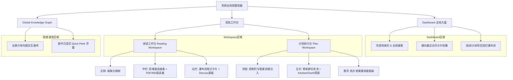

# 前端架构设计与交互规范 v1.1

> [!IMPORTANT]
> 本文档基于 [《交互链路与状态规范》](../04_interaction_design/flow_state_spec-v1.0.md) 与 [《业务模型规范》](../03_business_modeling/business_model.md) 推导，专为 **UI/UX 设计师** 与 **前端研发人员** 编写。
> **架构契约**：本文档采用严格的**“组件结构 -> 数据依赖 (输入) -> 交互事件 (输出)”**模型进行结构化表达，并明确了基于 Feature-Sliced 的**项目工程化目录与状态管理范式**，为后续开发奠定绝对的规范基石。

## 一、 核心页面布局与线框结构 (Layout & Wireframing)

> [!TIP]
> 界面原型设计需遵循“沉浸、无干扰”的排版原则，核心页面结构约束如下。

### 1. 全局视窗导航拓扑



### 2. 页面区域组件划分

| 页面模块 | 区域划分 | 核心组件与布局说明 |
| :--- | :--- | :--- |
| **Dashboard** <br/> (全局大盘与入口页) | **布局结构** | 顶部导航栏（含全局搜索与新建按钮） + 主内容区。 |
| | **主内容区** | 横向卡片轮播 (最近访问) + 双栏项目列表 (阅读项目 / 计划项目)。 |
| | **全局入口** | 提供明显的悬浮或固定按钮，用于一键呼出“全局知识图谱画布”。 |
| **Reading Workspace** <br/> (沉浸式阅读工作台) | **布局结构** | 自适应的双栏/三栏布局。 |
| | **左侧边栏** | 级联折叠的文档大纲树。 |
| | **中栏 (主阅读区)** | 顶部双维度进度条 + 居中的 PDF/Markdown 渲染容器。 |
| | **右栏 (读思面板)** | 瀑布流式融合笔记卡片列表 + 固定的 Discuss AI 输入框。 |
| **Global Knowledge Graph** <br/> (全局知识图谱) | **布局结构** | 全屏力导向图交互画布 (Force-directed Graph Canvas)。 |
| | **交互组件** | 漫游浮窗 (Quick Peek Overlay)：带有毛玻璃背景的居中悬浮窗，用于无跳转溯源。 |
| **Plan Workspace** <br/> (计划项目执行台) | **布局结构** | 顶部控制栏（含智能技能注入入口） + 核心任务视图（看板 Kanban 或 甘特图 Gantt）。 |
| | **任务流视图** | 注入技能时采用分层渐进式骨架屏渲染任务树；支持连带依赖拖拽排期。 |

---

## 二、 核心 UI 组件结构化定义 (Component I/O Spec)

> [!IMPORTANT]
> 前端组件必须严格遵循以下状态输入（Props/State）与交互输出（Events/Emits）契约，以保证前后端数据流转的一致性。

### 1. 双维度动态进度条 (Dual-metric Progress Bar)

> 功能描述：用于可视化展示用户的阅读与内化进度，支持联动跳转。

| 数据类型 | 字段名 | 类型 | 说明 |
| :--- | :--- | :--- | :--- |
| **Props** (输入) | `chapterReadRatio` | `Number` | 已读章节比例（0-1）。 |
| | `chunkParsedRatio` | `Number` | 文档切片解析比例（0-1）。 |
| | `chapterMarkers` | `Array` | 章节物理坐标系数组，用于渲染刻度。 |
| **Emits** (输出) | `onMarkerClick` | `Event` | 用户点击特定刻度，触发阅读器向对应章节平滑滚动。 |
| | `onHoverMarker` | `Event` | 触发悬浮气泡，展示章节标题与预估耗时。 |

### 2. 融合笔记卡片 (Unified Note Card)

> 功能描述：承载主观笔记、原文高亮引用与 AI 辅导上下文的统一组件。

| 数据类型 | 字段名 | 类型 | 说明 |
| :--- | :--- | :--- | :--- |
| **Props** (输入) | `noteId` | `String` | 笔记唯一标识。 |
| | `sourceAnchor` | `Object` | 物理原文锚点数据（包含页码、段落ID、特征字符）。 |
| | `quoteContent` | `String` | 原文引文内容（呈现为微透明浅绿背景、斜体且不可编辑）。 |
| | `userContent` | `String` | 富文本内容。 |
| | `isReadOnly` | `Boolean` | 级联项目状态，决定卡片是否置灰且禁用输入。 |
| **Emits** (输出) | `onLocateSource` | `Event` | 点击卡片头部定位按钮，派发物理追溯事件。 |
| | `onContentChange` | `Event` | 富文本内容变更时触发，前端须外层包裹 **500ms 防抖** 后再发请求。 |

### 3. 微型弱打扰气泡 (Recommendation Bubble)

> 功能描述：章节末尾或任务异常时的弱打扰提示，必须包含渐进式动效。

| 数据类型 | 字段名 | 类型 | 说明 |
| :--- | :--- | :--- | :--- |
| **Props** (输入) | `triggerCondition`| `Boolean` | 渲染触发开关（如：阅读滚动超过 95%）。 |
| | `message` | `String` | 提示文本（如“AI导师已整理本章方法论”）。 |
| | `actionType` | `String` | 点击后的动作映射策略。 |
| **Emits** (输出) | `onActionClick` | `Event` | 用户接受推荐，展开右侧对应面板或执行操作。 |
| | `onDismiss` | `Event` | 离开触发区域后自动触发的销毁事件。 |

### 4. 拓扑排序卡片节点 (Topological Node Card)

> 功能描述：沙箱编辑器中的任务编排节点，支持拖拽连线。

| 数据类型 | 字段名 | 类型 | 说明 |
| :--- | :--- | :--- | :--- |
| **Props** (输入) | `nodeId` | `String` | 节点标识。 |
| | `hasCycleError` | `Boolean` | 当前节点是否死锁。若为 `true`，激活红色高斯模糊与高频抖动动效，**强制禁用批准入库按钮 (PA-03)**。 |
| | `dependencies` | `Array` | 前置节点列表。 |
| **Emits** (输出) | `onConnectionCreate`| `Event` | 用户拖拽建立连线，触发外层画布的拓扑排序算法验证。 |
| | `onConnectionDelete`| `Event` | 断开连线，触发外层算法重新校验。 |

### 5. 经验复盘与变异浮窗 (Experience & Mutation Modal)

> 功能描述：归档阶段弹出的富文本无边框记录卡，用于引导用户沉淀实战复盘。

| 数据类型 | 字段名 | 类型 | 说明 |
| :--- | :--- | :--- | :--- |
| **Props** (输入) | `isDrafting` | `Boolean` | 是否正在后台静默生成技能变异草稿 (Skill Mutation)。 |
| **Emits** (输出) | `onSubmitExperience` | `Event` | 提交避坑指南，触发后台 Experience Note 实体写入与图谱增量同步。 |

### 6. 知识图谱节点 (Graph Node)

> 功能描述：全局知识图谱画布中的原子节点。

| 数据类型 | 字段名 | 类型 | 说明 |
| :--- | :--- | :--- | :--- |
| **Props** (输入) | `nodeData` | `Object` | 包含节点标签名称及元数据。 |
| | `isFalsified` | `Boolean` | 若该节点在最新经验中被“证伪”，则渲染为 40% Opacity 的视觉衰变态。 |
| **Emits** (输出) | `onClickNode` | `Event` | 用户点击节点，直接向外派发 `onQuickPeek` 呈现悬浮上下文。 |

### 7. 计划执行任务卡片 (Plan Task Card)

> 功能描述：承载计划项目中的原子执行步骤，支持状态扭转与异常重调度。

| 数据类型 | 字段名 | 类型 | 说明 |
| :--- | :--- | :--- | :--- |
| **Props** (输入) | `taskId` | `String` | 任务实体唯一标识。 |
| | `status` | `Enum` | `PENDING`, `RUNNING`, `COMPLETED`, `BLOCKED` (逾期异常状态)。 |
| | `deadline` | `Timestamp`| 任务截止时间。若逾期且未完成，卡片底色及时间字体标红闪烁。 |
| **Emits** (输出) | `onStatusChange` | `Event` | 用户标记任务完成，触发后台状态更新与后续依赖项自动解锁。 |
| | `onReschedule` | `Event` | 呼出悬浮面板，提供基于拓扑排序的“一键顺延”或“甘特图手动微调”。 |

---

## 三、 状态响应与视觉映射机制 (State & Visual Mapping)

> [!TIP]
> 组件的 `isReadOnly` 与 `hasError` 等输入依赖来源于全局状态机，确保以下视觉映射与状态机同步。

| 实体全局状态 (State Input) | 界面视觉与交互限制 (Visual Output) |
| :--- | :--- |
| **Project.Status = `ACTIVE`** | 正常交互配色，所有组件处于激活态。 |
| **Project.Status = `SUSPENDED`**| 对应工作区被**毛玻璃遮罩** (`backdrop-filter: blur`) 覆盖，底层模糊不可点击。呈现“一键唤醒”按钮，派发重载事件，渲染**全局水波纹扩散动效**并从 Redis 恢复会话 **(PA-04)**。 |
| **Project.Status = `ARCHIVED`** | 顶部渲染只读警告横幅。所有子组件 `isReadOnly = true`，输入框与提交按钮深度置灰；指针渲染为 `not-allowed`。触发最后一次闲时建图。 |
| **Task.Status = `BLOCKED`** | 任务卡片底色变更为警告红，字体加粗并闪烁。暴露悬浮的“重调度”快捷入口组件。 |
| **Document.Status = `PARSING`** | 大纲组件渲染为**波光骨架屏 (Skeleton)**，屏蔽点击事件，直至状态就绪。 |
| **Knowledge.State = `FALSIFIED`** | 知识新陈代谢视觉奇观：节点及连线视觉变暗（Opacity 降至 40%），被反向抑制边（虚线）连接。 |
| **Graph.State = `QUICK_PEEK`** | 弹出带有毛玻璃背景的沉浸式居中浮窗，底层主画布高斯模糊，点击外部空白遮罩层销毁，**绝不触发全屏跳转 (PA-07)**。 |

---

## 四、 前端技术栈与架构选型 (Frontend Architecture Stack)

> [!NOTE]
> 为满足项目复杂的视图渲染与极佳的交互体验要求，同时匹配 FastAPI 本地客户端的轻量级部署模式，前端基建明确如下选型。

### 1. 核心框架与构建发布
* **底座框架**：**React 18 + TypeScript**。
* **构建与路由**：**Vite + React Router**。采用纯 SPA 模式编译输出静态 `dist`。
* **运行模式**：
  * **开发调试期**：基于 Vite Dev Server，利用 Proxy 代理请求到 FastAPI (如 `localhost:8000`)，保持标准前后端分离。
  * **生产打包期**：Vite 产出 `dist` 静态资源，交由 PyInstaller 打包后的 FastAPI 使用 `StaticFiles` 直接同域挂载。前端无须考虑跨域与 Node 部署。

### 2. 状态管理 (双重架构)
* **服务端状态缓存**：**TanStack Query (React Query)**。用于处理所有后端请求，自动实现竞态处理、缓存失效、加载态暴露与接口重试。
* **全局 UI 状态**：**Zustand**。用于处理纯前端的轻量级状态（例如工作区折叠展开、全局主题色、当前选中的本地草稿等）。

### 3. UI 样式与设计还原
* **CSS 方案**：**Tailwind CSS**。严格将 Figma 设计系统转换为 `tailwind.config.ts` 中的 Design Tokens（颜色、间距、字体）。
* **UI 组件库**：**Radix UI (或 Shadcn UI)**。利用 Headless 组件提供无障碍访问与底层交互逻辑，完全摆脱传统 UI 库的样式束缚，实现极致的玻璃质感 (Glassmorphism) 与定制化视觉。

### 4. 复杂视图专属生态库
* **知识图谱与拓扑拖拽**：`React Flow` + `react-force-graph`。
* **任务拖拽排期 (Kanban)**：`dnd-kit`。
* **双向阅读器**：`react-pdf` (用于文档渲染) + `react-markdown` (用于笔记渲染与高亮)。

---

## 五、 目录规范与工程设计范式 (Directory & Design Paradigms)

> [!WARNING]
> 鉴于项目前端复杂度极高，必须严格遵守以下范式，以确保代码（不论是人类还是 AI 编写）的可维护性与强内聚。严禁在页面级组件堆砌业务逻辑。

### 1. Feature-Sliced (特征切片) 目录结构

前端 `src` 目录必须按领域划分，不再局限于单纯的文件类型堆叠：

```text
frontend/src/
├── assets/          # 静态资源 (图片、字体等)
├── components/      # 全局复用的纯 UI 组件 (Dumb, 如 Button, Modal)
├── features/        # 【核心】按业务领域划分的模块
│   ├── auth/        # 鉴权/初始化领域
│   ├── graph/       # 知识图谱领域
│   ├── plan/        # 计划与任务领域
│   │   ├── api/     # 该领域的请求函数 (React Query hooks)
│   │   ├── components/ # 仅该领域使用的专有组件
│   │   ├── hooks/   # 局部业务逻辑钩子
│   │   └── store/   # 局部 UI 状态 (Zustand slices)
│   └── reading/     # 阅读器领域
├── hooks/           # 全局通用的 Hooks (如 useDebounce)
├── layouts/         # 页面骨架布局 (如带侧边栏的 WorkspaceLayout)
├── pages/           # 页面路由入口组件 (只负责引入 features 组件)
├── router/          # React Router 路由表配置
├── store/           # 全局跨领域共享的状态 (Zustand)
├── styles/          # 全局 Tailwind CSS 入口与变量
├── types/           # 全局类型定义 (与后端 Pydantic Schema 对应)
└── utils/           # 通用纯函数工具 (时间格式化、计算等)
```

### 2. 逻辑解耦与数据流转范式

在编写前端代码时，必须遵守“智能/木偶分离”法则：

* **Smart Components (智能容器)**：
  * **职责**：只位于 `features/*/components` 的顶层，负责调用 React Query 钩子拉取数据，调用 Zustand 钩子读取/修改状态。
  * **禁忌**：不得包含繁杂的 Tailwind 样式类名堆砌。
* **Dumb Components (木偶组件)**：
  * **职责**：纯 UI 呈现。仅通过 Props 接收数据并渲染，通过触发回调函数 (Emits/Events) 通知父组件。
  * **禁忌**：内部绝对不允许直接引入网络请求 (api) 或全局状态 (store)。
* **数据流向闭环**：
  * 用户交互触发 -> Dumb 组件 `onXXX` 事件 -> Smart 容器捕获 -> 调用 API 或 Zustand -> 数据变更 -> React 响应式渲染更新 Dumb 组件 Props。
