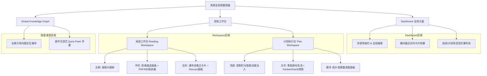

# 前端原型设计需求与交互规范 v1.0

> [!IMPORTANT]
> 本文档基于 [《交互链路与状态规范》](../04_interaction_design/flow_state_spec-v1.0.md) 与 [《业务模型规范》](../03_business_modeling/business_model.md) 推导，专为 **UI/UX 设计师** 与 **前端研发人员** 编写。
> **架构契约**：本文档采用严格的**“组件结构 -> 数据依赖 (输入) -> 交互事件 (输出)”**模型进行结构化表达，为后续组件库开发、状态管理与接口联调提供明确的标准输入。

## 一、 核心页面布局与线框结构 (Layout & Wireframing)

> [!TIP]
> 界面原型设计需遵循“沉浸、无干扰”的排版原则，核心页面结构约束如下。

### 1. 全局视窗导航拓扑

### 2. 页面区域组件划分

| 页面模块 | 区域划分 | 核心组件与布局说明 |
| :--- | :--- | :--- |
| **Dashboard**   (全局大盘与入口页) | **布局结构** | 顶部导航栏（含全局搜索与新建按钮） + 主内容区。 |
| | **主内容区** | 横向卡片轮播 (最近访问) + 双栏项目列表 (阅读项目 / 计划项目)。 |
| | **全局入口** | 提供明显的悬浮或固定按钮，用于一键呼出“全局知识图谱画布”。 |
| **Reading Workspace**   (沉浸式阅读工作台) | **布局结构** | 自适应的双栏/三栏布局。 |
| | **左侧边栏** | 级联折叠的文档大纲树。 |
| | **中栏 (主阅读区)** | 顶部双维度进度条 + 居中的 PDF/Markdown 渲染容器。 |
| | **右栏 (读思面板)** | 瀑布流式融合笔记卡片列表 + 固定的 Discuss AI 输入框。 |
| **Global Knowledge Graph**   (全局知识图谱) | **布局结构** | 全屏力导向图交互画布 (Force-directed Graph Canvas)。 |
| | **交互组件** | 漫游浮窗 (Quick Peek Overlay)：带有毛玻璃背景的居中悬浮窗，用于无跳转溯源。 |
| **Plan Workspace**   (计划项目执行台) | **布局结构** | 顶部控制栏（含智能技能注入入口） + 核心任务视图（看板 Kanban 或 甘特图 Gantt）。 |
| | **任务流视图** | 注入技能时采用分层渐进式骨架屏渲染任务树；支持连带依赖拖拽排期。 |

---

## 二、 核心 UI 组件结构化定义 (Component I/O Spec)

> [!IMPORTANT]
> 前端组件必须严格遵循以下状态输入（Props/State）与交互输出（Events/Emits）契约，以保证前后端数据流转的一致性。

### 1. 双维度动态进度条 (Dual-metric Progress Bar)

> 功能描述：用于可视化展示用户的阅读与内化进度，支持联动跳转。

| 数据类型 | 字段名 | 类型 | 说明 |
| :--- | :--- | :--- | :--- |
| **Props** (输入) | `chapterReadRatio` | `Number` | 已读章节比例（0-1）。 |
| | `chunkParsedRatio` | `Number` | 文档切片解析比例（0-1）。 |
| | `chapterMarkers` | `Array` | 章节物理坐标系数组，用于渲染刻度。 |
| **Emits** (输出) | `onMarkerClick` | `Event` | 用户点击特定刻度，触发阅读器向对应章节平滑滚动。 |
| | `onHoverMarker` | `Event` | 触发悬浮气泡，展示章节标题与预估耗时。 |

### 2. 融合笔记卡片 (Unified Note Card)

> 功能描述：承载主观笔记、原文高亮引用与 AI 辅导上下文的统一组件。

| 数据类型 | 字段名 | 类型 | 说明 |
| :--- | :--- | :--- | :--- |
| **Props** (输入) | `noteId` | `String` | 笔记唯一标识。 |
| | `sourceAnchor` | `Object` | 物理原文锚点数据（包含页码、段落ID、特征字符）。 |
| | `quoteContent` | `String` | 原文引文内容（呈现为微透明浅绿背景、斜体且不可编辑）。 |
| | `userContent` | `String` | 富文本内容。 |
| | `isReadOnly` | `Boolean` | 级联项目状态，决定卡片是否置灰且禁用输入。 |
| **Emits** (输出) | `onLocateSource` | `Event` | 点击卡片头部定位按钮，派发物理追溯事件。 |
| | `onContentChange` | `Event` | 富文本内容变更时触发，前端须外层包裹 **500ms 防抖** 后再发请求。 |

### 3. 微型弱打扰气泡 (Recommendation Bubble)

> 功能描述：章节末尾或任务异常时的弱打扰提示，必须包含渐进式动效。

| 数据类型 | 字段名 | 类型 | 说明 |
| :--- | :--- | :--- | :--- |
| **Props** (输入) | `triggerCondition`| `Boolean` | 渲染触发开关（如：阅读滚动超过 95%）。 |
| | `message` | `String` | 提示文本（如“AI导师已整理本章方法论”）。 |
| | `actionType` | `String` | 点击后的动作映射策略。 |
| **Emits** (输出) | `onActionClick` | `Event` | 用户接受推荐，展开右侧对应面板或执行操作。 |
| | `onDismiss` | `Event` | 离开触发区域后自动触发的销毁事件。 |

### 4. 拓扑排序卡片节点 (Topological Node Card)

> 功能描述：沙箱编辑器中的任务编排节点，支持拖拽连线。

| 数据类型 | 字段名 | 类型 | 说明 |
| :--- | :--- | :--- | :--- |
| **Props** (输入) | `nodeId` | `String` | 节点标识。 |
| | `hasCycleError` | `Boolean` | 当前节点是否死锁。若为 `true`，激活红色高斯模糊与高频抖动动效，**强制禁用批准入库按钮 (PA-03)**。 |
| | `dependencies` | `Array` | 前置节点列表。 |
| **Emits** (输出) | `onConnectionCreate`| `Event` | 用户拖拽建立连线，触发外层画布的拓扑排序算法验证。 |
| | `onConnectionDelete`| `Event` | 断开连线，触发外层算法重新校验。 |

### 5. 经验复盘与变异浮窗 (Experience & Mutation Modal)

> 功能描述：归档阶段弹出的富文本无边框记录卡，用于引导用户沉淀实战复盘。

| 数据类型 | 字段名 | 类型 | 说明 |
| :--- | :--- | :--- | :--- |
| **Props** (输入) | `isDrafting` | `Boolean` | 是否正在后台静默生成技能变异草稿 (Skill Mutation)。 |
| **Emits** (输出) | `onSubmitExperience` | `Event` | 提交避坑指南，触发后台 Experience Note 实体写入与图谱增量同步。 |

### 6. 知识图谱节点 (Graph Node)

> 功能描述：全局知识图谱画布中的原子节点。

| 数据类型 | 字段名 | 类型 | 说明 |
| :--- | :--- | :--- | :--- |
| **Props** (输入) | `nodeData` | `Object` | 包含节点标签名称及元数据。 |
| | `isFalsified` | `Boolean` | 若该节点在最新经验中被“证伪”，则渲染为 40% Opacity 的视觉衰变态。 |
| **Emits** (输出) | `onClickNode` | `Event` | 用户点击节点，直接向外派发 `onQuickPeek` 呈现悬浮上下文。 |

### 7. 计划执行任务卡片 (Plan Task Card)

> 功能描述：承载计划项目中的原子执行步骤，支持状态扭转与异常重调度。

| 数据类型 | 字段名 | 类型 | 说明 |
| :--- | :--- | :--- | :--- |
| **Props** (输入) | `taskId` | `String` | 任务实体唯一标识。 |
| | `status` | `Enum` | `PENDING`, `RUNNING`, `COMPLETED`, `BLOCKED` (逾期异常状态)。 |
| | `deadline` | `Timestamp`| 任务截止时间。若逾期且未完成，卡片底色及时间字体标红闪烁。 |
| **Emits** (输出) | `onStatusChange` | `Event` | 用户标记任务完成，触发后台状态更新与后续依赖项自动解锁。 |
| | `onReschedule` | `Event` | 呼出悬浮面板，提供基于拓扑排序的“一键顺延”或“甘特图手动微调”。 |

### 8. 阅读项目初始化表单 (ReadingProjectForm)

> 功能描述：阅读项目专属的初始化入口，强制关联文档上传与沙箱伴读 Agent 的绑定。

| 数据类型 | 字段名 | 类型 | 说明 |
| :--- | :--- | :--- | :--- |
| **Props** (输入) | `isLoading` | `Boolean` | 是否处于文档上传与初步解析阶段。 |
| **Emits** (输出) | `onSubmit` | `Event` | 提交包含文档文件与阅读截止时间的表单，触发系统静默绑定沙箱伴读 Agent。 |
| | `onUploadError` | `Event` | 文件格式不支持或超大时抛出异常，驱动 UI 红色边框告警。 |

### 9. 计划项目初始化表单 (PlanProjectForm)

> 功能描述：计划项目专属的初始化入口，通过智能检索一键注入技能模板并生成任务树。

| 数据类型 | 字段名 | 类型 | 说明 |
| :--- | :--- | :--- | :--- |
| **Props** (输入) | `recommendedSkills`| `Array` | 根据项目名称自动语义匹配的候选 Active 技能卡片列表。 |
| | `isInjecting` | `Boolean` | 骨架屏任务树渐进式分层渲染的过渡状态。 |
| **Emits** (输出) | `onSkillSearch` | `Event` | 用户手动输入技能关键词时触发的语义防抖检索。 |
| | `onSubmit` | `Event` | 提交包含截止时间与关联 Skill ID 的请求，启动计划执行流程。 |

### 10. 文本阅读器核心组件 (DocumentReader)

> 功能描述：渲染 PDF/Markdown 内容的核心视口，专注于高亮展现与物理锚点的无缝定位（不负责耗时的文件解析）。

| 数据类型 | 字段名 | 类型 | 说明 |
| :--- | :--- | :--- | :--- |
| **Props** (输入) | `chunks` | `Array` | 后端预处理完毕的结构化文本切片数组。 |
| | `anchorMap` | `Map` | 物理锚点映射表（页码、特征字符与 DOM 节点的绑定）。 |
| **Emits** (输出) | `onTextSelect` | `Event` | 用户鼠标划选文本结束时触发，抛出坐标系以驱动外层悬浮菜单渲染。 |
| | `onTraceToSource`| `Event` | 监听外部溯源指令，内部执行平滑滚动 (Smooth Scroll) 并触发 3 次脉冲闪烁 (Pulse Highlight)。 |

### 11. 级联大纲树 (OutlineTree)

> 功能描述：渲染文档章节骨架的树状导航器，通过内部状态接管实现解析期间与就绪期间的无缝过渡。

| 数据类型 | 字段名 | 类型 | 说明 |
| :--- | :--- | :--- | :--- |
| **Props** (输入) | `status` | `Enum` | `PARSING` (骨架屏波光动效) ｜ `READY` (真实树状数据渲染)。 |
| | `treeData` | `Array` | 具备父子层级关系的目录结构数据。 |
| | `currentChapterId` | `String` | 当前阅读器所处的活动章节，驱动侧边栏对应节点高亮选中。 |
| **Emits** (输出) | `onChapterClick` | `Event` | 点击某章节，触发大纲树内联展开及通知阅读器主干组件滚动跳转。 |

### 12. 伴读消息气泡 (MessageBubble)

> 功能描述：细粒度的对话气泡组件，承载 AI 提问与上下文渲染，内聚“保存笔记”动效。

| 数据类型 | 字段名 | 类型 | 说明 |
| :--- | :--- | :--- | :--- |
| **Props** (输入) | `messageData` | `Object` | 包含富文本、预提炼思考题或常规聊天的结构化对象。 |
| | `isAi` | `Boolean` | 判断消息发送方，决定气泡排版左/右对齐与颜色。 |
| **Emits** (输出) | `onSaveAsNote` | `Event` | 点击“存为笔记”，抛出自身 DOM 坐标及数据上下文，驱动父级引发抛物线粒子特效。 |

### 13. 划词悬浮操作菜单 (FloatingActionMenu)

> 功能描述：响应阅读器文本划选动作的极简悬浮层，用于捕捉瞬时灵感或触发单点技能编译。

| 数据类型 | 字段名 | 类型 | 说明 |
| :--- | :--- | :--- | :--- |
| **Props** (输入) | `selectionPosition`| `Object` | {x, y} 坐标系，用于在划选内容正上方挂载浮动菜单。 |
| | `selectedText` | `String` | 被划选的高亮本文内容。 |
| **Emits** (输出) | `onHighlightAndNote`| `Event` | 选择“高亮并记笔记”，通知中栏面板滑出并携带引用文本新建卡片。 |
| | `onDiscuss` | `Event` | 选择“Discuss”，展开右侧对话栏并将引用注入对话框。 |
| | `onExtractSkill` | `Event` | 选择“提炼为技能”，触发后台 L1 微观单点 Trace-to-Skill 编译流。 |

---

## 三、 状态响应与视觉映射机制 (State & Visual Mapping)

> [!TIP]
> 组件的 `isReadOnly` 与 `hasError` 等输入依赖来源于全局状态机，确保以下视觉映射与状态机同步。

| 实体全局状态 (State Input) | 界面视觉与交互限制 (Visual Output) |
| :--- | :--- |
| **Project.Status = `ACTIVE`** | 正常交互配色，所有组件处于激活态。 |
| **Project.Status = `SUSPENDED`**| 对应工作区被**毛玻璃遮罩** (`backdrop-filter: blur`) 覆盖，底层模糊不可点击。呈现“一键唤醒”按钮，派发重载事件，渲染**全局水波纹扩散动效**并从 Redis 恢复会话 **(PA-04)**。 |
| **Project.Status = `ARCHIVED`** | 顶部渲染只读警告横幅。所有子组件 `isReadOnly = true`，输入框与提交按钮深度置灰；指针渲染为 `not-allowed`。触发最后一次闲时建图。 |
| **Task.Status = `BLOCKED`** | 任务卡片底色变更为警告红，字体加粗并闪烁。暴露悬浮的“重调度”快捷入口组件。 |
| **Document.Status = `PARSING`** | 大纲组件渲染为**波光骨架屏 (Skeleton)**，屏蔽点击事件，直至状态就绪。 |
| **Knowledge.State = `FALSIFIED`** | 知识新陈代谢视觉奇观：节点及连线视觉变暗（Opacity 降至 40%），被反向抑制边（虚线）连接。 |
| **Graph.State = `QUICK_PEEK`** | 弹出带有毛玻璃背景的沉浸式居中浮窗，底层主画布高斯模糊，点击外部空白遮罩层销毁，**绝不触发全屏跳转 (PA-07)**。 |

---

## 四、 全局异常与错误反馈交互规范 (Error Handling & Feedback)

> [!IMPORTANT]
> 前端必须统筹处理基于 RFC 7807 规范返回的业务错误。绝不能将冰冷的 JSON 或原始报错直接抛给用户。所有的异常处理均需遵循“分级响应、精准定位、提供出路”的设计原则。

### 1. 错误展现形式分级策略 (Error Presentation Hierarchy)

根据错误的严重程度与用户介入的必要性，前端组件需进行分级渲染：

| 错误级别 | 适用场景 (基于 RFC 7807 特征) | 交互展现形式 (UI Pattern) | 交互行为约束 |
| :--- | :--- | :--- | :--- |
| **轻量级警示 (Toast)** | 常规业务阻断、临时网络波动。 (例: `status: 400`, 简单的 `detail` 提示) | **顶部悬浮消息条 (Message Toast)** | 自动消失 (通常 3-5 秒)。内容直接映射 RFC 7807 的 `title` 或 `detail`。禁止遮挡主操作区。 |
| **局部表单校验 (Inline)** | 表单字段输入不合法。 (例: `extension_fields.invalid_params` 存在) | **表单域内联红字提示 (Inline Validation)** | 精确追踪到具体的 Input 组件，输入框变红并抖动，文字提示附着在组件下方。 |
| **强干预阻塞 (Modal)** | 需要用户明确决策、支付升级、严重越权。 (例: `status: 403`, `extension_fields.upgrade_url` 存在) | **居中模态对话框 (Dialog/Modal)** | 必须包含清晰的行动号召 (Call to Action)。提供“取消”和“去处理”的主次按钮组合，背景采用高斯模糊遮罩。 |
| **局部破坏性异常 (Skeleton/Empty)** | 某一区块数据加载彻底失败，但页面主框架仍可用。 (例: 瀑布流某页拉取失败) | **局部空状态/错误重试占位图 (Empty State)** | 在该区块渲染柔和的插画及“点击重试”按钮，**切忌白屏或引发全局崩溃**。 |

### 2. 核心业务错误场景交互映射

针对特定业务场景，前端需拦截特定的 `type` 或 `extension_fields` 并执行专属 UI 动效：

*   **沙箱拓扑死锁 (`type: ".../topology-cycle"`)**：
    *   **拦截行为**：禁止使用常规 Toast。
    *   **UI 映射**：解析 `extension_fields.cycle_path`，在沙箱画布中将相关死锁节点高亮标红，连线变成红色虚线并触发**高频抖动动效 (Shake)**，右下角弹出包含详细死锁路径的警示气泡。
*   **配额耗尽要求升级 (`type: ".../quota-exceeded"`)**：
    *   **拦截行为**：拦截后直接呼出付费转化 Modal。
    *   **UI 映射**：展示精致的插画与当前的配额数据 (`extension_fields.current_quota`)，主按钮直达 `extension_fields.upgrade_url`。

### 3. 未知或系统级异常兜底 (Fallback Mechanism)

对于 `500 Internal Server Error` 或是网络断开导致未返回规范化 JSON 的情况：
*   **UI 降级**：统一展示“服务器正在打盹，请稍后重试”等拟人化友好文案，绝不直接展示 `Uncaught Promise Rejection`。
*   **调试支持**：在提示的次级文本中，提供一键复制 `TraceID` 的隐性入口，便于用户报障反馈。
