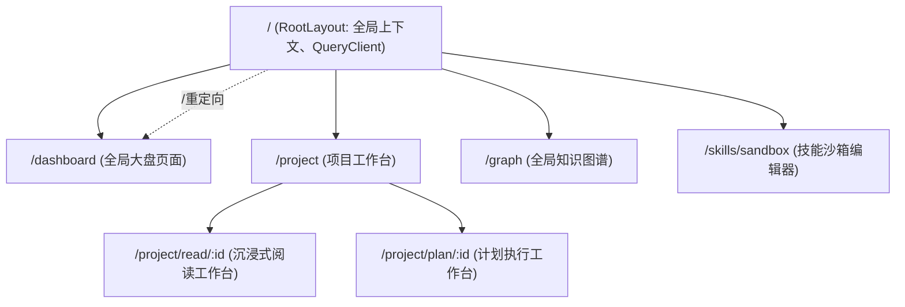

# 前端页面与路由设计规范 v1.0

> [!IMPORTANT]
> 本文档定义了基于 FSD (Feature-Sliced Design) 架构和 React Router v6 (Data Router) 的系统级路由规范。
> **联调声明**：对于当前后端 API 契约 (`api_spec_v1.0.md`) 中尚未定义的接口（下文以 **[未开发]** 标注），前端开发阶段将统一定义 MSW (Mock Service Worker) 拦截器进行本地垫片 (Mock) 处理。

## 一、 路由架构技术选型

* **路由引擎**：采用 `react-router-dom` v6 推荐的 **Data Router 模式** (`createBrowserRouter`)。
* **数据预加载 (Loader)**：路由跳转前通过 `loader` 函数与 TanStack Query (React Query) 集成，确保页面进入时数据已经就绪，减少组件内的 Loading 闪烁。
* **物理目录映射**：路由直接映射至 FSD 架构中的 `Pages` 层。`Pages` 层本身不包含业务逻辑，仅作为路由视口 (Outlet) 装配底层的 `Features` 和 `Entities`。

---

## 二、 核心路由拓扑映射 (Routing Topology)

系统采用单页面应用 (SPA) 架构，所有页面挂载在根布局 `<RootLayout />` 下。

---

## 三、 详细路由路径与数据装载契约 (Route Definitions)

### 1. 全局大盘页面 (Dashboard)

| 字段 | 设定 |
| :--- | :--- |
| **Path** | `/dashboard` |
| **FSD 映射组件** | `Pages/DashboardPage` |
| **功能说明** | 展示“最近访问项目”轮播与双轨项目（阅读/计划）瀑布流列表。 |
| **预加载数据 (Loader)** | `GET /api/projects?status=ACTIVE` (已开发) 利用 React Query `prefetchQuery` 获取首页大盘数据。 |

### 2. 阅读项目工作台 (Reading Workspace)

| 字段 | 设定 |
| :--- | :--- |
| **Path** | `/project/read/:id` |
| **FSD 映射组件** | `Pages/ReadingWorkspacePage` |
| **功能说明** | 承载文档解析、大纲树、PDF/MD 阅读器与右侧读思面板。 |
| **预加载数据 (Loader)** | 1. `GET /api/projects/:id` (获取项目详情元数据) -> **[未开发，需 Mock]** 2. `GET /api/projects/:id/notes?limit=15` (已开发，拉取首屏笔记缓存) |
| **异常阻断 (ErrorBoundary)** | 若项目 ID 不存在或返回 404，路由级 ErrorBoundary 拦截并展示骨架空状态图。 |

### 3. 计划项目执行台 (Plan Workspace)

| 字段 | 设定 |
| :--- | :--- |
| **Path** | `/project/plan/:id` |
| **FSD 映射组件** | `Pages/PlanWorkspacePage` |
| **功能说明** | 承载任务依赖看板、甘特图与智能技能注入入口。 |
| **预加载数据 (Loader)** | 1. `GET /api/projects/:id` (获取项目详情元数据) -> **[未开发，需 Mock]** 2. `GET /api/projects/:id/tasks` (拉取项目任务树依赖拓扑) -> **[未开发，需 Mock]** |

### 4. 全局知识图谱 (Global Knowledge Graph)

| 字段 | 设定 |
| :--- | :--- |
| **Path** | `/graph` |
| **FSD 映射组件** | `Pages/GlobalGraphPage` |
| **功能说明** | 全屏力导向图漫游，承载跨项目实体关系与 Falsified 衰变可视化。 |
| **预加载数据 (Loader)** | `GET /api/graph/all` (获取全局节点/边快照) -> **[未开发，需 Mock]** 由于图谱数据量可能极大，仅预加载主干节点，渲染后在客户端渐进加载。 |

### 5. 技能提炼与沙箱编辑器 (Skill Sandbox)

| 字段 | 设定 |
| :--- | :--- |
| **Path** | `/skills/sandbox/:skill_id` |
| **FSD 映射组件** | `Pages/SandboxEditorPage` |
| **功能说明** | 提供连线与拓扑排序阻断的沙箱编辑页面，用于 Trace-to-Skill 生成后的审批入库。 |
| **预加载数据 (Loader)** | `GET /api/skills/:skill_id` (拉取技能卡片与连接元数据) -> **[未开发，需 Mock]** |

---

## 四、 MSW (Mock Service Worker) 垫片拦截策略

由于部分 `Loader` 依赖的 GET 接口尚未在 API 规范中落地，前端开发须配置 `mock/handlers.ts`：

1. **项目详情 Mock (`GET /api/projects/:id`)**：
   - 拦截后返回固定的项目名称、创建时间及模拟的 `ACTIVE` 或 `ARCHIVED` 状态。
2. **任务树拓扑 Mock (`GET /api/projects/:id/tasks`)**：
   - 拦截后返回带有父子 `dependencies` 结构的静态树状 JSON，确保拖拽组件与拓扑检测算法在本地可以独立运行测试。
3. **全局图谱快照 Mock (`GET /api/graph/all`)**：
   - 生成 50 个随机关联节点，并特殊标记 2 个 `FALSIFIED` 状态的节点以测试“知识衰变”视觉动效。
