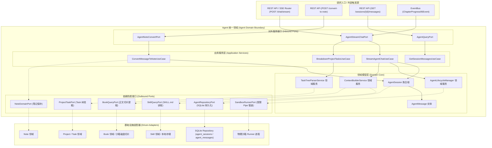
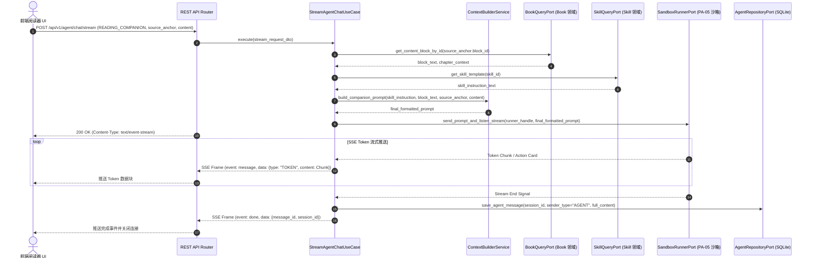
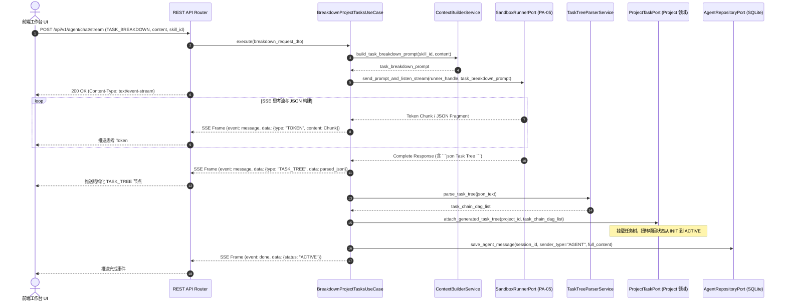
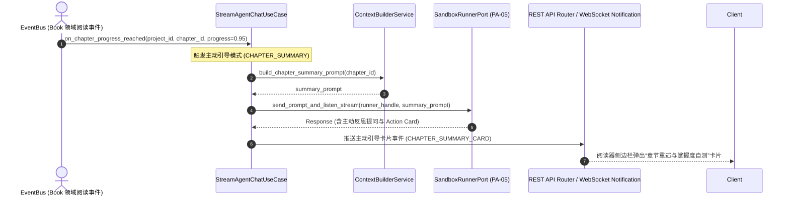
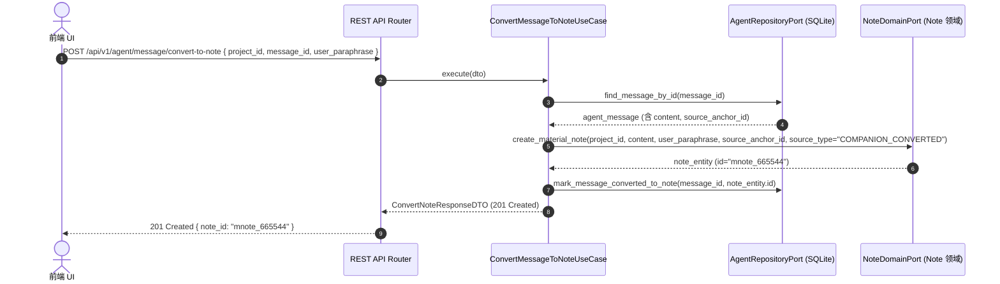
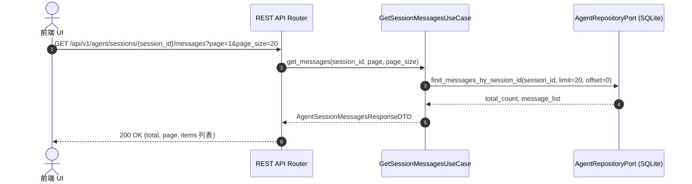

# Agent 领域 (Agent Domain) 后端设计规范 v1.0

> [!IMPORTANT]
> 本文档基于 [业务模型规范](../../03_business_modeling/business_model.md)、[项目领域后端设计规范](../project/project_backend_design_spec_v1.0.md)、[后端系统架构设计规范](../../06_system_architecture/architecture_backend_design_spec_v1.0.md)、[数据模型规范](../../07_data_model/data_model_spec_v1.0.md) 以及 [统一 Agent 领域 API 规范](../../08_api_specification/modules/agent/agent_api.md) 编写。
> 本文档旨在聚焦 `domain/agent` 限界上下文内部的详细设计、统一沙箱调度隔离 (PA-05)、多模式流式对话 (SSE)、Task 自动拆解建树以及对话转笔记沉淀机制。

---

## 一、 目标与功能

### 1. 领域定位与业务目标

Agent 领域 (`domain/agent`) 是系统中所有大语言模型交互与沙箱执行的统一中枢领域。其关键目标包括：

- **物理沙箱隔离调度 (PA-05)**：统管伴读 Agent、Task 拆解 Agent 与技能 Agent 的受限沙箱 Runner。封禁物理 Shell 执行与外部网络访问，严格通过 Pipe 管道传输结构化 Prompt 与 Token 流。
- **分层 Prompt 与 Skill 动态构建**：通过 `ContextBuilderService` 根据关联的 `skill_id` 注入 `SKILL.md` 系统指令，并结合上下文（图书切片 `ContentBlock`、章节摘要、Task 目标树）动态组装统一 Prompt。
- **多模式流式对话响应**：
  - **READING_COMPANION**：划词解惑，流式返回推导解答与交互卡片 (Action Cards)。
  - **TASK_BREAKDOWN**：计划工作台对话，自动分析项目目标并拆解输出结构化 `TaskChain` 与微观 `Task` 树 JSON。
  - **CHAPTER_SUMMARY**：当章节阅读进度达到 95% 时触发主动提问与重述引导卡片。
- ** Agent 生命周期管理与懒加载**：负责项目创建时的 `assigned_agent_id` 契约绑定、沙箱 Runner 的首次懒加载启动以及 24 小时无交互自动休眠/唤醒。
- **对话一键转笔记沉淀**：提供将特定 Agent 对话内容连同段落 `SourceAnchor` 一键转化为 `MaterialNote` 思考笔记的核心服务。

---

### 2. 对外暴露的领域功能契约 (Domain Capabilities & Services)

| 领域服务名称 | 调用的目标领域 / 模块 | 服务能力描述 | 领域契约与约束 |
| :--- | :--- | :--- | :--- |
| **Agent生命周期管理服务** <br>`AgentLifecycleManager` | Project 领域 / 接入层 REST | 管理 `assigned_agent_id` 契约生成与沙箱 Runner 的懒加载与 24 小时休眠唤醒。 | 隔离句柄存储，自动回收死进程 |
| **上下文与 Skill 组装服务** <br>`ContextBuilderService` | Skill / Book / Note 领域 | 提取 `skill_id` 对应的 `SKILL.md` 模板，融合图书切片、章节 Summary 与 Task 上下文。 | 支持 Token 上限截断与数据脱敏 |
| **Task 对话拆解与建树服务** <br>`TaskBreakdownService` | Project / Task 领域 | 驱动 `PLAN` 模式下的工作台对话，解析 Agent 返回的任务树 JSON，触发挂载。 | 输出标准的 Task 树 JSON 结构 |
| **沙箱隔离运行中枢** <br>`SandboxRunnerService` | 物理受限沙箱进程 | 通过 Pipe 管道收发 Prompt/Token 流，解析 Token Chunk 与 Action Cards。 | 执行 PA-05 权限熔断与命令过滤 |
| **对话转笔记服务** <br>`MessageToNoteService` | Note 领域 | 将指定 Agent 对话消息转存为 `MaterialNote` 并自动关联 `SourceAnchor` 锚点。 | 校验 `message_id` 归属与有效性 |
| **历史消息查询服务** <br>`AgentSessionQueryService` | 接入层 REST API | 提供 `session_id` 分页拉取历史消息流与 Action Cards 快照。 | 只读查询，支持按时间与游标分页 |

---

### 3. 六边形架构分层映射



---

## 二、 功能的详细设计交互

### 1. 伴读解惑流式对话交互流 (`READING_COMPANION` - SSE)

> [!NOTE]
> **场景说明**：
> 当用户在电子书阅读界面选定段落划词发起 Discuss 提问时，前端发送 `POST /api/v1/agent/chat/stream`，包含 `mode="READING_COMPANION"` 与段落 `source_anchor`。后端提取段落切片、组装 Prompt，建立 SSE 通道流式吐出解答 Token。



---

### 2. Task 自动拆解建树交互流 (`TASK_BREAKDOWN` - SSE)

> [!NOTE]
> **场景说明**：
> 在 `PLAN` 计划模式下，用户于项目工作台与 Agent 对话沟通总目标。Agent 分析需求后吐出思考 Token，并在结束时输出标准 JSON 格式的任务树，由后端自动挂载为 `TaskChain` 和 `Task`。



---

### 3. 章节 95% 进度主动引导交互流 (`CHAPTER_SUMMARY` - SSE)



---

### 4. Agent 对话一键转笔记交互流 (`convert-to-note`)



---

### 5. 获取 Agent 历史对话列表交互流



---

### 6. Agent 领域依赖的外部防腐接口 (Outbound Ports)

```python
# domain/agent/ports.py
from abc import ABC, abstractmethod
from typing import Optional, List, Dict, Any, Generator
from domain.agent.entities import AgentSession, AgentMessage

class AgentRepositoryPort(ABC):
    """Agent 会话与消息 SQLite 仓储接口"""
    @abstractmethod
    def save_session(self, session: AgentSession) -> AgentSession: ...
    @abstractmethod
    def find_session_by_id(self, session_id: str) -> Optional[AgentSession]: ...
    @abstractmethod
    def find_session_by_project_id(self, project_id: str) -> Optional[AgentSession]: ...
    @abstractmethod
    def save_message(self, message: AgentMessage) -> AgentMessage: ...
    @abstractmethod
    def find_message_by_id(self, message_id: str) -> Optional[AgentMessage]: ...
    @abstractmethod
    def find_messages_by_session_id(self, session_id: str, limit: int, offset: int) -> tuple[int, List[AgentMessage]]: ...

class SandboxRunnerPort(ABC):
    """受限沙箱物理 Runner 通信防腐接口 (PA-05)"""
    @abstractmethod
    def send_prompt_and_listen_stream(self, session_id: str, formatted_prompt: str) -> Generator[Dict[str, Any], None, None]: ...
    @abstractmethod
    def terminate_sandbox(self, session_id: str) -> bool: ...

class SkillQueryPort(ABC):
    """Skill 领域指令模板读取接口"""
    @abstractmethod
    def get_skill_template(self, skill_id: str) -> str: ...

class BookQueryPort(ABC):
    """Book 领域正文与锚点切片查询接口"""
    @abstractmethod
    def get_content_block_by_id(self, block_id: str) -> Dict[str, Any]: ...

class ProjectTaskPort(ABC):
    """Project/Task 领域任务树挂载接口"""
    @abstractmethod
    def attach_generated_task_tree(self, project_id: str, task_chains_data: Dict[str, Any]) -> bool: ...

class NoteDomainPort(ABC):
    """Note 领域思考笔记保存接口"""
    @abstractmethod
    def create_material_note(self, project_id: str, content: str, user_paraphrase: str, source_anchor_id: Optional[str], source_type: str) -> Dict[str, Any]: ...
```

---

## 三、 接口规范映射与契约 (API Specification Alignment)

### 1. REST 路由与领域 UseCase 映射表

| REST 路由 | HTTP Method | 请求 Payload / Query | 成功状态码 | 领域 UseCase |
| :--- | :--- | :--- | :--- | :--- |
| `/api/v1/agent/chat/stream` | `POST` | Body: `AgentChatStreamRequestDTO` | `200 OK (SSE)` | `StreamAgentChatUseCase` / `BreakdownProjectTasksUseCase` |
| `/api/v1/agent/message/convert-to-note` | `POST` | Body: `ConvertNoteRequestDTO` | `201 Created` | `ConvertMessageToNoteUseCase` |
| `/api/v1/agent/sessions/{session_id}/messages` | `GET` | Query: `?page=1&page_size=20` | `200 OK` | `GetSessionMessagesUseCase` |

---

### 2. DTO 与 Domain Entity 转换契约

```python
# application/agent/dtos.py
from pydantic import BaseModel, Field
from typing import Optional, List, Dict, Any

class SourceAnchorDTO(BaseModel):
    block_id: str
    start_offset: int
    end_offset: int
    selected_text: str

class AgentChatStreamRequestDTO(BaseModel):
    project_id: str
    book_id: Optional[str] = None
    chapter_id: Optional[str] = None
    mode: str = Field(..., description="READING_COMPANION | TASK_BREAKDOWN | CHAPTER_SUMMARY")
    trigger_type: Optional[str] = "DISCUSS"
    skill_id: Optional[str] = None
    content: str
    source_anchor: Optional[SourceAnchorDTO] = None

class ConvertNoteRequestDTO(BaseModel):
    project_id: str
    message_id: str
    user_paraphrase: str

class ConvertNoteResponseData(BaseModel):
    note_id: str
    project_id: str
    discuss_message_id: str
    source_type: str
    paraphrase: str
    source_anchor_id: Optional[str] = None
    created_at: str

class ConvertNoteResponseDTO(BaseModel):
    code: int = 201
    message: str = "note converted successfully"
    data: ConvertNoteResponseData

class AgentMessageDTO(BaseModel):
    id: str
    sender_type: str
    content: str
    trigger_type: Optional[str] = None
    action_cards: List[Dict[str, Any]] = []
    created_at: str

class AgentSessionMessagesResponseData(BaseModel):
    total: int
    page: int
    page_size: int
    items: List[AgentMessageDTO]

class AgentSessionMessagesResponseDTO(BaseModel):
    code: int = 200
    message: str = "success"
    data: AgentSessionMessagesResponseData
```

---

## 四、 异常边界与处理

### 1. 领域内部异常与 HTTP 错误映射

| 领域异常类 (Domain Exception) | 触发场景 | 映射 HTTP 状态 | Error Code Payload |
| :--- | :--- | :--- | :--- |
| `AgentSessionNotFoundException` | 传入无效或不存在的 `session_id` | `404 Not Found` | `AGENT_SESSION_NOT_FOUND` |
| `AgentMessageNotFoundException` | 转换笔记时找不到指定的 `message_id` | `404 Not Found` | `AGENT_MESSAGE_NOT_FOUND` |
| `SandboxPermissionViolationException` | 沙箱内尝试发起外部网络或执行 Shell | `403 Forbidden` | `SANDBOX_PERMISSION_VIOLATION` |
| `SandboxTimeoutException` | LLM 或沙箱响应超时超过 60 秒 | `504 Gateway Timeout` | `SANDBOX_TIMEOUT` |
| `InvalidSkillTemplateException` | 指定的 `skill_id` 缺少 `SKILL.md` 描述 | `400 Bad Request` | `INVALID_SKILL_TEMPLATE` |

---

### 2. Agent 会话状态跳转矩阵

| 源状态 \ 目标状态 | `IDLE` | `RUNNING` | `PAUSED` | `HIBERNATED` | `TERMINATED` |
| :--- | :--- | :--- | :--- | :--- | :--- |
| **`IDLE`** | 阻断 (409) | **允许 (收到 Chat 请求)** | 阻断 (409) | **允许 (24h 无交互)** | **允许 (删除项目)** |
| **`RUNNING`** | **允许 (流完成)** | 阻断 (409) | **允许 (用户强行中断)** | 阻断 (409) | **允许 (异常熔断)** |
| **`PAUSED`** | **允许 (恢复对话)** | **允许 (发送新消息)** | 阻断 (409) | **允许 (超时休眠)** | **允许 (手动销毁)** |
| **`HIBERNATED`** | 阻断 (409) | **允许 (新请求自动唤醒)** | 阻断 (409) | 阻断 (409) | **允许 (删除项目)** |
| **`TERMINATED`** | 阻断 (409) | 阻断 (409) | 阻断 (409) | 阻断 (409) | 阻断 (409) |

---

### 3. 交互节点异常退出分析与自愈处理

在 Agent 交互的全生命周期中，根据第一性原理拆解为 5 大核心时序节点，分析各节点的异常退出影响与处理机制：

1. **节点 N1：请求发起与 Prompt/Skill 组装节点**
   - **异常场景**：客户端取消请求；或关联的 `SKILL.md` 坏损/缺失。
   - **处置策略**：后端设置 5 秒组装超时；抛出 `InvalidSkillException` / `ContentBlockNotFoundException` 响应 4xx；若客户端已断开，监听 ASGI `request.is_disconnected()` 放弃后续沙箱调度。

2. **节点 N2：物理沙箱启动与 Pipe 管道建立节点**
   - **异常场景**：沙箱 Runner 物理进程冷启动失败（OOM、权限拒绝、坏损）或 Pipe 握手超时。
   - **处置策略**：设置 10 秒硬超时，超时强杀进程；捕获 `BrokenPipeError` 后将会话退回 `IDLE` 状态；通过 SSE 向客户端下发 `event: error, data: {"code": "SANDBOX_BOOT_FAILED"}` 告知用户重试。

3. **节点 N3：LLM 生成与 SSE 流式 Token 推送节点 (长窗口期)**
   - **异常场景 A（客户端掉线/关闭）**：后端监听 `request.is_disconnected()`，断开后立即发送 SIGINT/SIGTERM 中断沙箱，止损算力；将已接收的增量文本写入 `agent_messages` 标记 `status="INTERRUPTED"`。
   - **异常场景 B（服务端/LLM 崩溃）**：捕获 `GeneratorExit` 或沙箱非 0 退出信号，发送 `event: error, data: {"code": "SANDBOX_CRASHED"}` 帧；前端检测到非正常关闭自动切为“生成中断，点击重试”状态。

4. **节点 N4：TASK_BREAKDOWN 模式下的 JSON 解析与 Task 挂载节点**
   - **异常场景**：LLM 吐出的 JSON 任务树坏损截断；挂载 `TaskChain` / `Task` 树时 SQLite 写库失败。
   - **处置策略**：采用两阶段解析（自动补齐闭合括号）；若修复失败降级保存对话文本，提示用户手动建树；挂载过程必须强包裹在**单一数据库事务**内（创建 TaskChains + 批量插入 Tasks + 扭转 Status），失败整体 `ROLLBACK`，防止产生孤立节点。

5. **节点 N5：对话一键转笔记节点 (`POST /convert-to-note`)**
   - **异常场景**：并发重复点击；创建 `MaterialNote` 成功但更新消息标记时网络中断。
   - **处置策略**：建立 `(project_id, discuss_message_id)` 强幂等索引，重复请求直接返回已创建的 `note_id`；跨领域调用使用事务控制。

---

### 4. 交互节点异常退出处置矩阵

| 交互节点 | 异常类型 | 业务影响 | 自动恢复与处置机制 | 最终数据一致性 |
| :--- | :--- | :--- | :--- | :--- |
| **N1: Prompt 组装** | 切片/Skill 缺失 | 请求挂起 | 5s 超时拦截，抛出 400/404 错误 | 零脏数据 |
| **N2: 沙箱握手** | 进程崩溃/Pipe 超时 | 会话卡死在 `RUNNING` | 10s 握手超时强杀进程，状态退回 `IDLE`，下发 SSE 错误帧 | 会话状态复原 |
| **N3.1: 流推送 (客户端断线)** | 用户关页面/断网 | 无效计算/发包阻塞 | 实时监听 `is_disconnected()`，发送 SIGINT 中断沙箱，标记 `INTERRUPTED` 落盘 | 记录半截消息，无孤儿进程 |
| **N3.2: 流推送 (服务端崩溃)** | LLM/沙箱中途挂掉 | 前端无限等待 | 捕获 Pipe 异常下发 `SANDBOX_INTERRUPTED`，前端降级展示重试按钮 | 允许用户重新发起 |
| **N4: Task 树挂载** | JSON 损坏/写库失败 | 任务节点孤立/状态错乱 | 启用两阶段 JSON 修复；挂载逻辑强包裹在**单次数据库事务**中，失败整体 `ROLLBACK` | 确保无孤立 Task 节点 |
| **N5: 消息转笔记** | 重复点击/中途网络断 | 生成重复 Note | 基于 `(project_id, message_id)` 强幂等校验 | 幂等无重复 Note |


---

## 五、 可观测与监控

### 1. Agent 领域核心 Metrics 定义

```ini
# HELP agent_stream_duration_seconds Agent SSE streaming duration in seconds
# TYPE agent_stream_duration_seconds histogram
agent_stream_duration_seconds_bucket{mode="READING_COMPANION", le="3.0"} 45
agent_stream_duration_seconds_bucket{mode="TASK_BREAKDOWN", le="10.0"} 12

# HELP agent_sandbox_violations_total Total number of sandbox PA-05 rule violations
# TYPE agent_sandbox_violations_total counter
agent_sandbox_violations_total{reason="SHELL_EXEC_ATTEMPT"} 0
```

---

### 2. 结构化日志输出规范

```json
{
  "timestamp": "2026-07-23T15:10:00Z",
  "level": "INFO",
  "domain": "agent",
  "logger": "domain.agent.stream",
  "trace_id": "tr-9a8b7c6d5e",
  "session_id": "sess_443322",
  "project_id": "proj_112233",
  "mode": "READING_COMPANION",
  "tokens_generated": 340,
  "duration_ms": 2150,
  "event": "AgentStreamCompleted"
}
```

---

### 3. 领域健康度与告警

- **沙箱异常熔断告警**：`agent_sandbox_violations_total` > 0 时触发 High 级别告警。
- **SSE 流超时率告警**：5 分钟内 `504 Gateway Timeout` 占比 > 5% 时触发 Warning 告警。
