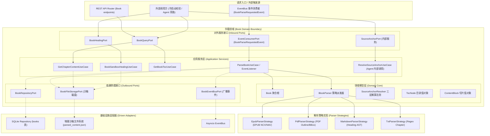
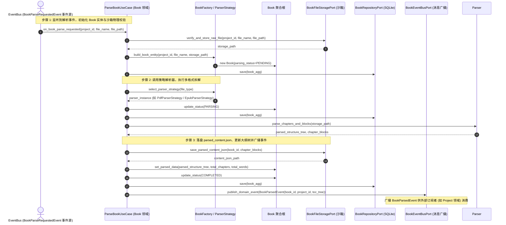
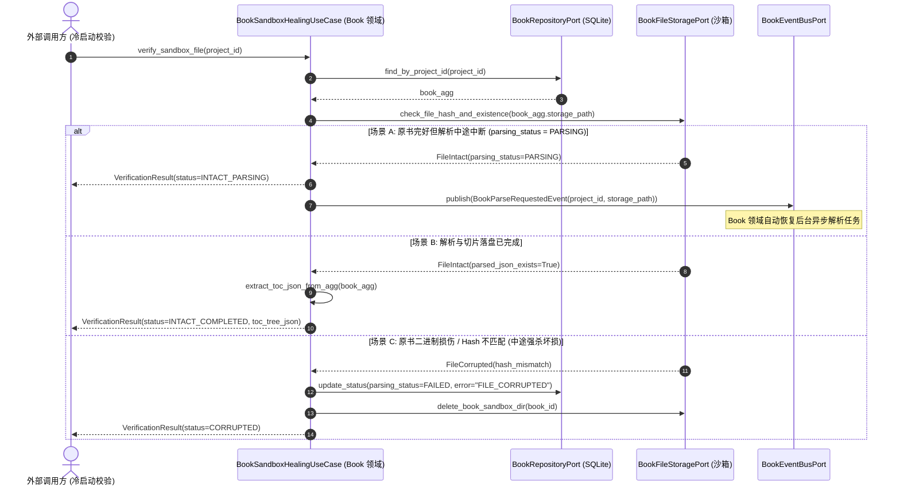
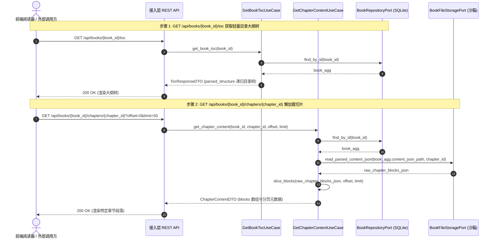
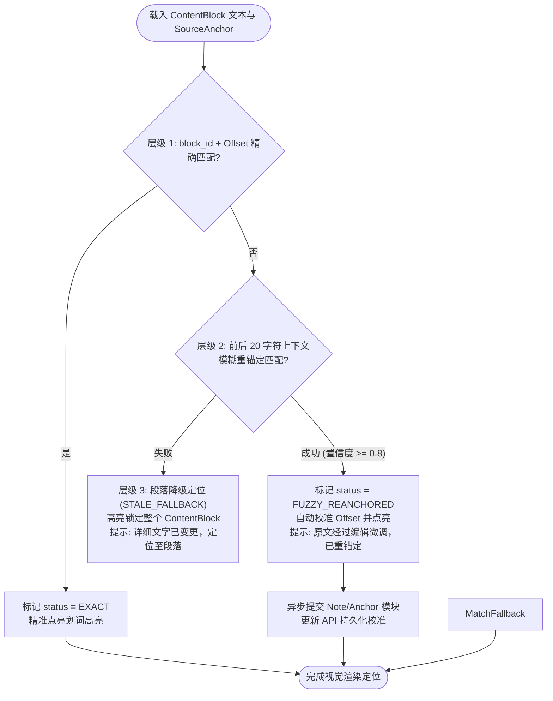

# 书籍领域 (Book Domain) 后端设计规范 v1.0

> [!IMPORTANT]
> 本文档基于 [业务模型规范](../../03_business_modeling/business_model.md)、[项目领域后端设计规范](../project/project_backend_design_spec_v1.0.md)、[后端系统架构设计规范](../../06_system_architecture/architecture_backend_design_spec_v1.0.md)、[数据模型规范](../../07_data_model/data_model_spec_v1.0.md) 以及 [书籍与物理锚点 API 规范](../../08_api_specification/modules/book/document_api.md) 编写。
> 本文档旨在聚焦 `domain/book` 限界上下文内部的详细设计、事件驱动解析引擎、沙箱自愈校验以及前后端协同的三层容错锚定解算机制。

---

## 一、 目标与功能

### 1. 领域定位与业务目标

书籍领域 (Book Domain) 是处理多格式电子书物料解析、物理正文切片提取、通用大纲构建与物理原文锚点定位的核心领域。其关键目标包括：

* **纯事件驱动解耦响应**：响应 `Project` 领域创建 `READING` 阅读项目时发出的 `BookParseRequestedEvent`，完成异步解析落盘后广播 `BookParsedEvent` 驱动 Project 领域挂载目录大纲树。
* **File-first (文件优先) 拆分架构**：根据 File-first 原则，将全书的大体量正文数据切片在沙箱磁盘落盘为 `parsed_content.json`，数据库仅存储轻量级的目录大纲树索引 `parsed_structure`，防止数据膨胀拖垮数据库。
* **抹平多格式解析差异**：采用策略模式 (`IBookParser`) 抹平 EPUB (NCX/NAV)、PDF (Outline/Layout)、TXT、MD 等异构文件的格式解析差异，统一输出通用递归大纲树 `TocNode` 与原子段落块 `ContentBlock`。
* **高效异步拆解**：在后台异步按 Chunk 粒度高效完成电子书拆解，原子写落盘正文切片与大纲索引，完成时广播领域事件驱动关联领域更新。
* **内聚沙箱自愈校验**：提供 `BookSandboxHealingService` 对外暴露 `BookHealingPort`，独立完成沙箱文件完整性校验与损坏清理。
* **前后端协同三层容错原文重锚定**：阅读器 UI 端的视觉高亮与重锚定解算在前端渲染 `ContentBlock` 时由 JS 内存高效完成（0 网络延时并精准操纵 DOM/PDF.js）；后端保留 `SourceAnchorResolutionService` 内部领域服务供 Agent 旁路使用，并在前端纠偏后接收异步写库回写。

---

### 2. 对外暴露的领域功能契约 (Domain Capabilities & Services)

书籍领域向接入层 (REST API) 及其他外部调用方提供以下核心能力契约：

| 领域服务名称 | 调用的目标领域 / 模块 | 服务能力描述 | 领域契约与约束 |
| :--- | :--- | :--- | :--- |
| **异步书籍解析引擎服务** <br>`BookParsingEngineService` | EventBus 事件消费 (`BookParseRequestedEvent`) | 校验沙箱物理文件格式与 Hash，调用策略解析器切片并落盘 `parsed_content.json`，更新目录树。 | 解析完成后广播 `BookParsedEvent` |
| **沙箱自愈与文件校验服务** <br>`BookSandboxHealingService` | 外部守护进程 / <br>冷启动修复调用方 | 提供 `verify_sandbox_file` 与 `get_parsed_toc_json` 接口，独立校验沙箱存储并清理死链文件。 | 返回 `FileIntact` 或 `FileCorrupted` 状态 |
| **通用目录大纲查询服务** <br>`BookTocQueryService` | 接入层 REST API / <br>外部目录订阅方 | 提供 `book_id` 级别的递归 `parsed_structure` 目录大纲树查询与节点校验。 | 只读查询，读取数据库中的轻量 JSON 索引 |
| **章节与 ContentBlock 懒加载服务** <br>`BookChapterContentService` | 接入层 REST API / <br>Agent 领域 (上下文注入) | 从沙箱磁盘读取 `parsed_content.json`，按 `chapter_id` 或 `block_id` 区间懒加载原子 ContentBlock 正文切片。 | 读取磁盘文件，不污染数据库内存，提供分页与 Chunk 提取 |
| **物理原文锚点解算服务** <br>`SourceAnchorResolutionService` | Agent 旁路 (知识提炼) / <br>Note 领域 (离线溯源) | 接收 `SourceAnchor` 参数，执行“精准偏移 -> 20 字符上下文模糊重锚定 -> 段落降级”三层解算。UI 侧由前端 JS 内存直接计算高亮。 | 处理原文编辑微调后的漂移，自动修复锚点快照 |
| **书籍清理与物理抹除服务** <br>`BookCleanupService` | 外部级联清理调用方 | 在书籍删除或上传覆盖时，安全级联清理 SQLite 记录及物理沙箱存储中的原书与 `parsed_content.json`。 | 保障磁盘空间回收与本地零孤岛垃圾文件 |

---

### 3. 六边形架构分层映射

书籍领域严格遵循六边形架构 (Hexagonal Architecture)，其内部与对外 Ports 边界如下：



---

## 二、 功能的详细设计交互

### 1. 电子书异步解析交互流 (Book 领域视角)

> [!NOTE]
> **解析触发入口**：
> 接收到事件总线广播的 `BookParseRequestedEvent(project_id, file_name, file_path)`。用户在创建 `READING` 阅读项目时，由 Project 领域在文件写入沙箱后统一向事件总线广播触发。



---

### 2. 沙箱自愈与文件校验服务交互流 (Book 领域视角)



---

### 3. 目录大纲树与章节 ContentBlock 懒加载交互流

> [!NOTE]
> **章节已读标记与打卡说明**：
> 电子书解析后，每个章节 (`Chapter`) 在 Project 领域自动对应映射一个 `Task` (任务)。当用户完成章节阅读或在界面主动打卡时，前端直接调用 Task 模块接口 `PATCH /api/tasks/{task_id}` 提交 `{"status": "COMPLETED"}`，后端将自动重新计算全书阅读总进度，并在大纲树节点旁呈现已读打钩状态。



---

### 4. 三层容错重锚定 (SourceAnchor Resolution) 解算流程与降级矩阵

> [!NOTE]
> **职责契约**：
> 物理原文锚点的视觉高亮与纠偏解算在前端载入 `ContentBlock` 时由 JS 内存高效完成（0 网络延时，且直接操纵 DOM / PDF.js 视口节点）。若触发重锚定修正，前端异步提交 Note/Anchor 模块的更新 API 持久化最新偏移量；后端仅在 Python 内部保留同名比对函数供旁路调用。



#### 三层容错重锚定降级矩阵

| 匹配层级 | 匹配条件与触发逻辑 | 计算过程与校验特征 | 输出解算状态 | 前端 UI 交互与提示行为 |
| :--- | :--- | :--- | :--- | :--- |
| **层级 1: 精确定位** <br>(Exact Match) | `block_id` 存在，且 `char_start_offset` 至 `char_end_offset` 切片 Hash 与 `content_hash` 完全一致 | 比对 SHA-256 Hash `Hash(text_snippet) == content_hash` | `EXACT` | 精确脉冲点亮划词文字，无任何警告 |
| **层级 2: 上下文模糊重锚定** <br>(Fuzzy Re-anchor) | 偏移失效，但通过 `text_snippet` + `prefix_context` + `suffix_context`（前后各 20 字符）在 Block 内滑动匹配成功 | 使用 Levenshtein 模糊匹配搜索最高置信度子串 (Confidence >= 0.8)，自动修正 `char_start_offset` 与 `char_end_offset` | `FUZZY_REANCHORED` | 脉冲点亮修正后的 DOM 节点，展示提示：“原文位置经过微调，已自动重锚定”；前端异步发请求修正数据库 |
| **层级 3: 段落降级定位** <br>(Stale Fallback) | 目标文字被重写，上下文匹配得分 < 0.8 | 找到物理 `block_id` 容器，但无法定位具体字符范围 | `STALE_FALLBACK` | 脉冲高亮点亮整个 `ContentBlock` 段落，展示 Notice 提示：“划词文本已被修改，定位至所在段落” |

---

### 5. Book 领域依赖的外部防腐接口 (Outbound Ports)

为保障 Book 领域的解耦与强内聚，定义以下 Python Port 契约：

```python
# domain/book/ports.py
from abc import ABC, abstractmethod
from typing import Optional, List, Dict, Any
from domain.book.entities import Book, SourceAnchor

class BookRepositoryPort(ABC):
    """Book 领域 SQLite 仓储接口"""
    @abstractmethod
    def save(self, book: Book) -> Book: ...
    @abstractmethod
    def find_by_id(self, book_id: str) -> Optional[Book]: ...
    @abstractmethod
    def find_by_project_id(self, project_id: str) -> Optional[Book]: ...
    @abstractmethod
    def delete(self, book_id: str) -> bool: ...

class BookFileStoragePort(ABC):
    """Book 物理沙箱文件存取接口 (File-first 原则)"""
    @abstractmethod
    def verify_and_store_raw_file(self, project_id: str, file_name: str, file_path: str) -> str: ...
    @abstractmethod
    def save_parsed_content_json(self, book_id: str, chapter_blocks_data: Dict[str, Any]) -> str: ...
    @abstractmethod
    def read_chapter_blocks(self, content_json_path: str, chapter_id: str) -> List[Dict[str, Any]]: ...
    @abstractmethod
    def check_file_hash_and_existence(self, file_path: str) -> bool: ...
    @abstractmethod
    def delete_book_sandbox_dir(self, book_id: str) -> None: ...

class BookEventBusPort(ABC):
    """Book 领域事件发布防腐接口"""
    @abstractmethod
    def publish_book_parsed(self, book_id: str, project_id: str, toc_tree: List[Dict[str, Any]]) -> None: ...

    @abstractmethod
    def publish_book_deleted(self, book_id: str, project_id: str) -> None:
        """广播 BookDeletedEvent/BookBlockDeletedEvent 驱动 Graph 侧向量清理与孤儿节点修剪"""
        ...
```

---

## 三、 接口规范映射与契约 (API Specification Alignment)

本模块将接入层 REST API 映射至 [document_api.md](../../08_api_specification/modules/book/document_api.md) 定义的规范：

### 1. REST 路由与领域 UseCase 映射表

| REST 路由 / 触发源 | HTTP Method | 请求 Payload 格式 | 成功响应状态码 | Book 领域 UseCase / 事件映射 |
| :--- | :--- | :--- | :--- | :--- |
| `BookParseRequestedEvent` (事件) | `EventBus` | 事件 Body (`project_id`, `file_name`, `file_path`) | `N/A` | `ParseBookUseCase.on_book_parse_requested()` |
| `/api/books/{book_id}` | `GET` | 无 | `200 OK` | `BookQueryUseCase.get_book_metadata()` |
| `/api/books/{book_id}/toc` | `GET` | 无 | `200 OK` | `GetBookTocUseCase.execute()` |
| `/api/books/{book_id}/chapters/{chapter_id}` | `GET` | Query Params (`?offset=0&limit=50`) | `200 OK` | `GetChapterContentUseCase.execute()` |

---

### 2. DTO 与 Domain Entity 转换契约

```python
# application/book/dtos.py
from pydantic import BaseModel
from typing import Optional, List, Dict, Any
from datetime import datetime
from domain.book.entities import Book

class BookResponseDTO(BaseModel):
    id: str
    project_id: str
    file_name: str
    file_type: str
    file_size: int
    parsing_status: str
    total_chapters: int
    total_word_count: int
    created_at: str

    @classmethod
    def from_domain(cls, entity: Book) -> "BookResponseDTO":
        return cls(
            id=entity.id,
            project_id=entity.project_id,
            file_name=entity.file_name,
            file_type=entity.file_type.value,
            file_size=entity.file_size,
            parsing_status=entity.parsing_status.value,
            total_chapters=entity.total_chapters,
            total_word_count=entity.total_word_count,
            created_at=entity.created_at.isoformat()
        )

class ContentBlockDTO(BaseModel):
    block_id: str
    block_type: str
    sequence_index: int
    text: str
    html_or_markdown: Optional[str] = None
    page_number: Optional[int] = None
    bbox: Optional[List[float]] = None

class ChapterContentResponseDTO(BaseModel):
    book_id: str
    chapter_id: str
    chapter_index: int
    total_blocks: int
    has_more: bool
    prev_chapter_id: Optional[str] = None
    next_chapter_id: Optional[str] = None
    blocks: List[ContentBlockDTO]
```

---

## 四、 异常边界与处理

### 1. 领域内部异常与 HTTP 错误映射

| 领域异常类 (Domain Exception) | 异常触发场景 | 映射 HTTP 状态码 | Error Code Payload |
| :--- | :--- | :--- | :--- |
| `BookNotFoundException` | 查询或获取不存在的 `book_id` | `404 Not Found` | `BOOK_NOT_FOUND` |
| `UnsupportedBookFormatException` | 触发非 `.pdf/.epub/.txt/.md` 格式解析 | `400 Bad Request` | `UNSUPPORTED_BOOK_FORMAT` |
| `BookParsingFailedException` | 解析引擎遇到损坏的 EPUB 结构或加密 PDF | `422 Unprocessable Entity` | `BOOK_PARSING_FAILED` |
| `ChapterNotFoundException` | 获取不存在的 `chapter_id` 内容 | `404 Not Found` | `CHAPTER_NOT_FOUND` |

---

### 2. 解析全生命周期状态跳转防阻断矩阵

| 源状态 \ 目标状态 | `PENDING` | `UPLOADING` | `PARSING` | `COMPLETED` | `FAILED` |
| :--- | :--- | :--- | :--- | :--- | :--- |
| **`PENDING`** | 阻断 (409) | **允许 (物理校验)** | 阻断 (409) | 阻断 (409) | **允许 (格式校验失败)** |
| **`UPLOADING`** | 阻断 (409) | 阻断 (409) | **允许 (启动解析)** | 阻断 (409) | **允许 (物理校验中断)** |
| **`PARSING`** | 阻断 (409) | 阻断 (409) | 允许 (拆解推进) | **允许 (解析成功完成)** | **允许 (提取崩溃报错)** |
| **`COMPLETED`** | 阻断 (409) | 阻断 (409) | 阻断 (409) | 阻断 (409) | 阻断 (409) |
| **`FAILED`** | 阻断 (409) | 阻断 (409) | **允许 (触发重新解析)** | 阻断 (409) | 阻断 (409) |

---

### 3. 单机离线包持久化安全与物理切片文件容错保护

在 Local-First 单机桌面客户端环境下，防范由于意外断电或程序强杀导致的文件损坏：

> [!CAUTION]
> **沙箱文件写保护与崩溃自愈原则**：
> 1. **Atomic Write (原子写入)**：生成 `parsed_content.json` 时，必须先写入临时文件 `parsed_content.json.tmp`，校验 SHA-256 Hash 正确无误后，原子重命名替换目标文件，防止解析中途崩溃产生 0 字节半截损坏文件。
> 2. **坏损检测与冷启动自动修复**：应用启动时扫描状态为 `PARSING` 的书籍，若对应沙箱中的原书文件完好，由 `StartupHealingThread` 自动重新发起异步解析任务。若原书物理文件已损坏，主动标记 `parsing_status=FAILED` 并向用户发送 Warning 通知引导重新上传。

#### 物理沙箱文件容错处置矩阵

| 场景 | 物理文件状态 | 自愈处置行为 | 最终业务状态 |
| :--- | :--- | :--- | :--- |
| **解析中途断电** | 原文件完整，`parsed_content.json.tmp` 残留 | 清理 `.tmp` 文件，自动重新派发 `BookParseRequestedEvent` 恢复解析 | 恢复为 `PARSING` 并自动完成转 `COMPLETED` |
| **上传中途断电** | 原始电子书二进制 Hash 不匹配 | 清理损坏的原书文件，更新 SQLite 记录为 `FAILED` | `parsing_status = FAILED` (提示文件坏损) |
| **正常解析完成** | 原书文件与 `parsed_content.json` 均校验通过 | 保持状态，向向量数据库及旁路建立索引 | `parsing_status = COMPLETED` |

---

## 五、 可观测与监控

### 1. Book 领域核心 Metrics 定义

```ini
# HELP book_parsing_duration_seconds Electronic book parsing engine execution duration in seconds
# TYPE book_parsing_duration_seconds histogram
book_parsing_duration_seconds_bucket{file_type="PDF", le="5.0"} 14
book_parsing_duration_seconds_bucket{file_type="EPUB", le="2.0"} 32
```

---

### 2. 结构化日志输出规范

使用 `structlog` 统一输出 Book 领域的结构化日志：

```json
{
  "timestamp": "2026-07-23T14:05:00Z",
  "level": "INFO",
  "domain": "book",
  "logger": "domain.book.parser",
  "trace_id": "tr-7a6b5c4d3e2f",
  "book_id": "bk_88776655",
  "file_type": "PDF",
  "parsed_chapters": 12,
  "parsed_blocks": 450,
  "event": "BookParsingCompleted",
  "duration_ms": 3420
}
```

---

### 3. 领域健康度与告警

1. **解析失败率告警**：`book_parsing_failed_total` 在 5 分钟内增加 > 3 次时，触发 Warning 日志。
