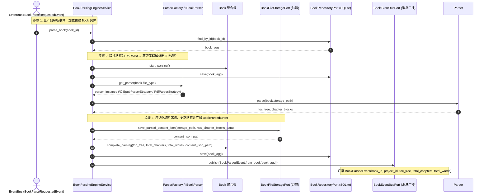
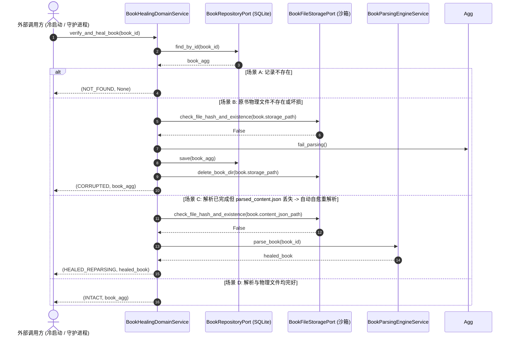
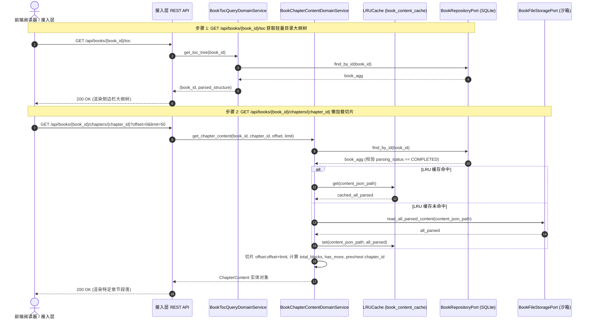
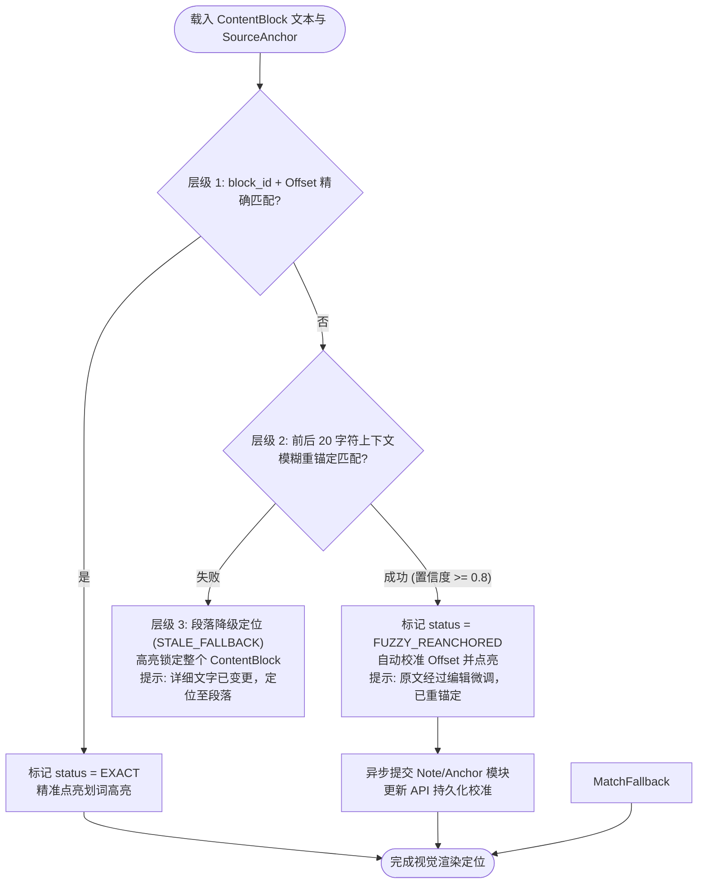

# 书籍领域 (Book Domain) 后端设计规范 v1.0

> [!IMPORTANT]
> 本文档基于 [业务模型规范](../../03_business_modeling/business_model.md)、[项目领域后端设计规范](../project/project_backend_design_spec_v1.0.md)、[后端系统架构设计规范](../../06_system_architecture/architecture_backend_design_spec_v1.0.md)、[数据模型规范](../../07_data_model/data_model_spec_v1.0.md) 以及 [书籍与物理锚点 API 规范](../../08_api_specification/modules/book/document_api.md) 编写。
> 本文档旨在聚焦 `domain/book` 限界上下文内部的详细设计、事件驱动解析引擎、沙箱自愈校验以及前后端协同的三层容错锚定解算机制。

---

## 一、 目标与功能

### 1. 领域定位与业务目标

书籍领域 (Book Domain) 是处理多格式电子书物料解析、物理正文切片提取、通用大纲构建与物理原文锚点定位的核心领域。其关键目标包括：

- **纯事件驱动解耦响应**：响应 `Project` 领域创建 `READING` 阅读项目时发出的 `BookParseRequestedEvent`，由 `BookParsingEngineService` 完成异步解析落盘后广播 `BookParsedEvent` 驱动 Project 领域挂载目录大纲树。
- **File-first (文件优先) 拆分架构**：根据 File-first 原则，将全书的大体量正文数据切片在沙箱磁盘落盘为 `parsed_content.json`，数据库仅存储轻量级的目录大纲树索引 `parsed_structure`，防止数据膨胀拖垮数据库。
- **抹平多格式解析差异**：采用策略工厂模式 (`ParserFactory` + `IBookParser`) 抹平 EPUB (NCX/NAV)、PDF (Outline/Layout)、TXT、MD 等异构文件的格式解析差异，统一输出通用递归大纲树 `TocNode` 与原子段落块 `ContentBlock`。
- **高效异步拆解与 LRU 缓存**：在后台按 Chunk 粒度高效完成电子书拆解，原子写落盘正文切片与大纲索引；正文切片懒加载集成内存 LRU 缓存，大幅降低重复磁盘 IO 开销。
- **内聚沙箱自愈校验**：提供 `BookHealingDomainService` 对外暴露 `verify_and_heal_book` 接口，独立完成沙箱文件完整性校验、丢失自动重解析与坏损清理。
- **前后端协同三层容错原文重锚定**：阅读器 UI 端的视觉高亮与重锚定解算在前端渲染 `ContentBlock` 时由 JS 内存高效完成（0 网络延时并精准操纵 DOM/PDF.js）；后端保留 `SourceAnchor` 实体与解算法则供 Agent 旁路检索使用。

---

### 2. 对外暴露的领域功能契约 (Domain Capabilities & Services)

书籍领域向接入层 (REST API) 及其他外部调用方提供以下核心领域服务契约：

| 领域服务名称 | 调用的目标领域 / 模块 | 服务能力描述 | 领域契约与约束 |
| :--- | :--- | :--- | :--- |
| **书籍记录创建服务** <br>`BookCreationDomainService` | 接入层 REST API / <br>Project 领域初始化 | 在解析前校验文件格式并初始化 `PENDING` 状态的 `Book` 聚合根记录。 | 校验 `.pdf/.epub/.txt/.md` 格式，生成唯一 `bk_` 前缀 ID |
| **异步书籍解析引擎服务** <br>`BookParsingEngineService` | EventBus 事件消费 (`BookParseRequestedEvent`) | 校验沙箱物理文件与 Hash，按策略解析器切片，原子落盘 `parsed_content.json` 并更新大纲树。 | 解析成功触发状态机转移至 `COMPLETED` 并广播 `BookParsedEvent`；失败转 `FAILED` |
| **沙箱自愈与损坏校验服务** <br>`BookHealingDomainService` | 外部守护进程 / <br>冷启动修复调用方 | 提供 `verify_and_heal_book` 接口，独立校验沙箱存储，发现丢失自动重新发起解析，坏损时清理孤岛文件。 | 返回 `INTACT` / `HEALED_REPARSING` / `CORRUPTED` / `NOT_FOUND` 状态 |
| **通用目录大纲查询服务** <br>`BookTocQueryDomainService` | 接入层 REST API / <br>外部目录订阅方 | 提供 `book_id` 级别的递归 `parsed_structure` 目录大纲树查询。 | 只读查询，直接读取数据库中轻量 JSON 索引 |
| **章节与 ContentBlock 懒加载服务** <br>`BookChapterContentDomainService` | 接入层 REST API / <br>Agent 领域 (上下文注入) | 从沙箱磁盘读取 `parsed_content.json`，按 `chapter_id` 提供分页切片懒加载，优先命中 LRU 内存缓存。 | 必须在 `COMPLETED` 状态下调用，提供 `has_more`、前后章节 ID 导航元数据 |

---

### 3. 六边形架构分层映射

书籍领域严格遵循六边形架构 (Hexagonal Architecture)，其内部与对外 Ports 边界如下：


```mermaid
graph TD
    subgraph DrivingAdapters ["请求入口 / 外部触发源"]
        REST["REST API Router (/api/books/...)"]
        EventConsumer["EventBus 事件消费者 (BookParseRequestedEvent)"]
        ExternalCaller["外部调用方 (冷启动校验 / Agent 旁路)"]
    end

    subgraph HexagonBoundary ["书籍领域 (Book Domain Boundary)"]
        subgraph DomainServices ["领域服务层 (Domain Services)"]
            DS_Create["BookCreationDomainService"]
            DS_Parse["BookParsingEngineService"]
            DS_Healing["BookHealingDomainService"]
            DS_Toc["BookTocQueryDomainService"]
            DS_Content["BookChapterContentDomainService"]
        end

        subgraph DomainModel ["领域模型层 (Domain Core)"]
            BookAgg["Book 聚合根"]
            ParserFactory["ParserFactory / IBookParser 策略派发"]
            SourceAnchorVO["SourceAnchor 实体 & 三层解算法则"]
            TocNodeVO["TocNode 目录值对象"]
            ContentBlockVO["ContentBlock 切片值对象"]
        end

        subgraph OutboundPorts ["依赖防腐接口 (Outbound Ports)"]
            OP_Repo["BookRepositoryPort"]
            OP_FileStore["BookFileStoragePort (沙箱磁盘)"]
            OP_Event["BookEventBusPort (广播事件)"]
        end
    end

    subgraph ParserImplementations ["解析策略实现 (Parser Strategies)"]
        EpubParser["EpubParserStrategy (EPUB NCX/NAV)"]
        PdfParser["PdfParserStrategy (PDF Outline/BBox)"]
        MdParser["MdParserStrategy (Heading AST)"]
        TxtParser["TxtParserStrategy (Regex Chapter)"]
    end

    subgraph Infrastructure ["基础设施适配器 (Driven Adapters)"]
        DB["SQLite Repository (books 表)"]
        SandboxFS["物理沙箱文件系统 (parsed_content.json)"]
        EventBus["Asyncio EventBus"]
        Cache["LRUCache (book_content_cache)"]
    end

    EventConsumer --> DS_Parse
    REST --> DS_Create
    REST --> DS_Toc
    REST --> DS_Content
    ExternalCaller --> DS_Healing

    DS_Create --> BookAgg
    DS_Parse --> BookAgg
    DS_Parse --> ParserFactory
    DS_Content --> Cache

    ParserFactory --> EpubParser
    ParserFactory --> PdfParser
    ParserFactory --> MdParser
    ParserFactory --> TxtParser

    DS_Create -.-> OP_Repo
    DS_Parse -.-> OP_Repo
    DS_Parse -.-> OP_FileStore
    DS_Parse -.-> OP_Event
    DS_Toc -.-> OP_Repo
    DS_Content -.-> OP_Repo
    DS_Content -.-> OP_FileStore
    DS_Healing -.-> OP_Repo
    DS_Healing -.-> OP_FileStore

    OP_Repo -.-> DB
    OP_FileStore -.-> SandboxFS
    OP_Event -.-> EventBus
```

---

## 二、 功能的详细设计交互

### 1. 电子书异步解析交互流 (Book 领域视角)

> [!NOTE]
> **解析触发入口**：
> 接收到事件总线广播的 `BookParseRequestedEvent(project_id, file_name, file_path, book_id)`。用户在创建 `READING` 阅读项目时，由 Project 领域在完成沙箱落盘后广播触发。


```mermaid
sequenceDiagram
    autonumber
    actor EventBus as EventBus (BookParseRequestedEvent)
    participant Engine as BookParsingEngineService
    participant Factory as ParserFactory / IBookParser
    participant Agg as Book 聚合根
    participant FileStore as BookFileStoragePort (沙箱)
    participant Repo as BookRepositoryPort (SQLite)
    participant Publisher as BookEventBusPort (消息广播)

    Note over EventBus, Engine: 步骤 1: 监听到解析事件，加载预建 Book 实体
    EventBus->>Engine: parse_book(book_id)
    Engine->>Repo: find_by_id(book_id)
    Repo-->>Engine: book_agg

    Note over Engine, Factory: 步骤 2: 转换状态为 PARSING，获取策略解析器执行切片
    Engine->>Agg: start_parsing()
    Engine->>Repo: save(book_agg)
    Engine->>Factory: get_parser(book.file_type)
    Factory-->>Engine: parser_instance (如 EpubParserStrategy / PdfParserStrategy)
    Engine->>Parser: parse(book.storage_path)
    Parser-->>Engine: toc_tree, chapter_blocks

    Note over Engine, FileStore: 步骤 3: 序列化切片落盘、更新状态并广播 BookParsedEvent
    Engine->>FileStore: save_parsed_content_json(storage_path, raw_chapter_blocks_data)
    FileStore-->>Engine: content_json_path
    Engine->>Agg: complete_parsing(toc_tree, total_chapters, total_words, content_json_path)
    Engine->>Repo: save(book_agg)

    Engine->>Publisher: publish(BookParsedEvent.from_book(book_agg))
    Note over Publisher: 广播 BookParsedEvent(book_id, project_id, toc_tree, total_chapters, total_words)
```

---

### 2. 沙箱自愈与损坏校验服务交互流 (Book 领域视角)


```mermaid
sequenceDiagram
    autonumber
    actor Caller as 外部调用方 (冷启动 / 守护进程)
    participant Healing as BookHealingDomainService
    participant Repo as BookRepositoryPort (SQLite)
    participant FileStore as BookFileStoragePort (沙箱)
    participant Engine as BookParsingEngineService

    Caller->>Healing: verify_and_heal_book(book_id)
    Healing->>Repo: find_by_id(book_id)
    Repo-->>Healing: book_agg

    alt 场景 A: 记录不存在
        Healing-->>Caller: (NOT_FOUND, None)

    else 场景 B: 原书物理文件不存在或坏损
        Healing->>FileStore: check_file_hash_and_existence(book.storage_path)
        FileStore-->>Healing: False
        Healing->>Agg: fail_parsing()
        Healing->>Repo: save(book_agg)
        Healing->>FileStore: delete_book_dir(book.storage_path)
        Healing-->>Caller: (CORRUPTED, book_agg)

    else 场景 C: 解析已完成但 parsed_content.json 丢失 -> 自动自愈重解析
        Healing->>FileStore: check_file_hash_and_existence(book.content_json_path)
        FileStore-->>Healing: False
        Healing->>Engine: parse_book(book_id)
        Engine-->>Healing: healed_book
        Healing-->>Caller: (HEALED_REPARSING, healed_book)

    else 场景 D: 解析与物理文件均完好
        Healing-->>Caller: (INTACT, book_agg)
    end
```

---

### 3. 目录大纲树与章节 ContentBlock 懒加载交互流

> [!NOTE]
> **章节已读标记与打卡说明**：
> 电子书解析后，每个章节 (`Chapter`) 在 Project 领域自动对应映射一个 `Task` (任务)。当用户完成章节阅读或在界面主动打卡时，前端直接调用 Task 模块接口 `PATCH /api/tasks/{task_id}` 提交 `{"status": "COMPLETED"}`，后端重新计算全书阅读总进度，并在大纲树节点旁呈现已读状态。


```mermaid
sequenceDiagram
    autonumber
    actor Caller as 前端阅读器 / 接入层
    participant REST as 接入层 REST API
    participant TocService as BookTocQueryDomainService
    participant ContentService as BookChapterContentDomainService
    participant Cache as LRUCache (book_content_cache)
    participant Repo as BookRepositoryPort (SQLite)
    participant FileStore as BookFileStoragePort (沙箱)

    Note over Caller, Repo: 步骤 1: GET /api/books/{book_id}/toc 获取轻量目录大纲树
    Caller->>REST: GET /api/books/{book_id}/toc
    REST->>TocService: get_toc_tree(book_id)
    TocService->>Repo: find_by_id(book_id)
    Repo-->>TocService: book_agg
    TocService-->>REST: (book_id, parsed_structure)
    REST-->>Caller: 200 OK (渲染侧边栏大纲树)

    Note over Caller, FileStore: 步骤 2: GET /api/books/{book_id}/chapters/{chapter_id} 懒加载切片
    Caller->>REST: GET /api/books/{book_id}/chapters/{chapter_id}?offset=0&limit=50
    REST->>ContentService: get_chapter_content(book_id, chapter_id, offset, limit)
    ContentService->>Repo: find_by_id(book_id)
    Repo-->>ContentService: book_agg (校验 parsing_status == COMPLETED)

    alt LRU 缓存命中
        ContentService->>Cache: get(content_json_path)
        Cache-->>ContentService: cached_all_parsed
    else LRU 缓存未命中
        ContentService->>FileStore: read_all_parsed_content(content_json_path)
        FileStore-->>ContentService: all_parsed
        ContentService->>Cache: set(content_json_path, all_parsed)
    end

    ContentService->>ContentService: 切片 offset:offset+limit, 计算 total_blocks, has_more, prev/next chapter_id
    ContentService-->>REST: ChapterContent 实体对象
    REST-->>Caller: 200 OK (渲染特定章节段落)
```

---

### 4. 三层容错重锚定 (SourceAnchor Resolution) 解算流程与降级矩阵

> [!NOTE]
> **职责契约**：
> 物理原文锚点的视觉高亮与纠偏解算在前端载入 `ContentBlock` 时由 JS 内存高效完成（0 网络延时，且直接操纵 DOM / PDF.js 视口节点）。若触发重锚定修正，前端异步提交 Note/Anchor 模块的更新 API 持久化最新偏移量；后端保留 `SourceAnchor` 实体定义供旁路任务使用。


```mermaid
flowchart TD
    Start(["载入 ContentBlock 文本与 SourceAnchor"]) --> Level1{"层级 1: block_id + Offset 精确匹配?"}
    
    Level1 -- 是 --> MatchExact["标记 status = EXACT<br>精准点亮划词高亮"]
    Level1 -- 否 --> Level2{"层级 2: 前后 20 字符上下文<br>模糊重锚定匹配?"}

    Level2 -- 成功 (置信度 >= 0.8) --> MatchFuzzy["标记 status = FUZZY_REANCHORED<br>自动校准 Offset 并点亮<br>提示: 原文经过编辑微调，已重锚定"]
    Level2 -- 失败 --> Level3["层级 3: 段落降级定位 (STALE_FALLBACK)<br>高亮锁定整个 ContentBlock<br>提示: 详细文字已变更，定位至段落"]

    MatchExact --> End(["完成视觉渲染定位"])
    MatchFuzzy --> AsyncUpdate["异步提交 Note/Anchor 模块更新 API 持久化校准"] --> End
    MatchFallback --> End
```

#### 三层容错重锚定降级矩阵

| 匹配层级 | 匹配条件与触发逻辑 | 计算过程与校验特征 | 输出解算状态 | 前端 UI 交互与提示行为 |
| :--- | :--- | :--- | :--- | :--- |
| **层级 1: 精确定位** <br>(Exact Match) | `block_id` 存在，且 `char_start_offset` 至 `char_end_offset` 切片 Hash 与 `content_hash` 完全一致 | 比对 SHA-256 Hash `Hash(text_snippet) == content_hash` | `EXACT` | 精确脉冲点亮划词文字，无任何警告 |
| **层级 2: 上下文模糊重锚定** <br>(Fuzzy Re-anchor) | 偏移失效，但通过 `text_snippet` + `prefix_context` + `suffix_context`（前后各 20 字符）在 Block 内滑动匹配成功 | 使用 Levenshtein 模糊匹配搜索最高置信度子串 (Confidence >= 0.8)，自动修正 `char_start_offset` 与 `char_end_offset` | `FUZZY_REANCHORED` | 脉冲点亮修正后的 DOM 节点，展示提示：“原文位置经过微调，已自动重锚定”；前端异步发请求修正数据库 |
| **层级 3: 段落降级定位** <br>(Stale Fallback) | 目标文字被重写，上下文匹配得分 < 0.8 | 找到物理 `block_id` 容器，但无法定位具体字符范围 | `STALE_FALLBACK` | 脉冲高亮点亮整个 `ContentBlock` 段落，展示 Notice 提示：“划词文本已被修改，定位至所在段落” |

---

### 5. Book 领域依赖的外部防腐接口 (Outbound Ports)

为保障 Book 领域的解耦与强内聚，定义以下 Python Port 契约 (`app/domain/book/ports.py`)：

```python
from abc import ABC, abstractmethod
from typing import Optional, List, Dict, Any
from app.domain.book.entities import Book

class BookRepositoryPort(ABC):
    """Book 领域 SQLite 仓储接口"""
    @abstractmethod
    async def save(self, book: Book) -> Book: ...
    @abstractmethod
    async def find_by_id(self, book_id: str) -> Optional[Book]: ...
    @abstractmethod
    async def find_by_project_id(self, project_id: str) -> Optional[Book]: ...
    @abstractmethod
    async def delete(self, book_id: str) -> bool: ...

class BookFileStoragePort(ABC):
    """Book 物理沙箱文件存取接口 (File-first 原则)"""
    @abstractmethod
    async def save_parsed_content_json(
        self, storage_path: str, chapter_blocks_data: Dict[str, List[Dict[str, Any]]]
    ) -> str: ...
    @abstractmethod
    async def read_chapter_blocks(self, content_json_path: str, chapter_id: str) -> List[Dict[str, Any]]: ...
    @abstractmethod
    async def read_all_parsed_content(self, content_json_path: str) -> Dict[str, List[Dict[str, Any]]]: ...
    @abstractmethod
    async def check_file_hash_and_existence(self, file_path: str) -> bool: ...
    @abstractmethod
    async def delete_book_dir(self, storage_path: str) -> None: ...

from app.domain.common.ports import EventPublisherPort
BookEventBusPort = EventPublisherPort
```

---

## 三、 接口规范映射与契约 (API Specification Alignment)

本模块将接入层 REST API 映射至 [document_api.md](../../08_api_specification/modules/book/document_api.md) 定义的规范：

### 1. REST 路由与领域服务映射表

| REST 路由 / 触发源 | HTTP Method | 请求 Payload / Query 格式 | 成功响应状态码 | Book 领域服务 / 方法映射 |
| :--- | :--- | :--- | :--- | :--- |
| `BookParseRequestedEvent` (事件) | `EventBus` | Body (`project_id`, `file_name`, `file_path`, `book_id`) | `N/A` | `BookParsingEngineService.parse_book()` |
| `/api/books/{book_id}` | `GET` | 无 | `200 OK` | `BookRepositoryPort.find_by_id()` |
| `/api/books/{book_id}/toc` | `GET` | 无 | `200 OK` | `BookTocQueryDomainService.get_toc_tree()` |
| `/api/books/{book_id}/chapters/{chapter_id}` | `GET` | Query Params (`?offset=0&limit=50`) | `200 OK` | `BookChapterContentDomainService.get_chapter_content()` |

---

### 2. DTO 与 Domain Entity 转换契约

```python
# application/book/dtos.py (或 api/schemas/book.py)
from pydantic import BaseModel
from typing import Optional, List, Dict, Any
from app.domain.book.entities import Book, ContentBlock, ChapterContent

class BookResponseDTO(BaseModel):
    id: str
    project_id: str
    file_name: str
    file_type: str
    file_size: int
    parsing_status: str
    total_chapters: int
    total_word_count: int
    storage_path: str
    content_json_path: str
    created_at: Optional[str] = None
    updated_at: Optional[str] = None

    @classmethod
    def from_domain(cls, entity: Book) -> "BookResponseDTO":
        return cls(
            id=entity.id,
            project_id=entity.project_id,
            file_name=entity.file_name,
            file_type=entity.file_type.value,
            file_size=entity.file_size,
            parsing_status=entity.parsing_status.value,
            total_chapters=entity.total_chapters,
            total_word_count=entity.total_word_count,
            storage_path=entity.storage_path,
            content_json_path=entity.content_json_path,
            created_at=entity.created_at.isoformat() if entity.created_at else None,
            updated_at=entity.updated_at.isoformat() if entity.updated_at else None
        )

class ContentBlockDTO(BaseModel):
    block_id: str
    block_type: str
    sequence_index: int
    text: str
    html_or_markdown: Optional[str] = None
    page_number: Optional[int] = None
    bbox: Optional[List[float]] = None

    @classmethod
    def from_domain(cls, entity: ContentBlock) -> "ContentBlockDTO":
        return cls(
            block_id=entity.block_id,
            block_type=entity.block_type.value,
            sequence_index=entity.sequence_index,
            text=entity.text,
            html_or_markdown=entity.html_or_markdown,
            page_number=entity.page_number,
            bbox=entity.bbox
        )

class ChapterContentResponseDTO(BaseModel):
    book_id: str
    chapter_id: str
    chapter_index: int
    total_blocks: int
    has_more: bool
    prev_chapter_id: Optional[str] = None
    next_chapter_id: Optional[str] = None
    blocks: List[ContentBlockDTO]
```

---

## 四、 异常边界与处理

### 1. 领域内部异常与 HTTP RFC 7807 映射

所有领域异常集成自 `DomainException`，自描述并自动映射为 RFC 7807 标准 Problem Details：

| 领域异常类 (Domain Exception) | 异常触发场景 | 映射 HTTP 状态码 | `error_code` Extension |
| :--- | :--- | :--- | :--- |
| `BookNotFoundException` | 查询不存在的 `book_id` | `404 Not Found` | `BOOK_NOT_FOUND` |
| `UnsupportedBookFormatException` | 传入非 `.pdf/.epub/.txt/.md` 格式文件 | `400 Bad Request` | `UNSUPPORTED_BOOK_FORMAT` |
| `InvalidStateTransitionException` | 触发非法的解析状态转移（如 `COMPLETED -> PARSING`） | `409 Conflict` | `INVALID_STATE_TRANSITION` |
| `BookParsingFailedException` | 解析引擎解析失败或获取未完成书籍的章节切片 | `422 Unprocessable Entity` | `BOOK_PARSING_FAILED` |
| `ChapterNotFoundException` | 获取不存在的 `chapter_id` 内容 | `404 Not Found` | `CHAPTER_NOT_FOUND` |

---

### 2. 解析全生命周期状态跳转防阻断矩阵

| 源状态 \ 目标状态 | `PENDING` | `UPLOADING` | `PARSING` | `COMPLETED` | `FAILED` |
| :--- | :--- | :--- | :--- | :--- | :--- |
| **`PENDING`** | 阻断 (409) | **允许** | **允许 (启动解析)** | 阻断 (409) | **允许 (失败校验)** |
| **`UPLOADING`** | 阻断 (409) | 阻断 (409) | **允许 (启动解析)** | 阻断 (409) | **允许 (上传异常)** |
| **`PARSING`** | 阻断 (409) | 阻断 (409) | **允许 (二次重试)** | **允许 (解析成功完成)** | **允许 (提取崩溃报错)** |
| **`COMPLETED`** | 阻断 (409) | 阻断 (409) | 阻断 (409) | 阻断 (409) | 阻断 (409) |
| **`FAILED`** | 阻断 (409) | 阻断 (409) | **允许 (触发重新解析)** | 阻断 (409) | 阻断 (409) |

---

### 3. 单机离线包持久化安全与物理切片文件容错保护

在 Local-First 单机桌面客户端环境下，防范由于意外断电或程序强杀导致的文件损坏：

> [!CAUTION]
> **沙箱文件写保护与崩溃自愈原则**：
> 1. **Atomic Write (原子写入)**：生成 `parsed_content.json` 时，必须先写入临时文件 `parsed_content.json.tmp`，校验 SHA-256 Hash 正确无误后，原子重命名替换目标文件，防止解析中途崩溃产生 0 字节半截损坏文件。
> 2. **坏损检测与冷启动自动修复**：应用启动或系统守护进程调用 `BookHealingDomainService.verify_and_heal_book(book_id)`。若原书文件完好但 `parsed_content.json` 丢失，自动发起重新解析自愈；若原书物理文件坏损，标记 `parsing_status=FAILED` 并清理垃圾目录。

#### 物理沙箱文件容错处置矩阵

| 场景 | 物理文件状态 | 自愈处置行为 (`verify_and_heal_book`) | 最终业务状态 (`HealingStatus`) |
| :--- | :--- | :--- | :--- |
| **解析中途断电 / JSON 丢失** | 原书完好，`parsed_content.json` 丢失或为 `.tmp` | 清理 `.tmp`，由 `BookParsingEngineService` 自动发起二次重解析 | `HEALED_REPARSING` -> 恢复为 `COMPLETED` |
| **原书损坏 / 找不到** | 原书二进制损伤或存储文件不存在 | 标记 `parsing_status=FAILED`，清理沙箱孤岛文件夹 | `CORRUPTED` / `NOT_FOUND` |
| **正常状态** | 原书与 `parsed_content.json` 校验均通过 | 保持现状，读取内容 | `INTACT` |

---

## 五、 可观测与监控

### 1. Book 领域核心 Metrics 定义

```ini
# HELP book_parsing_duration_seconds Electronic book parsing engine execution duration in seconds
# TYPE book_parsing_duration_seconds histogram
book_parsing_duration_seconds_bucket{file_type="PDF", le="5.0"} 14
book_parsing_duration_seconds_bucket{file_type="EPUB", le="2.0"} 32

# HELP book_cache_hits_total Total hits in book content LRU cache
# TYPE book_cache_hits_total counter
book_cache_hits_total 1280
```

---

### 2. 结构化日志输出规范

统一输出 Book 领域的结构化日志：

```json
{
  "timestamp": "2026-07-25T14:05:00Z",
  "level": "INFO",
  "domain": "book",
  "logger": "app.domain.book.services.parsing_engine_service",
  "book_id": "bk_88776655",
  "file_type": "EPUB",
  "parsed_chapters": 12,
  "parsed_words": 85400,
  "event": "BookParsingCompleted"
}
```

---

### 3. 领域健康度与告警

1. **解析失败率告警**：`book_parsing_failed_total` 在 5 分钟内增加 > 3 次时，触发 Warning 日志。
2. **沙箱损坏监控**：`verify_and_heal_book` 返回 `CORRUPTED` 时，触发 ERROR 级别告警日志以便人工介入或提示用户重新上传。
