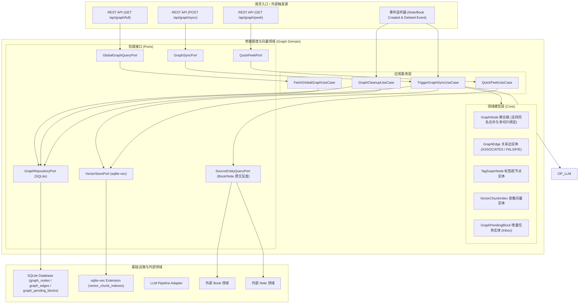
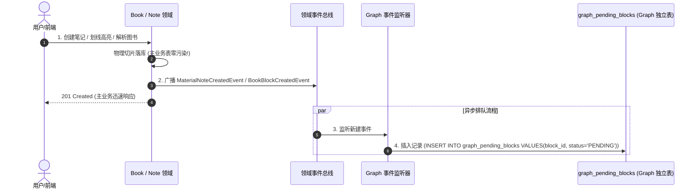
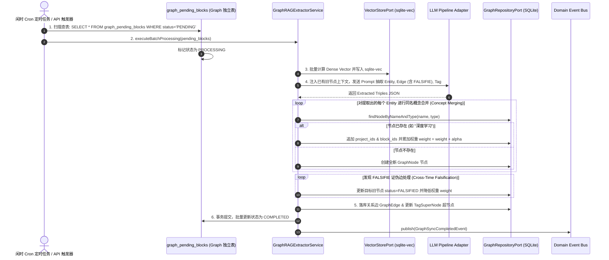
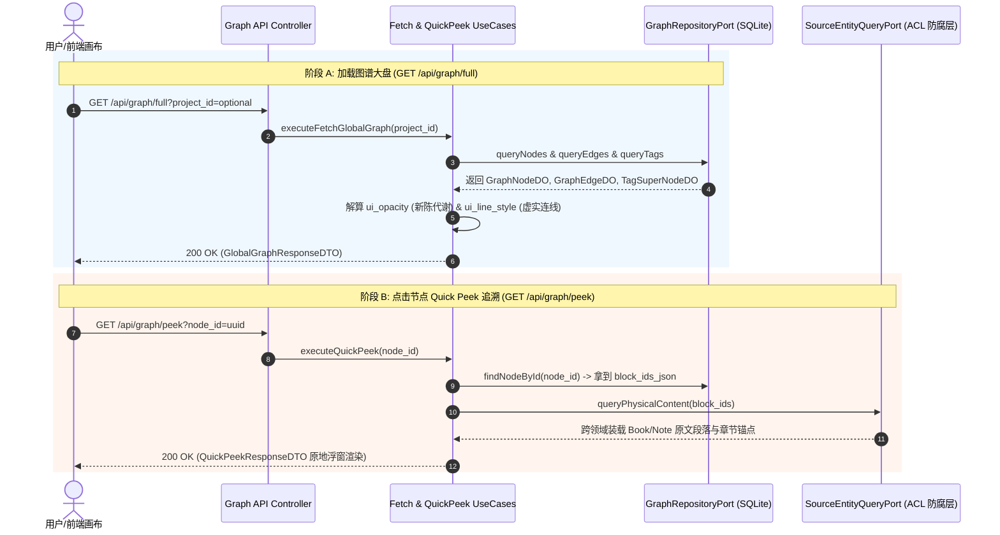
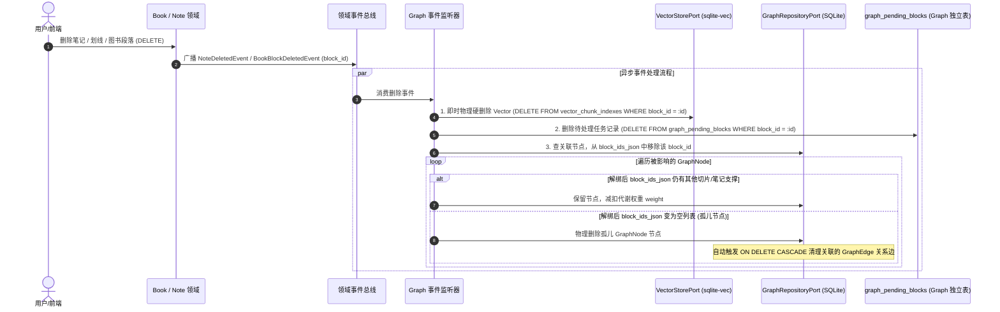
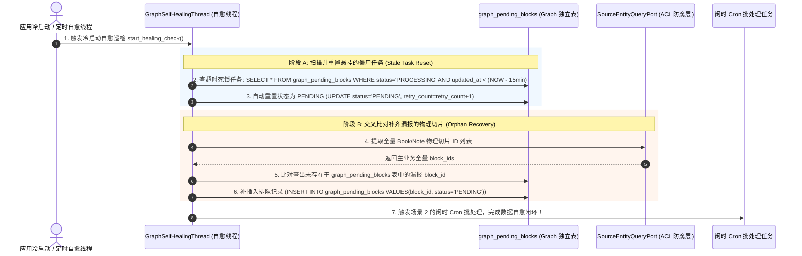
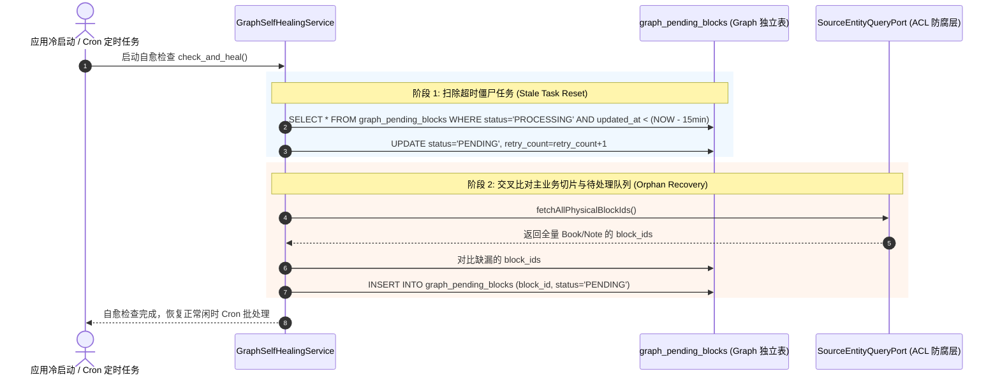

# 旁路图谱与向量领域 (Graph Domain) 后端设计规范 v1.0

> [!IMPORTANT]
> 本文档基于 [业务模型规范](../../03_business_modeling/business_model.md)、[交互流程规范](../../04_interaction_design/flow_interaction-v1.0.md)、[后端系统架构设计规范](../../06_system_architecture/architecture_backend_design_spec_v1.0.md)、[数据模型规范](../../07_data_model/data_model_spec_v1.0.md) 以及 [图谱 API 规范](../../08_api_specification/modules/graph/graph_api.md) 编写。
> 本文档聚焦 `domain/graph` 限界上下文内部的完整工程闭环，涵盖 **密集向量 (Dense RAG) 独立检索缓存**、**闲时 Cron 批量图谱建图 (Graph RAG)**、**全屏大盘与 Quick Peek 无跳跃追溯**、**同名实体概念合并** 以及 **物理删改级联清理**。

---

## 一、 目标与功能契约

### 1. 核心定位与设计原则

旁路图谱与向量领域 (Graph & Vector Domain) 是系统中承载全局认知网状联想、Dense RAG 检索引擎与知识新陈代谢的核心中枢。遵循以下三大工程铁律：

* **旁路隔离与 Token 成本控制**：上游 Book/Note 领域创建切片时主业务零阻塞响应。Graph 侧通过独立的 `graph_pending_blocks` 任务表排队，由闲时 Cron 定时任务批量调用 LLM 算力，大幅降低 Token 费用并规避 Rate Limit 频控。
* **Dense RAG 纯粹性**：`sqlite-vec` 虚表仅存储纯粹的物理段落/笔记切片向量（`BOOK_BLOCK` / `NOTE_CARD`），不塞入任何派生摘要，保证 Agent 问答与语义检索的高确定性。
* **证伪与代谢 100% 封闭**：`FALSIFIE` 证伪关系边、状态更迭 (`FALSIFIED`/`DECAYED`) 以及代谢降权 (`ui_opacity`) 严格封闭在 Graph 内部（只修改 `graph_nodes` 和 `graph_edges`），绝不上侵修改 Book/Note/Task 等主业务物理表。

---

### 2. 对外暴露的领域功能契约 (Domain Services)

| 领域服务名称 | 调用的目标领域 / 模块 | 服务能力描述 | 领域契约与约束 |
| :--- | :--- | :--- | :--- |
| **闲时增量构建服务** <br>`GraphSyncService` | 接入层 REST API / 定时任务 | 扫描 `graph_pending_blocks` 表，批量计算 Dense Vector 存入 `sqlite-vec`，调 LLM 抽取实体关系落库。 | 纯后台异步解耦，支持 API 手动与 Cron 闲时触发 |
| **Quick Peek 追溯解析服务** <br>`QuickPeekService` | 全局图谱视图 / 接入层 REST API | 根据 `node_id` 反查 `block_ids`，跨领域装载源富文本段落与页面/章节锚点。 | 无跳跃追溯，统一返回 `QuickPeekVO` |
| **全局图谱视图加载服务** <br>`GlobalGraphQueryService` | 全局图谱视图 / 接入层 REST API | 查询项目或全局粒度的节点 (`GraphNode`)、超节点 (`TagSuperNode`) 及关系边 (`GraphEdge`) 集合。 | 支持按项目/标签过滤与透明度/虚实算子解算 |
| **删除级联清理服务** <br>`GraphCleanupService` | 事件总线 / 领域事件监听器 | 消费 `NoteDeletedEvent` / `BookBlockDeletedEvent`，即时硬删除向量并修剪孤儿图谱节点。 | 即时硬删除向量，Graph 侧解绑与孤儿修剪 |

---

### 3. 六边形架构分层映射



---

## 二、 领域模型与核心数据结构

### 1. 实体与模型定义 (DO / Domain)

#### (1) 图谱增量待处理任务 (`GraphPendingBlockDO` - Inbox 机制)
* **定义**：Graph 领域独立的旁路事件排队任务实体，用于主业务零污染解耦。

```python
from dataclasses import dataclass, field
from datetime import datetime
from typing import List, Optional
from enum import Enum

class PendingStatusEnum(str, Enum):
    PENDING = "PENDING"             # 待处理
    PROCESSING = "PROCESSING"       # 处理中
    COMPLETED = "COMPLETED"         # 已完成
    FAILED = "FAILED"               # 失败重试

@dataclass
class GraphPendingBlockDO:
    id: str                         # 主键 UUID
    block_id: str                   # 切片/笔记物理 ID (唯一索引)
    source_type: str                # BOOK_BLOCK / NOTE_CARD
    project_id: str                 # 归属项目 ID
    status: str = "PENDING"         # PENDING / PROCESSING / COMPLETED / FAILED
    retry_count: int = 0            # 重试次数
    created_at: datetime = field(default_factory=datetime.now)
    updated_at: datetime = field(default_factory=datetime.now)
```

#### (2) 知识原子节点 (`GraphNodeDO` - 支持同名合并)

```python
class GraphNodeEntityTypeEnum(str, Enum):
    CONCEPT = "CONCEPT"             # 概念
    METHODOLOGY = "METHODOLOGY"     # 方法论
    TOOL = "TOOL"                   # 工具

class GraphNodeStatusEnum(str, Enum):
    ACTIVE = "ACTIVE"               # 活跃
    FALSIFIED = "FALSIFIED"         # 被证伪/反驳
    DECAYED = "DECAYED"             # 衰变

@dataclass
class GraphNodeDO:
    id: str                         # 主键 UUID
    name: str                       # 实体概念名称 (唯一约束: name + entity_type)
    entity_type: str                # CONCEPT / METHODOLOGY / TOOL
    source_id: str                  # 首次提炼来源 ID
    project_ids_json: str           # JSON 数组，如 '["proj_A", "proj_B"]' (跨项目多归属)
    block_ids_json: str             # JSON 数组，如 '["block_1", "block_2"]' (跨项目多切片绑定)
    weight: float = 1.0             # 置信度与代谢权重 (多项目/切片引用自动加权)
    status: str = "ACTIVE"          # ACTIVE / FALSIFIED / DECAYED
    created_at: datetime = field(default_factory=datetime.now)
    updated_at: datetime = field(default_factory=datetime.now)

@dataclass
class GraphNodeDomain(GraphNodeDO):
    project_ids: List[str] = field(default_factory=list)
    block_ids: List[str] = field(default_factory=list)
    related_edges: List['GraphEdgeDomain'] = field(default_factory=list)
    tag_super_nodes: List['TagSuperNodeDomain'] = field(default_factory=list)

@dataclass
class GraphNodeVO:
    id: str
    name: str
    entity_type: str
    project_ids: List[str]
    weight: float
    status: str
    ui_opacity: float               # 视觉透明度 (weight < 0.4 或 DECAYED/FALSIFIED 时降至 0.4)
    ui_color_code: str              # 节点色彩映射
```

#### (3) 认知关系边 (`GraphEdgeDO` / `Domain` / `VO`)

```python
class GraphRelationTypeEnum(str, Enum):
    ASSOCIATES = "ASSOCIATES"       # 关联
    FALSIFIE = "FALSIFIE"           # 证伪/反驳

@dataclass
class GraphEdgeDO:
    id: str                         # 主键 UUID
    source_node_id: str             # 起始节点 ID
    target_node_id: str             # 目标节点 ID
    relation_type: str              # ASSOCIATES / FALSIFIE
    weight: float = 1.0             # 关系边权重
    created_at: datetime = field(default_factory=datetime.now)
    updated_at: datetime = field(default_factory=datetime.now)

@dataclass
class GraphEdgeVO:
    id: str
    source_node_id: str
    target_node_id: str
    relation_type: str
    ui_line_style: str              # ASSOCIATES: "solid"; FALSIFIE: "dashed"
    ui_line_color: str              # ASSOCIATES: #3B82F6; FALSIFIE: #EF4444
```

#### (4) 密集向量切片索引 (`VectorChunkIndexDO` - sqlite-vec)

```python
@dataclass
class VectorChunkIndexDO:
    id: str                         # 主键 UUID
    source_type: str                # BOOK_BLOCK / NOTE_CARD
    source_id: str                  # 归属主体 ID
    block_id: str                   # 物理段落切片 ID
    embedding: bytes                # Dense Vector (1536 维 FloatArray 字节流)
    text_hash: str                  # 文本 SHA-256 哈希
    created_at: datetime
```

---

## 三、 拆分场景核心流程与序列图

### 场景 1：新增笔记/切片的事件监听与异步排队流程

主业务（Book/Note）新增切片时，立即返回 201 Created。Graph 事件监听器接收事件广播后，只往独立的 `graph_pending_blocks` 表写 PENDING 记录，主业务表**零污染**。



---

### 场景 2：闲时 Cron 批量向量化与 Graph RAG 构建流程

后台定时任务 (Cron) 自动拉取 `PENDING` 记录，打包调用 LLM Batch API 完成向量计算与实体抽取落库。



---

### 场景 3：全屏图谱大盘渲染与 Quick Peek 无跳跃追溯流程

渲染全局/项目图谱大盘，点击节点原地弹出浮窗追溯源富文本与位置锚点。



---

### 场景 4：数据删除场景与级联清理流程

用户在主业务中删除图书切片或笔记时，Graph 模块进行向量即时硬删除与孤儿节点修剪。



---

### 场景 5：冷启动与后台定时自愈线程交互流程 (Self-Healing Thread Flow)

应用系统冷启动时或后台后台自愈线程 (`GraphSelfHealingThread`) 定时触发运行，自动发现并自愈异常断电、强杀程序留下的僵尸任务与遗漏切片。



#### 自愈线程处理规则：
1. **僵尸任务重置 (PROCESSING Reset)**：针对中途断电强杀死锁在 `PROCESSING` 状态的任务，超时 15 分钟自动重置为 `PENDING`，以便重新排队。
2. **切片漏报补齐 (Missing Block Recovery)**：比对主业务物理切片与 Graph 排队表，发现广播丢失的切片时自动补插入 `graph_pending_blocks`（`status = 'PENDING'`）。
3. **闭环触发**：自愈修复完成后，自动唤醒场景 2 的 Cron 批处理，彻底恢复系统数据的最终一致性。

---

## 四、 接口规范与防腐层设计 (DTOs & RFC 7807)

### 1. Data Transfer Objects (DTO)

```python
class QuickPeekResponseDTO(BaseModel):
    node_id: str
    type: str                           # READING_NOTE / BOOK_BLOCK / EXPERIENCE_NOTE
    content: str                        # 富文本切片内容
    source_anchor: Dict[str, Any]       # {"project_id": "str", "page_or_chapter_id": "str", "block_id": "str"}

class GlobalGraphResponseDTO(BaseModel):
    nodes: List[GraphNodeVO]
    edges: List[GraphEdgeVO]
    tag_super_nodes: List[TagSuperNodeVO]
```

### 2. RFC 7807 统一异常映射

```json
{
  "type": "https://api.ihaveaplan.com/errors/GRAPH_NODE_NOT_FOUND",
  "title": "Graph Node Not Found",
  "status": 404,
  "detail": "指定的图谱节点 node_881923 不存在或已被清理。",
  "instance": "/api/graph/peek?node_id=node_881923",
  "code": "GRAPH_NODE_NOT_FOUND"
}
```

---

## 五、 存储设计 (SQLite DDL)

```sql
-- 1. 图谱增量待处理任务表 (Inbox 机制)
CREATE TABLE IF NOT EXISTS graph_pending_blocks (
    id VARCHAR(36) PRIMARY KEY,
    block_id VARCHAR(36) NOT NULL UNIQUE,
    source_type VARCHAR(32) NOT NULL,    -- BOOK_BLOCK / NOTE_CARD
    project_id VARCHAR(36) NOT NULL,
    status VARCHAR(32) NOT NULL DEFAULT 'PENDING', -- PENDING / PROCESSING / COMPLETED / FAILED
    retry_count INTEGER NOT NULL DEFAULT 0,
    created_at TIMESTAMP NOT NULL DEFAULT CURRENT_TIMESTAMP,
    updated_at TIMESTAMP NOT NULL DEFAULT CURRENT_TIMESTAMP
);
CREATE INDEX idx_pending_status_project ON graph_pending_blocks(status, project_id);

-- 2. 知识原子节点表 (支持同名合并)
CREATE TABLE IF NOT EXISTS graph_nodes (
    id VARCHAR(36) PRIMARY KEY,
    name VARCHAR(128) NOT NULL,
    entity_type VARCHAR(32) NOT NULL, -- CONCEPT / METHODOLOGY / TOOL
    source_id VARCHAR(36) NOT NULL,
    project_ids_json TEXT NOT NULL,   -- JSON Array e.g. ["proj_A", "proj_B"]
    block_ids_json TEXT NOT NULL,     -- JSON Array of block IDs
    weight REAL NOT NULL DEFAULT 1.0,
    status VARCHAR(32) NOT NULL DEFAULT 'ACTIVE', -- ACTIVE / FALSIFIED / DECAYED
    created_at TIMESTAMP NOT NULL DEFAULT CURRENT_TIMESTAMP,
    updated_at TIMESTAMP NOT NULL DEFAULT CURRENT_TIMESTAMP,
    CONSTRAINT uq_graph_node_name_type UNIQUE (name, entity_type)
);
CREATE INDEX idx_graph_nodes_source ON graph_nodes(source_id);
CREATE INDEX idx_graph_nodes_status ON graph_nodes(status);

-- 3. 认知关系边表
CREATE TABLE IF NOT EXISTS graph_edges (
    id VARCHAR(36) PRIMARY KEY,
    source_node_id VARCHAR(36) NOT NULL,
    target_node_id VARCHAR(36) NOT NULL,
    relation_type VARCHAR(32) NOT NULL, -- ASSOCIATES / FALSIFIE
    weight REAL NOT NULL DEFAULT 1.0,
    created_at TIMESTAMP NOT NULL DEFAULT CURRENT_TIMESTAMP,
    updated_at TIMESTAMP NOT NULL DEFAULT CURRENT_TIMESTAMP,
    FOREIGN KEY (source_node_id) REFERENCES graph_nodes(id) ON DELETE CASCADE,
    FOREIGN KEY (target_node_id) REFERENCES graph_nodes(id) ON DELETE CASCADE
);
CREATE INDEX idx_graph_edges_src_tgt ON graph_edges(source_node_id, target_node_id);

-- 4. 全局标签超节点表
CREATE TABLE IF NOT EXISTS tag_super_nodes (
    id VARCHAR(36) PRIMARY KEY,
    name VARCHAR(64) NOT NULL UNIQUE,
    synonym_tags_json TEXT,
    node_count INTEGER NOT NULL DEFAULT 0,
    created_at TIMESTAMP NOT NULL DEFAULT CURRENT_TIMESTAMP
);

-- 5. sqlite-vec 密集向量扩展虚表
CREATE VIRTUAL TABLE IF NOT EXISTS vector_chunk_indexes USING vec0(
    id text primary key,
    source_type text,
    source_id text,
    block_id text,
    text_hash text,
    embedding float[1536]
);
```

---

## 六、 目录结构与模块文件映射

```text
backend/
├── app/
│   └── api/
│       └── v1/
│           └── graph.py                   # REST API 接入层 Controller (POST /sync, GET /peek, GET /full)
└── domain/
    └── graph/
        ├── __init__.py
        ├── config.py                      # 领域配置 (向量维度、衰变系数)
        ├── models/                        # 数据模型与实体定义
        │   ├── vector_index.py            # VectorChunkIndexDO
        │   ├── graph_node.py              # GraphNodeDO / Domain / VO
        │   ├── graph_edge.py              # GraphEdgeDO / Domain / VO
        │   ├── tag_super_node.py          # TagSuperNodeDO / Domain / VO
        │   └── pending_block.py           # GraphPendingBlockDO
        ├── services/                      # 领域服务与 UseCases
        │   ├── graph_sync_service.py      # TriggerGraphSyncUseCase & 增量 Cron 批处理
        │   ├── quick_peek_service.py      # QuickPeekUseCase & 无跳跃溯源
        │   ├── global_graph_service.py    # FetchGlobalGraphUseCase & 视图组装
        │   ├── cleanup_service.py         # GraphCleanupUseCase (删改向量硬删除与孤儿修剪)
        │   └── healing_service.py         # GraphSelfHealingService (崩溃自愈与僵尸任务重置)
        ├── ports/                         # 端口定义
        │   ├── inbound/
        │   │   └── graph_ports.py
        │   └── outbound/
        │       ├── graph_repository_port.py
        │       ├── vector_store_port.py
        │       ├── llm_graph_rag_port.py
        │       └── source_entity_port.py
        └── adapters/                      # 适配器与 ACL 防腐层
            ├── repository/
            │   ├── sqlite_graph_repo.py   # SQLite 持久化实现
            │   └── sqlite_vec_store.py    # sqlite-vec 扩展适配器实现
            └── acl/
                ├── llm_pipeline_acl.py    # LLM Graph RAG 提取防腐层
                └── source_entity_acl.py   # Book / Note 物理源切片反查防腐层
```

---

## 七、 容错控制、崩溃自愈与一致性保障 (Fault Tolerance & Self-Healing)

在单机本地或客户端运行环境中，系统可能面临软件强杀 (`SIGKILL`)、断电崩溃或 LLM 网络超时等异常。Graph 模块通过 **`GraphSelfHealingService` (图谱旁路自愈服务)** 确保数据的最终一致性。

### 1. 软件异常关闭场景分析与自愈方案

| 异常场景 | 物理表现与问题分析 | 系统自愈与修复策略 | 最终一致性保障 |
| :--- | :--- | :--- | :--- |
| **1. 批处理中途断电/强杀 (`PROCESSING` 僵尸任务)** | 闲时 Cron 任务正在处理批处理切片，将 `graph_pending_blocks` 标记为 `PROCESSING` 后遭遇系统崩溃强杀 | **冷启动自愈**：`GraphSelfHealingService` 扫描 `status = 'PROCESSING'` 且超时 15 分钟的记录，自动将其重置为 `PENDING` 并增加 `retry_count` | 避免僵尸任务死锁，重启后重新排队批量处理 |
| **2. 事件广播丢失/漏报 (切片未排队)** | Note 领域落盘成功，但由于进程强杀导致 `NoteCreatedEvent` 广播丢失，Graph 未收到排队通知 | **冷启动交叉比对**：自愈服务通过 `SourceEntityQueryPort` 对比 Note/Book 物理切片表与 `graph_pending_blocks` / `sqlite-vec`，自动补发漏报的 `PENDING` 任务记录 | 补齐遗漏切片，确保无盲区 |
| **3. 向量写入完成但图谱落库失败** | `sqlite-vec` 已写入 embedding 向量，但大模型解析超时或 SQLite 写 `graph_nodes` 时发生异常 | **事务原子回滚与幂等补算**：双库写盘使用统一 DB 事务包裹；若失败则 `sqlite-vec` 物理回滚，任务标记为 `FAILED`，在下次 Cron 批处理中进行幂等重试 | 绝不产生只有向量而没有节点的孤岛数据 |
| **4. 连续重试失败 (LLM 格式异常/死锁)** | 单个恶劣切片由于文本特殊，导致大模型持续解析失败 (`retry_count >= 3`) | **隔离进入死信状态**：将 `status` 升级为 `FAILED`，不再阻塞后续正常切片的批处理 | 输出错误日志，隔离故障切片，保障整体系统可用 |

---

### 2. 冷启动自愈服务流程 (GraphSelfHealingService)

系统在应用服务每次启动或闲时 Cron 批处理开始前，自动调度运行 `GraphSelfHealingService`：


