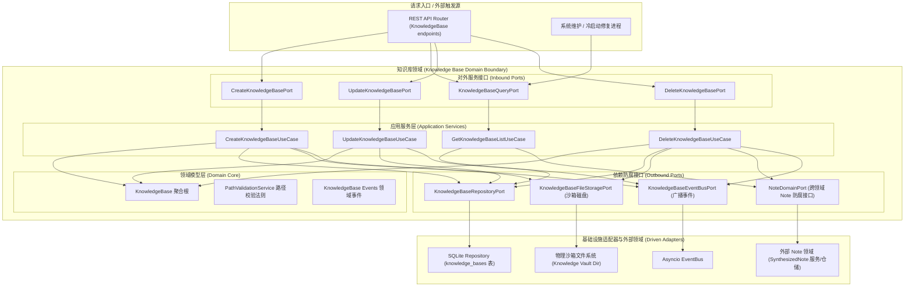
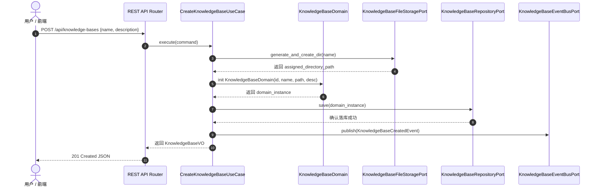
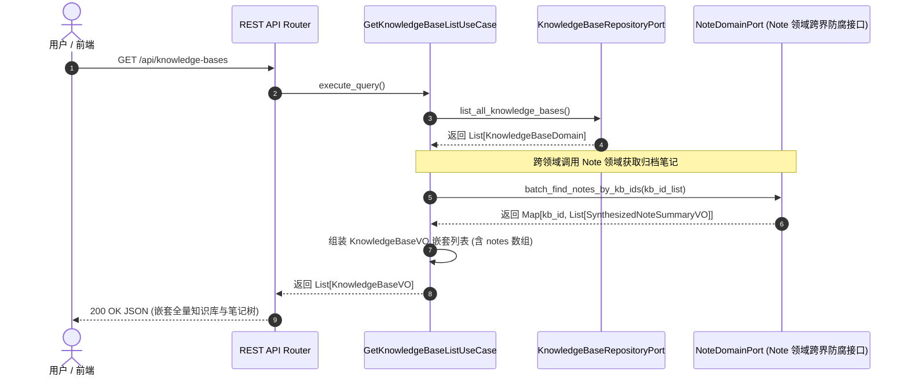
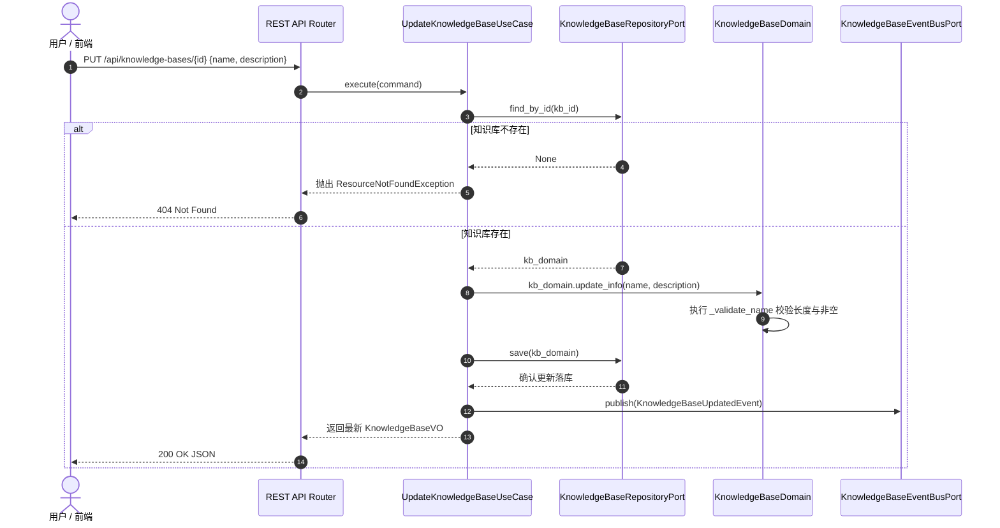
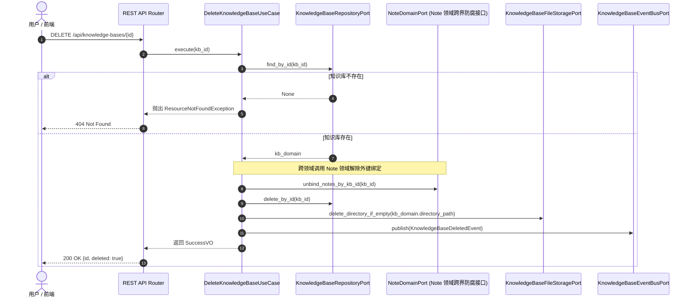
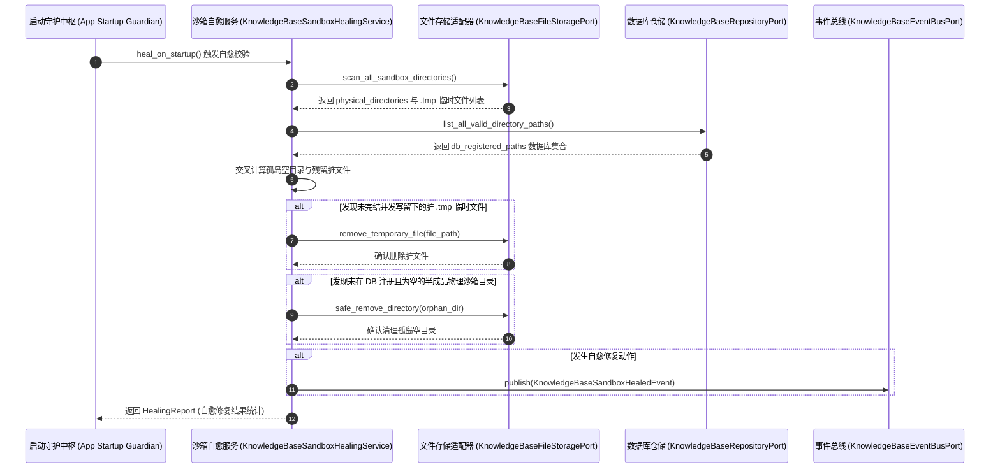

# 知识库领域 (Knowledge Base Domain) 后端设计规范 v1.0

> [!IMPORTANT]
> 本文档基于 [业务模型规范](../../03_business_modeling/business_model.md)、[后端系统架构设计规范](../../06_system_architecture/architecture_backend_design_spec_v1.0.md)、[数据模型规范](../../07_data_model/data_model_spec_v1.0.md) 以及 [知识库 API 规范](../../08_api_specification/modules/note/knowledge_base_api.md) 编写。
> 本文档旨在聚焦 `domain/knowledge` 限界上下文内部的详细设计、物理隔离目录组织、聚合根生命周期管理与分层架构规范。

---

## 一、 目标与功能

### 1. 领域定位与业务目标

知识库领域 (Knowledge Base Domain) 是独立于单一项目生命周期的长效知识资产管理容器。其核心目标包括：

* **长效知识资产隔离**：作为超越具体学习或计划项目生命周期的知识管理容器，统一组织分类收录的知识与沉淀资产。
* **物理存储隔离管理**：为每个知识库在本地沙箱磁盘创建独立的物理文件夹目录，保障 Local-first 场景下的文件隔离与文件系统结构清晰。
* **轻量索引与多维统计**：维护数据库中的知识库元数据与关联项目/笔记的数量统计，支持高效检索与展示。
* **级联安全与防呆清理**：在知识库删除与更新时，执行严格的离线磁盘与逻辑数据校验，防止孤岛垃圾文件或误删物理目录。

---

### 2. 对外暴露的领域功能契约 (Domain Capabilities & Services)

知识库领域向接入层 (REST API) 及其他外部领域提供以下核心能力契约：

| 领域服务名称 | 调用的目标领域 / 模块 | 服务能力描述 | 领域契约与约束 |
| :--- | :--- | :--- | :--- |
| **知识库创建服务** <br>`CreateKnowledgeBaseService` | 接入层 REST API | 校验知识库名称合法性，分配唯一 UUID，在物理沙箱创建对应存储目录，并完成元数据落库。 | 成功后向全局广播 `KnowledgeBaseCreatedEvent` |
| **知识库列表与统计查询服务** <br>`KnowledgeBaseQueryService` | 接入层 REST API / <br>前端交互控制台 | 查询所有知识库列表，动态计算/聚合关联的项目与沉淀笔记数量。 | 只读查询，支持内存缓存与高效统计 |
| **知识库信息更新服务** <br>`UpdateKnowledgeBaseService` | 接入层 REST API | 修改知识库名称、描述及元数据。物理目录名保持不变以保障路径稳定性。 | 成功后向全局广播 `KnowledgeBaseUpdatedEvent` |
| **知识库删除与级联清理服务** <br>`DeleteKnowledgeBaseService` | 接入层 REST API / <br>系统维护服务 | 删除指定知识库元数据，解除关联笔记的归档绑定，并依据策略清理物理沙箱文件。 | 执行防呆校验，成功后广播 `KnowledgeBaseDeletedEvent` |

---

### 3. 六边形架构分层映射

知识库领域严格遵循六边形架构 (Hexagonal Architecture)，其内部与对外 Ports 边界如下：



---

## 二、 领域模型与核心数据结构

### 1. 实体与模型定义

在实现中严格区分持久化数据对象 (DO)、内存充血领域模型 (Domain) 与前端交互视图对象 (VO)。

#### (1) 数据持久化模型 (`KnowledgeBaseDO`)

映射 SQLite 数据库表 `knowledge_bases`。

```python
from dataclasses import dataclass
from datetime import datetime
from typing import Optional

@dataclass
class KnowledgeBaseDO:
    id: str                    # 主键 UUID (如 kb_dist_03)
    name: str                  # 知识库名称
    description: Optional[str] # 知识库描述
    directory_path: str        # 物理磁盘相对路径/绝对路径
    created_at: datetime       # 创建时间
    updated_at: datetime       # 更新时间
```

#### (2) 领域充血模型 (`KnowledgeBaseDomain`)

包含业务校验逻辑与状态更新行为。

```python
class KnowledgeBaseDomain:
    def __init__(
        self,
        id: str,
        name: str,
        directory_path: str,
        description: Optional[str] = None,
        created_at: Optional[datetime] = None,
        updated_at: Optional[datetime] = None
    ):
        self._id = id
        self._name = self._validate_name(name)
        self._description = description
        self._directory_path = directory_path
        self._created_at = created_at or datetime.now()
        self._updated_at = updated_at or datetime.now()

    @staticmethod
    def _validate_name(name: str) -> str:
        cleaned = name.strip()
        if not cleaned:
            raise ValueError("知识库名称不能为空")
        if len(cleaned) > 100:
            raise ValueError("知识库名称不能超过100字符")
        return cleaned

    def update_info(self, name: str, description: Optional[str]) -> None:
        """更新基本信息"""
        self._name = self._validate_name(name)
        self._description = description
        self._updated_at = datetime.now()

    @property
    def id(self) -> str:
        return self._id

    @property
    def name(self) -> str:
        return self._name

    @property
    def description(self) -> Optional[str]:
        return self._description

    @property
    def directory_path(self) -> str:
        return self._directory_path
```

#### (3) 交互视图模型 (`KnowledgeBaseVO`)

对应 REST API 响应。

```python
@dataclass
class KnowledgeBaseVO:
    id: str
    name: str
    description: Optional[str]
    directory_path: str
    project_count: int                   # 动态聚合项目数量
    note_count: int                      # 动态聚合笔记数量
    created_at: str                      # ISO 8601 格式字符串
    updated_at: str                      # ISO 8601 格式字符串
    notes: List[SynthesizedNoteSummaryVO] = field(default_factory=list) # 嵌套归档笔记列表
```

---

### 2. 领域事件定义

| 事件名称 | 触发时机 | 携带载荷数据 | 订阅方与后续动作 |
| :--- | :--- | :--- | :--- |
| `KnowledgeBaseCreatedEvent` | 知识库创建并落盘成功 | `kb_id`, `name`, `directory_path`, `timestamp` | 日志审计、旁路索引初始化 |
| `KnowledgeBaseUpdatedEvent` | 知识库名称或描述更新 | `kb_id`, `name`, `timestamp` | 缓存失效与更新 |
| `KnowledgeBaseDeletedEvent` | 知识库删除成功 | `kb_id`, `directory_path`, `timestamp` | 解除笔记归档绑定、异步清理缓存 |

---

## 三、 核心业务流程与交互设计

### 1. 知识库创建与物理沙箱目录初始化

展示用户发起创建新知识库时，应用服务校验参数、在磁盘分配物理存储目录并落库持久化的流程。



---

### 2. 全量知识库与嵌套归档笔记查询流程

展示前端调用 `GET /api/knowledge-bases` 时，应用服务一次性批量查询所有知识库元数据，并跨领域调用 `NoteDomainPort` 接口获取归档在各个知识库下的沉淀笔记 (`SynthesizedNote`) 列表后组装返回的完整交互流程。



---

### 3. 知识库基本信息更新流程

展示用户修改知识库名称或描述文本时，应用服务校验名称合法性、在数据库更新元数据并保持底层 `directory_path` 路径不变以保证防腐解耦的交互流程。



---

### 4. 知识库删除与级联安全校验

展示知识库删除时的防呆校验、跨领域通知 Note 领域解绑归档外键与物理文件清理流程。



---

### 5. 冷启动沙箱自愈线程修复流程

展示应用软件在经历强行关闭、断电崩溃等意外重启后，冷启动自愈服务 (KnowledgeBaseSandboxHealingService) 自动扫描物理磁盘沙箱与 SQLite 数据库记录，交叉比对并清理孤岛空文件夹及未完结 `.tmp` 临时文件的交互时序。



---

## 四、 分层架构与代码接口定义

### 1. Inbound Ports (应用服务接口)

```python
from abc import ABC, abstractmethod
from typing import List, Optional
from dataclasses import dataclass

@dataclass
class CreateKnowledgeBaseCommand:
    name: str
    description: Optional[str] = None

@dataclass
class UpdateKnowledgeBaseCommand:
    kb_id: str
    name: str
    description: Optional[str] = None

class IKnowledgeBaseApplicationService(ABC):

    @abstractmethod
    async def create_knowledge_base(self, cmd: CreateKnowledgeBaseCommand) -> KnowledgeBaseVO:
        """创建新知识库"""
        pass

    @abstractmethod
    async def get_knowledge_base_list(self) -> List[KnowledgeBaseVO]:
        """获取所有知识库列表及关联项目数统计"""
        pass

    @abstractmethod
    async def get_knowledge_base_notes(
        self, 
        kb_id: str, 
        page: int = 1, 
        page_size: int = 20, 
        note_type: Optional[str] = None, 
        keyword: Optional[str] = None
    ) -> SynthesizedNotePageVO:
        """分页查询归档收录在指定知识库下的沉淀笔记列表"""
        pass

    @abstractmethod
    async def update_knowledge_base(self, cmd: UpdateKnowledgeBaseCommand) -> KnowledgeBaseVO:
        """更新知识库元数据"""
        pass

    @abstractmethod
    async def delete_knowledge_base(self, kb_id: str) -> bool:
        """删除指定知识库"""
        pass
```

---

### 2. Outbound Ports (依赖防腐接口)

```python
class IKnowledgeBaseRepositoryPort(ABC):

    @abstractmethod
    async def save(self, kb: KnowledgeBaseDomain) -> None:
        """保存或更新知识库元数据"""
        pass

    @abstractmethod
    async def find_by_id(self, kb_id: str) -> Optional[KnowledgeBaseDomain]:
        """根据 ID 查询"""
        pass

    @abstractmethod
    async def list_all(self) -> List[KnowledgeBaseDomain]:
        """获取所有知识库实体"""
        pass

    @abstractmethod
    async def count_associated_projects(self, kb_id: str) -> int:
        """统计关联项目数量"""
        pass

    @abstractmethod
    async def delete_by_id(self, kb_id: str) -> None:
        """从 SQLite 移除知识库元数据记录"""
        pass


class INoteDomainPort(ABC):
    """跨领域调用接口：连接 Note 领域 (domain/note) 防腐通道"""

    @abstractmethod
    async def batch_find_notes_by_kb_ids(
        self, kb_ids: List[str]
    ) -> Dict[str, List[SynthesizedNoteSummaryVO]]:
        """跨领域查询指定知识库集合下的沉淀笔记摘要清单"""
        pass

    @abstractmethod
    async def unbind_notes_by_kb_id(self, kb_id: str) -> None:
        """跨领域解除指定知识库下笔记的归档外键绑定"""
        pass


class IKnowledgeBaseFileStoragePort(ABC):

    @abstractmethod
    async def create_storage_directory(self, folder_name: str) -> str:
        """在物理沙箱创建存储文件夹，返回物理绝对/相对路径"""
        pass

    @abstractmethod
    async def safe_remove_directory(self, directory_path: str) -> None:
        """安全移除空文件夹或归档沙箱路径"""
        pass
```

---

## 五、 异常处理与并发容错策略

### 1. 物理目录创建冲突与名称规范化

> [!TIP]
> 当并发创建同名知识库或名称中包含非法文件系统字符（如 `/`, `\`, `:`, `*`）时，仓储与文件适配器执行自动脱敏与 Sanitization。

* **路径安全处理**：使用 `slugify` 或 Hash 后缀防止重名冲突与路径注入攻击。
* **写锁隔离**：文件系统操作使用轻量级 `asyncio.Lock` 避免多线程并发在相同沙箱目录下创建重名文件夹。

---

### 2. 逻辑删除与物理文件自愈校验

> [!WARNING]
> 删除知识库时采用“解除归档绑定 + 逻辑删除 DB 记录 + 安全清理空目录”三步法。

* **归档解除防护**：删除知识库不会删除该知识库下的 `SynthesizedNote` Markdown 原文，仅将其 `knowledge_base_id` 置空，防止数据丢失。
* **物理目录防护**：仅当物理目录下无未被记录的非系统文件时才清理目录，防止误删用户手动放置的外发文件。

---

### 3. 软件包意外关闭问题与容错自愈处理表

在单机桌面应用 (Local-First Desktop App) 运行过程中，软件随时可能遭遇用户强行杀死进程 (`SIGKILL`)、OS 崩溃或断电等意外关闭情况。知识库领域基于“本地数据保护与冷启动自愈 (Crash Recovery)”原则，对各类意外关闭场景的处理规范如下表所示：

| 异常场景类型 | 意外关闭触发节点 | 产生的问题与隐患 | 容错与冷启动自愈处理机制 | 最终数据一致性状态 |
| :--- | :--- | :--- | :--- | :--- |
| **创建过程意外关闭** | 物理磁盘文件夹已创建，但写 SQLite `knowledge_bases` 之前遭遇崩溃关闭 | 物理沙箱中留下孤岛空文件夹，数据库中缺失对应记录 | 冷启动时 `KnowledgeBaseSandboxHealingService` 自动扫描沙箱目录，若发现未在 DB 注册的半成品空文件夹，自动执行防呆清理或重新匹配补全 | 物理磁盘与数据库恢复一致，无孤岛垃圾文件夹 |
| **元数据更新意外关闭** | 内存状态已更新，但在写 SQLite `knowledge_bases` 过程中遭遇崩溃关闭 | 内存中更新的数据丢失，数据库中保持修改前的数据 | 基于 SQLite WAL 事务原子性，未提交事务自动回滚。再次启动后读取旧数据，用户重新提交更新即可 | 数据库数据保持事务一致性（回滚至修改前有效状态） |
| **解除归档与删除意外关闭** | 已解除笔记的 `knowledge_base_id` 关联，但在物理磁盘目录清理完成前崩溃关闭 | 数据库对应知识库记录已被移除，但磁盘上留有残留目录结构 | 冷启动自愈线程检查无 DB 关联且为空的物理沙箱目录，安全补齐磁盘擦除动作 | 数据库与物理磁盘彻底清理，无状态漂移 |
| **物理文件并发写意外关闭** | 写入知识库配置或元数据文件时遭遇软件异常强杀关闭 | 正在写入的文件损坏，写入内容为 0 字节或半截数据 | 物理存储采用“先写临时文件 `.tmp` 再原子替换 (`atomic rename`)”，防止原文件损坏；冷启动自动丢弃未完成的 `.tmp` 文件 | 文件保持原有效版本，避免损坏 |
