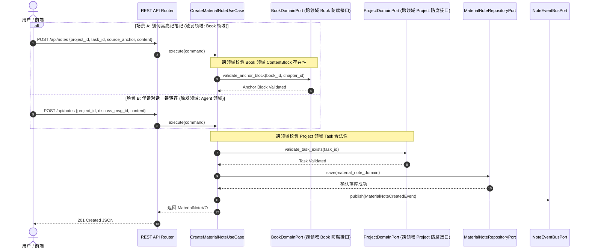
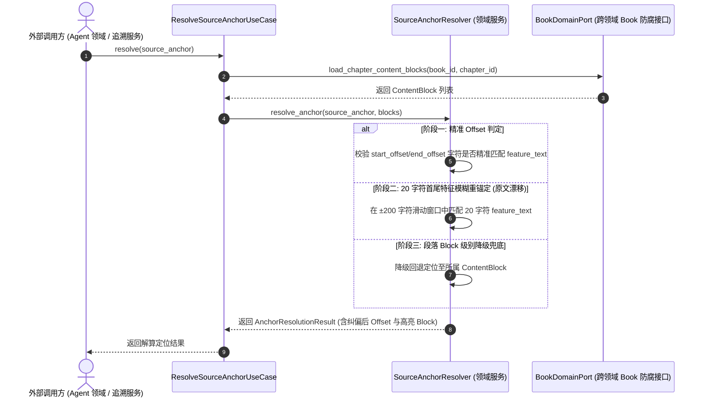
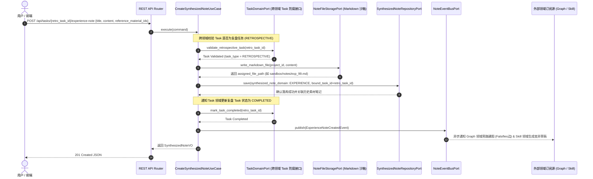
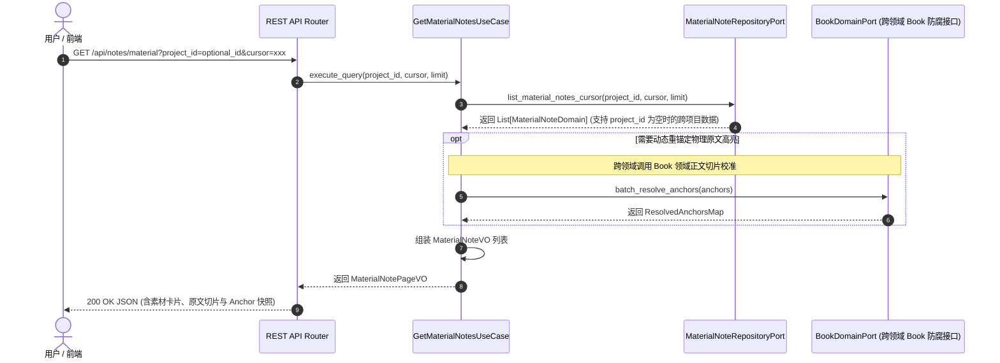
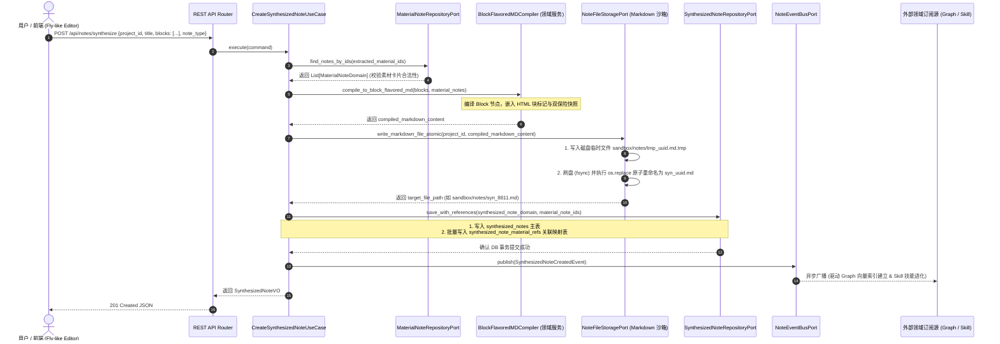
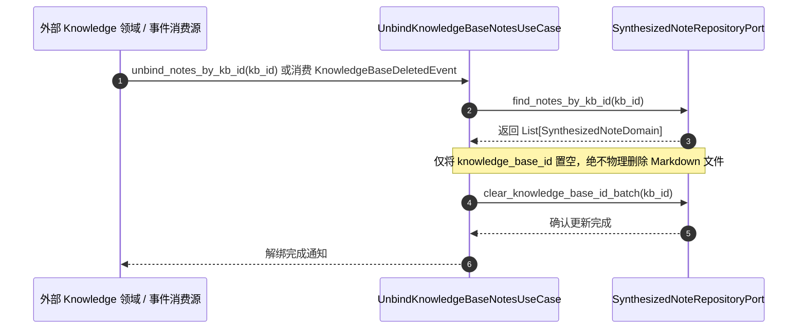
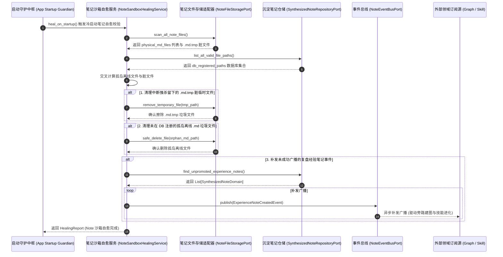

# 笔记领域 (Note Domain) 后端设计规范 v1.0

> [!IMPORTANT]
> 本文档基于 [业务模型规范](../../03_business_modeling/business_model.md)、[后端系统架构设计规范](../../06_system_architecture/architecture_backend_design_spec_v1.0.md)、[数据模型规范](../../07_data_model/data_model_spec_v1.0.md)、[伴读对话与融合笔记 API 规范](../../08_api_specification/modules/note/note_api.md) 以及 [知识库领域后端设计规范](../knowledge/knowledge_backend_design_spec_v1.0.md) 编写。
> 本文档旨在聚焦 `domain/note` 限界上下文内部的详细设计、双通道笔记捕获、物理原文三层容错锚定解算、结项复盘经验笔记生成以及与跨领域的解耦协作规范。

---

## 一、 目标与功能

### 1. 领域定位与业务目标

笔记领域 (Note Domain) 是管理用户阅读感悟、伴读对话转化卡片与结项复盘总结的核心业务大脑。其关键目标包括：

* **双轨双通道笔记捕获**：同构“划词高亮记笔记”（绑定 `Book` 领域正文切片）与“伴读对话一键转存”（绑定 `Agent` 领域伴读回答）双通道数据。
* **物理原文三层容错重锚定**：提供“精准偏移 -> 20 字符上下文特征重锚定 -> 段落降级”三层解算机制，解决原文改动后的锚点漂移问题。
* **微观 Task 物理绑定**：阅读或计划项目中的素材笔记均统一物理挂载至微观 `Task` 实体，为学习与实践提供履约痕迹。
* **知行闭环与结项经验沉淀**：在 `Project` 领域归档时引导用户录入 `SynthesizedNote(type=EXPERIENCE)` 复盘经验笔记，广播领域事件驱动 `Graph` 领域旁路建图与 `Skill` 领域进化变异。
* **File-first (文件优先) Markdown 存储**：遵循 File-first 原则，沉淀笔记的富文本/Markdown 正文在沙箱磁盘文件落盘，SQLite 数据库仅存储元数据与软外键。

---

### 2. 对外暴露的领域功能契约 (Domain Capabilities & Services)

笔记领域向接入层 (REST API) 及其他外部领域提供以下核心能力契约：

| 领域服务名称 | 调用的目标领域 / 模块 | 服务能力描述 | 领域契约与约束 |
| :--- | :--- | :--- | :--- |
| **素材笔记双通道创建服务** <br>`CreateMaterialNoteService` | 接入层 REST API / <br>Book 领域 / Agent 领域 | 支持“划词高亮”与“伴读对话转存”生成素材笔记 (`MaterialNote`)，并持久化 `SourceAnchor` 快照。 | 必须绑定物理 `Task` 实体与项目外键 |
| **三层容错原文锚定解算服务** <br>`SourceAnchorResolutionService` | Agent 领域 (上下文检索) / <br>前端 UI (内存高亮渲染) | 接收 `SourceAnchor` 快照，执行“精准偏移 -> 20 字符特征首尾模糊匹配 -> 段落降级”三层解算法则。 | UI 侧发版渲染由前端 JS 内存直接 0 延时解算 |
| **沉淀与复盘经验笔记生成服务** <br>`CreateSynthesizedNoteService` | 接入层 REST API / <br>Project 领域 (归档触发) | 提炼多源素材笔记或在项目归档时生成 `SynthesizedNote`。 | 成功后广播 `ExperienceNoteCreatedEvent` 驱动旁路建图 |
| **项目笔记 Cursor 分页查询服务** <br>`GetNotesByProjectQueryService` | 接入层 REST API / <br>前端读思侧边栏 | 基于游标 (Cursor) 按时间倒序高效拉取特定项目下的素材与沉淀笔记列表。 | 返回游标分页数据，避免大深度 offset 性能劣化 |
| **知识库解绑与状态维护服务** <br>`UnbindKnowledgeBaseNotesService` | Knowledge 领域 (跨领域防腐调用) | 响应 Knowledge 领域删除动作或消费 `KnowledgeBaseDeletedEvent`，解除笔记的 `knowledge_base_id` 外键。 | 仅置空归档外键，绝不物理删除笔记 Markdown 原文 |

---

### 3. 六边形架构分层映射与外部领域契约

笔记领域严格遵循六边形架构 (Hexagonal Architecture)，其内部与跨领域防腐 Ports 边界如下：

```mermaid
graph TD
    subgraph DrivingAdapters ["请求入口 / 外部领域触发源"]
        REST["REST API Router (Note endpoints)"]
        BookDomainConsumer["Book 领域消费源 (正文事件)"]
        ProjectDomainConsumer["Project 领域消费源 (项目归档硬约束事件)"]
        AgentDomainConsumer["Agent 领域消费源 (伴读回答转化事件)"]
    end

    subgraph HexagonBoundary ["笔记领域 (Note Domain Boundary)"]
        subgraph AppServices ["应用服务层 (Application Services)"]
            UC_Material["CreateMaterialNoteUseCase"]
            UC_Synthesized["CreateSynthesizedNoteUseCase"]
            UC_Anchor["ResolveSourceAnchorUseCase"]
            UC_Query["GetNotesByProjectUseCase"]
            UC_Unbind["UnbindKnowledgeBaseNotesUseCase"]
        end

        subgraph DomainModel ["领域模型层 (Domain Core)"]
            MatNoteAgg["MaterialNote 聚合根"]
            SynNoteAgg["SynthesizedNote 聚合根"]
            AnchorValueObject["SourceAnchor 三层解算法则"]
        end

        subgraph InboundPorts ["对外服务接口 (Inbound Ports)"]
            IP_Material["MaterialNotePort"]
            IP_Synthesized["SynthesizedNotePort"]
            IP_Anchor["SourceAnchorPort"]
            IP_Query["NoteQueryPort"]
            IP_Unbind["KnowledgeBaseUnbindPort (供 Knowledge 领域调)"]
        end

        subgraph OutboundPorts ["依赖防腐接口 (Outbound Ports)"]
            OP_RepoMat["MaterialNoteRepositoryPort"]
            OP_RepoSyn["SynthesizedNoteRepositoryPort"]
            OP_FS["NoteFileStoragePort (Markdown 沙箱)"]
            OP_Event["NoteEventBusPort (广播事件)"]
            OP_BookDomain["BookDomainPort (跨领域 Book 物理段落查询)"]
            OP_AgentDomain["AgentDomainPort (跨领域 Agent 对话快照)"]
            OP_ProjectDomain["ProjectDomainPort (跨领域 Task/Project 校验)"]
        end
    end

    subgraph Infrastructure ["基础设施适配器与外部领域 (Driven Adapters)"]
        DB_Mat["SQLite Repository (material_notes 表)"]
        DB_Syn["SQLite Repository (synthesized_notes 表)"]
        SandboxFS["物理沙箱文件系统 (Notes Markdown Dir)"]
        EventBus["Asyncio EventBus"]
        ExternalBookDomain["外部 Book 领域 (ContentBlock 查询)"]
        ExternalAgentDomain["External Agent 领域 (Discuss Session)"]
        ExternalProjectDomain["External Project 领域 (Task/Project 状态)"]
    end

    REST --> IP_Material
    REST --> IP_Synthesized
    REST --> IP_Query
    BookDomainConsumer --> IP_Material
    AgentDomainConsumer --> IP_Material
    ProjectDomainConsumer --> IP_Synthesized

    IP_Material --> UC_Material
    IP_Synthesized --> UC_Synthesized
    IP_Anchor --> UC_Anchor
    IP_Query --> UC_Query
    IP_Unbind --> UC_Unbind

    UC_Material --> MatNoteAgg
    UC_Synthesized --> SynNoteAgg
    UC_Anchor --> AnchorValueObject

    UC_Material --> OP_RepoMat
    UC_Material --> OP_BookDomain
    UC_Material --> OP_ProjectDomain
    UC_Material --> OP_Event

    UC_Synthesized --> OP_RepoSyn
    UC_Synthesized --> OP_FS
    UC_Synthesized --> OP_ProjectDomain
    UC_Synthesized --> OP_Event

    UC_Anchor --> OP_BookDomain

    OP_RepoMat --> DB_Mat
    OP_RepoSyn --> DB_Syn
    OP_FS --> SandboxFS
    OP_Event --> EventBus
    OP_BookDomain --> ExternalBookDomain
    OP_AgentDomain --> ExternalAgentDomain
    OP_ProjectDomain --> ExternalProjectDomain
```



---

## 二、 领域模型与核心数据结构

### 1. 实体与模型定义

在实现中严格区分持久化数据对象 (DO)、内存充血领域模型 (Domain) 与前端交互视图对象 (VO)。

#### (1) 素材笔记模型 (`MaterialNoteDO` / `Domain` / `VO`)

* **定义**：原子级知识素材卡片，既可在阅读过程中基于原文片段生成，也可在 Task/计划项目执行过程中挂载到具体 Task 下记录思考。
* **结构**：统一由“素材/参考片段” + “个人转述” + “知识点关联自身经历/情景”三要素构成。

```python
from dataclasses import dataclass
from datetime import datetime
from typing import Optional

@dataclass
class SourceAnchorVO:
    book_id: str
    chapter_id: str
    start_offset: int
    end_offset: int
    feature_text: str  # 20 字符首尾容错特征文本

@dataclass
class MaterialNoteDO:
    id: str                        # 主键 UUID
    project_id: str                # 物理归属项目外键
    task_id: str                   # 物理挂载 Task 外键
    source_type: str               # BOOK_BLOCK / NOTE_CARD / DISCUSS_MSG
    raw_quote: Optional[str]       # 素材/原文参考片段
    user_interpretation: str       # 个人转述
    context_reflection: Optional[str] # 关联自身经历/情景
    anchor_json: Optional[str]     # SourceAnchor 的 JSON 序列化字符串
    created_at: datetime
    updated_at: datetime
```

#### (2) 飞书式 Block 块级沉淀与复盘经验笔记模型 (`SynthesizedNoteDO` / `Domain` / `VO`)

* **定义**：基于自由内容块 (Block-based) 编排与多源素材卡片引用的综合知识文档，或项目完结时生成的复盘经验笔记 (`type=EXPERIENCE`)。
* **存储法则 (Block-Flavored MD)**：物理落盘为标准的 Markdown (`.md`) 文件，内部支持自由段落 Block、标题 Block 以及带 `<!-- block:material_ref id="mat_01" -->` 的素材引用卡片 Block。
* **双保险引用契约**：插入 `MATERIAL_REF` 素材卡片 Block 时，采用**软引用 ID + 静态文本快照双保险机制**，既保持原素材卡片的溯源绑定，又防止素材后续变动导致文档显示断裂。

```python
@dataclass
class DocumentBlockVO:
    block_id: str                          # 块唯一 ID
    block_type: str                        # PARAGRAPH / HEADING / MATERIAL_REF / TASK_REF / CODE / QUOTE
    content: str                           # 文本内容或 Markdown
    material_note_id: Optional[str] = None # 关联素材笔记 ID (若为 MATERIAL_REF 块)
    quote_snapshot: Optional[str] = None   # 素材原文快照
    interpretation_snapshot: Optional[str] = None # 素材转述快照

@dataclass
class SynthesizedNoteDO:
    id: str                        # 主键 UUID
    project_id: str                # 物理归属项目外键
    knowledge_base_id: Optional[str] # 归属知识库外键 (可选)
    title: str                     # 笔记标题
    type: str                      # GENERAL (常规沉淀) / EXPERIENCE (结项经验)
    file_path: str                 # 磁盘 Block-Flavored MD 文件的物理相对路径
    summary: Optional[str]         # 摘要提炼
    created_at: datetime
    updated_at: datetime
```

---

### 2. 领域事件定义

| 事件名称 | 触发时机 | 携带载荷数据 | 订阅方与后续动作 |
| :--- | :--- | :--- | :--- |
| `MaterialNoteCreatedEvent` | 素材笔记捕获并落库成功 | `note_id`, `project_id`, `task_id`, `timestamp` | 日志审计、旁路 Graph 实体提取 |
| `SynthesizedNoteCreatedEvent` | 综合沉淀笔记合并落盘成功 | `note_id`, `project_id`, `knowledge_base_id`, `file_path` | 全局向量索引建立、日志审计 |
| `ExperienceNoteCreatedEvent` | 结项复盘经验笔记生成落地 | `note_id`, `project_id`, `file_path`, `timestamp` | **触发 Graph 领域旁路建图 (Falsifies 边标记) 与 Skill 领域变异进化** |

---

## 三、 核心业务流程与交互设计

### 1. 划词高亮/伴读转化生成素材笔记流程

* **触发领域**：`Book 领域`（划词高亮与正文切片绑定）/ `Agent 领域`（伴读对话回答卡片一键转化）。
* **业务语义**：用户划词或将伴读回答存为笔记，应用服务校验 `Book` 领域与 `Project` 领域的 Task 状态后持久化 `MaterialNote` 与 `SourceAnchor`。



---

### 2. 三层容错原文锚点解算与高亮追溯流程

* **触发领域**：`前端 UI`（视觉高亮 0 延时计算）/ `Agent 领域`（旁路知识提炼与上下文检索调算）。
* **解算法则**：精准偏移 -> 20 字符上下文特征重锚定 -> 段落降级。



---

### 3. 复盘 Task 引导与经验笔记 (Experience Note) 生成流程

* **触发领域**：`Task 领域`（复盘 Task `task_type = RETROSPECTIVE` 履约触发）与 `Project 领域`（项目完结选择挂载）。

展示计划项目完成后，系统/用户选择生成复盘 Task（类型为 `RETROSPECTIVE`），复盘 Task 卡片中汇总展示项目历史素材笔记供用户参考，用户在该复盘 Task 中录入复盘感悟与实战心得，作为笔记实体绑定至 `task_id`，并驱动旁路建图与 Skill 变异进化的完整交互流程。



---

### 4. 素材笔记列表与可引用片段查询流程 (支持跨项目)

* **触发领域**：`接入层`（前端 UI 侧边栏/全局素材库发起）/ `Agent 领域`（Agent 技能提炼前读取上下文）。

展示用户在创建沉淀笔记或发起技能提炼前，向后端拉取素材笔记 (`MaterialNote`) 列表（包含原文参考片段 `raw_quote` 与 `SourceAnchor` 物理锚点快照）的交互流程。支持跨项目全局拉取，`project_id` 为可选过滤参数。



---

### 5. 素材笔记提炼合并为沉淀笔记流程 (飞书式 Block 编译与物理落盘机制)

* **触发领域**：`接入层`（用户基于查出的素材列表勾选提炼与飞书式编辑器编排）/ `Agent 领域`（Agent 启发式技能提炼引导）。

#### (1) 物理存储与双保险快照机制

在飞书式 Block 块级文档落盘时，应用服务联动领域服务与基础设施适配器完成以下两阶段处理：

1. **块级文本编译 (Block-Flavored MD Compilation)**：
   - 领域编译器服务 `BlockFlavoredMDCompiler` 将接收到的 Block 数组解析组合。
   - 当遇到 `MATERIAL_REF` 素材引用卡片 Block 时，向底层注入 HTML 注释块标识（如 `<!-- block:material_ref id="mat_9918" -->`），并嵌入素材原文与转述的静态文本快照，构成双保险机制。
2. **原子化物理刷盘 (Atomic File Persistence)**：
   - 磁盘文件适配器 `NoteFileStoragePort` 遵守文件写隔离原则，先在沙箱 `sandbox/notes/` 创建临时文件 `tmp_{uuid}.md.tmp` 并全量写入编译后的 Markdown 字符串。
   - 文件物理刷盘 (`flush & fsync`) 完成后，调用 `os.replace` 原子重命名为目标路径 `sandbox/notes/syn_{uuid}.md`，防止进程崩溃强杀时产生 0 字节损坏文件。
3. **SQLite 关系与元数据双写**：
   - 在 SQLite `synthesized_notes` 表持久化文档主记录（包含 `id`, `project_id`, `title`, `file_path`, `type`）。
   - 在 `synthesized_note_material_refs` 中间映射表批量写入关联引用关系（`synthesized_note_id` -> `material_note_id`）。

#### (2) 详细交互时序图



---

#### (3) 交互流程异常中断与防呆回滚处理表

针对飞书式 Block 沉淀笔记在编译、磁盘落盘与数据库写入各阶段发生的异常中断，后端具体的防呆保护与回滚机制如下表所示：

| 异常中断节点 | 触发原因 / 故障现象 | 潜在风险 | 后端容错与防呆回滚机制 | 最终一致性状态 |
| :--- | :--- | :--- | :--- | :--- |
| **1. 校验阶段中断** | 前端 Block 载荷损坏或引用的素材卡片不存在 | 请求非法 | API Router 拦截并抛出 `400 Bad Request`，不进行任何磁盘写或 DB 事务 | DB 与磁盘 0 变动，完全安全 |
| **2. 磁盘写临时文件中断** | 写入 `.md.tmp` 临时文件时遭遇断电、磁盘满或强杀 `SIGKILL` | 磁盘留有损坏的半截文件 | 采用原子写模式（先写临时文件再重命名）。强杀仅留下未完结的 `.tmp`；冷启动 `NoteSandboxHealingService` 自动清扫过期的 `.tmp` 文件 | 正式 Markdown 文件不受污染，垃圾 `.tmp` 被自愈清除 |
| **3. 磁盘已重命名但 DB 事务失败** | 目标 `.md` 文件已在磁盘生成，但 SQLite 事务提交回滚 | 磁盘上留有孤岛 `.md` 文件 | **运行时**：应用服务 `try-catch` 捕获 DB 异常，立刻调用 `FS.safe_delete_file()` 擦除对应 `.md` 文件；<br>**冷启动**：若强杀未擦除，自愈线程比对 DB 记录，清理未在 DB 注册的孤岛 `.md` | 磁盘与数据库最终一致，无孤岛垃圾文件 |
| **4. 旁路事件广播中断** | 笔记在 DB 和磁盘已落盘成功，但旁路 Graph 向量提取网络超时 | 图谱索引未实时建立 | 主业务操作成功响应 201。将失败事件投递至本地持久化队列，后台异步指数退避重试 (Backoff Retry) | 绝不影响主业务落盘，旁路消费保证最终一致 |

---

### 6. 知识库解绑触发笔记状态维护流程

* **触发领域**：`Knowledge 领域`（删除知识库时的跨领域 `NoteDomainPort` 解绑调用 / 事件广播响应）。



---

### 7. 冷启动 Note 沙箱自愈线程修复流程

* **触发领域**：`系统启动中枢`（单机离线包冷启动/崩溃重启时触发）。

展示应用软件在经历强行关闭、断电崩溃或进程被 `SIGKILL` 强杀后，冷启动笔记自愈服务 (NoteSandboxHealingService) 自动扫描沙箱物理 `.md` 文件与 SQLite 数据库记录，交叉比对并擦除脏临时文件、孤岛空记录以及补发漏报事件的交互流程。



---

## 四、 分层架构与代码接口定义

### 1. Inbound Ports (应用服务接口)

```python
from abc import ABC, abstractmethod
from typing import List, Optional
from dataclasses import dataclass

@dataclass
class CreateMaterialNoteCommand:
    project_id: str
    task_id: str
    content: str
    source_type: str = "BOOK_BLOCK"  # BOOK_BLOCK / DISCUSS_MSG
    raw_quote: Optional[str] = None
    book_id: Optional[str] = None
    chapter_id: Optional[str] = None
    start_offset: Optional[int] = None
    end_offset: Optional[int] = None
    feature_text: Optional[str] = None

@dataclass
class CreateSynthesizedNoteCommand:
    project_id: str
    title: str
    blocks: List[DocumentBlockVO]
    content_markdown: str
    note_type: str = "GENERAL"       # GENERAL / EXPERIENCE
    knowledge_base_id: Optional[str] = None

@dataclass
class UpdateSynthesizedNoteCommand:
    note_id: str
    title: str
    blocks: List[DocumentBlockVO]
    content_markdown: str

class INoteApplicationService(ABC):

    @abstractmethod
    async def create_material_note(self, cmd: CreateMaterialNoteCommand) -> MaterialNoteVO:
        """创建素材笔记"""
        pass

    @abstractmethod
    async def create_synthesized_note(self, cmd: CreateSynthesizedNoteCommand) -> SynthesizedNoteVO:
        """创建沉淀或复盘经验笔记"""
        pass

    @abstractmethod
    async def update_synthesized_note(self, cmd: UpdateSynthesizedNoteCommand) -> SynthesizedNoteVO:
        """更新已有沉淀笔记 (重新编译 Block 并原子覆盖物理 Markdown 文件)"""
        pass

    @abstractmethod
    async def get_material_notes(
        self, 
        project_id: Optional[str] = None, 
        cursor: Optional[str] = None, 
        limit: int = 15,
        keyword: Optional[str] = None
    ) -> MaterialNoteCursorPageVO:
        """Cursor 分页获取素材笔记 (支持跨项目全局检索，project_id 为可选过滤参数)"""
        pass

    @abstractmethod
    async def unbind_knowledge_base_notes(self, kb_id: str) -> None:
        """跨领域解绑指定知识库下的笔记"""
        pass
```

---

### 2. Outbound Ports (依赖防腐接口)

```python
class IMaterialNoteRepositoryPort(ABC):

    @abstractmethod
    async def save(self, note: MaterialNoteDomain) -> None:
        """保存素材笔记"""
        pass

    @abstractmethod
    async def find_by_id(self, note_id: str) -> Optional[MaterialNoteDomain]:
        """按 ID 查询素材笔记"""
        pass

    @abstractmethod
    async def list_material_notes_cursor(
        self, 
        project_id: Optional[str], 
        cursor: Optional[str], 
        limit: int
    ) -> List[MaterialNoteDomain]:
        """按游标查询素材笔记 (当 project_id 为 None 时执行全局跨项目查询)"""
        pass


class ISynthesizedNoteRepositoryPort(ABC):

    @abstractmethod
    async def save(self, note: SynthesizedNoteDomain) -> None:
        """保存沉淀笔记"""
        pass

    @abstractmethod
    async def clear_knowledge_base_id_batch(self, kb_id: str) -> None:
        """批量清空知识库归档外键"""
        pass


class IBookDomainPort(ABC):
    """跨领域调用接口：连接 Book 领域 (domain/book) 防腐通道"""

    @abstractmethod
    async def validate_block_exists(self, book_id: str, chapter_id: str) -> bool:
        """验证正文切片存在性"""
        pass

    @abstractmethod
    async def get_chapter_content_blocks(self, book_id: str, chapter_id: str) -> List[dict]:
        """读取正文 ContentBlock 列表进行锚点三层重锚定解算"""
        pass


class IProjectDomainPort(ABC):
    """跨领域调用接口：连接 Project 领域 (domain/project) 防腐通道"""

    @abstractmethod
    async def validate_task_exists(self, task_id: str) -> bool:
        """校验 Task 合法性"""
        pass

    @abstractmethod
    async def get_project_status(self, project_id: str) -> str:
        """获取项目状态 (校验是否处于 RETROSPECTIVE 状态)"""
        pass
```

---

## 五、 异常处理、并发与高可用策略

### 1. 原文修改导致的锚点漂移与退避解算

> [!TIP]
> 当书本正文被修剪修改导致 `start_offset` / `end_offset` 无法精准命中时，解算服务自动退避至 20 字符特征首尾搜索；若仍未命中，则自动退避降级定位至整个 `ContentBlock` 段落。

---

### 2. File-first 物理 Markdown 存储写锁隔离

* **并发写锁防护**：使用 `asyncio.Lock` 保证并发生成 `SynthesizedNote` Markdown 文件时的磁盘写冲突隔离。
* **原子写入**：先在临时目录生成 `.md.tmp` 文件，再执行 `atomic rename` 替换，防止中途强杀导致 0 字节损坏文件。

---

### 3. 软件包意外关闭问题与容错自愈处理表

在单机桌面应用 (Local-First Desktop App) 运行过程中，软件随时可能遭遇用户强行杀死进程 (`SIGKILL`)、OS 崩溃或断电等意外关闭情况。笔记领域基于“本地数据保护与冷启动自愈 (Crash Recovery)”原则，对各类意外关闭场景的处理规范如下表所示：

| 异常场景类型 | 意外关闭触发节点 | 产生的问题与隐患 | 容错与冷启动自愈处理机制 | 最终数据一致性状态 |
| :--- | :--- | :--- | :--- | :--- |
| **素材笔记创建意外关闭** | 素材笔记落盘 SQLite 时遭遇断电或进程强杀关闭 | 内存状态丢失，物理数据库缺失该笔记录 | 基于 SQLite WAL 事务原子性自动回滚。用户再次提交即可 | 数据保持事务一致性（无残留半成品记录） |
| **Markdown 物理写意外关闭** | 写入 `SynthesizedNote` 磁盘 `.md` 文件过程中遭遇崩溃 | 磁盘上留有写入中断的半截文件或 0 字节文件 | 物理存储采用“先写 `.md.tmp` 临时文件再原子替换”机制；冷启动时 `NoteSandboxHealingService` 自动清理丢弃残留脏 `.tmp` 文件 | 原 Markdown 文件不受损坏，临时脏文件被擦除 |
| **复盘经验笔记生成意外关闭** | 复盘 Markdown 已落盘，但 `ExperienceNoteCreatedEvent` 广播发布前崩溃关闭 | 笔记在 DB 和磁盘正常落盘，但旁路 Graph 实体与 Skill 变异草稿未实时触发 | 冷启动自愈服务扫描 `status=COMPLETED` 且 `type=EXPERIENCE` 的笔记，重新补发 `ExperienceNoteCreatedEvent` 补救驱动 | 旁路建图与 Skill 进化最终一致 |
