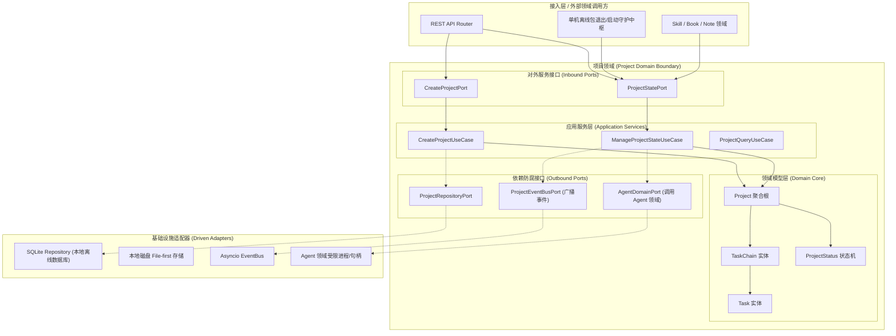
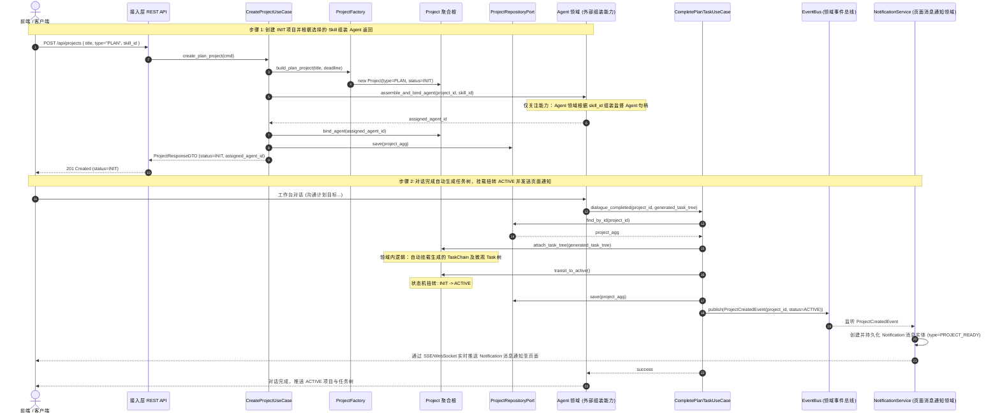
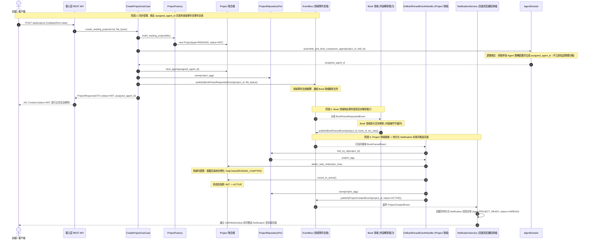
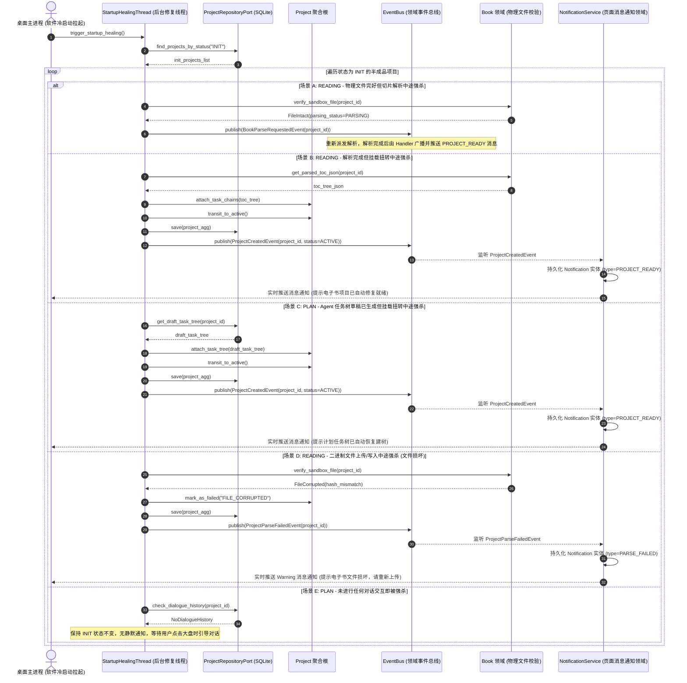
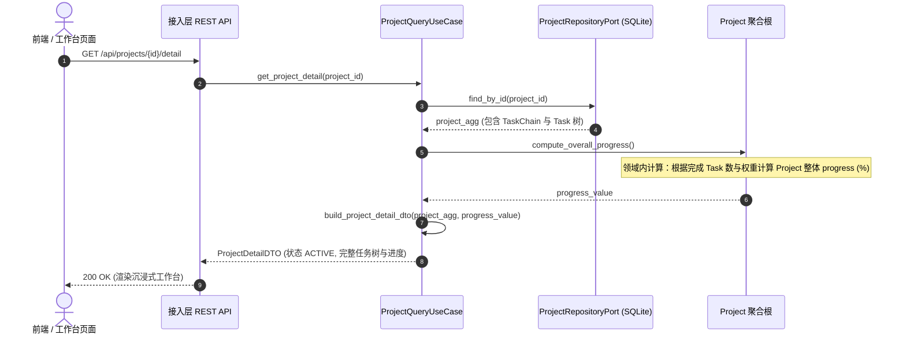
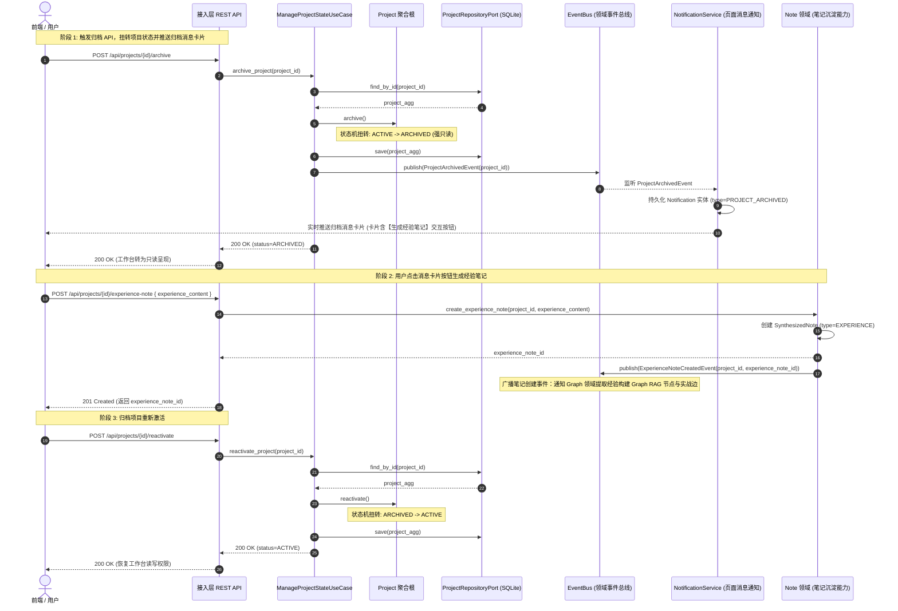

# 项目领域 (Project Domain) 后端设计规范 v1.0

> [!IMPORTANT]
> 本文档基于 [业务模型规范](../../03_business_modeling/business_model.md)、[后端系统架构设计规范](../../06_system_architecture/architecture_backend_design_spec_v1.0.md)、[交互状态规范](../../04_interaction_design/flow_state_spec-v1.0.md) 以及 [项目 API 规范](../../08_api_specification/modules/project/project_api.md) 编写。
> 本文档旨在定义 `domain/project` 限界上下文内部的详细设计、向外提供的服务功能契约、单机本地化应用 (Local-First) 形态下的生命周期控制、核心状态流转、异常边界以及可观测监控方案。

---

## 一、 目标与功能

### 1. 领域定位与业务目标

项目领域 (Project Domain) 是管理学习与实践任务的最高层级承载容器。核心目标为：

* **双轨项目容器**：统一管理 `READING` (阅读) 与 `PLAN` (计划) 项目的生命周期。
* **三层树结构支撑**：维护 `Project -> Task Chain -> Task` 聚合体系，支撑任务树的挂载与推进。
* **生命周期事件驱动**：广播项目状态变更与归档事件，支撑离线包退出挂起 (PA-04) 与旁路建图 (PA-02)。

---

### 2. 对外暴露的领域功能契约 (Domain Capabilities & Services)

项目领域作为容器服务，向接入层 (REST API) 及其他领域（Book 领域、Note 领域、Skill 领域、Agent 领域、Graph 领域）提供以下核心能力契约：

| 领域服务名称                                        | 调用的目标领域 / 模块                            | 服务能力描述                                                                                                              | 领域契约与约束                                         |
| :-------------------------------------------------- | :----------------------------------------------- | :------------------------------------------------------------------------------------------------------------------------ | :----------------------------------------------------- |
| **项目双轨创建服务** <br>`CreateProjectService`     | 接入层 REST API / <br>Book 领域 (物料挂载)       | 提供 `PLAN` 与 `READING` 项目的初始化创建。对于 `READING` 项目，通过消息总线通知 Book 领域解析并挂载 `TaskChain` 树。     | 成功后向全局广播 `ProjectCreatedEvent`                 |
| **状态生命周期管理服务** <br>`ProjectStateService`  | 接入层 REST API / <br>离线包退出守护进程         | 提供项目的启动 (`ACTIVE`)、休眠 (`SUSPENDED`)、唤醒 (`RESUME`) 与归档 (`ARCHIVED`) 转换。控制内部状态机合法性与退出挂起。 | 离线包退出时自动刷盘；唤醒联动 Agent 句柄重建          |
| **任务树挂载与调度服务** <br>`TaskChainTreeService` | Skill 领域 (技能注入) / <br>Book 领域 (章节生成) | 允许外部领域向特定 `Project` 注入 `TaskChain` 节点或 `Task` 微观步骤，并提供 DAG 依赖校验与进度计算。                     | 维护 `Project -> TaskChain -> Task` 归属索引与拓扑状态 |
| **项目上下文元数据查询** <br>`ProjectQueryService`  | Note 领域 (笔记归属) / <br>Graph 领域 (溯源定位) | 提供根据 `project_id` 获取项目基本属性、当前状态、绑定 Agent ID 及聚合进度的查询接口。                                    | 高频查询，提供领域缓存与只读视图 DTO                   |
| **项目领域事件订阅源** <br>`ProjectEventPublisher`  | Graph RAG 旁路领域 / <br>消息通知领域            | 发布 `ProjectStatusChangedEvent` 与 `ProjectArchivedEvent`。归档扭转后触发页面归档卡片推送，点击卡片后广播 `ExperienceNoteCreatedEvent` 驱动 Graph RAG 旁路建图。 | 100% 异步广播，不阻塞 Project 领域写入                 |

---

### 3. 六边形架构分层映射

项目领域严格遵循六边形架构 (Hexagonal Architecture)，其内部与对外 Ports 边界如下：



---

## 二、 功能的详细设计交互

> [!NOTE]
> 本章节重点描述 **Project 领域内部** 的核心交互逻辑、实体状态变迁与单机离线包 (Local-First Package) 形态下的生命周期控制。外部领域的交互仅作为能力引用。

### 1. 双轨项目创建内部交互流

项目创建分为对话交互自动建树的 `PLAN` 模式与**事件驱动异步解耦**的 `READING` 模式。

#### (1) 计划项目 (`PLAN` 模式) 对话建树与激活交互流



#### (2) 阅读项目 (`READING` 模式) 事件总线解耦流



#### (3) 创建中断场景与冷启动修复线程 (Startup Healing Thread) 交互流

项目创建过程中若遭遇单机软件意外关闭/断电强杀，后台**冷启动修复线程 (Startup Healing Thread)** 将在应用重新拉起时自动扫描 `status=INIT` 的半成品项目。修复处理完成后，统一向事件总线广播事件并触发 `NoticeService` 生成 `Notification` 页面消息实体推送给前端：



##### 冷启动创建中断异常处置与消息通知矩阵

| 异常中断场景                 | 物理残留状态描述                                      | 后端自愈与处置机制                                        | 处置后页面消息通知 (Notification)                                |
| :--------------------------- | :---------------------------------------------------- | :-------------------------------------------------------- | :--------------------------------------------------------------- |
| **解析中途强杀** (`READING`) | 物理文件完整存留，`Book.parsing_status=PARSING`       | 重新派发 `BookParseRequestedEvent` 恢复后台解析与自动挂载 | 解析完成后由事件驱动产生 `PROJECT_READY` 消息通知                |
| **挂载中途强杀** (`READING`) | `parsed_content.json` 已生成，`Project.status=INIT`   | 读取 JSON 文件自动实例化 `TaskChain` 树并扭转为 `ACTIVE`  | 产生 `PROJECT_READY` 消息通知：“电子书解析已自动修复就绪”        |
| **建树中途强杀** (`PLAN`)    | 增量对话 Trace 与 Task 草稿已在 SQLite，`status=INIT` | 提取 SQLite 中已落盘的草稿建树，挂载并纠偏扭转为 `ACTIVE` | 产生 `PROJECT_READY` 消息通知：“计划任务树已自动恢复建树”        |
| **文件写入损坏** (`READING`) | 文件传输/写入中途断电，文件 Hash 不匹配               | 标记 `Book.parsing_status=FAILED` 并清理死链垃圾文件      | 产生 `PARSE_FAILED` (Warning) 消息通知：“电子书坏损，请重新上传” |
| **未对话即强杀** (`PLAN`)    | 只有 `INIT` 项目记录，无任何对话历史                  | 保持 `status=INIT` 项目容器不变，无需静默通知             | 用户在大盘点击该项目时，自动分配 Agent 启动工作台对话引导        |

---

### 2. 项目工作台模型装载与进度计算内部交互流

> [!NOTE]
> 从 **Project 领域视角** 出发，工作台加载时不关注外部 Agent 进程的物理句柄生命周期，而是聚焦于 `Project -> TaskChain -> Task` 聚合树的提取、实时进度计算与只读视图 DTO 组装。



---

### 3. 项目归档与生成经验笔记内部交互流

当项目完成或用户发送归档指令时，系统分为“项目状态归档扭转”与“卡片点击生成经验笔记”两个步骤处理：

1. **第一阶段 (状态归档扭转)**：发起 `POST /api/projects/{id}/archive`，Project 领域将状态从 `ACTIVE` 扭转为 `ARCHIVED` (页面转为只读)，并广播 `ProjectArchivedEvent`。`NotificationService` 接收该事件后持久化并向用户推送 `PROJECT_ARCHIVED` 消息通知卡片（卡片上带有【生成经验笔记】交互按钮）。
2. **第二阶段 (生成经验笔记)**：用户在归档消息卡片上点击【生成经验笔记】按钮，发起 `POST /api/projects/{id}/experience-note` 请求。后端调用 Note 领域 `CreateExperienceNoteUseCase` 创建 `EXPERIENCE` 类型的沉淀笔记 (`SynthesizedNote`)，挂载至归档项目并广播 `ExperienceNoteCreatedEvent` 驱动旁路 Graph RAG 建图。



---

### 4. Project 领域依赖的外部防腐接口 (Outbound Ports)

为保障 Project 领域的解耦与强内聚，定义以下 Project 视角下的防腐接口契约：

```python
# domain/project/ports.py
from abc import ABC, abstractmethod
from typing import Optional, List, Dict, Any
from domain.project.entities import Project

class ProjectRepositoryPort(ABC):
    """Project 领域内部仓储持久化接口 (SQLite 本地持久化)"""
    @abstractmethod
    def save(self, project: Project) -> Project: ...
    @abstractmethod
    def find_by_id(self, project_id: str) -> Optional[Project]: ...
    @abstractmethod
    def list_by_status(self, status: str, page: int, size: int) -> tuple[List[Project], int]: ...

class ProjectEventBusPort(ABC):
    """Project 领域事件发布与订阅防腐接口"""
    @abstractmethod
    def publish_book_parse_requested(self, project_id: str, file_bytes: bytes) -> None: ...
    @abstractmethod
    def publish_project_created_notice(self, project_id: str, status: str) -> None: ...
    @abstractmethod
    def publish_archived_event(self, project_id: str) -> None: ...
```

---

## 三、 接口规范映射与契约 (API Specification Alignment)

本模块将接入层 REST API 映射至 [project_api.md](../../08_api_specification/modules/project/project_api.md) 定义的规范：

### 1. REST 路由与领域 UseCase 映射表

| REST 路由                            | HTTP Method | 请求 Payload 格式                                              | 成功响应状态码 | Project / Note 领域 UseCase 映射         |
| :---------------------------------- | :---------- | :------------------------------------------------------------- | :------------- | :--------------------------------------- |
| `/api/projects`                      | `POST`      | `application/json` (PLAN) <br> `multipart/form-data` (READING) | `201 Created`  | `CreateProjectUseCase.execute()`         |
| `/api/projects`                      | `GET`       | Query Params (`?status=ACTIVE&page=1&size=20`)                 | `200 OK`       | `ProjectQueryUseCase.list_projects()`    |
| `/api/projects/{id}/archive`         | `POST`      | 无 Body                                                        | `200 OK`       | `ManageProjectStateUseCase.archive()`    |
| `/api/projects/{id}/experience-note` | `POST`      | `application/json` (`experience_content`)                      | `201 Created`  | `NoteDomain.create_experience_note()`   |
| `/api/projects/{id}/reactivate`      | `POST`      | 无 Body                                                        | `200 OK`       | `ManageProjectStateUseCase.reactivate()` |

---

### 2. DTO 与 Domain Entity 转换契约

```python
# application/project/dtos.py
from pydantic import BaseModel
from typing import Optional, Literal
from datetime import datetime
from domain.project.entities import Project, ProjectStatus, ProjectType

class CreatePlanProjectDTO(BaseModel):
    title: str
    type: Literal["PLAN"] = "PLAN"
    deadline: Optional[datetime] = None
    skill_id: Optional[str] = None

class CreateExperienceNoteDTO(BaseModel):
    experience_content: Optional[str] = None

class ProjectResponseDTO(BaseModel):
    id: str
    title: str
    type: str
    status: str
    progress: int
    deadline: Optional[str]
    created_at: str

    @classmethod
    def from_domain(cls, entity: Project, progress: int = 0) -> "ProjectResponseDTO":
        return cls(
            id=entity.id,
            title=entity.title,
            type=entity.type.value,
            status=entity.status.value,
            progress=progress,
            deadline=entity.deadline.isoformat() if entity.deadline else None,
            created_at=entity.created_at.isoformat()
        )
```

---

## 四、 异常边界与处理

### 1. 领域内部异常与 HTTP 错误映射

| 领域异常类 (Domain Exception)     | 异常触发场景                            | 映射 HTTP 状态码  | Error Code Payload         |
| :-------------------------------- | :-------------------------------------- | :---------------- | :------------------------- |
| `ProjectNotFoundException`        | 查询或变更不存在的 `project_id`         | `404 Not Found`   | `PROJECT_NOT_FOUND`        |
| `InvalidStateTransitionException` | 对已 `ARCHIVED` 的项目尝试重复归档      | `409 Conflict`    | `INVALID_STATE_TRANSITION` |
| `ExternalServiceFailureException` | 调用 Book 领域解析或 Agent 领域加载失败 | `502 Bad Gateway` | `EXTERNAL_DOMAIN_ERROR`    |
| `DuplicateProjectTitleException`  | 创建同名活跃项目 (同名约束)             | `400 Bad Request` | `DUPLICATE_PROJECT_TITLE`  |

---

### 2. 领域状态跳转防阻断矩阵

| 源状态 \ 目标状态 | `INIT`     | `ACTIVE`                  | `ARCHIVED`                |
| :---------------- | :--------- | :------------------------ | :------------------------ |
| **`INIT`**        | 阻断 (409) | **允许 (200 - 建树就绪)** | 阻断 (409)                |
| **`ACTIVE`**      | 阻断 (409) | 阻断 (409)                | **允许 (200 - 结项归档)** |
| **`ARCHIVED`**    | 阻断 (409) | **允许 (200 - 重新激活)** | 阻断 (409)                |

---

### 3. 单机离线包持久化安全与异常数据库自愈机制

在单机桌面包形态下，客户端随时面临强行关闭、断电或异常崩溃风险。Project 领域采取以下本地数据保护机制：

> [!CAUTION]
> **数据持久化安全与崩溃自愈原则**：
> 1. **Per-Message 实时增量落盘**：每一轮对话 Message 与 Task 进度更新即刻实时增量写入本地 SQLite。数据库状态永远保持真实有效的 `ACTIVE` 业务语义，退出与异常断电无需额外的离线转态。
> 2. **数据坏损自愈**：由于离线包环境可能遭遇意外断电导致 SQLite 损坏，系统在拉起时检测数据库完整性，必要时自动使用静态 WAL / 快照文件修复数据。

#### 单机离线包异常处置矩阵

| 场景                  | 异常点 (Failure Scenario)     | Project 领域处置行为 (Domain Self-Healing)                                                | 业务状态最终结果 | 页面提示与通知                                                     |
| :-------------------- | :---------------------------- | :---------------------------------------------------------------------------------------- | :--------------- | :----------------------------------------------------------------- |
| **软件正常退出**      | 用户点击应用 `X` 按钮关闭软件 | 业务数据已 100% 实时写入 SQLite。主进程极速退出，项目在 SQLite 中维持真实 `ACTIVE` 状态。 | 保持 `ACTIVE`    | 0.1s 极速响应退出，再次打开正常访问。                              |
| **软件异常强杀/断电** | 电脑断电或任务管理器强杀进程  | 对话与任务数据在产生时已即刻落盘 SQLite。再次打开时无数据丢失，项目依然保持 `ACTIVE`。    | 保持 `ACTIVE`    | 再次进入项目，展示 100% 完整历史数据与进度。                       |
| **本地数据库坏损**    | SQLite 数据库文件损坏         | 启动或载入时捕获 `DatabaseCorruptedException`，从 WAL/快照恢复 SQLite 数据库。            | 恢复为 `ACTIVE`  | 产生 `SYSTEM_ALERT` Warning 消息通知：“本地数据库已自动修复恢复”。 |

> [!TIP]
> 关于双轨项目创建中断场景与冷启动修复线程 (Startup Healing Thread) 的详细序列图与自愈矩阵，请直接参照 [二、1 (3) 创建中断场景与冷启动修复线程交互流](#3-创建中断场景与冷启动修复线程-startup-healing-thread-交互流)。

---

## 五、 可观测与监控

### 1. Project 领域核心 Metrics 定义

```ini
# HELP project_active_count Total number of active projects in memory/DB
# TYPE project_active_count gauge
project_active_count{type="READING"} 12
project_active_count{type="PLAN"} 5

# HELP project_state_transitions_total Total state transition counts
# TYPE project_state_transitions_total counter
project_state_transitions_total{from="ACTIVE", to="SUSPENDED", action="app_exit"} 38
project_state_transitions_total{from="SUSPENDED", to="ACTIVE", action="user_resume"} 35
```

---

### 2. 结构化日志输出规范

使用 `structlog` 统一输出 Project 领域的结构化日志：

```json
{
  "timestamp": "2026-07-23T12:00:00Z",
  "level": "INFO",
  "domain": "project",
  "logger": "domain.project.lifecycle",
  "trace_id": "tr-8f7e6d5c4b3a",
  "project_id": "proj_998877",
  "event": "ProjectStateTransited",
  "from_status": "ACTIVE",
  "to_status": "ARCHIVED",
  "reason": "user_archive_action"
}
```

---

### 3. 领域健康度与告警

1. **冷启动崩溃自愈监控**：启动检测到由于非正常退出引起的 `mark_as_suspended_for_crash_recovery()` 触发次数 > 0 时，输出 Warning 日志。
2. **状态孤岛告警**：处于 `INIT` 状态超过 10 分钟未转为 `ACTIVE` 的项目数 > 0 触发警告日志。
