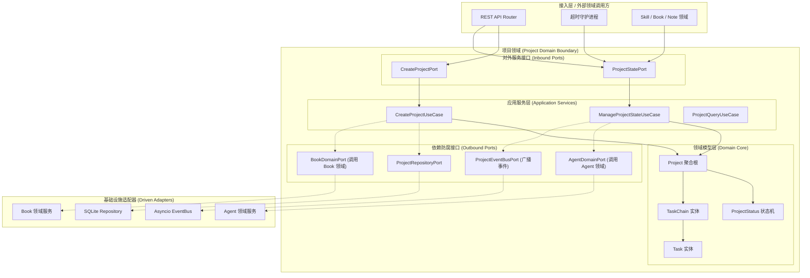
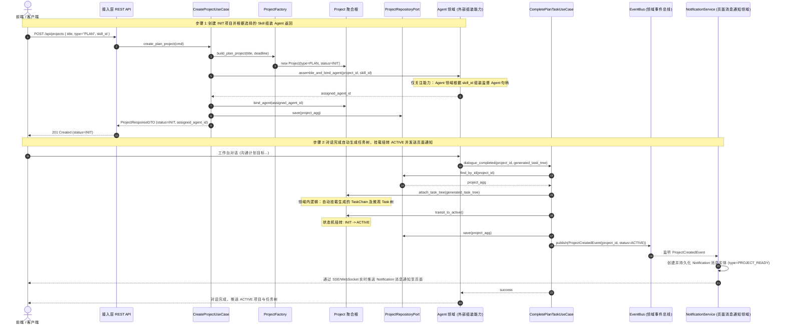
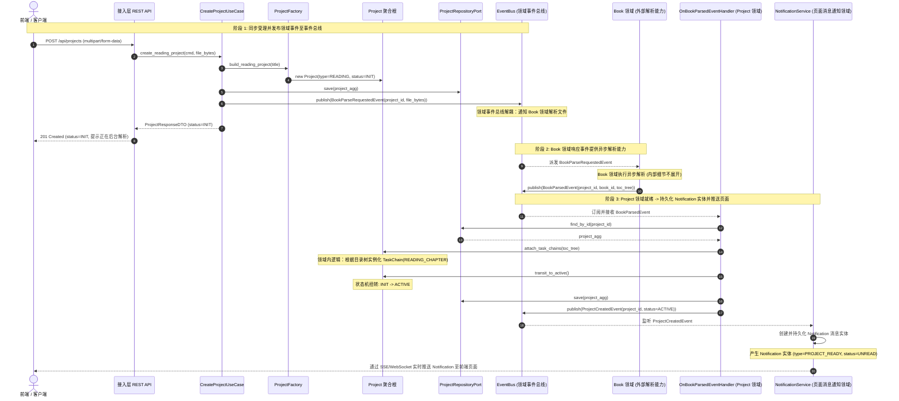
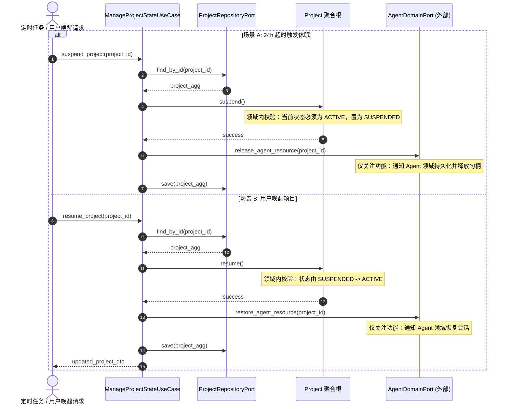
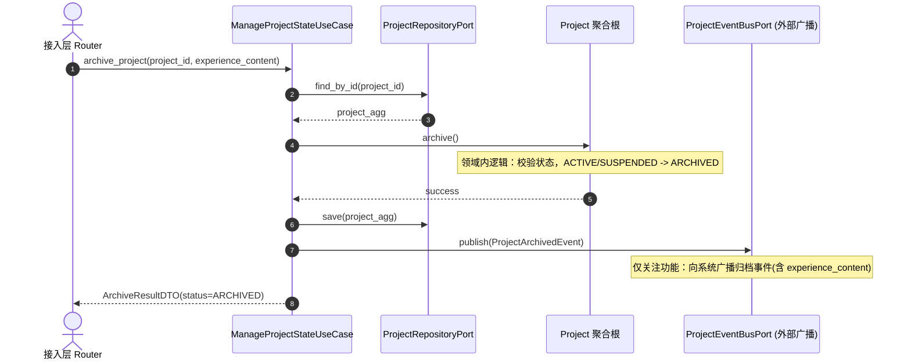

# 项目领域 (Project Domain) 后端设计规范 v1.0

> [!IMPORTANT]
> 本文档基于 [业务模型规范](../../03_business_modeling/business_model.md)、[后端系统架构设计规范](../../06_system_architecture/architecture_backend_design_spec_v1.0.md)、[交互状态规范](../../04_interaction_design/flow_state_spec-v1.0.md) 以及 [项目 API 规范](../../08_api_specification/modules/project/project_api.md) 编写。
> 本文档旨在定义 `domain/project` 限界上下文内部的详细设计、向外提供的服务功能契约、领域内核心状态流转与逻辑交互、异常边界以及可观测监控方案。

---

## 一、 目标与功能

### 1. 领域定位与业务目标

项目领域 (Project Domain) 是管理学习与实践任务的最高层级承载容器。核心目标为：

* **双轨项目容器**：统一管理 `READING` (阅读) 与 `PLAN` (计划) 项目的生命周期。
* **三层树结构支撑**：维护 `Project -> Task Chain -> Task` 聚合体系，支撑任务树的挂载与推进。
* **生命周期事件驱动**：广播项目状态变更与归档事件，支撑资源休眠 (PA-04) 与旁路建图 (PA-02)。

---

### 2. 对外暴露的领域功能契约 (Domain Capabilities & Services)

项目领域作为容器服务，向接入层 (REST API) 及其他领域（Book 领域、Note 领域、Skill 领域、Agent 领域、Graph 领域）提供以下核心能力契约：

| 领域服务名称 | 调用的目标领域 / 模块 | 服务能力描述 | 领域契约与约束 |
| :--- | :--- | :--- | :--- |
| **项目双轨创建服务** <br>`CreateProjectService` | 接入层 REST API / <br>Book 领域 (物料挂载) | 提供 `PLAN` 与 `READING` 项目的初始化创建。对于 `READING` 项目，调用 Book 领域解析能力并自动挂载 `TaskChain` 树。 | 成功后向全局广播 `ProjectCreatedEvent` |
| **状态生命周期管理服务** <br>`ProjectStateService` | 接入层 REST API / <br>后台超时守护进程 | 提供项目的启动 (`ACTIVE`)、休眠 (`SUSPENDED`)、唤醒 (`RESUME`) 与归档 (`ARCHIVED`) 转换。控制内部状态机合法性。 | 无法跳过状态约束；休眠/唤醒联动 Agent 领域句柄释放/重连 |
| **任务树挂载与调度服务** <br>`TaskChainTreeService` | Skill 领域 (技能注入) / <br>Book 领域 (章节生成) | 允许外部领域向特定 `Project` 注入 `TaskChain` 节点或 `Task` 微观步骤，并提供 DAG 依赖校验与进度计算。 | 维护 `Project -> TaskChain -> Task` 归属索引与拓扑状态 |
| **项目上下文元数据查询** <br>`ProjectQueryService` | Note 领域 (笔记归属) / <br>Graph 领域 (溯源定位) | 提供根据 `project_id` 获取项目基本属性、当前状态、绑定 Agent ID 及聚合进度的查询接口。 | 高频查询，提供领域缓存与只读视图 DTO |
| **项目领域事件订阅源** <br>`ProjectEventPublisher` | Graph RAG 旁路领域 / <br>Note 领域 (复盘引导) | 发布 `ProjectStatusChangedEvent` 与 `ProjectArchivedEvent`。归档事件携带结项经验总结出列。 | 100% 异步广播，不阻塞 Project 领域写入 |

---

### 3. 六边形架构分层映射

项目领域严格遵循六边形架构 (Hexagonal Architecture)，其内部与对外 Ports 边界如下：



---

## 二、 功能的详细设计交互

> [!NOTE]
> 本章节重点描述 **Project 领域内部** 的核心交互逻辑、实体状态变迁与校验规则。外部领域（如 Book 领域、Agent 领域、Graph 领域）的交互仅作为能力引用，不展开其内部细节。

### 1. 双轨项目创建内部交互流

项目创建分为对话交互自动建树的 `PLAN` 模式与**事件驱动异步解耦**的 `READING` 模式。为保证清晰度，分别进行链路绘制：

#### (1) 计划项目 (`PLAN` 模式) 对话建树与激活交互流



#### (2) 阅读项目 (`READING` 模式) 事件总线解耦流



---

### 2. 状态机流转与休眠/唤醒内部交互

> [!NOTE]
> 项目实体及其挂载的 `TaskChain` / `Task` 服务端状态机与流转逻辑，严格遵循并直接复用 [系统交互状态规范](../../04_interaction_design/flow_state_spec-v1.0.md#L11) 的定义，本文档不再重复绘制状态变迁图。

#### 24h 超时休眠与一键唤醒内部流转



---

### 3. 项目结项归档内部流程与事件发布



---

### 4. Project 领域依赖的外部防腐接口 (Outbound Ports)

为保障 Project 领域的解耦与强内聚，定义以下防腐接口契约：

```python
# domain/project/ports.py
from abc import ABC, abstractmethod
from typing import Optional, List, Dict, Any
from domain.project.entities import Project

class ProjectRepositoryPort(ABC):
    """Project 领域内部仓储持久化接口"""
    @abstractmethod
    def save(self, project: Project) -> Project: ...
    @abstractmethod
    def find_by_id(self, project_id: str) -> Optional[Project]: ...
    @abstractmethod
    def list_by_status(self, status: str, page: int, size: int) -> tuple[List[Project], int]: ...

class ProjectEventBusPort(ABC):
    """Project 领域事件发布与订阅防腐接口"""
    @abstractmethod
    def publish_book_parse_requested(self, project_id: str, file_bytes: bytes) -> None: ...
    @abstractmethod
    def publish_project_created_notice(self, project_id: str, status: str) -> None: ...
    @abstractmethod
    def publish_archived_event(self, project_id: str, experience_content: Optional[str]) -> None: ...

class AgentDomainPort(ABC):
    """依赖 Agent 领域的外部防腐接口 (仅关注功能)"""
    @abstractmethod
    def release_agent_resource(self, project_id: str) -> bool: ...
    @abstractmethod
    def restore_agent_resource(self, project_id: str) -> bool: ...
```

---

## 三、 接口规范映射与契约 (API Specification Alignment)

本模块将接入层 REST API 映射至 [project_api.md](../../08_api_specification/modules/project/project_api.md) 定义的规范：

### 1. REST 路由与领域 UseCase 映射表

| REST 路由 | HTTP Method | 请求 Payload 格式 | 成功响应状态码 | Project 领域 UseCase 映射 |
| :--- | :--- | :--- | :--- | :--- |
| `/api/projects` | `POST` | `application/json` (PLAN) <br> `multipart/form-data` (READING) | `201 Created` | `CreateProjectUseCase.execute()` |
| `/api/projects` | `GET` | Query Params (`?status=ACTIVE&page=1&size=20`) | `200 OK` | `ProjectQueryUseCase.list_projects()` |
| `/api/projects/{id}/archive` | `POST` | `application/json` (`experience_content`) | `200 OK` | `ManageProjectStateUseCase.archive()` |
| `/api/projects/{id}/suspend` | `POST` | 无 Body | `200 OK` | `ManageProjectStateUseCase.suspend()` |
| `/api/projects/{id}/resume` | `POST` | 无 Body | `200 OK` | `ManageProjectStateUseCase.resume()` |

---

### 2. DTO 与 Domain Entity 转换契约

```python
# application/project/dtos.py
from pydantic import BaseModel
from typing import Optional, Literal
from datetime import datetime
from domain.project.entities import Project, ProjectStatus, ProjectType

class CreatePlanProjectDTO(BaseModel):
    title: str
    type: Literal["PLAN"] = "PLAN"
    deadline: Optional[datetime] = None
    skill_id: Optional[str] = None

class ProjectResponseDTO(BaseModel):
    id: str
    title: str
    type: str
    status: str
    progress: int
    deadline: Optional[str]
    created_at: str

    @classmethod
    def from_domain(cls, entity: Project, progress: int = 0) -> "ProjectResponseDTO":
        return cls(
            id=entity.id,
            title=entity.title,
            type=entity.type.value,
            status=entity.status.value,
            progress=progress,
            deadline=entity.deadline.isoformat() if entity.deadline else None,
            created_at=entity.created_at.isoformat()
        )
```

---

## 四、 异常边界与处理

### 1. 领域内部异常与 HTTP 错误映射

| 领域异常类 (Domain Exception) | 异常触发场景 | 映射 HTTP 状态码 | Error Code Payload |
| :--- | :--- | :--- | :--- |
| `ProjectNotFoundException` | 查询或变更不存在的 `project_id` | `404 Not Found` | `PROJECT_NOT_FOUND` |
| `InvalidStateTransitionException` | 对已 `ARCHIVED` 的项目尝试调用休眠 | `409 Conflict` | `INVALID_STATE_TRANSITION` |
| `ExternalServiceFailureException` | 调用 Book 领域解析或 Agent 领域释放失败 | `502 Bad Gateway` | `EXTERNAL_DOMAIN_ERROR` |
| `DuplicateProjectTitleException` | 创建同名活跃项目 (同名约束) | `400 Bad Request` | `DUPLICATE_PROJECT_TITLE` |

---

### 2. 领域状态跳转防阻断矩阵

| 源状态 \ 目标状态 | `INIT` | `ACTIVE` | `SUSPENDED` | `ARCHIVED` |
| :--- | :--- | :--- | :--- | :--- |
| **`INIT`** | 阻断 (409) | **允许 (200)** | 阻断 (409) | 阻断 (409) |
| **`ACTIVE`** | 阻断 (409) | 阻断 (409) | **允许 (200)** | **允许 (200)** |
| **`SUSPENDED`** | 阻断 (409) | **允许 (200)** | 阻断 (409) | **允许 (200)** |
| **`ARCHIVED`** | 阻断 (409) | **允许 (200 - 激活)** | 阻断 (409) | 阻断 (409) |

---

## 五、 可观测与监控

### 1. Project 领域核心 Metrics 定义

```ini
# HELP project_active_count Total number of active projects in memory/DB
# TYPE project_active_count gauge
project_active_count{type="READING"} 12
project_active_count{type="PLAN"} 5

# HELP project_state_transitions_total Total state transition counts
# TYPE project_state_transitions_total counter
project_state_transitions_total{from="ACTIVE", to="SUSPENDED", action="auto_timeout"} 38
project_state_transitions_total{from="SUSPENDED", to="ACTIVE", action="user_resume"} 35
```

---

### 2. 结构化日志输出规范

使用 `structlog` 统一输出 Project 领域的结构化日志：

```json
{
  "timestamp": "2026-07-23T12:00:00Z",
  "level": "INFO",
  "domain": "project",
  "logger": "domain.project.aggregate",
  "trace_id": "tr-8f7e6d5c4b3a",
  "project_id": "proj_998877",
  "event": "ProjectStateTransited",
  "from_status": "SUSPENDED",
  "to_status": "ACTIVE"
}
```

---

### 3. 领域健康度与告警

1. **状态孤岛告警**：处于 `INIT` 状态超过 10 分钟未转为 `ACTIVE` 的项目数 > 0 触发警告日志。
2. **外部依赖超时告警**：调用 `AgentDomainPort` 或 `BookDomainPort` 响应时间 > 3 秒触发 Warning 告警。
