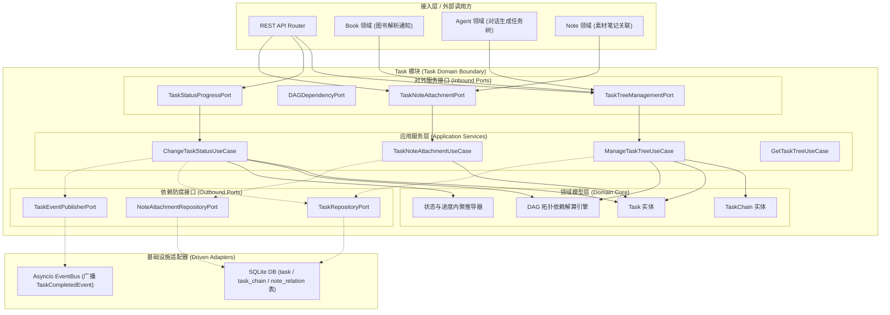
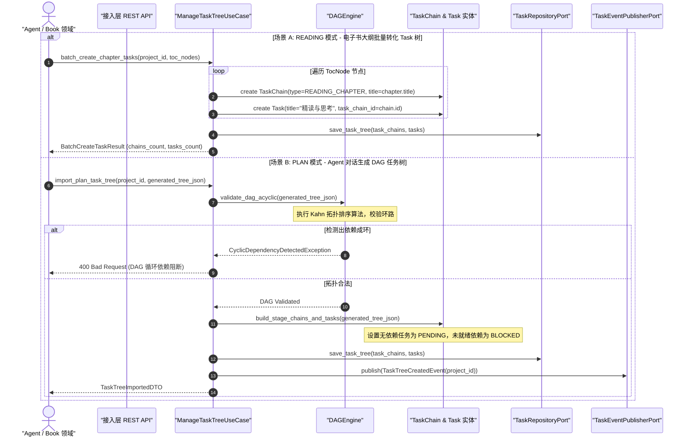
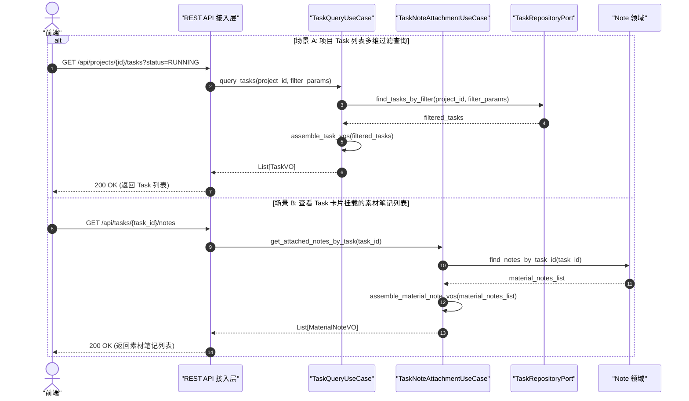
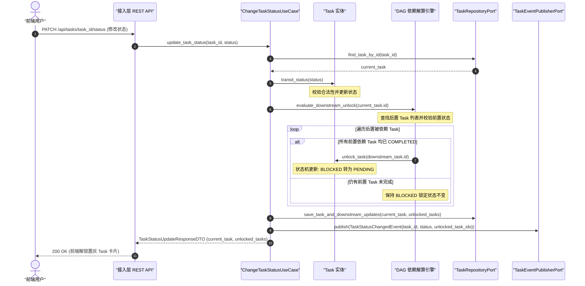
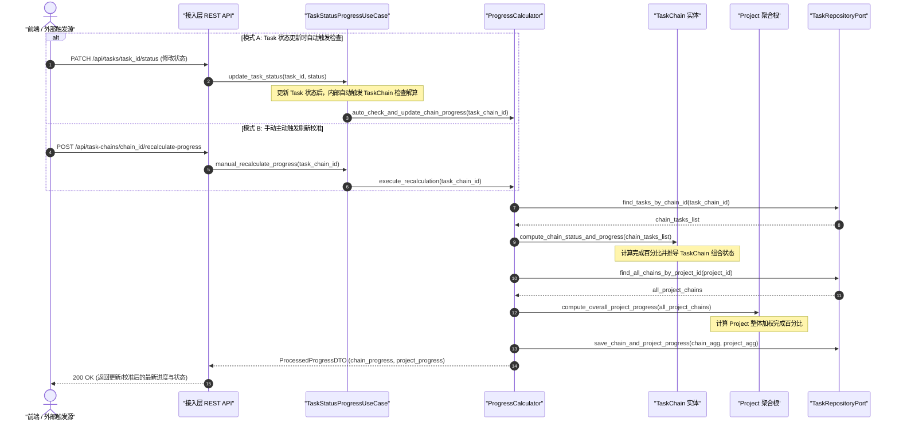
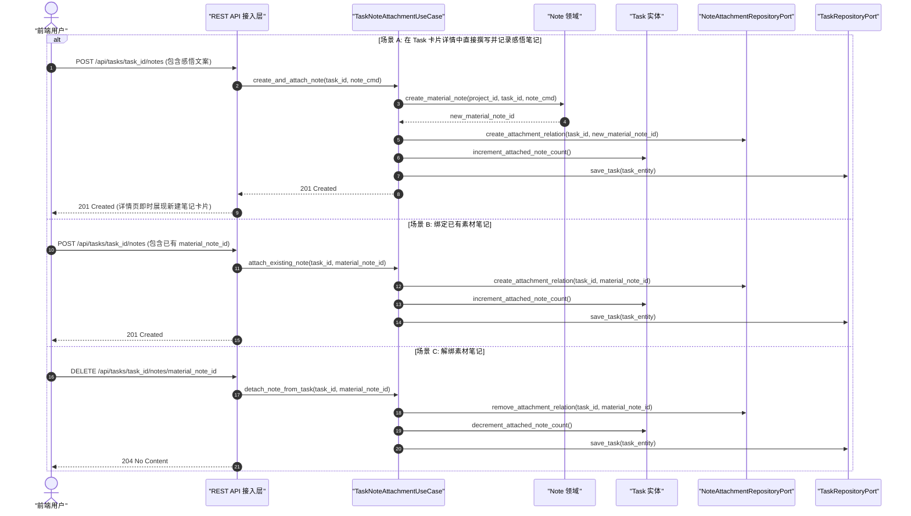
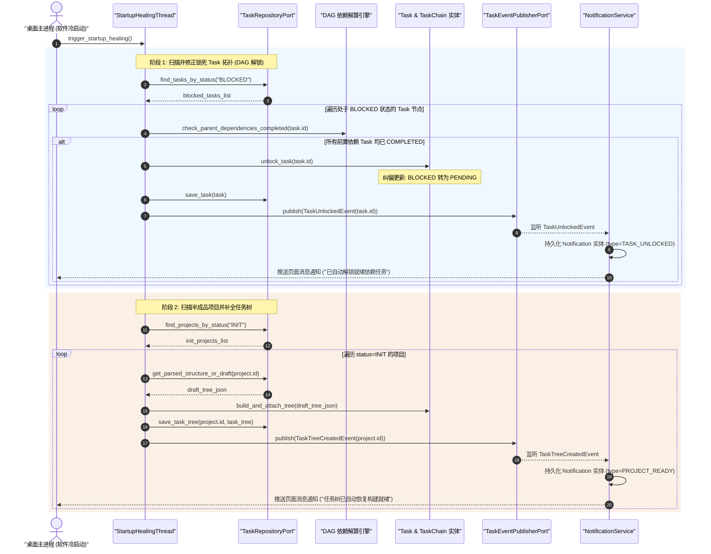

# Task 模块 (Task Domain/Module) 后端设计规范 v1.0

> [!IMPORTANT]
> 本文档基于 [业务模型规范](../../03_business_modeling/business_model.md)、[交互流程规范](../../04_interaction_design/flow_interaction-v1.0.md)、[数据模型与 DDD 规范](../../07_data_model/data_model_spec_v1.0.md) 以及 [项目领域后端设计规范](./project_backend_design_spec_v1.0.md) 编写。
> 本文档旨在定义 `domain/project` 限界上下文内部 **Task 模块**（包含 `TaskChain` 中观任务链与 `Task` 微观任务实体）的详细设计、向外提供的服务功能契约、DAG 拓扑依赖解算机制、素材笔记绑定生命周期、中微观状态进度内聚推导及异常边界。

---

## 一、 目标与功能

### 1. 领域定位与业务目标

Task 模块是项目领域 (Project Domain) 内部核心的中微观任务树执行与调度引擎。核心目标为：

* **三层范式承载 (`Project -> TaskChain -> Task`)**：维护项目中观层级的 `TaskChain` 容器（包括阅读大纲链 `READING_CHAPTER` 和计划阶段链 `PLAN_STAGE`）与微观可执行单元 `Task`。
* **DAG 有向无环图拓扑解算**：支持 `Task` 间通过 `depends_on_task_ids` 建立复杂前置依赖图，提供死锁/环路阻断算法及自动级联解锁机制 (`BLOCKED -> PENDING`)。
* **素材笔记 (`MaterialNote`) 关联绑定**：支持在具体的 `Task` 下挂载划词感悟与思考素材卡片，维护任务与知识资产的强绑定语义。
* **状态与进度内聚推导**：基于微观 Task 状态自动推导 TaskChain 及聚合根 Project 的总体进度百分比与组合状态，保证视图数据强一致性。

---

### 2. 对外暴露的领域服务能力契约 (Domain Capabilities & Services)

Task 模块向接入层 (REST API) 及项目上下文其他组件/外部领域提供以下核心服务能力契约：

| 领域服务名称 | 调用的目标领域 / 模块 | 服务能力描述 | 领域契约与约束 |
| :--- | :--- | :--- | :--- |
| **任务树构建与注入服务** <br>`TaskTreeManagementService` | REST API / <br>Book 领域 (目录拆解) / <br>Agent 领域 (对话拆建) | 提供 `TaskChain` 节点与 `Task` 微观步骤的动态创建、修改、排序及多级父子树 (`parent_task_id`) 挂载能力。 | 挂载时校验拓扑结构合法性，禁止空链插入 |
| **DAG 依赖与级联解锁服务** <br>`DAGDependencyService` | REST API / <br>Task 内部状态变更驱动 | 评估 `Task` 前置依赖状态。上游依赖均完成时自动将 `BLOCKED` 节点解锁为 `PENDING`；上游撤回时反向级联锁定。 | 执行严格的环路检测算法 (Kahn)，阻断依赖成环 |
| **状态变迁与进度推导服务** <br>`TaskStatusProgressService` | REST API / <br>Project 聚合根中枢 | 处理 Task 状态转换 (`PENDING`/`RUNNING`/`COMPLETED`/`BLOCKED`)，后端自动评估推导 TaskChain 和 Project 的整体完成百分比与状态；同时提供手动触发刷新校准接口 (`recalculate_progress`)，支持显式强行重算与数据校准。 | 状态转换受防阻断状态机管控，自动/手动触发均原子化刷盘持久化 |
| **素材笔记绑定服务** <br>`TaskNoteAttachmentService` | REST API / <br>Note 领域 (素材笔记) | 提供 `Task` 与 `MaterialNote` (素材笔记) 的关联挂载、查验与解除绑定功能。 | 支持一键查询 Task 挂载的所有思考卡片与原文锚点 |
| **任务树只读查询服务** <br>`TaskQueryService` | REST API / <br>工作台渲染视图 | 提供根据 `project_id` 或 `task_chain_id` 获取完整树状拓扑、任务锁死状态 (`status="BLOCKED"`) 及挂载笔记计数的查询 DTO。 | 高频查询，提供标准的 TaskVO 结构 |

---

### 3. 六边形架构分层映射

Task 模块内嵌于项目限界上下文内部，其六边形架构 (Hexagonal Architecture) 边界与 Ports 映射如下：



---

## 二、 功能的详细设计交互

### 1. 双轨任务树生成与装载交互流

任务树的生成包含 `PLAN` 模式下 Agent 对话拆解/Skill 步骤注入，与 `READING` 模式下 Book 章节大纲目录转化的自动化批量构建。



---

### 2. Task 列表过滤查询与挂载笔记查看交互流

支持按多条件过滤获取项目 Task 列表，及查询特定 Task 下挂载的素材笔记：

1. **Task 列表过滤查询**：`GET /api/projects/{id}/tasks?status=xx&task_chain_id=yy&search_keyword=zz`，后端根据状态、TaskChain 或关键字过滤并返回 `List[TaskVO]`。
2. **挂载笔记列表查看 (支持过滤)**：`GET /api/tasks/{task_id}/notes?source_type=xx&search_keyword=yy&tag=zz`，后端支持按来源类型、关键字及标签筛选，向 Note 领域装载并返回对应的 `List[MaterialNoteVO]`。



---

### 3. DAG 依赖锁死、解算与拓扑级联解锁交互流

当微观 Task 的状态变更为 `COMPLETED`（或由 `COMPLETED` 重新撤回重置）时，`DAGDependencyEngine` 自动触发下游相关节点的依赖评估与状态级联转换。



#### DAG 拓扑检测与解算算法规则 (Kahn 算法应用)

```python
# domain/project/task_dag_engine.py
from typing import List, Dict, Set
from domain.project.exceptions import CyclicDependencyException

class TaskDAGEngine:
    @staticmethod
    def validate_acyclic_and_sort(tasks_data: List[Dict]) -> List[str]:
        """
        使用 Kahn 算法校验 Task 依赖关系是否构成 DAG 有向无环图。
        若存在环路，直接抛出 CyclicDependencyException 阻断保存。
        """
        in_degree: Dict[str, int] = {t["id"]: 0 for t in tasks_data}
        adj_list: Dict[str, List[str]] = {t["id"]: [] for t in tasks_data}

        for t in tasks_data:
            # 过滤有效依赖父节点
            deps = [pid for pid in t.get("depends_on_task_ids", []) if pid in in_degree]
            in_degree[t["id"]] = len(deps)
            for parent_id in deps:
                adj_list[parent_id].append(t["id"])

        queue = [task_id for task_id, degree in in_degree.items() if degree == 0]
        visited_count = 0
        topo_order = []

        while queue:
            curr = queue.pop(0)
            visited_count += 1
            topo_order.append(curr)
            for neighbor in adj_list.get(curr, []):
                in_degree[neighbor] -= 1
                if in_degree[neighbor] == 0:
                    queue.append(neighbor)

        if visited_count != len(tasks_data):
            raise CyclicDependencyException("Task 依赖图中检测出环路，无法构建任务链拓扑！")

        return topo_order
```

---

### 4. Task 状态与 TaskChain / Project 进度内聚推导交互流

Task 状态变更不仅影响自身的生命周期，还会驱动 `TaskChain` 的状态与总体 `Project` 的进度百分比更新。系统支持**Task 状态更新时自动触发检查更新**与**客户端/REST API 手动主动触发校准**双轨模式：

* **模式 A (Task 状态更新时自动触发检查)**：在 `PATCH /api/tasks/{id}/status` 执行 Task 状态变更（如扭转为 `RUNNING` / `COMPLETED` / `PENDING`）的原子事务内部，后端自动调用 `ProgressCalculator` 检查并重新推导所属 `TaskChain` 的状态 (`PENDING`/`RUNNING`/`COMPLETED`) 及 `Project` 整体完成百分比，同步持久化。
* **模式 B (手动主动触发校准)**：前端或运维离线进程可以显式调用 `POST /api/task-chains/{id}/recalculate-progress` 接口，强行触发后端对特定任务链及聚合项目的全量校验与进度重新推导校准。



---

### 5. Task 卡片详情笔记记录与素材笔记 (`MaterialNote`) 绑定/解绑交互流

在沉浸式工作台中，用户点击任意微观 Task 卡片展开详情时，不仅可以查看任务说明，还支持**“在 Task 卡片详情中直接撰写并记录思考感悟笔记”**或**“关联绑定已有素材笔记”**：

* **场景 A (Task 详情直接撰写记录笔记)**：用户在 Task 详情弹窗的富文本框中输入感悟文案并点击【记录笔记】，发起 `POST /api/tasks/{task_id}/notes` 请求（Payload 包含 `paraphrase` 转述感悟等字段）。后端原子化调用 Note 领域生成 `MaterialNote` (带有 `task_id` 归属)，并完成绑定关系构建，实时更新 Task 卡片的笔记角标。
* **场景 B (绑定已有素材笔记)**：用户从已有素材库中选择卡片绑定至当前 Task（Payload 仅包含 `material_note_id`）。
* **场景 C (解绑素材笔记)**：发起 `DELETE /api/tasks/{task_id}/notes/{material_note_id}` 移除关联。



---

### 6. 单机冷启动自愈线程 (Startup Healing Thread) 拓扑与建树自愈交互流

当桌面应用遭遇非正常退出、强杀或电脑断电后重新拉起时，后台**冷启动修复线程 (`StartupHealingThread`)** 会在软件启动钩子 (`on_startup`) 触发时自动扫描并修复潜在的状态断层与半成品任务树：

1. **DAG 依赖锁死自愈**：扫描系统中所有处于 `BLOCKED` 锁定状态的 Task 节点，二次重新校验其所有前置依赖 Task。若前置 Task 均已 `COMPLETED`，自动纠偏解锁为 `PENDING` 并广播 `TaskUnlockedEvent` 产生消息通知。
2. **半成品项目 Task 树恢复**：扫描处于 `INIT` 状态的项目，提取已落盘的电子书大纲切片 JSON 或 Agent 任务草稿重新全量构建 Task 树，挂载并纠偏扭转为 `ACTIVE` 状态，广播 `TaskTreeCreatedEvent` 产生就绪通知。



---

### 7. Task 模块防腐接口 (Outbound Ports) 契约

为保持 Task 模块在 `domain/project` 内部的独立性与解耦能力，定义如下抽象接口：

```python
# domain/project/task_ports.py
from abc import ABC, abstractmethod
from typing import Optional, List, Dict
from domain.project.entities import TaskChain, Task

class TaskRepositoryPort(ABC):
    """Task 模块基础仓储接口 (SQLite 持久化)"""
    @abstractmethod
    def save_task(self, task: Task) -> Task: ...
    @abstractmethod
    def save_task_chain(self, task_chain: TaskChain) -> TaskChain: ...
    @abstractmethod
    def find_task_by_id(self, task_id: str) -> Optional[Task]: ...
    @abstractmethod
    def find_tasks_by_chain_id(self, chain_id: str) -> List[Task]: ...
    @abstractmethod
    def find_downstream_dependent_tasks(self, task_id: str) -> List[Task]: ...
    @abstractmethod
    def save_task_tree(self, chains: List[TaskChain], tasks: List[Task]) -> None: ...

class NoteAttachmentRepositoryPort(ABC):
    """Task 与 Note 模块绑定防腐契约接口"""
    @abstractmethod
    def create_attachment_relation(self, task_id: str, material_note_id: str) -> str: ...
    @abstractmethod
    def remove_attachment_relation(self, task_id: str, material_note_id: str) -> bool: ...
    @abstractmethod
    def get_attached_note_ids_by_task(self, task_id: str) -> List[str]: ...

class TaskEventPublisherPort(ABC):
    """Task 领域事件发布防腐接口"""
    @abstractmethod
    def publish_task_status_changed(self, task_id: str, status: str, unlocked_task_ids: List[str]) -> None: ...
    @abstractmethod
    def publish_task_completed(self, task_id: str, project_id: str) -> None: ...
```

---

## 三、 接口规范映射与契约 (API Specification Alignment)

### 1. REST 路由与 UseCase 映射表

本模块 REST API 严格对齐系统总体 API 规范：

| REST 路由 | HTTP Method | 请求 Payload 格式 | 成功状态码 | UseCase / Handler 映射 |
| :--- | :--- | :--- | :--- | :--- |
| `/api/projects/{id}/task-tree` | `GET` | 无 | `200 OK` | `GetTaskTreeUseCase.execute()` |
| `/api/projects/{id}/tasks` | `GET` | Query Params (`TaskQueryFilterDTO`) | `200 OK` | `TaskQueryUseCase.list_tasks()` |
| `/api/task-chains` | `POST` | `application/json` (`CreateTaskChainDTO`) | `201 Created` | `ManageTaskTreeUseCase.create_chain()` |
| `/api/tasks` | `POST` | `application/json` (`CreateTaskDTO`) | `201 Created` | `ManageTaskTreeUseCase.create_task()` |
| `/api/tasks/{id}/status` | `PATCH` | `application/json` (`UpdateTaskStatusDTO`) | `200 OK` | `ChangeTaskStatusUseCase.execute()` |
| `/api/task-chains/{id}/recalculate-progress` | `POST` | 无 | `200 OK` | `TaskStatusProgressUseCase.manual_recalculate_progress()` |
| `/api/tasks/{id}/notes` | `GET` | 无 | `200 OK` | `TaskNoteAttachmentUseCase.list_notes()` |
| `/api/tasks/{id}/notes` | `POST` | `application/json` (`CreateOrAttachTaskNoteDTO`) | `201 Created` | `TaskNoteAttachmentUseCase.attach_or_create()` |
| `/api/tasks/{id}/notes/{note_id}` | `DELETE` | 无 | `204 No Content` | `TaskNoteAttachmentUseCase.detach()` |

---

### 2. DTO 与 Domain Entity 转换契约

```python
# application/project/task_dtos.py
from pydantic import BaseModel, Field
from typing import Optional, List, Literal
from datetime import datetime
from domain.project.entities import Task, TaskChain

class CreateTaskDTO(BaseModel):
    task_chain_id: str
    title: str = Field(..., max_length=100)
    description: Optional[str] = None
    sequence_order: int = 0
    parent_task_id: Optional[str] = None
    depends_on_task_ids: List[str] = Field(default_factory=list)
    deadline: Optional[datetime] = None

class UpdateTaskStatusDTO(BaseModel):
    status: Literal["PENDING", "RUNNING", "COMPLETED", "BLOCKED"]

class TaskQueryFilterDTO(BaseModel):
    """项目 Task 列表多维过滤查询 DTO"""
    status: Optional[Literal["PENDING", "RUNNING", "COMPLETED", "BLOCKED"]] = None
    task_chain_id: Optional[str] = None
    search_keyword: Optional[str] = None

class TaskAttachedNoteQueryFilterDTO(BaseModel):
    """Task 卡片下素材笔记过滤查询 DTO"""
    source_type: Optional[Literal["USER_THOUGHT", "EXCERPT", "AI_SUMMARY"]] = None
    search_keyword: Optional[str] = None
    tag: Optional[str] = None

class CreateOrAttachTaskNoteDTO(BaseModel):
    """支持 Task 详情页直接撰写记录笔记 (场景 A) 或绑定已有素材笔记 (场景 B)"""
    material_note_id: Optional[str] = None  # 场景 B: 绑定已有素材笔记 ID
    paraphrase: Optional[str] = None        # 场景 A: 个人思考与转述感悟
    original_snippet: Optional[str] = None  # 场景 A: 参考片段/划词快照
    scenario_context: Optional[str] = None  # 场景 A: 应用情景
    tags: List[str] = Field(default_factory=list)

class MaterialNoteVO(BaseModel):
    """Task 卡片下展现的素材笔记 VO"""
    id: str
    project_id: str
    task_id: Optional[str]
    source_type: str
    original_snippet: Optional[str]
    paraphrase: str
    scenario_context: Optional[str]
    tags: List[str]
    created_at: str

class TaskVO(BaseModel):
    id: str
    task_chain_id: str
    title: str
    description: Optional[str]
    sequence_order: int
    status: str
    parent_task_id: Optional[str]
    depends_on_task_ids: List[str]
    attached_note_count: int
    created_at: str

    @classmethod
    def from_domain(cls, entity: Task, attached_note_count: int = 0) -> "TaskVO":
        return cls(
            id=entity.id,
            task_chain_id=entity.task_chain_id,
            title=entity.title,
            description=entity.description,
            sequence_order=entity.sequence_order,
            status=entity.status.value,
            parent_task_id=entity.parent_task_id,
            depends_on_task_ids=entity.depends_on_task_ids,
            attached_note_count=attached_note_count,
            created_at=entity.created_at.isoformat()
        )

class TaskChainVO(BaseModel):
    id: str
    project_id: str
    title: str
    sequence_order: int
    status: str
    type: str
    tasks: List[TaskVO] = Field(default_factory=list)
    progress: float

    @classmethod
    def from_domain(cls, chain: TaskChain, tasks_vo: List[TaskVO], progress: float) -> "TaskChainVO":
        return cls(
            id=chain.id,
            project_id=chain.project_id,
            title=chain.title,
            sequence_order=chain.sequence_order,
            status=chain.status.value,
            type=chain.type.value,
            tasks=tasks_vo,
            progress=progress
        )
```

---

## 四、 异常边界与处理

### 1. 领域异常类与 HTTP 错误映射

| 领域异常类 (Domain Exception) | 异常触发场景 | 映射 HTTP 状态码 | Error Code Payload |
| :--- | :--- | :--- | :--- |
| `CyclicDependencyException` | 创建或修改 `depends_on_task_ids` 导致拓扑环路 | `400 Bad Request` | `TASK_CYCLIC_DEPENDENCY` |
| `TaskBlockedException` | 尝试将处于 `BLOCKED` (前置未就绪) 的 Task 直接改为 `RUNNING`/`COMPLETED` | `409 Conflict` | `TASK_DEPENDENCY_BLOCKED` |
| `TaskNotFoundException` | 操作或查询不存在的 `task_id` 或 `task_chain_id` | `404 Not Found` | `TASK_NOT_FOUND` |
| `InvalidTaskStateTransitionException` | 试图对已归档项目的 Task 进行状态更新 | `422 Unprocessable Entity` | `PROJECT_ARCHIVED_READONLY` |
| `DuplicateNoteAttachmentException` | 重复绑定相同的素材笔记至同一 Task | `400 Bad Request` | `DUPLICATE_NOTE_ATTACHMENT` |

---

### 2. Task 状态机转换防阻断矩阵

| 源状态 \ 目标状态 | `PENDING` | `RUNNING` | `COMPLETED` | `BLOCKED` |
| :--- | :--- | :--- | :--- | :--- |
| **`PENDING`** | 阻断 (409) | **允许 (200 - 开始执行)** | **允许 (200 - 直接完成)** | **允许 (自动 - 增加前置依赖)** |
| **`RUNNING`** | **允许 (200 - 挂起重置)** | 阻断 (409) | **允许 (200 - 执行完成)** | 阻断 (409 - 需先重置) |
| **`COMPLETED`** | **允许 (200 - 撤回重置)** | 阻断 (409) | 阻断 (409) | 阻断 (409) |
| **`BLOCKED`** | **允许 (自动 - 前置依赖全解)** | 阻断 (409 - 前置未就绪) | 阻断 (409 - 前置未就绪) | 阻断 (409) |

---

### 3. 单机离线包意外中断场景分析与崩溃自愈矩阵

在单机桌面包 (Local-First) 形态下，客户端面临软件被强行关闭、任务管理器强杀进程或电脑意外断电等场景。本节针对 Task 模块全交互链路中的意外中断进行穷举分析与自愈机制设计：

#### (1) 意外中断场景分析

1. **Task 状态更新与 DAG 级联解锁中途强杀**：
   - *风险点*：Task A 状态已更新为 `COMPLETED`，但解算并更新后置 Task B 从 `BLOCKED -> PENDING` 的过程被打断，导致后置任务非法锁死。
   - *处置*：更新 Task A 状态与后置 Task B 解锁全部包裹在 SQLite 单一原子事务 (Single Transaction) 中，强杀自动 Rollback。此外，软件重启拉起或加载项目时，自愈线程自动校验所有 `BLOCKED` 节点的依赖就绪状态，二次自动解锁。
2. **Task 树批量导入/构建中途断电 (`READING` 目录拆解 / `PLAN` Agent 拆解)**：
   - *风险点*：只写入了部分 TaskChain 或 Task 节点，项目残留在不完整的半成品树状态。
   - *处置*：批量插入使用数据库写事务封装，中断自动回滚。冷启动自愈线程扫描 `INIT` 状态项目，重新提取物理切片 JSON (`parsed_structure`) 或 Agent 对话草稿全量重新建树。
3. **Task 详情页记录素材笔记 (CreateAndAttachNote) 中途崩溃**：
   - *风险点*：Note 实体成功写入，但 Task 与 Note 的关联映射记录未写入，产生孤儿 Note。
   - *处置*：`MaterialNote` 实体带有 `task_id` 属性，且创建 Note 与关联映射建立属于联合事务。若发生异常，下次加载 Task 详情时，通过外键反向自动校准关联数与角标。
4. **Task 状态更新后进度推导中途中断**：
   - *风险点*：Task 状态已持久化，但 TaskChain 或 Project 的加权完成百分比 `progress` 未同步更新。
   - *处置*：进度百分比为纯无损推导属性。任何查询/加载接口被调用或冷启动自愈时，均可基于当前 Task 实时重新解算并持久化校准。

#### (2) 单机离线包 Task 模块中断处置与页面通知矩阵

| 异常中断场景 | 物理残留状态描述 | 后端自愈与处置机制 (Domain Self-Healing) | 业务状态最终结果 | 处置后页面消息通知 (Notification) |
| :--- | :--- | :--- | :--- | :--- |
| **DAG 解锁中途强杀** | SQLite 事务未提交，更改完全丢失；或处于中途状态 | SQLite 单事务自动 Rollback；冷启动自愈线程重新扫描解算 `BLOCKED` 节点前置依赖 | 恢复为 `ACTIVE` | 产生 `TASK_UNLOCKED` 消息通知：“已自动解锁就绪依赖任务，拓扑无锁死” |
| **电子书建树中途断电** (`READING`) | Project 处于 `INIT`，Task 树未创建或事务回滚 | 数据库事务回滚至无 Task 状态。冷启动时读取 `parsed_structure` JSON 重新全量生成 Task 树 | 扭转为 `ACTIVE` | 产生 `PROJECT_READY` 消息通知：“电子书解析与任务树已自动恢复就绪” |
| **Agent 计划建树强杀** (`PLAN`) | Project 处于 `INIT`，Agent 对话 Trace 已落盘 SQLite | 读取 SQLite 中存留的 Agent 最新任务树草稿 JSON 重新校验并构建 Task 树；若草稿丢失保持 `INIT` | 扭转为 `ACTIVE` | 产生 `PROJECT_READY` 消息通知：“计划任务树已自动恢复建树” |
| **详情记录笔记强杀** | 联合事务未提交，或 Note 已写但 Task 映射未加 | 联合事务保障 Rollback；或者加载时根据 Note 字段中的 `task_id` 外键反向修复角标 | 保持 `ACTIVE` | 无脏记录或悬空卡片，页面角标与笔记列表 100% 准确展示 |
| **进度推导中途强杀** | Task 状态更新已落盘，TaskChain 进度未重算 | 加载 Task 视图或冷启动时，`ProgressCalculator` 重新解算完成百分比并同步更新冗余值 | 保持 `ACTIVE` | 页面展示 100% 准确的项目与任务链进度百分比 |

> [!CAUTION]
> **单机离线包事务与数据一致性底层铁律**：
> 1. **全量写操作事务化 (Transactional Write-ahead)**：Task 模块所有写接口（创建树、状态更新 + 解锁、笔记绑定）必须且只能在同一个 SQLite 数据库写事务内部完成，确保“要么全部成功落盘，要么全部回滚”。
> 2. **无损幂等可重构 (Idempotent Reconstruction)**：Task 拓扑解锁状态与进度百分比设计为无损可重构，即便数据库因极端硬件断电受损恢复，亦可通过冷启动自愈线程无损重新算得。

---

## 五、 可观测与监控

### 1. Task 模块核心 Metrics 定义

```ini
# HELP task_completed_total Total count of completed tasks across all projects
# TYPE task_completed_total counter
task_completed_total{project_type="PLAN"} 142
task_completed_total{project_type="READING"} 310

# HELP task_blocked_current Current number of tasks in BLOCKED status
# TYPE task_blocked_current gauge
task_blocked_current 8

# HELP dag_unlock_duration_seconds Time taken to evaluate and unlock downstream tasks
# TYPE dag_unlock_duration_seconds summary
dag_unlock_duration_seconds_sum 0.045
dag_unlock_duration_seconds_count 120
```

---

### 2. 结构化日志输出规范

使用 `structlog` 输出格式统一的控制台与落盘日志：

```json
{
  "timestamp": "2026-07-24T04:26:00Z",
  "level": "INFO",
  "domain": "project.task",
  "logger": "domain.project.task_dag_engine",
  "trace_id": "tr-task-99812",
  "task_id": "task_776655",
  "event": "TaskStatusChangedAndUnlocked",
  "from_status": "PENDING",
  "to_status": "COMPLETED",
  "unlocked_downstream_task_ids": ["task_776656", "task_776657"],
  "chain_progress": 75.0,
  "project_progress": 40.5
}
```
