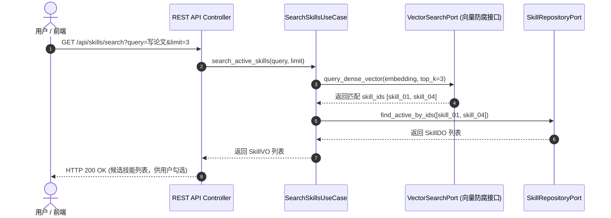
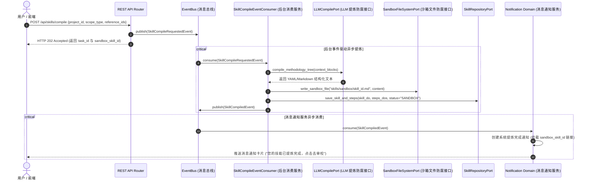
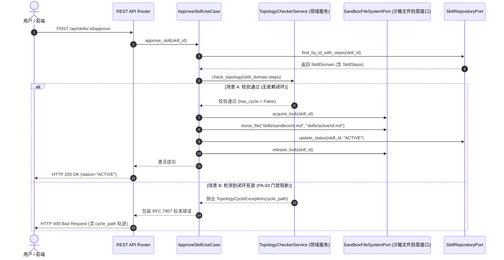
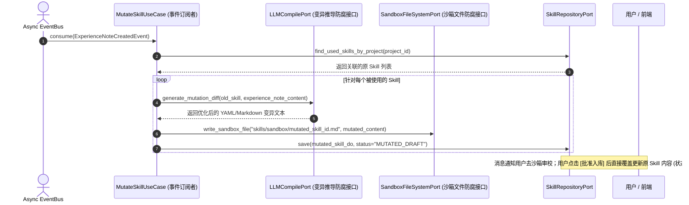
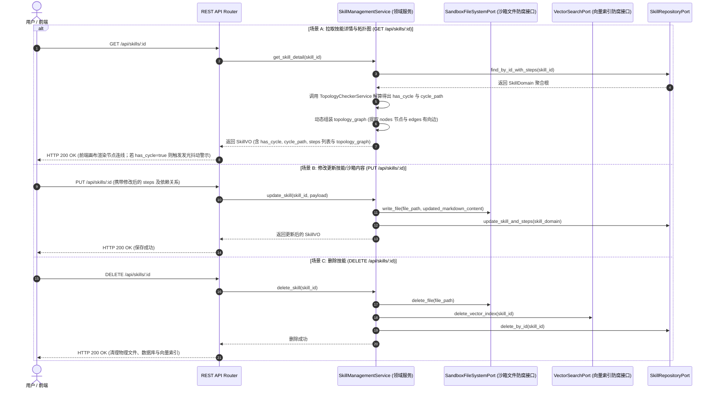
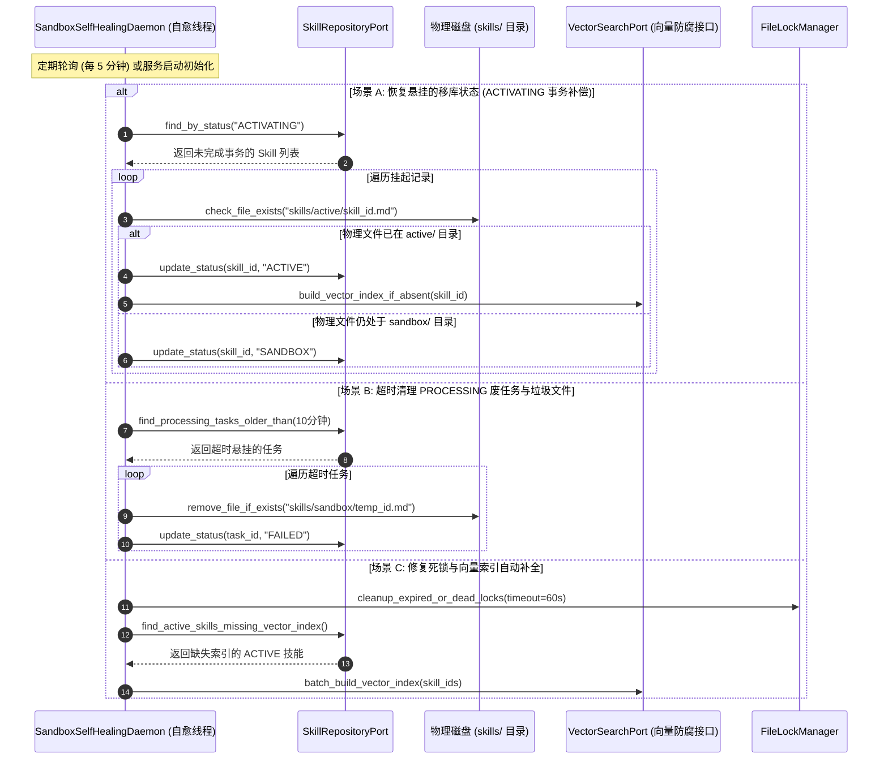

# 技能与沙箱领域 (Skill Domain) 后端设计规范 v1.0

> [!IMPORTANT]
> 本文档基于 [业务模型规范](../../03_business_modeling/business_model.md)、[交互流程规范](../../04_interaction_design/flow_interaction-v1.0.md)、[后端系统架构设计规范](../../06_system_architecture/architecture_backend_design_spec_v1.0.md)、[数据模型规范](../../07_data_model/data_model_spec_v1.0.md) 以及 [技能 API 规范](../../08_api_specification/modules/skill/skill_api.md) 编写。
> 本文档旨在聚焦 `domain/skill` 限界上下文内部的详细设计、密集向量语义检索、Trace-to-Skill 三级提炼编译、PA-03 门禁拓扑解环死锁阻断以及物理隔离沙箱生命周期管理。

---

## 一、 目标与功能

### 1. 领域定位与业务目标

技能与沙箱领域 (Skill & Sandbox Domain) 是系统中承载非结构化知识转化编译为可指导 Agent 执行的方法论核心大脑。其关键目标包括：

* **密集向量语义检索与挑选**：为计划项目初始化提供基于语义向量 (Dense Vector Search) 的技能检索，响应前端防抖搜索请求，供用户在创建项目时主动挑选并装载技能模版。
* **Trace-to-Skill 三级提炼编译**：支持跨多源上下文（图书切片 `ContentBlock`、素材笔记 `MaterialNote`、沉淀笔记 `SynthesizedNote` 及复盘经验笔记 `ExperienceNote`），按 L1 (单点)、L2 (章节/板块)、L3 (全书/项目) 进行方法论编译，输出标准的 `SKILL.md` 文件并写入物理沙箱中枢。
* **PA-03 门禁拓扑解环与死锁阻断**：在沙箱卡片编辑器中，提供基于有向图（Kahn / DFS 拓扑排序算法）的依赖死锁检测服务。若检测到闭环，阻断入库并输出带有 `cycle_path` 环路轨迹的 RFC 7807 统一错误，驱动前端连线红色抖动示警与提交按钮置灰。
* **物理沙箱隔离与移库激活**：管理物理目录 `skills/sandbox/` 与 `skills/active/` 的物理安全隔离。审批通过后通过文件系统原子移动完成技能状态从 `SANDBOX` 到 `ACTIVE` 的原子切换。
* **知行闭环与技能变异进化**：项目归档阶段录入 `SynthesizedNote(type=EXPERIENCE)` 经验笔记后，广播领域事件驱动生成 `MUTATED_DRAFT` 变异草稿存入沙箱；用户审校并批准入库后直接覆盖更新原 Skill 内容。

---

### 2. 对外暴露的领域功能契约 (Domain Capabilities & Services)

技能与沙箱领域向接入层 (REST API) 及其他外部领域提供以下核心能力契约：

| 领域服务名称 | 调用的目标领域 / 模块 | 服务能力描述 | 领域契约与约束 |
| :--- | :--- | :--- | :--- |
| **技能管理中心服务** <br>`SkillManagementService` | 接入层 REST API / 技能管理工作台 | 提供技能分页列表查询、详情获取、内容与步骤修改以及物理文件与向量索引删除。 | 支持按 `status` 筛选与并发删除控制 |
| **语义向量检索服务** <br>`SkillSearchService` | Project 领域 / 接入层 REST API | 提供基于语义向量索引的匹配检索，响应前端防抖搜索，返回 `ACTIVE` 状态候选技能列表。 | 后端速率限制 (Rate Limit)，默认 top-k 匹配 |
| **三级提炼编译服务** <br>`SkillCompilerService` | Book 领域 / Note 领域 / Agent 领域 | 接收提炼请求后立即返回 202 异步任务，后台 Task 抽取文本并驱动 LLM 编译为 `SKILL.md` 落盘沙箱，完成后广播通知事件。 | 纯后台异步解耦，支持 L1/L2/L3 提炼 |
| **PA-03 拓扑死锁解算服务** <br>`TopologyCheckerService` | 接入层 API / 沙箱审校 | 对内存中 Step 有向图进行拓扑解算，检测是否存在依赖闭环。 | 若成环必须返回包含 `cycle_path` 的死锁轨迹 |
| **沙箱审批移库服务** <br>`SandboxApprovalService` | 物理受限文件系统 / SQLite | 校验通过后，将物理文件从 `skills/sandbox/` 原子移动至 `skills/active/`，更新数据库状态为 `ACTIVE`。 | 必须带路径隔离锁，具备跨介质事务补偿 |
| **技能变异草稿服务** <br>`SkillMutationService` | Project 领域 (归档触发) / Note 领域 | 消费 `ExperienceNoteCreatedEvent` 事件后，自动提取经验感悟衍生出变异版本 Skill 草稿。 | 初始状态锁定为 `MUTATED_DRAFT` |

---

### 3. 六边形架构分层映射与外部领域契约

```mermaid
graph TD
    subgraph DrivingAdapters ["请求入口 / 外部领域触发源"]
        REST_Manage["REST API (GET/PUT/DELETE /api/skills)"]
        REST_Search["REST API (GET /api/skills/search)"]
        REST_Compile["REST API (POST /api/skills/compile)"]
        REST_Approve["REST API (POST /api/skills/:id/approve)"]
        NoteDomainConsumer["Note 领域消费源 (ExperienceNoteCreatedEvent)"]
    end

    subgraph HexagonBoundary ["技能与沙箱领域 (Skill Domain Boundary)"]
        subgraph AppServices ["应用服务层 (Application Services)"]
            UC_Search["SearchSkillsUseCase"]
            UC_Compile["CompileSkillUseCase"]
            UC_Approve["ApproveSkillUseCase"]
            UC_Mutate["MutateSkillUseCase"]
        end

        subgraph DomainModel ["领域模型层 (Domain Core)"]
            SkillAgg["SkillDomain 聚合根"]
            StepEntity["SkillStepDomain 关联子实体"]
            SandboxEntity["SandboxContextDomain 沙箱隔离中枢"]
            TopoService["TopologyCheckerService 领域服务"]
            ParserService["MarkdownSkillParserService 领域服务"]
        end

        subgraph InboundPorts ["对外服务接口 (Inbound Ports)"]
            IP_Search["SkillSearchPort"]
            IP_Compile["SkillCompilePort"]
            IP_Approve["SkillApprovalPort"]
            IP_Mutate["SkillMutationPort"]
        end

        subgraph OutboundPorts ["依赖防腐接口 (Outbound Ports)"]
            OP_Repo["SkillRepositoryPort (SQLite 持久化)"]
            OP_FS["SandboxFileSystemPort (物理目录移库)"]
            OP_Vector["VectorSearchPort (Dense Vector 检索)"]
            OP_LLM["LLMCompilePort (Prompt 提炼编译)"]
            OP_BookDomain["BookDomainPort (图书切片查询)"]
            OP_NoteDomain["NoteDomainPort (笔记内容查询)"]
        end
    end

    subgraph Infrastructure ["基础设施适配器与外部领域 (Driven Adapters)"]
        DB["SQLite Repository (skills / skill_steps / sandbox_contexts)"]
        FS_Disk["物理沙箱磁盘 (skills/sandbox vs skills/active)"]
        VectorDB["FAISS / Dense Vector Index"]
        LLM_Engine["LLM Pipeline Adapter"]
        ExternalBookDomain["外部 Book 领域"]
        ExternalNoteDomain["外部 Note 领域"]
    end

    REST_Search --> IP_Search
    REST_Compile --> IP_Compile
    REST_Approve --> IP_Approve
    NoteDomainConsumer --> IP_Mutate

    IP_Search --> UC_Search
    IP_Compile --> UC_Compile
    IP_Approve --> UC_Approve
    IP_Mutate --> UC_Mutate

    UC_Search --> SkillAgg
    UC_Search --> OP_Vector

    UC_Compile --> ParserService
    UC_Compile --> OP_LLM
    UC_Compile --> OP_FS
    UC_Compile --> OP_BookDomain
    UC_Compile --> OP_NoteDomain

    UC_Approve --> TopoService
    UC_Approve --> OP_FS
    UC_Approve --> OP_Repo

    UC_Mutate --> SkillAgg
    UC_Mutate --> OP_Repo

    OP_Repo --> DB
    OP_FS --> FS_Disk
    OP_Vector --> VectorDB
    OP_LLM --> LLM_Engine
    OP_BookDomain --> ExternalBookDomain
    OP_NoteDomain --> ExternalNoteDomain
```



---

## 二、 领域模型与核心数据结构

### 1. 实体与模型定义

在实现中严格区分持久化数据对象 (DO)、内存充血领域模型 (Domain) 与前端交互视图对象 (VO)。

#### (1) Skill 聚合根 (`SkillDO` / `Domain` / `VO`)

* **定义**：由非结构化知识提炼编译为可指导 Agent 执行的结构化任务生成模板实体。采用 `Skill 1 -- N SkillStep` 聚合根模型。

```python
from dataclasses import dataclass, field
from datetime import datetime
from typing import List, Optional
from enum import Enum

class SkillStatusEnum(str, Enum):
    SANDBOX = "SANDBOX"             # 沙箱待审批
    ACTIVE = "ACTIVE"               # 批准入库激活
    MUTATED_DRAFT = "MUTATED_DRAFT" # 变异草稿
    DEPRECATED = "DEPRECATED"       # 废弃

class SkillSourceTypeEnum(str, Enum):
    SINGLE_NOTE = "SINGLE_NOTE"     # L1 单点笔记
    CHAPTER = "CHAPTER"             # L2 章节板块
    BOOK_FULL = "BOOK_FULL"         # L3 全书/项目

@dataclass
class SkillDO:
    id: str                         # 主键 UUID
    name: str                       # 技能名称
    description: str                # 方法论简述
    version: str                    # 语义化版本 (如 "1.0.0")
    author: str                     # 提炼者 (用户 / Agent)
    status: str                     # SANDBOX / ACTIVE / MUTATED_DRAFT / DEPRECATED
    source_type: str                # SINGLE_NOTE / CHAPTER / BOOK_FULL
    source_id: Optional[str]        # 关联源实体 ID
    file_path: str                  # 物理相对路径 (skills/sandbox/skill_01.md)
    created_at: datetime
    updated_at: datetime

@dataclass
class SkillStepDO:
    id: str                         # 本地步骤标识 (如 "step_1")
    skill_id: str                   # 归属 Skill 聚合根 ID
    title: str                      # 步骤名称
    instruction_prompt: str         # Prompt 指令大纲
    depends_on_json: str            # JSON 数组，如 '["step_1"]'
```

#### (2) 沙箱安全隔离容器模型 (`SandboxContextDO` / `Domain` / `VO`)

* **定义**：贯穿受限运行、审校校验与拓扑死锁阻断的通用支撑中枢容器。

```python
@dataclass
class SandboxContextDO:
    id: str                         # 主键 UUID
    type: str                       # SKILL_VALIDATION / AGENT_RUNTIME / BOOK_PARSING
    target_entity_id: Optional[str] # 绑定的目标实体 ID
    security_level: str             # STRICT_ISOLATED / READ_ONLY
    validation_status: str          # PENDING / VALIDATED / DEADLOCK_BLOCKED
    isolation_policy_json: str      # JSON 安全策略，如 '{"no_shell": true}'
    created_at: datetime
    updated_at: datetime
```

---

### 2. 领域事件定义

| 事件名称 | 触发时机 | 携带载荷数据 | 订阅方与后续动作 |
| :--- | :--- | :--- | :--- |
| `SkillCompileRequestedEvent` | 用户/外部领域提交技能提炼请求 | `task_id`, `sandbox_skill_id`, `project_id`, `reference_ids` | **Skill 领域后台 Consumer 订阅，触发异步解耦提炼** |
| `SkillCompiledEvent` | Trace-to-Skill 三级提炼编译完成落盘 | `skill_id`, `source_type`, `file_path`, `timestamp` | **消息通知领域 (Notification Domain) 订阅，向用户推发送技能完成消息通知；初始化 `SandboxContext`** |
| `SkillApprovedEvent` | 技能通过 PA-03 拓扑解算并批准移库激活 | `skill_id`, `old_path`, `new_path`, `timestamp` | 建立 FAISS 密集向量索引、通知前端渲染已激活卡片 |
| `SkillMutatedDraftCreatedEvent` | 结项复盘产生变异草稿 | `parent_skill_id`, `draft_skill_id`, `version` | **消息通知领域订阅发送变异草稿提醒消息，引导用户至沙箱审校** |

---

## 三、 核心业务流程与交互设计

### 1. 语义向量检索与技能挑选流程

* **触发领域**：`Project 领域`（初始化项目弹窗）/ `前端 UI`（输入框 300ms 防抖控制触发）。
* **业务语义**：前端对用户输入进行防抖拦截，向后端发起语义向量查询；后端返回 `ACTIVE` 状态候选列表供用户手动挑选装载。



---

### 2. Trace-to-Skill 三级提炼编译流程 (事件驱动解耦 & 消息通知模式)

* **触发领域**：`Book 领域`（图书切片提炼）/ `Note 领域`（素材/沉淀笔记提炼）。
* **业务语义**：提交提炼请求后广播 `SkillCompileRequestedEvent` 事件解耦并立即返回 202 Accepted。后台异步 Consumer 订阅该事件执行文本抽取、LLM 提炼与沙箱落盘；落盘成功后广播 `SkillCompiledEvent`，由消息通知服务 (`Notification Domain`) 消费并向前端推送系统消息通知。



---

### 3. PA-03 拓扑死锁阻断与沙箱移库流程

* **触发领域**：`沙箱编辑器`（用户拖拽连线编排依赖并点击 [批准入库]）。
* **业务语义**：后端基于 Kahn 算法解算步骤 dependency 有向图；检测到闭环阻断入库并抛出 RFC 7807 错误，否则执行跨介质移库与激活。



---

### 4. 结项经验驱动 Skill 变异草稿生成与直接覆盖流程

* **触发领域**：`Note 领域`（广播 `ExperienceNoteCreatedEvent` 事件）/ `Project 领域`（项目结项归档）。
* **业务语义**：消费结项复盘笔记事件，分析实践反思，结合原 Skill 生成 `MUTATED_DRAFT` 变异草稿存入沙箱并通知用户。用户在沙箱卡片编辑器审校通过后，点击 [批准入库] **直接覆盖更新**原 Skill 的数据库记录与物理 `SKILL.md` 文件。



---

### 5. 技能管理中心交互流程 (拉取详情含拓扑图、编辑与删除)

* **触发领域**：`技能管理中心 / 沙箱编辑器`。
* **业务语义**：包含拉取技能详情及组装拓扑图数据结构 (`topology_graph`)、沙箱/技能卡片修改更新以及物理文件与向量索引双清理的完整交互机制。



---

## 四、 接口规范映射与代码契约

### 1. API 接口映射规范 (与 skill_api.md 统一)

| 物理 Endpoint | HTTP Method | 交互类型 | 映射的 UseCase / Domain Service | 核心返回 / 响应码 |
| :--- | :--- | :--- | :--- | :--- |
| `/api/skills/search` | `GET` | 同步 REST | `SearchSkillsUseCase` | `200 OK` (密集向量推荐 SkillVO 数组) |
| `/api/skills/compile` | `POST` | 异步 Task | `CompileSkillUseCase` (事件驱动) | `202 Accepted` (task_id, sandbox_skill_id) |
| `/api/skills/:id/approve` | `POST` | 同步 REST | `ApproveSkillUseCase` + `TopologyCheckerService` | `200 OK` (ACTIVE) / `400 Bad Request` (RFC 7807) |
| `/api/skills` | `GET` | 同步 REST | `GetSkillListUseCase` | `200 OK` (分页技能列表) |
| `/api/skills/:id` | `GET` | 同步 REST | `GetSkillDetailUseCase` | `200 OK` (技能详情与步骤树) |
| `/api/skills/:id` | `PUT` | 同步 REST | `UpdateSkillUseCase` | `200 OK` (更新后的 SkillVO) |
| `/api/skills/:id` | `DELETE` | 同步 REST | `DeleteSkillUseCase` | `200 OK` (清理物理文件与向量索引) |

---

### 2. Inbound Ports 定义 (Python 契约)

```python
from abc import ABC, abstractmethod
from typing import List, Dict, Any, Optional

class SkillManagementPort(ABC):
    @abstractmethod
    def get_skill_list(self, status: Optional[str], page: int, limit: int) -> Dict[str, Any]:
        """分页获取技能管理列表"""
        pass

    @abstractmethod
    def get_skill_detail(self, skill_id: str) -> Dict[str, Any]:
        """获取技能详情与步骤树"""
        pass

    @abstractmethod
    def update_skill(self, skill_id: str, update_payload: Dict[str, Any]) -> Dict[str, Any]:
        """在沙箱或管理面板更新技能元数据及步骤内容"""
        pass

    @abstractmethod
    def delete_skill(self, skill_id: str) -> None:
        """删除技能，清理物理 SKILL.md 文件、SQLite 记录及向量索引"""
        pass

class SkillApprovalPort(ABC):
    @abstractmethod
    def approve_skill(self, skill_id: str) -> Dict[str, Any]:
        """
        审批沙箱技能入库 (PA-03 拓扑阻断门禁，通过后直接覆盖更新原 Skill)
        :throws TopologyCycleException: 检测到闭环死锁时抛出
        """
        pass

class SkillCompilePort(ABC):
    @abstractmethod
    def submit_compile_task(self, project_id: str, scope_type: str, reference_ids: List[str]) -> Dict[str, Any]:
        """
        提交 Trace-to-Skill 三级提炼编译后台任务
        :return: {"task_id": str, "sandbox_skill_id": str, "status": "PROCESSING"}
        """
        pass
```

### 2. Outbound Ports 与 Domain Services 定义

```python
class TopologyCheckerService:
    def check_topology(self, steps: List[Any]) -> Dict[str, Any]:
        """
        执行 Kahn / DFS 算法检测步骤依赖图
        :return: {"has_cycle": bool, "cycle_path": List[str]}
        """
        pass

class SandboxFileSystemPort(ABC):
    @abstractmethod
    def move_sandbox_to_active(self, skill_id: str, source_path: str, target_path: str) -> None:
        """物理文件原子移动"""
        pass
```

---

## 五、 异常处理、并发与高可用策略

### 1. PA-03 死锁异常与 RFC 7807 统一响应规范

当 `TopologyCheckerService` 检测到有向环路依赖时，必须中断流程并抛出 RFC 7807 标准响应：

```json
{
  "type": "https://api.example.com/errors/topology-cycle",
  "title": "Topological Cycle Detected",
  "status": 400,
  "detail": "依赖解析失败，检测到步骤循环依赖。",
  "instance": "/api/skills/sandbox-123/approve",
  "extension_fields": {
    "cycle_path": [
      "step_A",
      "step_B",
      "step_A"
    ]
  }
}
```

### 2. 沙箱物理安全隔离与文件锁机制

* **物理隔离范围**：限定物理读写路径仅在项目相对根目录 `skills/sandbox/` 与 `skills/active/` 下，严禁路径穿越。
* **物理文件与数据库事务补偿**：先执行文件移动，成功后提交数据库事务状态更新；若数据库更新失败，捕获异常后触发撤销移动（移回 `sandbox/`）。

---

### 3. 程序异常退出导致的问题分析与处理办法

系统或进程遭遇非正常崩溃（如 `kill -9`、断电、内存 OOM 导致退栈）时，由于技能涉及磁盘 `SKILL.md` 文件、SQLite 关系库及 FAISS 向量库三端，可能产生以下异常问题及应对机制：

| 异常现象 / 问题场景 | 根因分析 | 影响与后果 | 处理办法与设计规范 |
| :--- | :--- | :--- | :--- |
| **中间态文件悬挂 (孤儿文件)** | 物理移动 `skills/sandbox/` -> `skills/active/` 完成，但提交 SQLite 事务前进程崩溃。 | 物理磁盘处于 `active/` 目录，但数据库记录仍为 `ACTIVATING` 或 `SANDBOX`。 | 数据库引入中间状态 `ACTIVATING`；启动自愈线程对比物理文件与 DB，自动推演补偿恢复至 `ACTIVE`。 |
| **异步 Task 卡死与垃圾文件遗留** | 异步 Trace-to-Skill 编译中途崩溃，写了半截 `.md` 临时文件。 | 数据库任务永远处于 `PROCESSING`，磁盘存留非完整垃圾文件。 | 设置 10 分钟任务超时熔断；自愈线程清理超过 10 分钟未更新的临时文件，并将 `status` 标记为 `FAILED`。 |
| **向量索引滞后 / 脏索引** | 数据库与物理移库成功，但向 FAISS 构建 Embed 向量时发生宕机。 | 技能虽然已经激活，但在新建项目时无法通过向量搜索出该 Skill。 | 自愈线程扫描 `status == ACTIVE` 但缺失向量 ID 的记录，后台静默触发二次 Embedding 索引构建。 |
| **文件锁死锁挂起** | 物理移库前获取了 ReentrantLock / 磁盘 `.lock` 文件，崩溃后未显式释放。 | 后续对该 Skill 的审批更新请求被锁死。 | 锁文件写入 PID 与系统时间戳；自愈线程判断宿主 PID 不存在或锁超时 60s 后自动强行解锁。 |

---

### 4. 后台自愈线程 (SandboxSelfHealingDaemon) 交互与恢复流程

为了保障跨介质数据一致性，后台运行一个轻量级的定期轮询自愈线程 `SandboxSelfHealingDaemon`（默认每 5 分钟执行一次或在系统启动初始化时触发）。


