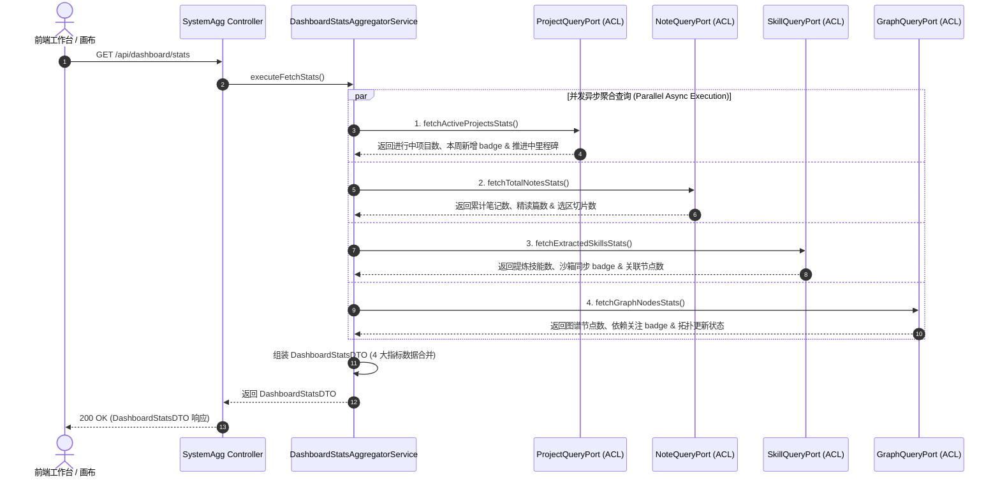
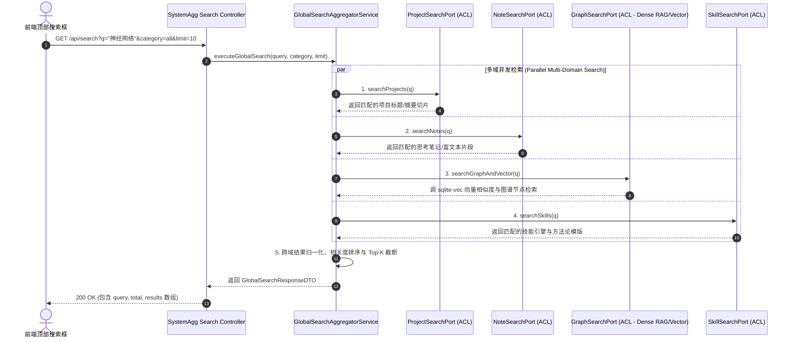

# 系统聚合领域 (System Aggregation Domain) 后端设计规范 v1.0

> [!IMPORTANT]
> 本文档基于 [业务模型规范](../../03_business_modeling/business_model.md)、[后端系统架构设计规范](../../06_system_architecture/architecture_backend_design_spec_v1.0.md)、[数据模型规范](../../07_data_model/data_model_spec_v1.0.md) 以及 [大盘 API 规范](../../08_api_specification/modules/system/dashboard_api.md) 编写。
> 本文档聚焦 `domain/system_agg` 限界上下文内部的完整工程闭环，涵盖 **工作台大盘核心指标 (Dashboard Stats) 跨域并发聚合**、**性能缓存策略** 与 **六边形防腐层路由**。

---

## 一、 目标与功能契约

### 1. 核心定位与设计原则

系统聚合领域 (`domain/system_agg`) 是工作台与全局大盘的**高性能读屏聚联门面 (Read-Aggregator Gate)**：

* **并发异步装载 (Parallel Async Gathering)**：`GET /api/dashboard/stats` 接口聚合了 `Project`、`Note`、`Skill` 与 `Graph` 4 大核心领域数据。聚合门面通过 Async IO / 线程池并发调用各领域的防腐查询端口，保障全局响应时间在 30ms 以内。
* **无状态只读与无污染防腐 (ReadOnly ACL)**：聚合层不拥有持久化主业务表，仅通过 Port 接口向各领域发出只读 Query 请求，绝不上侵修改任何领域状态。

---

### 2. 领域服务契约

| 领域服务名称 | 调用的目标领域 / 端口 | 服务能力描述 | 领域契约与约束 |
| :--- | :--- | :--- | :--- |
| **大盘指标聚合服务** <br>`DashboardStatsAggregatorService` | `ProjectQueryPort`<br>`NoteQueryPort`<br>`SkillQueryPort`<br>`GraphQueryPort` | 并发拉取 4 大核心指标数据，组装包含数值、Badge 徽章与描述信息的聚合 DTO。 | 只读并发查询，响应时间小于 30ms |

---

## 二、 核心流程设计与交互序列图

### 1. 工作台大盘指标聚合交互流程 (`GET /api/dashboard/stats`)

工作台初始化打开时，前端发起 `GET /api/dashboard/stats` 请求，聚合门面并发调度 4 大领域的防腐端口，并行计算并装载响应数据。



---

### 2. 全局跨域聚合搜索交互流程 (`GET /api/search`)

前端顶部搜索框发起 `GET /api/search?q=query&category=all` 全局混合搜索时，聚合门面服务 (`GlobalSearchAggregatorService`) 调度防腐端口，并发在 4 大领域中执行跨域检索并整合结果。



---

## 三、 领域模型与 DTO 契约

### 1. 响应载荷数据传输对象 (DTO)

```python
from pydantic import BaseModel
from typing import Dict, Any, Optional

class ActiveProjectsStatDTO(BaseModel):
    total_count: int                  # 进行中项目数 (如 4)
    weekly_added_count: int           # 本周新增项目数 (如 2)
    in_progress_milestones_count: int # 推进中里程碑数 (如 2)

class TotalNotesStatDTO(BaseModel):
    total_count: int                  # 笔记卡片总数 (如 119)
    intensive_read_count: int         # 精读篇数 (如 12)
    anchored_slices_count: int        # 已锚定选区切片数 (如 380)

class ExtractedSkillsStatDTO(BaseModel):
    total_count: int                  # 技能引擎总数 (如 8)
    sandbox_synced_count: int         # 沙箱同步演进数 (如 3)
    associated_nodes_count: int       # 关联核心领域节点数 (如 5)

class GraphNodesStatDTO(BaseModel):
    total_count: int                  # 图谱活跃节点总数 (如 236)
    dependency_attention_count: int   # 拓扑依赖需关注数 (如 1)
    falsified_nodes_count: int        # 证伪降权节点数 (如 4)

class DashboardStatsDTO(BaseModel):
    active_projects: ActiveProjectsStatDTO  # 进行中项目结构化指标
    total_notes: TotalNotesStatDTO          # 累计笔记结构化指标
    extracted_skills: ExtractedSkillsStatDTO # 已提炼技能结构化指标
    graph_nodes: GraphNodesStatDTO          # 图谱节点结构化指标

class SearchResultItemDTO(BaseModel):
    id: str                           # 命中结果 ID
    type: str                         # project / note / graph / skill
    title: str                        # 结果标题/概念名
    snippet: str                      # 命中富文本高亮片段 (包含 <em> 标签)
    target_url: str                   # 前端跳转地址
    updated_at: str                   # 更新时间 ISO 字符串

class GlobalSearchResponseDTO(BaseModel):
    query: str                        # 查询关键词
    total: int                        # 匹配到的总条数
    results: List[SearchResultItemDTO]# 搜索结果列表
```

---

## 四、 防腐层与接口实现 (Ports & ACL)

```python
from abc import ABC, abstractmethod
from typing import Dict, Any, List

class ProjectQueryPort(ABC):
    """Project 领域只读防腐接口"""
    @abstractmethod
    def fetch_active_projects_stats(self) -> Dict[str, Any]: ...

class NoteQueryPort(ABC):
    """Note 领域只读防腐接口"""
    @abstractmethod
    def fetch_total_notes_stats(self) -> Dict[str, Any]: ...

class SkillQueryPort(ABC):
    """Skill 领域只读防腐接口"""
    @abstractmethod
    def fetch_extracted_skills_stats(self) -> Dict[str, Any]: ...

class GraphQueryPort(ABC):
    """Graph 领域只读防腐接口"""
    @abstractmethod
    def fetch_graph_nodes_stats(self) -> Dict[str, Any]: ...

class GlobalSearchPort(ABC):
    """全局跨域聚合检索防腐接口"""
    @abstractmethod
    def search_projects(self, query: str, limit: int) -> List[SearchResultItemDTO]: ...
    
    @abstractmethod
    def search_notes(self, query: str, limit: int) -> List[SearchResultItemDTO]: ...

    @abstractmethod
    def search_graph_and_vectors(self, query: str, limit: int) -> List[SearchResultItemDTO]: ...

    @abstractmethod
    def search_skills(self, query: str, limit: int) -> List[SearchResultItemDTO]: ...
```
```

---

## 五、 性能优化与并发策略

1. ** asyncio.gather / 线程池并行化**：
   通过 Python `asyncio.gather(fetch_proj(), fetch_note(), fetch_skill(), fetch_graph())` 实现零等待并发网络/数据库 IO 查询，整体耗时取决于单个最慢的 DB 查询（通常在 10-25ms 内）。
2. **轻量级内存热缓存 (Hot Memory Cache)**：
   对指标高频读取场景，聚合服务可针对全量 stats 配置 5 秒的本地 TTL 缓存。项目/笔记/技能创建更新时通过 Bus 异步使缓存失效。

---

## 六、 目录结构与模块文件映射

```text
backend/
├── app/
│   └── api/
│       └── v1/
│           └── dashboard.py               # REST API Controller (GET /api/dashboard/stats)
└── domain/
    └── system_agg/
        ├── __init__.py
        ├── models/
        │   └── dashboard_stats.py         # DashboardStatsDTO, StatItemDTO
        ├── services/
        │   └── aggregator_service.py      # DashboardStatsAggregatorService
        ├── ports/
        │   └── inbound/
        │       └── dashboard_ports.py
        └── adapters/
            └── acl/
                ├── project_acl.py         # Project 领域防腐实现
                ├── note_acl.py            # Note 领域防腐实现
                ├── skill_acl.py           # Skill 领域防腐实现
                └── graph_acl.py           # Graph 领域防腐实现
```
